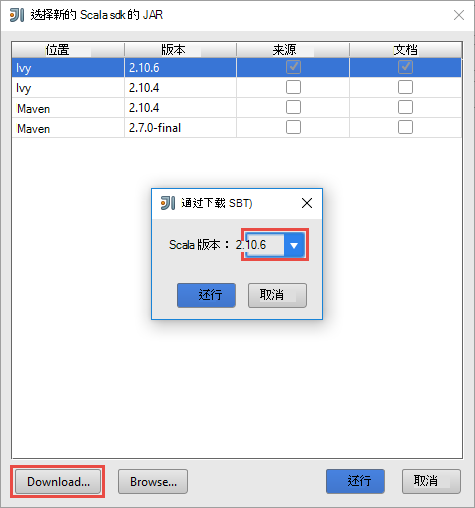
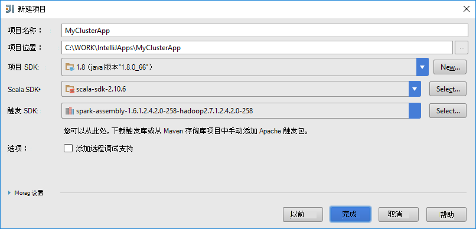
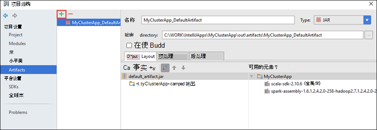

 <properties
    pageTitle="在 IntelliJ 的 Azure Toolkit 使用 HDInsight 工具远程调试 HDInsight 触发群集上运行的应用程序 |Microsoft Azure"
    description="了解如何使用中的 IntelliJ Azure Toolkit HDInsight 工具来远程调试 HDInsight 触发群集上运行的应用程序。"
    services="hdinsight"
    documentationCenter=""
    authors="nitinme"
    manager="jhubbard"
    editor="cgronlun"
    tags="azure-portal"/>

<tags
    ms.service="hdinsight"
    ms.workload="big-data"
    ms.tgt_pltfrm="na"
    ms.devlang="na"
    ms.topic="article"
    ms.date="09/09/2016"
    ms.author="nitinme"/>

# 在 IntelliJ 的 Azure Toolkit 中使用 HDInsight 工具来调试触发远程 HDInsight 触发 Linux 群集上的应用程序

本文提供有关如何在 IntelliJ 的 Azure Toolkit 中使用 HDInsight 工具来提交 HDInsight 触发群集上的触发作业，然后对其进行调试远程桌面计算机中的分步指导。 若要执行此操作，您必须执行以下高级步骤︰

1. 创建站点到站点或点到网站 Azure 虚拟网络。 此文档中的步骤假定您使用的站点到站点网络。

2. 在 Azure HDInsight 站点的 Azure 虚拟网络的一部分创建触发群集。

3. 请验证群集 headnode 和桌面之间的连接。

4. 创建一个 Scala 应用在 IntelliJ 的想法并将其配置为远程调试。

5. 运行和调试应用程序。

##系统必备组件

* Azure 的订阅。 请参阅[获取 Azure 免费试用版](https://azure.microsoft.com/documentation/videos/get-azure-free-trial-for-testing-hadoop-in-hdinsight/)。

* 一个 HDInsight Linux 上的 Apache 触发群集。 有关说明，请参阅[创建 Apache 触发群集在 Azure HDInsight](hdinsight-apache-spark-jupyter-spark-sql.md)。
 
* Oracle Java 开发工具包。 您可以从[这里](http://www.oracle.com/technetwork/java/javase/downloads/jdk8-downloads-2133151.html)安装它。
 
* IntelliJ 的想法。 本文使用版本 15.0.1。 您可以从[这里](https://www.jetbrains.com/idea/download/)安装它。
 
* 在 Azure Toolkit 的 IntelliJ HDInsight 工具。 提供了用于 IntelliJ 的 HDInsight 工具的 IntelliJ Azure Toolkit 的一部分。 有关如何安装 Azure Toolkit 的说明，请参阅[安装的 IntelliJ Azure Toolkit](../azure-toolkit-for-intellij-installation.md)。

* 登录到 Azure 订购从 IntelliJ 的想法。 按照[此处](hdinsight-apache-spark-intellij-tool-plugin.md#log-into-your-azure-subscription)。
 
* 当运行时触发 Scala 为在 Windows 计算机上的远程调试的应用程序，可能会出现异常，如[触发 2356年](https://issues.apache.org/jira/browse/SPARK-2356)导致 Windows 上缺少 WinUtils.exe 中所述。 若要解决此错误，您必须像**C:\WinUtils\bin**一样的位置[下载的可执行文件在这里](http://public-repo-1.hortonworks.com/hdp-win-alpha/winutils.exe)。 然后必须添加**HADOOP_HOME**环境变量，该变量的值设置为**C\WinUtils**。

## 步骤 1︰ 创建 Azure 的虚拟网络

按照说明从以下链接可创建 Azure 虚拟网络，然后检查桌面和 Azure 虚拟网络之间的连接。

* [使用 Azure 门户站点到站点 VPN 连接时创建 VNet](../vpn-gateway/vpn-gateway-howto-site-to-site-resource-manager-portal.md)
* [使用站点到站点 VPN 连接使用 PowerShell 创建 VNet](../vpn-gateway/vpn-gateway-create-site-to-site-rm-powershell.md)
* [配置虚拟网络使用 PowerShell 点到站点连接](../vpn-gateway/vpn-gateway-howto-point-to-site-rm-ps.md)

## 步骤 2︰ 创建一个 HDInsight 触发的群集

此外应该是您创建的 Azure 虚拟网络的一部分的 Azure HDInsight 上创建一个 Apache 触发的群集。 在[HDInsight 中的创建 Linux 基于群集](hdinsight-hadoop-provision-linux-clusters.md)使用可用的信息。 作为可选配置的一部分，选择您在上一步中创建的 Azure 虚拟网络。

## 第 3 步︰ 验证群集 headnode 和桌面之间的连接

1. 获得 headnode 的 IP 地址。 打开群集 Ambari 用户界面。 从群集刀片式服务器，请单击**仪表板**。

    

2. 从 Ambari 用户界面，从右上角，单击**主机**。

    

3. 您应该看到 headnodes，辅助节点和 zookeeper 节点的列表。 Headnodes 具有**hn*** 前缀。 单击第一个 headnode。

    

4. 打开**摘要**框中，从页面底部将复制 headnode 和主机名的 IP 地址。

    

5. 您要从中运行，并且远程调试的触发作业到计算机上的**主机**文件包括的 IP 地址和主机名的 headnode。 这将使您能够使用的 IP 地址以及主机名 headnode 与通信。

    1. 使用提升的权限打开记事本。 从文件菜单上，单击**打开**，然后导航到主机文件的位置。 在 Windows 的计算机，它是`C:\Windows\System32\Drivers\etc\hosts`。

    2. **主机**文件中添加以下。

            # For headnode0
            192.xxx.xx.xx hn0-nitinp
            192.xxx.xx.xx hn0-nitinp.lhwwghjkpqejawpqbwcdyp3.gx.internal.cloudapp.net

            # For headnode1
            192.xxx.xx.xx hn1-nitinp
            192.xxx.xx.xx hn1-nitinp.lhwwghjkpqejawpqbwcdyp3.gx.internal.cloudapp.net

5. 从连接到 Azure 虚拟网络使用 HDInsight 群集的计算机，请验证您可以 ping 两个 headnodes 使用的 IP 地址以及主机名。

6. 在[连接到一个使用 SSH 的 HDInsight 群集](hdinsight-hadoop-linux-use-ssh-windows.md#connect-to-a-linux-based-hdinsight-cluster)使用的说明群集 headnode 到 SSH。 从群集 headnode，ping 台式计算机的 IP 的地址。 您应该测试连接到的 IP 地址分配给计算机的网络连接和 Azure 虚拟网络中的计算机连接到另一个。

7. 对其他 headnode 重复步骤。 

## 步骤 4︰ 创建用于 IntelliJ HDInsight 工具在 Azure Toolkit 触发 Scala 应用程序并将其配置为远程调试

1. 启动 IntelliJ 的想法，然后创建一个新项目。 在新建项目对话框中，进行以下几种选择，，然后单击**下一步**。

    

    * 从左窗格中，选择**HDInsight**。
    * 在右窗格中，选择**HDInsight (Scala) 上的触发**。
    * 单击**下一步**。

2. 在下一个窗口，提供项目详细信息。

    * 提供项目名称和项目位置。
    * **项目的 SDK**，请确保您提供的 Java 版本大于 7。
    * **Scala 的 SDK**，单击**创建**，**下载**，请单击，然后选择 Scala 使用的版本。 **，请确保没有使用版本 2.11.x**。 此示例使用版本**2.10.6**。

        

    * 对于**触发 SDK**，请下载并使用从[此处](http://go.microsoft.com/fwlink/?LinkID=723585&clcid=0x409)SDK。 也可以忽略此警告并改用[触发 Maven 存储库](http://mvnrepository.com/search?q=spark)，但是请确保您具有适当 maven 存储库安装触发应用程序开发。 （例如，您需要确保您具有触发流部件安装如果使用的触发流;此外请确保在使用存储库中标记为 Scala 2.10-不要的使用存储库中标记为 Scala 2.11。）

        

    * 单击**完成**。

3. 触发项目会自动为您创建一个项目。 若要查看项目，请执行以下步骤。

    1. 从**文件**菜单中，单击**项目结构**。
    2. 在**项目结构**对话框中，单击**项目**以查看已创建的默认项目。

        

    您还可以创建您自己的项目上单击 bly**+**图标，在上图中突出显示。

4. 在**项目结构**对话框中，单击**项目**。 如果**项目的 SDK**设置为 1.8，确保**项目语言级别**设置为**7-菱形，ARM，多问题等**。

    

4. 将库添加到项目中。 若要添加一个库，项目名称在项目树中，用鼠标右键单击，然后单击**打开模块设置**。 在**项目结构**对话框中，从左边的窗格中，单击**库**，请单击 （+） 符号，然后单击**从 Maven**。 

     

    在**Maven 存储库中下载库**对话框中，搜索并添加下列库。

    * `org.scalatest:scalatest_2.10:2.2.1`
    * `org.apache.hadoop:hadoop-azure:2.7.1`

5. 复制`yarn-site.xml`和`core-site.xml`从群集 headnode 并将其添加到项目中。 使用以下命令复制文件。 您可以使用[Cygwin](https://cygwin.com/install.html)运行以下`scp`命令将文件从群集 headnodes 复制。

        scp <ssh user name>@<headnode IP address or host name>://etc/hadoop/conf/core-site.xml .

    因为我们已经添加了 headnode 群集的 IP 地址和主机名权威主机文件在桌面上，我们可以按以下方式使用**scp**命令。

        scp sshuser@hn0-nitinp:/etc/hadoop/conf/core-site.xml .
        scp sshuser@hn0-nitinp:/etc/hadoop/conf/yarn-site.xml .

    通过例如复制文件夹下的**/src**在项目树中，将这些文件添加到您的项目`<your project directory>\src`。

6. 更新`core-site.xml`进行以下更改。

    1. `core-site.xml`包括与群集相关的存储帐户的加密的密钥。 在`core-site.xml`与默认的存储帐户是否已添加到项目中，替换的实际的存储密钥加密的密钥相关联。 请参阅[管理存储的访问键](../storage/storage-create-storage-account.md#manage-your-storage-account)。

            <property>
                <name>fs.azure.account.key.hdistoragecentral.blob.core.windows.net</name>
                <value>access-key-associated-with-the-account</value>
            </property>

    2. 从以下项中移除`core-site.xml`。

            <property>
                <name>fs.azure.account.keyprovider.hdistoragecentral.blob.core.windows.net</name>
                <value>org.apache.hadoop.fs.azure.ShellDecryptionKeyProvider</value>
            </property>

            <property>
                <name>fs.azure.shellkeyprovider.script</name>
                <value>/usr/lib/python2.7/dist-packages/hdinsight_common/decrypt.sh</value>
            </property>

            <property>
                <name>net.topology.script.file.name</name>
                <value>/etc/hadoop/conf/topology_script.py</value>
            </property>

    3. 保存该文件。

7. 添加您的应用程序的主类。 从**项目资源管理器**中，右键单击**源**，指向**新建**，然后单击**Scala 类**。

    

8. 在**创建新的 Scala 类**对话框中提供一个名称，选择**对象**的**种类**，然后单击**确定**。

    

9. 在`MyClusterAppMain.scala`文件，请将以下代码粘贴。 此代码将创建触发上下文和启动`executeJob`方法从`SparkSample`对象。

        import org.apache.spark.{SparkConf, SparkContext}

        object SparkSampleMain {
          def main (arg: Array[String]): Unit = {
            val conf = new SparkConf().setAppName("SparkSample")
                                      .set("spark.hadoop.validateOutputSpecs", "false")
            val sc = new SparkContext(conf)
        
            SparkSample.executeJob(sc,
                                   "wasbs:///HdiSamples/HdiSamples/SensorSampleData/hvac/HVAC.csv",
                                   "wasbs:///HVACOut")
          }
        }

10. 重复步骤 8 和 9 上面添加一个新的 Scala 对象，称为`SparkSample`。 向此类添加以下代码。 此代码读取 （适用于所有 HDInsight 触发群集），HVAC.csv 的数据检索 CSV 中的第七个列中只有一位数字的行并将输出写入**/HVACOut**群集的默认存储容器下。

        import org.apache.spark.SparkContext
    
        object SparkSample {
          def executeJob (sc: SparkContext, input: String, output: String): Unit = {
            val rdd = sc.textFile(input)
        
            //find the rows which have only one digit in the 7th column in the CSV
            val rdd1 =  rdd.filter(s => s.split(",")(6).length() == 1)
        
            val s = sc.parallelize(rdd.take(5)).cartesian(rdd).count()
            println(s)
        
            rdd1.saveAsTextFile(output)
            //rdd1.collect().foreach(println)
          }
        
        }

11. 重复步骤 8 和 9 的上方将添加一个新类，称为`RemoteClusterDebugging`。 此类实现用于调试应用程序触发测试框架。 添加以下代码为`RemoteClusterDebugging`类。

        import org.apache.spark.{SparkConf, SparkContext}
        import org.scalatest.FunSuite
        
        class RemoteClusterDebugging extends FunSuite {
        
          test("Remote run") {
            val conf = new SparkConf().setAppName("SparkSample")
                                      .setMaster("yarn-client")
                                      .set("spark.yarn.am.extraJavaOptions", "-Dhdp.version=2.4")
                                      .set("spark.yarn.jar", "wasbs:///hdp/apps/2.4.2.0-258/spark-assembly-1.6.1.2.4.2.0-258-hadoop2.7.1.2.4.2.0-258.jar")
                                      .setJars(Seq("""C:\WORK\IntelliJApps\MyClusterApp\out\artifacts\MyClusterApp_DefaultArtifact\default_artifact.jar"""))
                                      .set("spark.hadoop.validateOutputSpecs", "false")
            val sc = new SparkContext(conf)
        
            SparkSample.executeJob(sc,
              "wasbs:///HdiSamples/HdiSamples/SensorSampleData/hvac/HVAC.csv",
              "wasbs:///HVACOut")
          }
        }

    几个此处需要注意的重要事项︰
    
    * 为`.set("spark.yarn.jar", "wasbs:///hdp/apps/2.4.2.0-258/spark-assembly-1.6.1.2.4.2.0-258-hadoop2.7.1.2.4.2.0-258.jar")`，请确保触发程序集 JAR 位于群集存储在指定的路径。
    * 为`setJars`，指定将在其中创建项目 jar 的位置。 通常它是`<Your IntelliJ project directory>\out\<project name>_DefaultArtifact\default_artifact.jar`。 

11. 在`RemoteClusterDebugging`类中，用鼠标右键单击`test`关键字和选择**创建 RemoteClusterDebugging 配置**。

    

12. 在对话框中提供的配置中，一个名称并选择**测试类型**作为**测试名称**。 将所有其他值保留为默认值，单击**应用**，然后单击**确定**。

    

13. 现在应该看到一个**远程运行**配置菜单栏中的下拉列表。 

    

## 步骤 5︰ 在调试模式下运行应用程序

1. 在 IntelliJ 的想法项目中，打开`SparkSample.scala`和创建断点 val rdd1 旁边。 在弹出式菜单中创建一个断点，选择**函数 executeJob 中的行**。

    

2. 单击**调试运行**按钮开始运行该应用程序的下拉列表中的**远程运行**配置。

    

3. 当执行程序到达断点时，您应该看到一个**调试器**选项卡的底部窗格中。

    

4. 单击 (**+**) 图标来添加监视下面的图像所示。 

    

    这里，因为应用程序中断之前变量`rdd1`使用创建的我们可以看到什么是在该变量中的前 5 行此监视`rdd`。 按**enter 键**。

    

    在上图中看到的内容是，在运行时，无法查询的数据和调试 terrabytes 如何应用进展。 例如，在上图中所示的输出，可以看到输出的第一行是标题。 据此，可以修改应用程序代码中跳过的标题行，如果需要。

5. 现在，您可以单击以继续使用您的应用程序运行的**恢复程序**图标。

    

6. 如果应用程序成功完成后，您应该看到类似于下面的输出。

    

 

## 请参见

* [概述︰ 在 Azure HDInsight 上的 Apache 触发](hdinsight-apache-spark-overview.md)

### 方案

* [触发与 BI︰ 执行与 BI 工具一起使用在 HDInsight 中的触发交互式数据分析](hdinsight-apache-spark-use-bi-tools.md)

* [机器学习与触发︰ 用于分析使用 HVAC 数据的生成温度 HDInsight 中使用触发](hdinsight-apache-spark-ipython-notebook-machine-learning.md)

* [机器学习与触发︰ 使用 HDInsight 来预测食品检查结果中的触发](hdinsight-apache-spark-machine-learning-mllib-ipython.md)

* [HDInsight 用于构建实时流的应用程序中触发流︰ 使用触发](hdinsight-apache-spark-eventhub-streaming.md)

* [在 HDInsight 中使用触发网站日志分析](hdinsight-apache-spark-custom-library-website-log-analysis.md)

### 创建和运行应用程序

* [创建独立的应用程序使用 Scala](hdinsight-apache-spark-create-standalone-application.md)

* [在群集上使用晚触发远程运行作业](hdinsight-apache-spark-livy-rest-interface.md)

### 工具和扩展

* [在 IntelliJ 的 Azure Toolkit 中使用 HDInsight 工具来创建和提交触发 Scala applicatons](hdinsight-apache-spark-intellij-tool-plugin.md)

* [在 Azure Toolkit 的 Eclipse 中使用 HDInsight 工具创建触发应用程序](hdinsight-apache-spark-eclipse-tool-plugin.md)

* [在 HDInsight 上触发群集使用 Zeppelin 笔记本](hdinsight-apache-spark-use-zeppelin-notebook.md)

* [内核可用于触发 HDInsight 群集中的 Jupyter 笔记本](hdinsight-apache-spark-jupyter-notebook-kernels.md)

* [外部包使用 Jupyter 笔记本](hdinsight-apache-spark-jupyter-notebook-use-external-packages.md)

* [在您的计算机上安装 Jupyter 并连接到一个 HDInsight 触发的群集](hdinsight-apache-spark-jupyter-notebook-install-locally.md)

### 管理资源

* [管理在 Azure HDInsight Apache 触发群集的资源](hdinsight-apache-spark-resource-manager.md)

* [跟踪和调试 HDInsight 在 Apache 触发群集上运行的作业](hdinsight-apache-spark-job-debugging.md)
