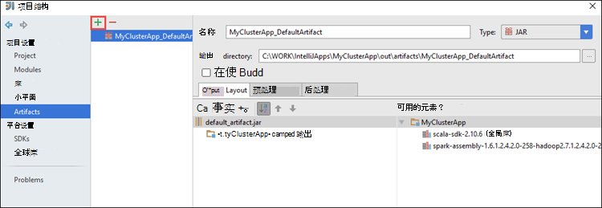
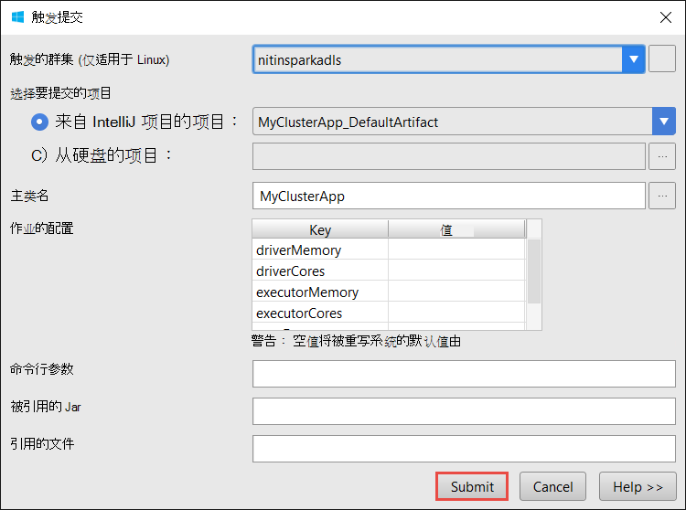

 <properties
    pageTitle="创建触发 Scala 应用程序使用的 Azure Toolkit 的 IntelliJ 的 HDInsight 工具 |Microsoft Azure"
    description="了解如何创建独立的触发 HDInsight 触发群集上运行应用程序。"
    services="hdinsight"
    documentationCenter=""
    authors="nitinme"
    manager="jhubbard"
    editor="cgronlun"
    tags="azure-portal"/>

<tags
    ms.service="hdinsight"
    ms.workload="big-data"
    ms.tgt_pltfrm="na"
    ms.devlang="na"
    ms.topic="article"
    ms.date="09/09/2016"
    ms.author="nitinme"/>

# 在 IntelliJ 的 Azure Toolkit 中使用 HDInsight 工具创建触发 HDInsight 触发 Linux 群集的应用程序

这篇文章提供了开发触发应用程序编写 Scala 和提交到 HDInsight 触发群集使用的 Azure Toolkit 的 IntelliJ 的 HDInsight 工具的分步指导。  您可以在几种不同的方法使用工具︰

* 制定并提交 HDInsight 触发群集上的一个 Scala 触发应用程序
* 若要访问您的 Azure HDInsight 触发群集资源
* 开发并在本地运行一个 Scala 触发应用程序

您还可以视频在[这里](https://mix.office.com/watch/1nqkqjt5xonza)帮助您入门遵循。

>[AZURE.IMPORTANT] 此工具可用于创建和提交仅在 Linux 上 HDInsight 触发群集的应用程序。

##系统必备组件

* Azure 的订阅。 请参阅[获取 Azure 免费试用版](https://azure.microsoft.com/documentation/videos/get-azure-free-trial-for-testing-hadoop-in-hdinsight/)。

* 一个 HDInsight Linux 上的 Apache 触发群集。 有关说明，请参阅[创建 Apache 触发群集在 Azure HDInsight](hdinsight-apache-spark-jupyter-spark-sql.md)。

* Oracle Java 开发工具包。 您可以从[这里](http://www.oracle.com/technetwork/java/javase/downloads/jdk8-downloads-2133151.html)安装它。

* IntelliJ 的想法。 本文使用版本 15.0.1。 您可以从[这里](https://www.jetbrains.com/idea/download/)安装它。

## 安装在 Azure Toolkit IntelliJ HDInsight 工具

HDInsight 工具 IntelliJ，那么提供的 IntelliJ Azure Toolkit 的一部分。 有关如何安装 Azure Toolkit 的说明，请参阅[安装的 IntelliJ Azure Toolkit](../azure-toolkit-for-intellij-installation.md)。

## 登录到 Azure 订阅

1. 启动 IntelliJ IDE，然后打开 Azure 资源管理器。 从 IDE 中的**视图**菜单中，单击**工具窗口**，然后单击**Azure 资源管理器**。

    

2. **Azure**节点在**Azure 资源管理器**中的用鼠标右键单击，然后单击**管理订阅**。

3. 在**管理订阅**对话框中，单击**登录**并输入您 Azure 的凭据。

    

4. 您登录后，**管理订阅**对话框将列出与凭据关联的所有 Azure 订阅。 单击**关闭**对话框中。

5. 在**Azure 资源管理器**选项卡中，展开**HDInsight**来查看在您的订购的 HDInsight 触发簇。

    

6. 您可以进一步扩展群集名称节点以查看与群集相关的资源 （例如存储帐户）。

    

## 在 HDInsight 触发群集上运行触发 Scala 应用程序

1. 启动 IntelliJ 的想法，然后创建一个新项目。 在新建项目对话框中，进行以下几种选择，，然后单击**下一步**。

    

    * 从左窗格中，选择**HDInsight**。
    * 在右窗格中，选择**HDInsight (Scala) 上的触发**。
    * 单击**下一步**。

2. 在下一个窗口，提供项目详细信息。

    * 提供项目名称和项目位置。
    * **项目的 SDK**，请确保您提供的 Java 版本大于 7。
    * **Scala 的 SDK**，单击**创建**，**下载**，请单击，然后选择 Scala 使用的版本。 **，请确保没有使用版本 2.11.x**。 此示例使用版本**2.10.6**。

        

    * 对于**触发 SDK**，请下载并使用从[此处](http://go.microsoft.com/fwlink/?LinkID=723585&clcid=0x409)SDK。 也可以忽略此警告并改用[触发 Maven 存储库](http://mvnrepository.com/search?q=spark)，但是请确保您具有适当 maven 存储库安装触发应用程序开发。 （例如，您需要确保您具有触发流部件安装如果使用的触发流;此外请确保在使用存储库中标记为 Scala 2.10-不要的使用存储库中标记为 Scala 2.11。）

        

    * 单击**完成**。

3. 触发项目会自动为您创建一个项目。 若要查看项目，请执行以下步骤。

    1. 从**文件**菜单中，单击**项目结构**。
    2. 在**项目结构**对话框中，单击**项目**以查看已创建的默认项目。

        

    您还可以创建您自己的项目上单击 bly**+**图标，在上图中突出显示。

4. 在**项目结构**对话框中，单击**项目**。 如果**项目的 SDK**设置为 1.8，确保**项目语言级别**设置为**7-菱形，ARM，多问题等**。

    

5. 添加应用程序源代码。

    1. 从**项目资源管理器**中，右键单击**源**，指向**新建**，然后单击**Scala 类**。

        

    2. 在**创建新的 Scala 类**对话框中提供一个名称，选择**对象**的**种类**，然后单击**确定**。

        

    3. 在**MyClusterApp.scala**文件中，粘贴以下代码。 此代码读取 （适用于所有 HDInsight 触发群集），HVAC.csv 的数据检索 CSV 中的第七个列中只有一位数字的行并将输出写入**/HVACOut**群集的默认存储容器下。

            import org.apache.spark.SparkConf
            import org.apache.spark.SparkContext

            object MyClusterApp{
              def main (arg: Array[String]): Unit = {
                val conf = new SparkConf().setAppName("MyClusterApp")
                val sc = new SparkContext(conf)

                val rdd = sc.textFile("wasbs:///HdiSamples/HdiSamples/SensorSampleData/hvac/HVAC.csv")

                //find the rows which have only one digit in the 7th column in the CSV
                val rdd1 =  rdd.filter(s => s.split(",")(6).length() == 1)

                rdd1.saveAsTextFile("wasbs:///HVACOut")
              }

            }

5. 在 HDInsight 触发群集上运行应用程序。

    1. 从**项目资源管理器**中，右击项目名称，然后选择**到 HDInsight 提交触发应用程序**。

        

    2. 系统将提示您输入凭据 Azure 的订阅。 在**触发提交**对话框中，提供以下值。

        * 对于**触发群集 (仅适用于 Linux)**，选择您要在其运行应用程序的 HDInsight 触发群集。

        * 需要从 IntelliJ 项目中，选择一个项目，也可以从硬盘中选择一个。

        * 针对**主类名**文本框中，单击省略号 ()，应用程序源代码，在选择主类，然后单击**确定**。

            

        * 因为此示例中的应用程序代码不需要任何命令行参数或引用 Jar 或文件，可以将剩余文本框留空。

        * 在让所有的输入后，该对话框应如下所示。

            

        * 单击**提交**。

    3. 位于窗口底部的**触发提交**标签应开始显示进度。 您可以通过单击"触发提交"窗口中的红色按钮来停止该应用程序。

        

    在下一部分中，您将学习如何访问作业输出 IntelliJ Azure Toolkit 中使用 HDInsight 工具。

## 访问和管理用于 IntelliJ HDInsight 工具在 Azure Toolkit HDInsight 触发群集

您可以执行各种操作，使用 HDInsight 工具 IntelliJ 的 Azure Toolkit 的一部分。

### 访问作业视图直接从 HDInsight 工具

1. 从**Azure 资源管理器**中，展开**HDInsight**，展开触发群集名称，然后单击**作业**。

2. 在右窗格中，**触发作业视图**选项卡显示在群集运行的所有应用程序。 单击您要查看其详细信息的应用程序名称。

    

3. **错误消息**、**作业输出**、**晚作业日志**和**触发驱动程序日志**的框来填充基于您选择的应用程序。

4. 您还可以通过单击相应按钮在屏幕的顶部打开**触发历史 UI**和**YARN UI** （在应用程序级别）。

### 触发历史记录服务器的访问

1. 从**Azure 资源管理器**中，展开**HDInsight**、 您触发的群集名称，用鼠标右键单击，然后选择**打开触发历史记录用户界面**。 出现提示时，输入群集管理员凭据。 您必须指定这些设置群集时。

2. 在历史记录服务器触发面板中，您可以查看应用程序您刚完成运行使用应用程序的名称。 在上面的代码中，可以设置应用程序名称中使用`val conf = new SparkConf().setAppName("MyClusterApp")`。 因此，触发应用程序的名称是**MyClusterApp**。

### 启动 Ambari 门户

从**Azure 资源管理器**中，展开**HDInsight**，右键单击触发群集名称，然后选择**打开群集管理门户网站 (Ambari)**。 出现提示时，输入群集管理员凭据。 您必须指定这些设置群集时。

### 管理 Azure 订阅

默认情况下，HDInsight 工具列出触发簇从 Azure 的所有订阅。 如果需要，您可以指定您要访问该群集的订阅。 **Azure 资源管理器**中，从**Azure**根节点，用鼠标右键单击，然后单击**管理订阅**。 从对话框中，清除根据订阅不希望访问，然后单击**关闭**复选框。 如果您想要从 Azure 订阅注销，也可以单击**注销**。

## 触发 Scala 应用程序在本地运行

您可以使用 HDInsight 工具 IntelliJ 的 Azure Toolkit 在本地工作站上运行应用程序触发 Scala 通常情况下，这样的应用程序执行不需要访问群集资源如存储容器，可以运行和测试本地。

### 系统必备组件

当在 Windows 计算机上运行本地触发 Scala 应用程序，可能会出现异常，如[触发 2356年](https://issues.apache.org/jira/browse/SPARK-2356)导致 Windows 上缺少 WinUtils.exe 中所述。 若要解决此错误，您必须像**C:\WinUtils\bin**一样的位置[下载的可执行文件在这里](http://public-repo-1.hortonworks.com/hdp-win-alpha/winutils.exe)。 然后必须添加**HADOOP_HOME**环境变量，该变量的值设置为**C\WinUtils**。

### 运行本地触发 Scala 应用程序  

1. 启动 IntelliJ 的想法，然后创建一个新项目。 在新建项目对话框中，进行以下几种选择，，然后单击**下一步**。

    

    * 从左窗格中，选择**HDInsight**。
    * 在右窗格中，选择**HDInsight 本地运行示例 (Scala) 上的触发**。
    * 单击**下一步**。

2. 在下一个窗口，提供项目详细信息。

    * 提供项目名称和项目位置。
    * **项目的 SDK**，请确保您提供的 Java 版本大于 7。
    * **Scala 的 SDK**，单击**创建**，**下载**，请单击，然后选择 Scala 使用的版本。 **，请确保没有使用版本 2.11.x**。 此示例使用版本**2.10.6**。

        

    * 对于**触发 SDK**，请下载并使用从[此处](http://go.microsoft.com/fwlink/?LinkID=723585&clcid=0x409)SDK。 也可以忽略此警告并改用[触发 Maven 存储库](http://mvnrepository.com/search?q=spark)，但是请确保您具有适当 maven 存储库安装触发应用程序开发。 （例如，您需要确保您具有触发流部件安装如果使用的触发流;此外请确保在使用存储库中标记为 Scala 2.10-不要的使用存储库中标记为 Scala 2.11。）

        

    * 单击**完成**。

3. 该模板添加示例代码 (**LogQuery**) 可以在您的计算机本地运行的**src**文件夹下。

    

4.  **LogQuery**应用程序中，右键单击，然后单击**"运行 'LogQuery'"**。 您将看到如下输出底部的**运行**选项卡中。

    

## 转换现有的 IntelliJ 知道应用程序要用于 IntelliJ HDInsight 工具在 Azure Toolkit

您也可以将现有触发 Scala 应用程序创建在 IntelliJ 与 IntelliJ 的 Azure Toolkit 中的 HDInsight 工具兼容的主意。 这将使您可以使用该工具来提交到 HDInsight 触发群集的应用程序。 您可以通过执行下面的步骤进行操作︰

1. 对于现有的触发 Scala 创建的应用程序使用 IntelliJ 的想法，打开相关联的.iml 文件。
2. 在根级别，您将看到像这样的**模块**元素︰

        <module org.jetbrains.idea.maven.project.MavenProjectsManager.isMavenModule="true" type="JAVA_MODULE" version="4">

3. 编辑元素以添加`UniqueKey="HDInsightTool"`，以便**模块**元素如下所示︰

        <module org.jetbrains.idea.maven.project.MavenProjectsManager.isMavenModule="true" type="JAVA_MODULE" version="4" UniqueKey="HDInsightTool">

4. 保存所做的更改。 现在，应用程序应使用 Azure Toolkit 的 IntelliJ 中的 HDInsight 工具兼容。 您可以用鼠标右键单击在项目资源管理器中的项目名称上进行测试。 弹出式菜单现在应该有**到 HDInsight 提交触发应用程序**的选项。

## 故障排除

### 在本地运行"请使用更大的堆大小"错误

在触发 1.6，如果使用的 32 位 Java SDK 在本地运行，期间可能会遇到以下错误︰

    Exception in thread "main" java.lang.IllegalArgumentException: System memory 259522560 must be at least 4.718592E8. Please use a larger heap size.
        at org.apache.spark.memory.UnifiedMemoryManager$.getMaxMemory(UnifiedMemoryManager.scala:193)
        at org.apache.spark.memory.UnifiedMemoryManager$.apply(UnifiedMemoryManager.scala:175)
        at org.apache.spark.SparkEnv$.create(SparkEnv.scala:354)
        at org.apache.spark.SparkEnv$.createDriverEnv(SparkEnv.scala:193)
        at org.apache.spark.SparkContext.createSparkEnv(SparkContext.scala:288)
        at org.apache.spark.SparkContext.<init>(SparkContext.scala:457)
        at LogQuery$.main(LogQuery.scala:53)
        at LogQuery.main(LogQuery.scala)
        at sun.reflect.NativeMethodAccessorImpl.invoke0(Native Method)
        at sun.reflect.NativeMethodAccessorImpl.invoke(NativeMethodAccessorImpl.java:57)
        at sun.reflect.DelegatingMethodAccessorImpl.invoke(DelegatingMethodAccessorImpl.java:43)
        at java.lang.reflect.Method.invoke(Method.java:606)
        at com.intellij.rt.execution.application.AppMain.main(AppMain.java:144)

这是因为堆大小不是足够大，以便触发运行，因为触发要求至少 471 MB （可获得更多详细信息从[触发 12081](https://issues.apache.org/jira/browse/SPARK-12081)如果需要）。 一个简单的解决方案是使用 64 位 Java SDK。 此外可以通过在 IntelliJ 中的 JVM 设置添加下列选项︰

    -Xms128m -Xmx512m -XX:MaxPermSize=300m -ea

## 反馈信息和已知问题

当前正在查看触发输出直接不支持，我们正在从事的。

如果您有任何建议或反馈，或者使用此工具时遇到任何问题，随时给我们发一封电子邮件在 hdivstool 在 microsoft 点 com。

## 请参见

* [概述︰ 在 Azure HDInsight 上的 Apache 触发](hdinsight-apache-spark-overview.md)

### 方案

* [触发与 BI︰ 执行与 BI 工具一起使用在 HDInsight 中的触发交互式数据分析](hdinsight-apache-spark-use-bi-tools.md)

* [机器学习与触发︰ 用于分析使用 HVAC 数据的生成温度 HDInsight 中使用触发](hdinsight-apache-spark-ipython-notebook-machine-learning.md)

* [机器学习与触发︰ 使用 HDInsight 来预测食品检查结果中的触发](hdinsight-apache-spark-machine-learning-mllib-ipython.md)

* [HDInsight 用于构建实时流的应用程序中触发流︰ 使用触发](hdinsight-apache-spark-eventhub-streaming.md)

* [在 HDInsight 中使用触发网站日志分析](hdinsight-apache-spark-custom-library-website-log-analysis.md)

### 创建和运行应用程序

* [创建独立的应用程序使用 Scala](hdinsight-apache-spark-create-standalone-application.md)

* [在群集上使用晚触发远程运行作业](hdinsight-apache-spark-livy-rest-interface.md)

### 工具和扩展

* [在 IntelliJ 的 Azure Toolkit 中使用 HDInsight 工具来触发应用程序进行远程调试](hdinsight-apache-spark-intellij-tool-plugin-debug-jobs-remotely.md)

* [在 Azure Toolkit 的 Eclipse 中使用 HDInsight 工具创建触发应用程序](hdinsight-apache-spark-eclipse-tool-plugin.md)

* [在 HDInsight 上触发群集使用 Zeppelin 笔记本](hdinsight-apache-spark-use-zeppelin-notebook.md)

* [内核可用于触发 HDInsight 群集中的 Jupyter 笔记本](hdinsight-apache-spark-jupyter-notebook-kernels.md)

* [外部包使用 Jupyter 笔记本](hdinsight-apache-spark-jupyter-notebook-use-external-packages.md)

* [在您的计算机上安装 Jupyter 并连接到一个 HDInsight 触发的群集](hdinsight-apache-spark-jupyter-notebook-install-locally.md)

### 管理资源

* [管理在 Azure HDInsight Apache 触发群集的资源](hdinsight-apache-spark-resource-manager.md)

* [跟踪和调试 HDInsight 在 Apache 触发群集上运行的作业](hdinsight-apache-spark-job-debugging.md)
