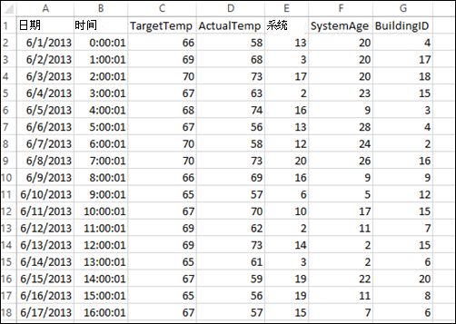
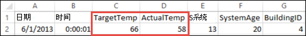

<properties 
    pageTitle="使用 Apache 触发生成上 HDInsight 的机器学习应用程序 |Microsoft Azure" 
    description="如何使用 Apache 触发笔记本构建机器学习应用程序的分步指导" 
    services="hdinsight" 
    documentationCenter="" 
    authors="nitinme" 
    manager="jhubbard" 
    editor="cgronlun"
    tags="azure-portal"/>

<tags 
    ms.service="hdinsight" 
    ms.workload="big-data" 
    ms.tgt_pltfrm="na" 
    ms.devlang="na" 
    ms.topic="article" 
    ms.date="10/05/2016" 
    ms.author="nitinme"/>

# 建立机器学习在 Apache 触发 HDInsight Linux 上的群集上运行的应用程序

了解如何构建机器学习在 HDInsight 中使用 Apache 触发群集的应用程序。 本文介绍如何使用群集可用的 Jupyter 笔记本以生成并测试我们的应用程序。 应用程序使用在默认情况下所有群集可用的示例 HVAC.csv 数据。

**系统必备组件︰**

您必须具有以下各项︰

- Azure 的订阅。 请参阅[获取 Azure 免费试用版](https://azure.microsoft.com/documentation/videos/get-azure-free-trial-for-testing-hadoop-in-hdinsight/)。
- 一个 HDInsight Linux 上的 Apache 触发群集。 有关说明，请参阅[创建 Apache 触发群集在 Azure HDInsight](hdinsight-apache-spark-jupyter-spark-sql.md)。 

##显示数据

我们开始构建该应用程序之前，让我们了解数据和分析的数据，我们可以执行何种的结构。 

在本文中，我们将使用示例**HVAC.csv**数据文件会出现在与 HDInsight 群集相关的 Azure 存储帐户。 中存储帐户，该文件位于**\HdiSamples\HdiSamples\SensorSampleData\hvac**。 下载并打开该 CSV 文件获取的数据的快照。  

数据显示目标温度和已安装的 HVAC 系统的建筑物的实际温度。 让我们假定**系统**列表示系统 ID **SystemAge**列表示的 HVAC 系统已存在于该建筑物的年数。

我们使用此数据来预测是否建筑物会炎热或 colder 基于目标温度，给出系统 ID 和系统年龄上。

##编写使用触发 MLlib 的机器学习应用程序

此应用程序中我们使用触发 ML 管道执行文档分类。 在管线中，我们将文档拆分为词、 将文字转换为数字的特征向量，和最后生成特征向量和标签使用的预测模型。 执行以下步骤以创建应用程序。

1. 从[Azure 门户网站](https://portal.azure.com/)，startboard，从单击触发群集的拼贴 （如果您将它固定到 startboard）。 您还可以向下**浏览所有**群集导航 > **HDInsight 群集**。   

2. 从触发群集刀片式服务器，**群集的仪表板**，请单击，然后单击**Jupyter 笔记本**。 出现提示时，输入群集管理员凭据。

    > [AZURE.NOTE] 通过在浏览器中打开下面的 URL，还可能会达到 Jupyter 笔记本为群集。 __群集名称__替换您的群集的名称︰
    >
    > `https://CLUSTERNAME.azurehdinsight.net/jupyter`

2. 创建新的笔记本。 单击**新建**，然后单击**PySpark**。

    

3. 创建并打开名为 Untitled.pynb 的新笔记本。 单击顶部的笔记本名称并输入好记的名称。

    

3. 由于在创建笔记本使用 PySpark 内核，您不需要显式创建任何上下文。 运行第一个代码单元格时，将为您自动创建添姿加配置单元的上下文。 您可以通过导入的类型所需的这种情况下开始。 空单元格中粘贴下面的代码段，然后按**SHIFT + ENTER**。 

        from pyspark.ml import Pipeline
        from pyspark.ml.classification import LogisticRegression
        from pyspark.ml.feature import HashingTF, Tokenizer
        from pyspark.sql import Row
        
        import os
        import sys
        from pyspark.sql.types import *
        
        from pyspark.mllib.classification import LogisticRegressionWithSGD
        from pyspark.mllib.regression import LabeledPoint
        from numpy import array
        
        
     
4. 您现在必须加载数据 (hvac.csv)，分析它，并使用它来训练模型。 为此，您可以定义检查建筑物的实际温度是否大于目标温度的函数。 如果实际温度更高，建筑物热，是由值**1.0**。 如果实际温度较低，建筑是冷，值**0.0**表示。 

    在一个空单元格中粘贴下面的代码段，然后按**SHIFT + ENTER**。

        
        # List the structure of data for better understanding. Becuase the data will be
        # loaded as an array, this structure makes it easy to understand what each element
        # in the array corresponds to

        # 0 Date
        # 1 Time
        # 2 TargetTemp
        # 3 ActualTemp
        # 4 System
        # 5 SystemAge
        # 6 BuildingID

        LabeledDocument = Row("BuildingID", "SystemInfo", "label")

        # Define a function that parses the raw CSV file and returns an object of type LabeledDocument
        
        def parseDocument(line):
            values = [str(x) for x in line.split(',')]
            if (values[3] > values[2]):
                hot = 1.0
            else:
                hot = 0.0        
    
            textValue = str(values[4]) + " " + str(values[5])
    
            return LabeledDocument((values[6]), textValue, hot)

        # Load the raw HVAC.csv file, parse it using the function
        data = sc.textFile("wasbs:///HdiSamples/HdiSamples/SensorSampleData/hvac/HVAC.csv")

        documents = data.filter(lambda s: "Date" not in s).map(parseDocument)
        training = documents.toDF()

5. 配置触发机器学习管道组成的三个阶段︰ 标记器、 hashingTF 和 lr。 关于什么是一个管道和它是如何工作的详细信息请参阅<a href="http://spark.apache.org/docs/latest/ml-guide.html#how-it-works" target="_blank">触发机器学习管道</a>。

    在一个空单元格中粘贴下面的代码段，然后按**SHIFT + ENTER**。

        tokenizer = Tokenizer(inputCol="SystemInfo", outputCol="words")
        hashingTF = HashingTF(inputCol=tokenizer.getOutputCol(), outputCol="features")
        lr = LogisticRegression(maxIter=10, regParam=0.01)
        pipeline = Pipeline(stages=[tokenizer, hashingTF, lr])

6. 适合于培训文档的管道。 在一个空单元格中粘贴下面的代码段，然后按**SHIFT + ENTER**。

        model = pipeline.fit(training)

7. 验证检查点培训文档您与应用程序的进度。 在一个空单元格中粘贴下面的代码段，然后按**SHIFT + ENTER**。

        training.show()

    这应类似于下面的输出︰

        +----------+----------+-----+
        |BuildingID|SystemInfo|label|
        +----------+----------+-----+
        |         4|     13 20|  0.0|
        |        17|      3 20|  0.0|
        |        18|     17 20|  1.0|
        |        15|      2 23|  0.0|
        |         3|      16 9|  1.0|
        |         4|     13 28|  0.0|
        |         2|     12 24|  0.0|
        |        16|     20 26|  1.0|
        |         9|      16 9|  1.0|
        |        12|       6 5|  0.0|
        |        15|     10 17|  1.0|
        |         7|      2 11|  0.0|
        |        15|      14 2|  1.0|
        |         6|       3 2|  0.0|
        |        20|     19 22|  0.0|
        |         8|     19 11|  0.0|
        |         6|      15 7|  0.0|
        |        13|      12 5|  0.0|
        |         4|      8 22|  0.0|
        |         7|      17 5|  0.0|
        +----------+----------+-----+

    回过头来验证对该原始 CSV 文件的输出。 例如，该 CSV 文件的第一行具有此数据︰

    

    请注意如何实际温度小于目标温度建议建筑很冷。 因此在培训输出中，**标签**中的第一行的值为**0.0**，这意味着建筑物不热。

8.  准备一个数据集来运行对培训的模型。 这样做，我们将通过系统 ID 和系统 （称为**SystemInfo**培训输出中） 时代，而模型可以预测是否具有该系统 ID 和系统时代的建筑是炎热 （由 1.0） 或冷色 （由 0.0 表示）。

    在一个空单元格中粘贴下面的代码段，然后按**SHIFT + ENTER**。
        
        # SystemInfo here is a combination of system ID followed by system age
        Document = Row("id", "SystemInfo")
        test = sc.parallelize([(1L, "20 25"),
                      (2L, "4 15"),
                      (3L, "16 9"),
                      (4L, "9 22"),
                      (5L, "17 10"),
                      (6L, "7 22")]) \
            .map(lambda x: Document(*x)).toDF() 

9. 最后，对测试数据进行预测。 在一个空单元格中粘贴下面的代码段，然后按**SHIFT + ENTER**。

        # Make predictions on test documents and print columns of interest
        prediction = model.transform(test)
        selected = prediction.select("SystemInfo", "prediction", "probability")
        for row in selected.collect():
            print row

10. 您应该看到类似于下面的输出︰

        Row(SystemInfo=u'20 25', prediction=1.0, probability=DenseVector([0.4999, 0.5001]))
        Row(SystemInfo=u'4 15', prediction=0.0, probability=DenseVector([0.5016, 0.4984]))
        Row(SystemInfo=u'16 9', prediction=1.0, probability=DenseVector([0.4785, 0.5215]))
        Row(SystemInfo=u'9 22', prediction=1.0, probability=DenseVector([0.4549, 0.5451]))
        Row(SystemInfo=u'17 10', prediction=1.0, probability=DenseVector([0.4925, 0.5075]))
        Row(SystemInfo=u'7 22', prediction=0.0, probability=DenseVector([0.5015, 0.4985]))

    从预测中的第一行，您可以看到对于 HVAC 系统 ID 20 和系统期限为 25 年，建筑物将会热 (**预测 = 1.0**)。 DenseVector (0.49999) 的第一个值对应预测 0.0，1.0 预测与对应的第二个值 (0.5001)。 在输出中，即使第二个值只是略高，模型显示**预测 = 1.0**。

11. 运行应用程序之后，您应该关闭笔记本以释放资源。 为此，请从笔记本上的**文件**菜单上，单击**关闭并暂停**。 这将关闭和关闭笔记本。
           

##使用 Anaconda scikit-为机器学习了解库

在 HDInsight 上的 Apache 触发群集包括 Anaconda 库。 这还包括**scikit-了解**的机器学习的库。 库还包含可用于生成示例应用程序直接从 Jupyter 笔记本的各种数据集。 有关示例使用 scikit-了解库信息，请参阅[http://scikit-learn.org/stable/auto_examples/index.html](http://scikit-learn.org/stable/auto_examples/index.html)。

##请参见

* [概述︰ 在 Azure HDInsight 上的 Apache 触发](hdinsight-apache-spark-overview.md)

### 方案

* [触发与 BI︰ 执行与 BI 工具一起使用在 HDInsight 中的触发交互式数据分析](hdinsight-apache-spark-use-bi-tools.md)

* [机器学习与触发︰ 使用 HDInsight 来预测食品检查结果中的触发](hdinsight-apache-spark-machine-learning-mllib-ipython.md)

* [HDInsight 用于构建实时流的应用程序中触发流︰ 使用触发](hdinsight-apache-spark-eventhub-streaming.md)

* [在 HDInsight 中使用触发网站日志分析](hdinsight-apache-spark-custom-library-website-log-analysis.md)

### 创建和运行应用程序

* [创建独立的应用程序使用 Scala](hdinsight-apache-spark-create-standalone-application.md)

* [在群集上使用晚触发远程运行作业](hdinsight-apache-spark-livy-rest-interface.md)

### 工具和扩展

* [使用 HDInsight 工具插件为 IntelliJ 创意来创建和提交触发 Scala applicatons](hdinsight-apache-spark-intellij-tool-plugin.md)

* [使用 HDInsight 工具插件为 IntelliJ 创意来触发应用程序进行远程调试](hdinsight-apache-spark-intellij-tool-plugin-debug-jobs-remotely.md)

* [在 HDInsight 上触发群集使用 Zeppelin 笔记本](hdinsight-apache-spark-use-zeppelin-notebook.md)

* [内核可用于触发 HDInsight 群集中的 Jupyter 笔记本](hdinsight-apache-spark-jupyter-notebook-kernels.md)

* [外部包使用 Jupyter 笔记本](hdinsight-apache-spark-jupyter-notebook-use-external-packages.md)

* [在您的计算机上安装 Jupyter 并连接到一个 HDInsight 触发的群集](hdinsight-apache-spark-jupyter-notebook-install-locally.md)

### 管理资源

* [管理在 Azure HDInsight Apache 触发群集的资源](hdinsight-apache-spark-resource-manager.md)

* [跟踪和调试 HDInsight 在 Apache 触发群集上运行的作业](hdinsight-apache-spark-job-debugging.md)

[hdinsight-versions]: hdinsight-component-versioning.md
[hdinsight-upload-data]: hdinsight-upload-data.md
[hdinsight-storage]: hdinsight-hadoop-use-blob-storage.md

[hdinsight-weblogs-sample]: hdinsight-hive-analyze-website-log.md
[hdinsight-sensor-data-sample]: hdinsight-hive-analyze-sensor-data.md

[azure-purchase-options]: http://azure.microsoft.com/pricing/purchase-options/
[azure-member-offers]: http://azure.microsoft.com/pricing/member-offers/
[azure-free-trial]: http://azure.microsoft.com/pricing/free-trial/
[azure-management-portal]: https://manage.windowsazure.com/
[azure-create-storageaccount]: storage-create-storage-account.md
