<properties 
    pageTitle="跟踪和调试作业上 Apache 触发运行群集在 HDInsight |Microsoft Azure" 
    description="使用 YARN UI、 触发 UI 和触发历史记录服务器来跟踪和调试在 Azure HDInsight 触发群集上运行的作业" 
    services="hdinsight" 
    documentationCenter="" 
    authors="nitinme" 
    manager="jhubbard" 
    editor="cgronlun"
    tags="azure-portal"/>

<tags 
    ms.service="hdinsight" 
    ms.workload="big-data" 
    ms.tgt_pltfrm="na" 
    ms.devlang="na" 
    ms.topic="article" 
    ms.date="08/25/2016" 
    ms.author="nitinme"/>

# 在 Apache 触发 HDInsight Linux 中的群集上运行的跟踪和调试作业

在本文中，您将学习如何跟踪和调试使用 YARN UI、 触发 UI 和触发历史记录服务器触发作业。 对于本文，我们将开始触发作业与触发群集，使用可用的笔记本**机器学习︰ 使用 MLLib 食品检测数据的预测分析**。 您可以使用下面的步骤来跟踪应用程序提交使用任何其他方法，例如，**触发提交**。

##系统必备组件

您必须具有以下各项︰

- Azure 的订阅。 请参阅[获取 Azure 免费试用版](https://azure.microsoft.com/documentation/videos/get-azure-free-trial-for-testing-hadoop-in-hdinsight/)。
- 一个 HDInsight Linux 上的 Apache 触发群集。 有关说明，请参阅[创建 Apache 触发群集在 Azure HDInsight](hdinsight-apache-spark-jupyter-spark-sql.md)。
- 您应该已经启动运行笔记本，**[机器学习︰ 使用 MLLib 食品检测数据的预测分析](hdinsight-apache-spark-machine-learning-mllib-ipython.md)**。 有关如何运行此笔记本的说明，按照链接。  

## 跟踪中 YARN UI 的应用程序

1. 启动 YARN UI。 从群集刀片式服务器，**群集的仪表板**，请单击，然后单击**YARN**。

    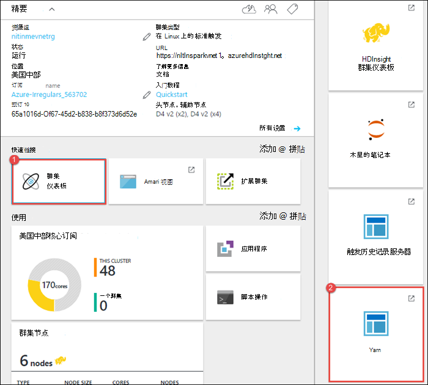

    >[AZURE.TIP] 或者，也可以启动从 Ambari 用户界面 YARN UI。 若要启动 Ambari 用户界面中的从群集刀片式服务器、**群集的仪表板**，请单击，然后单击**HDInsight 群集仪表板**。 从 Ambari 用户界面，然后单击**YARN**、**快速链接**、 活动资源管理器中，和**ResourceManager 用户界面**。  

3. 开始使用 Jupyter 笔记本的触发作业，因为应用程序名称**remotesparkmagics** （这是笔记本中启动的所有应用程序的名称）。 单击应用程序名称应用程序 ID，以获取有关该作业的详细信息。 这将启动应用程序视图。

    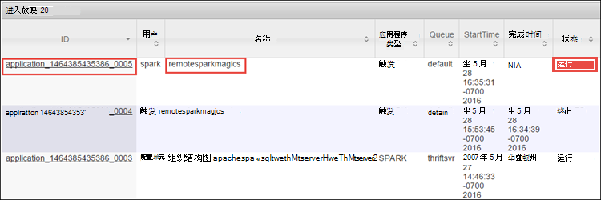

    对于此类应用程序可从 Jupyter 笔记本中启动，状态始终是**运行**直到退出笔记本。

4. 从应用程序视图中，您可以进一步深入了解与应用程序和日志 (stdout/stderr) 的容器。 您还可以通过单击链接对应的**跟踪 URL**，如下所示启动触发用户界面。 

    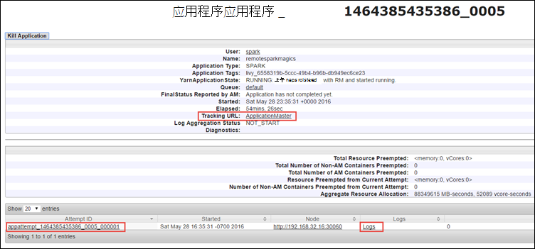

## 跟踪应用程序中触发用户界面

在触发用户界面，您可以深入到触发作业产生的先前启动的应用程序。

1. 若要启动触发用户界面中，从应用程序视图中，单击针对**跟踪 URL**，该链接上方的屏幕截图所示。 可以看到通过在 Jupyter 笔记本中运行的应用程序启动的触发作业。

    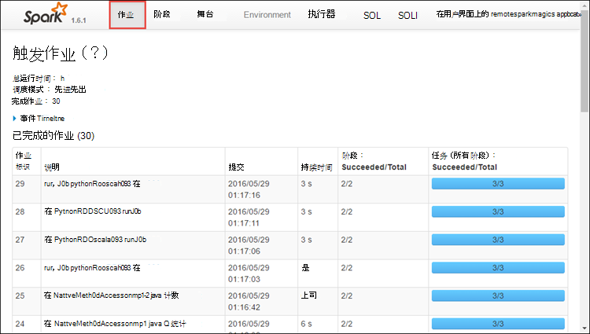

2. 单击**执行**选项卡以查看每个执行器的处理和存储信息。 您还可以通过单击**线程转储**链接检索调用堆栈。

    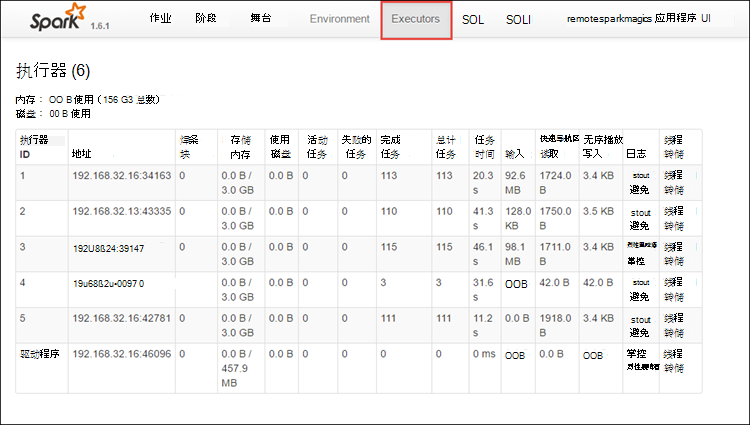
 
3. 单击**阶段**选项卡来查看与该应用程序关联的阶段。

    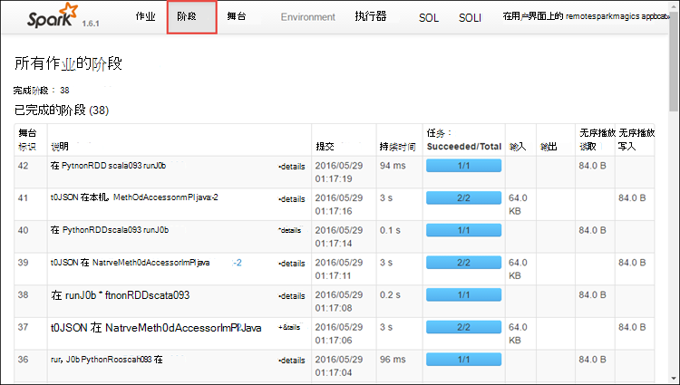

    每个阶段可以有多个任务，您可以查看执行统计信息，如下面所示。

    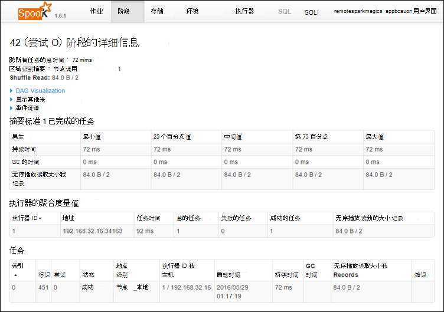 

4. 从舞台详细信息页中，您可以启动 DAG 可视化效果。 展开在页面的顶部的**DAG 可视化**链接，如下所示。

    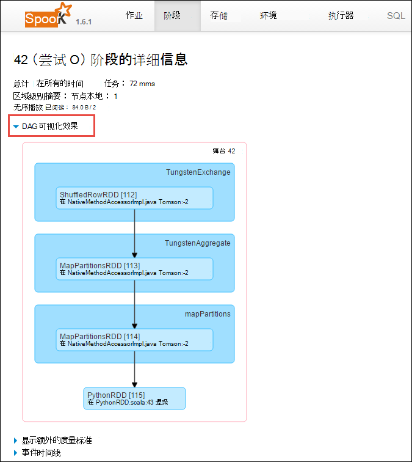

    DAG 或直接 Aclyic 图形表示应用程序中的不同阶段。 每个关系图中的蓝色框表示应用程序中调用触发操作。

5. 从舞台详细信息页中，您可以启动应用程序的时间线视图。 展开**事件时间线**顶部的页面，链接，如下所示。

    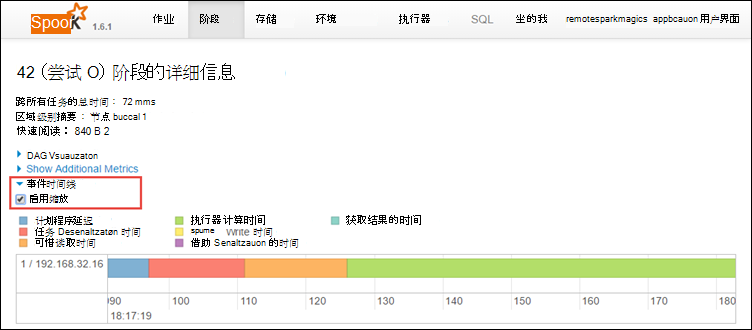

    这将在窗体中的时间线显示触发事件。 时间线视图可用于在三个级别，整个作业，在作业，和某一阶段内。 上面的图像捕获给定阶段日程表视图。

    >[AZURE.TIP] 如果您选择**启用缩放**复选框，可以在时间线视图滚动从左和右。

6. 触发用户界面中的其他选项卡提供有关触发实例以及有用的信息。

    * 存储选项卡-如果您的应用程序创建 RDDs，您可以找到有关存储选项卡中的信息。
    * 环境选项卡-此选项卡提供了大量有用的信息，有关触发实例如 
        * Scala 版本
        * 与群集相关的事件日志目录
        * 执行器的应用程序的内核数
        * 等。

## 查找有关使用触发历史记录服务器已完成作业的信息

完成作业后，触发历史记录服务器中保持有关作业的信息。

1. 若要启动触发历史记录服务器，群集刀片式服务器、**群集的仪表板**，请单击，然后单击**触发历史记录服务器**。

    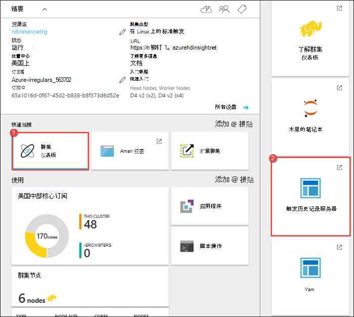

    >[AZURE.TIP] 或者，也可以启动触发历史记录服务器用户界面从 Ambari 用户界面。 若要启动 Ambari 用户界面中的从群集刀片式服务器、**群集的仪表板**，请单击，然后单击**HDInsight 群集仪表板**。 从 Ambari 用户界面中，单击**触发**，单击**快速链接**，然后单击**触发历史记录服务器用户界面**。

2. 您将看到所有已完成列出的应用程序。 单击以向下钻取到应用程序的详细信息的应用程序 ID。

    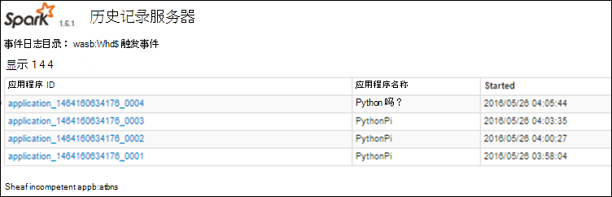
    

## 请参见

* [概述︰ 在 Azure HDInsight 上的 Apache 触发](hdinsight-apache-spark-overview.md)

### 方案

* [触发与 BI︰ 执行与 BI 工具一起使用在 HDInsight 中的触发交互式数据分析](hdinsight-apache-spark-use-bi-tools.md)

* [机器学习与触发︰ 用于分析使用 HVAC 数据的生成温度 HDInsight 中使用触发](hdinsight-apache-spark-ipython-notebook-machine-learning.md)

* [机器学习与触发︰ 使用 HDInsight 来预测食品检查结果中的触发](hdinsight-apache-spark-machine-learning-mllib-ipython.md)

* [HDInsight 用于构建实时流的应用程序中触发流︰ 使用触发](hdinsight-apache-spark-eventhub-streaming.md)

* [在 HDInsight 中使用触发网站日志分析](hdinsight-apache-spark-custom-library-website-log-analysis.md)

### 创建和运行应用程序

* [创建独立的应用程序使用 Scala](hdinsight-apache-spark-create-standalone-application.md)

* [在群集上使用晚触发远程运行作业](hdinsight-apache-spark-livy-rest-interface.md)

### 工具和扩展

* [使用 HDInsight 工具插件为 IntelliJ 创意来创建和提交触发 Scala applicatons](hdinsight-apache-spark-intellij-tool-plugin.md)

* [使用 HDInsight 工具插件为 IntelliJ 创意来触发应用程序进行远程调试](hdinsight-apache-spark-intellij-tool-plugin-debug-jobs-remotely.md)

* [在 HDInsight 上触发群集使用 Zeppelin 笔记本](hdinsight-apache-spark-use-zeppelin-notebook.md)

* [内核可用于触发 HDInsight 群集中的 Jupyter 笔记本](hdinsight-apache-spark-jupyter-notebook-kernels.md)

* [外部包使用 Jupyter 笔记本](hdinsight-apache-spark-jupyter-notebook-use-external-packages.md)

* [在您的计算机上安装 Jupyter 并连接到一个 HDInsight 触发的群集](hdinsight-apache-spark-jupyter-notebook-install-locally.md)

### 管理资源

* [管理在 Azure HDInsight Apache 触发群集的资源](hdinsight-apache-spark-resource-manager.md)
