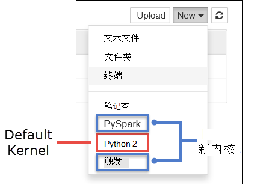

<properties 
    pageTitle="在您的计算机上安装 Jupyter 笔记本并将其连接到一个 HDInsight 触发群集 |Microsoft Azure" 
    description="了解如何在您的计算机上本地安装 Jupyter 笔记本并将其连接到 Azure HDInsight 上的 Apache 触发群集。" 
    services="hdinsight" 
    documentationCenter="" 
    authors="nitinme" 
    manager="jhubbard" 
    editor="cgronlun"
    tags="azure-portal"/>

<tags 
    ms.service="hdinsight" 
    ms.workload="big-data" 
    ms.tgt_pltfrm="na" 
    ms.devlang="na" 
    ms.topic="article" 
    ms.date="09/26/2016" 
    ms.author="nitinme"/>

# 在您的计算机上安装 Jupyter 笔记本和连接到 HDInsight Linux 上的 Apache 触发群集

在本文中，您将学习如何自定义 PySpark （对于 Python) 和触发 （针对 Scala) 内核与触发的神奇功能，安装 Jupyter 笔记本和将笔记本连接到一个 HDInsight 的群集。 可以有多种原因，在您的本地计算机上安装 Jupyter，可能会有一些挑战以及。 原因和面临的挑战的列表，请参阅本文末尾处[为什么应该安装在计算机上的 Jupyter](#why-should-i-install-jupyter-on-my-computer)的部分。

在您的计算机上安装 Jupyter 和触发魔术中包含有三个关键步骤。

* 安装 Jupyter 笔记本
* 安装 PySpark 和触发内核与触发魔术
* 配置触发魔术来访问 HDInsight 上的触发群集

有关自定义内核和触发神奇之处可供 Jupyter 笔记本使用 HDInsight 群集的详细信息，请参阅[Jupyter 笔记本使用 HDInsight 上的 Apache 触发 Linux 群集的可用的内核](hdinsight-apache-spark-jupyter-notebook-kernels.md)。

##系统必备组件

此处列出的前提条件不可用于安装 Jupyter。 这些是安装笔记本后 HDInsight 群集连接 Jupyter 笔记本。

- Azure 的订阅。 请参阅[获取 Azure 免费试用版](https://azure.microsoft.com/documentation/videos/get-azure-free-trial-for-testing-hadoop-in-hdinsight/)。
- 一个 HDInsight Linux 上的 Apache 触发群集。 有关说明，请参阅[创建 Apache 触发群集在 Azure HDInsight](hdinsight-apache-spark-jupyter-spark-sql.md)。

## 在您的计算机上安装 Jupyter 笔记本

安装 Jupyter 笔记本之前，您必须安装 Python。 Python 和 Jupyter 可作为[Ananconda 通讯组](https://www.continuum.io/downloads)的一部分。 Anaconda 安装时，您实际安装的 Python 的分布。 Anaconda 安装后，您可以通过运行命令添加 Jupyter 安装。 此部分提供了必须遵循的指示。

1. 下载用于您的平台[Anaconda 安装程序](https://www.continuum.io/downloads)并运行安装程序。 当运行安装向导时，确保您选择的选项添加到 PATH 变量 Anaconda。

2. 运行以下命令以安装 Jupyter。

        conda install jupyter

    Installting Jupyter 的详细信息，请参阅[使用 Anaconda 安装的 Jupyter](http://jupyter.readthedocs.io/en/latest/install.html)。

## 安装内核和触发魔术

有关如何安装触发魔术，PySpark 和触发的内核，GitHub 上看到[sparkmagic 文档](https://github.com/jupyter-incubator/sparkmagic#installation)。

## 配置触发魔术访问 HDInsight 触发群集

在此部分中，您配置您前面安装连接到 Apache 触发群集，您必须已创建在 Azure HDInsight 触发魔术。

1. Jupyter 配置信息通常存储在用户主目录中。 在任何操作系统平台上找到您的主目录，请键入以下命令。

    启动 Python 解释器。 在命令窗口中，键入以下命令︰

        python

    在 Python 解释器，请输入以下命令来找出主目录。

        import os
        print(os.path.expanduser('~'))

2. 导航到主目录中，创建一个称为**.sparkmagic** ，如果尚不存在的文件夹。

3. 在文件夹中创建名为**config.json**的文件，并添加下面的 JSON 段内。

        {
          "kernel_python_credentials" : {
            "username": "{USERNAME}",
            "base64_password": "{BASE64ENCODEDPASSWORD}",
            "url": "https://{CLUSTERDNSNAME}.azurehdinsight.net/livy"
          },
          "kernel_scala_credentials" : {
            "username": "{USERNAME}",
            "base64_password": "{BASE64ENCODEDPASSWORD}",
            "url": "https://{CLUSTERDNSNAME}.azurehdinsight.net/livy"
          }
        }

4. 与相应的值替换**{用户名}**， **{CLUSTERDNSNAME}**， **{BASE64ENCODEDPASSWORD}** 。 大量用您最喜欢的编程语言或在线实用程序可用于您的实际密码生成一个 base64 编码的密码。 将简单的 Python 代码段从命令提示符运行︰

        python -c "import base64; print(base64.b64encode('{YOURPASSWORD}'))"

5. 从 Jupyter 开始。 使用下面的命令从命令提示符。

        jupyter notebook

6. 请验证可以连接到使用 Jupyter 笔记本的群集和内核可以使用可用的触发魔力。 执行以下步骤。

    1. 创建新的笔记本。 从右下角，单击**新建**。 您应该看到缺省内核**Python2**和两个新的内核，安装时， **PySpark**和**触发**。

        

    
        单击**PySpark**。

    2. 运行下面的代码段。

            %%sql
            SELECT * FROM hivesampletable LIMIT 5

        如果成功，您可以检索输出，测试与 HDInsight 群集的连接。

    >[AZURE.TIP] 如果您想要更新笔记本配置连接到不同的群集，用一组新的值，更新 config.json 上面的步骤 3 中所示。 

## 为什么应该安装 Jupyter 在我的计算机？

可以有多个原因为什么您可能想要在您的计算机上安装 Jupyter，然后将其连接到 HDInsight 上触发群集。

* 即使 Jupyter 的笔记本电脑已经有了触发群集在 Azure HDInsight 上，在您的计算机上安装 Jupyter 提供的选项，以创建您的笔记本本地测试运行的群集中，针对应用程序，然后将笔记本上载到群集。 若要上载到群集的笔记本，可以上载使用运行 Jupyter 笔记本或群集，或将其保存到与群集相关的存储帐户中的 /HdiNotebooks 文件夹。 笔记本上群集的存储方式的详细信息，请参阅[Jupyter 笔记本的存储位置](hdinsight-apache-spark-jupyter-notebook-kernels.md#where-are-the-notebooks-stored)吗？
* 用笔记本与本地，可以连接到基于应用程序要求的不同触发群集。
* 您可以使用 GitHub 实现源代码管理系统，并让笔记本的版本控制。 也可以让多个用户可以使用同一个笔记本的协作环境。
* 您可以使用笔记本本地无群集。 您只需要测试，对笔记本无法手动管理您的笔记本或开发环境中的群集。
* 它可能更容易比配置 Jupyter 安装在群集上配置本地开发环境。  您可以利用您无需配置一个或多个远程群集本地安装的所有软件。

>[AZURE.WARNING] 安装在您的本地计算机上的 Jupyter，与多个用户可以笔记本同一触发在群集上运行一次。 在这种情况下，创建多个晚会话。 如果您遇到了问题，要进行调试，将一个复杂的任务，以跟踪哪些晚会话所属的用户。

## 请参见

* [概述︰ 在 Azure HDInsight 上的 Apache 触发](hdinsight-apache-spark-overview.md)

### 方案

* [触发与 BI︰ 执行与 BI 工具一起使用在 HDInsight 中的触发交互式数据分析](hdinsight-apache-spark-use-bi-tools.md)

* [机器学习与触发︰ 用于分析使用 HVAC 数据的生成温度 HDInsight 中使用触发](hdinsight-apache-spark-ipython-notebook-machine-learning.md)

* [机器学习与触发︰ 使用 HDInsight 来预测食品检查结果中的触发](hdinsight-apache-spark-machine-learning-mllib-ipython.md)

* [HDInsight 用于构建实时流的应用程序中触发流︰ 使用触发](hdinsight-apache-spark-eventhub-streaming.md)

* [在 HDInsight 中使用触发网站日志分析](hdinsight-apache-spark-custom-library-website-log-analysis.md)

### 创建和运行应用程序

* [创建独立的应用程序使用 Scala](hdinsight-apache-spark-create-standalone-application.md)

* [在群集上使用晚触发远程运行作业](hdinsight-apache-spark-livy-rest-interface.md)

### 工具和扩展

* [使用 HDInsight 工具插件为 IntelliJ 创意来创建和提交触发 Scala applicatons](hdinsight-apache-spark-intellij-tool-plugin.md)

* [使用 HDInsight 工具插件为 IntelliJ 创意来触发应用程序进行远程调试](hdinsight-apache-spark-intellij-tool-plugin-debug-jobs-remotely.md)

* [在 HDInsight 上触发群集使用 Zeppelin 笔记本](hdinsight-apache-spark-use-zeppelin-notebook.md)

* [内核可用于触发 HDInsight 群集中的 Jupyter 笔记本](hdinsight-apache-spark-jupyter-notebook-kernels.md)

* [外部包使用 Jupyter 笔记本](hdinsight-apache-spark-jupyter-notebook-use-external-packages.md)

### 管理资源

* [管理在 Azure HDInsight Apache 触发群集的资源](hdinsight-apache-spark-resource-manager.md)

* [跟踪和调试 HDInsight 在 Apache 触发群集上运行的作业](hdinsight-apache-spark-job-debugging.md)
