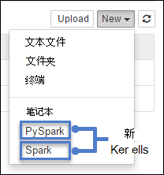

<properties 
    pageTitle="内核用 Jupyter 笔记本在 HDInsight 触发群集在 Linux 上 |Microsoft Azure" 
    description="了解其他 Jupyter 笔记本的内核可用于触发 HDInsight Linux 上的群集。" 
    services="hdinsight" 
    documentationCenter="" 
    authors="nitinme" 
    manager="jhubbard" 
    editor="cgronlun"
    tags="azure-portal"/>

<tags 
    ms.service="hdinsight" 
    ms.workload="big-data" 
    ms.tgt_pltfrm="na" 
    ms.devlang="na" 
    ms.topic="article" 
    ms.date="10/05/2016" 
    ms.author="nitinme"/>

# HDInsight Linux 内核与 Apache 触发 Jupyter 笔记本的可用簇

在 HDInsight (Linux) 上的 Apache 触发群集包括 Jupyter 笔记本可以用来测试您的应用程序。 内核是一个程序的运行，并将解释代码。 HDInsight 触发群集提供了您可以使用 Jupyter 笔记本的两个内核。 它们是︰

1. **PySpark**（对于用 Python 编写的应用程序）
2. **触发**（对于在 Scala 中编写的应用程序）

在本文中，您将学习有关如何使用这些内核和什么是您使用它们带来的好处。

**系统必备组件︰**

您必须具有以下各项︰

- Azure 的订阅。 请参阅[获取 Azure 免费试用版](https://azure.microsoft.com/documentation/videos/get-azure-free-trial-for-testing-hadoop-in-hdinsight/)。
- 一个 HDInsight Linux 上的 Apache 触发群集。 有关说明，请参阅[创建 Apache 触发群集在 Azure HDInsight](hdinsight-apache-spark-jupyter-spark-sql.md)。

## 如何使用内核？ 

1. 从[Azure 门户网站](https://portal.azure.com/)，startboard，从单击触发群集的拼贴 （如果您将它固定到 startboard）。 您还可以向下**浏览所有**群集导航 > **HDInsight 群集**。   

2. 从触发群集刀片式服务器，**群集的仪表板**，请单击，然后单击**Jupyter 笔记本**。 出现提示时，输入群集管理员凭据。

    > [AZURE.NOTE] 通过在浏览器中打开下面的 URL，还可能会达到 Jupyter 笔记本为群集。 __群集名称__替换您的群集的名称︰
    >
    > `https://CLUSTERNAME.azurehdinsight.net/jupyter`

2. 与新的内核中创建一个新的笔记本。 单击**新建**，然后单击**Pyspark**或**触发**。 对于 Python 应用程序，应使用 Scala 应用程序触发内核和 PySpark 内核。

     

3. 这应该与所选的内核打开新的笔记本。

## 为什么要使用 PySpark 或触发内核？

以下是使用新的内核的几个优点。

1. **预设的上下文**。 **PySpark**或 Jupyter 笔记本提供的**触发**内核时，您不需要显式设置触发或配置单元上下文，然后才可以开始使用此应用程序进行开发;这些是默认为您提供。 这些上下文是︰

    * **sc**的触发上下文
    * **sqlContext** -用于配置单元上下文

    因此，您不必运行语句如下所示设置上下文︰

        ###################################################
        # YOU DO NOT NEED TO RUN THIS WITH THE NEW KERNELS
        ###################################################
        sc = SparkContext('yarn-client')
        sqlContext = HiveContext(sc)

    相反，可以直接在您的应用程序中使用预设的上下文。
    
2. **Magics 单元格**。 PySpark 内核提供了一些预定义的"magics"，哪些是可以使用调用的特殊命令`%%`(例如`%%MAGIC` <args>)。 魔术的命令必须是代码单元格中的第一个单词并且允许多个行的内容。 魔术一词应为在单元格中的第一个单词。 添加任何东西之前变魔术一样，即使意见，将会导致出错。   Magics 的详细信息，请参阅[此处](http://ipython.readthedocs.org/en/stable/interactive/magics.html)。

    下表列出了不同的 magics 可通过内核。

  	| 魔术     | 示例                         | 说明  |
  	|-----------|---------------------------------|--------------|
  	| 帮助      | `%%help`                            | 生成示例，并说明使用所有可用的 magics 的表 |
  	| 信息      | `%%info`                          | 当前晚终结点的输出会话信息 |
  	| 配置 | `%%configure -f` `{"executorMemory": "1000M"`, `"executorCores": 4`} | 配置参数，以创建会话。 强制标记 (-f) 是必需的如果已创建一个会话，该会话将被删除并重新创建。 有关有效参数的列表看[晚的开机自检 /sessions 请求的正文](https://github.com/cloudera/livy#request-body)。 参数必须为一个 JSON 字符串中传递和之后，必须是在下一行上神奇之处，列中的示例所示。 |
  	| sql       |  `%%sql -o <variable name>`  `SHOW TABLES`    | 配置单元对执行查询，sqlContext。 如果`-o`传递参数，则查询结果保留在 %%为[Pandas](http://pandas.pydata.org/) dataframe 的本地 Python 上下文。   |
  	| 本地     |     `%%local` `a=1`              | 本地执行的后续行中的所有代码。 代码必须是有效的 Python 代码。 |
  	| 日志      | `%%logs`                        | 输出当前晚会话日志。  |
  	| 删除    | `%%delete -f -s <session number>` | 删除特定会话的当前晚终结点。 请注意，您不能删除会话启动内核本身。 |
  	| 清理   | `%%cleanup -f`                    | 删除所有当前晚终结点，包括笔记本的会话的会话。 强制的标志-f 是必需的。  |

    >[AZURE.NOTE] 除了由 PySpark 内核添加 magics，您还可以使用[内置 IPython magics](https://ipython.org/ipython-doc/3/interactive/magics.html#cell-magics)，包括`%%sh`。 您可以使用`%%sh`在群集 headnode 上运行脚本和代码块的魔术。 

3. **自动可视化效果**。 **Pyspark**内核自动形象配置单元和 SQL 查询的输出结果。 您可以选择几种不同类型的可视化效果包括表、 饼形、 线路、 区域、 条之间进行选择。

## 支持使用参数 %%sql 魔术

%%Sql 神奇功能支持可用于控制当您运行查询时，收到的输出类型的不同参数。 下表列出输出。

| 参数     | 示例                         | 说明  |
|-----------|---------------------------------|--------------|
| -o      | `-o <VARIABLE NAME>`                          | 使用此参数的查询结果保留在 %%本地 Python 上下文，为[Pandas](http://pandas.pydata.org/) dataframe。 Dataframe 变量的名称是您指定的变量名称。 |
| -q      | `-q`                          | 用于关闭可视化项的单元格。 如果您不希望自动显示单元格的内容，只是想将其作为 dataframe，然后使用`-q -o <VARIABLE>`。 如果您想要关闭不捕获结果的可视化效果 (例如像具负面影响运行 SQL 查询`CREATE TABLE`语句)，只需使用`-q`而不指定`-o`参数。 |
| -m       |  `-m <METHOD>`    | 其中，**方法**是**采取**或**示例**（默认为**执行**）。 如果该方法是**采用**，内核将从指定的最大行数 （在此表后面介绍） 的结果数据集上的元素来挑选。 如果该方法**的示例**，内核将随机取样根据数据集的元素`-r`参数，此表中的下一步所述。   |
| -r     |     `-r <FRACTION>`            | 这里**的分数**是介于 0.0 和 1.0 之间的浮点数。 如果 SQL 查询的示例方法是`sample`，然后内核进行随机取样为您; 结果集中的元素的指定的部分例如如果您使用参数运行 SQL 查询`-m sample -r 0.01`，然后将随机抽样的结果行的 1%。 |
| -n      | `-n <MAXROWS>`                        | **最大行数**为整数值。 内核将会限制输出**最大行数**的行数。 如果**最大行数**为负数例如**-1**，然后在结果集中的行数不会有限。 |

**示例︰**

    %%sql -q -m sample -r 0.1 -n 500 -o query2 
    SELECT * FROM hivesampletable

上面的语句执行以下任务︰

* 从**hivesampletable**中选择所有记录。
* 因为我们使用-q，它会关闭自动可视化效果。
* 因为我们使用`-m sample -r 0.1 -n 500`它随机抽取 10%的中行 hivesampletable 和结果集为 500 行的大小限制。
* 最后，由于我们使用`-o query2`它还将输出保存到名为**query2**dataframe。
    

## 使用新的内核时的注意事项

任何一种内核则使用 （PySpark 或触发），从而使运行笔记本电脑将消耗您的群集资源。  与这些内核中，上下文预设的因为只需退出笔记本未使上下文，因此群集资源将继续被使用。 PySpark 和触发内核具有较好的做法是使用笔记本的**文件**菜单中的**关闭和停止**选项。 这使断开上下文，然后退出笔记本。    

## 向我显示了一些示例

当您打开一个 Jupyter 笔记本时，您将看到两个文件夹可在根级别。

* **PySpark**文件夹包含示例使用新的**Python**内核的笔记本。
* **Scala**文件夹包含示例使用新的**触发**内核的笔记本。

可以打开从**PySpark**或**触发**文件夹，若要了解有关可用不同的 magics **00-[阅读我第一个] 触发魔术核心功能**的笔记本。 此外可以使用两个文件夹下其他可用的示例笔记本来了解如何实现 HDInsight 触发群集中使用 Jupyter 笔记本的不同方案。

## 笔记本的存储位置

Jupyter 笔记本被保存到**/HdiNotebooks**文件夹下群集与关联的存储帐户。  笔记本、 文字文件和从 Jupyter 中创建的文件夹将从 WASB 访问。  例如，如果您使用 Jupyter 来创建文件夹**myfolder 文件夹**和笔记本**myfolder/mynotebook.ipynb**，您可以访问在该笔记本`wasbs:///HdiNotebooks/myfolder/mynotebook.ipynb`。  相反也是如此，也就是说，如果您将笔记本传直接到您的存储帐户， `/HdiNotebooks/mynotebook1.ipynb`，笔记本电脑将会从 Jupyter 中看到。  即使群集中被删除，笔记本将保留在存储帐户。

笔记本电脑会保存到存储帐户的方法是兼容 HDFS。 因此，如果您到群集可以使用 SSH 文件管理命令，如下所示︰

    hdfs dfs -ls /HdiNotebooks                            # List everything at the root directory – everything in this directory is visible to Jupyter from the home page
    hdfs dfs –copyToLocal /HdiNotebooks                 # Download the contents of the HdiNotebooks folder
    hdfs dfs –copyFromLocal example.ipynb /HdiNotebooks   # Upload a notebook example.ipynb to the root folder so it’s visible from Jupyter

如果有访问该群集的存储帐户的问题，笔记本也保存在 headnode `/var/lib/jupyter`。

## 支持的浏览器
针对 HDInsight 触发群集运行的 Jupyter 笔记本支持仅在 Google Chrome 上。

## 反馈

新内核处于发展阶段，并将随着时间的推移成熟。 这也意味着，Api 无法更改这些内核成熟。 我们将不胜感激任何使用这些新的内核时的反馈。 这将是在塑造这些内核的最终版本中非常有用。 可以将批注反馈保留下这篇文章底部的**注释**部分。

## 请参见

* [概述︰ 在 Azure HDInsight 上的 Apache 触发](hdinsight-apache-spark-overview.md)

### 方案

* [触发与 BI︰ 执行与 BI 工具一起使用在 HDInsight 中的触发交互式数据分析](hdinsight-apache-spark-use-bi-tools.md)

* [机器学习与触发︰ 用于分析使用 HVAC 数据的生成温度 HDInsight 中使用触发](hdinsight-apache-spark-ipython-notebook-machine-learning.md)

* [机器学习与触发︰ 使用 HDInsight 来预测食品检查结果中的触发](hdinsight-apache-spark-machine-learning-mllib-ipython.md)

* [HDInsight 用于构建实时流的应用程序中触发流︰ 使用触发](hdinsight-apache-spark-eventhub-streaming.md)

* [在 HDInsight 中使用触发网站日志分析](hdinsight-apache-spark-custom-library-website-log-analysis.md)

### 创建和运行应用程序

* [创建独立的应用程序使用 Scala](hdinsight-apache-spark-create-standalone-application.md)

* [在群集上使用晚触发远程运行作业](hdinsight-apache-spark-livy-rest-interface.md)

### 工具和扩展

* [使用 HDInsight 工具插件为 IntelliJ 创意来创建和提交触发 Scala applicatons](hdinsight-apache-spark-intellij-tool-plugin.md)

* [使用 HDInsight 工具插件为 IntelliJ 创意来触发应用程序进行远程调试](hdinsight-apache-spark-intellij-tool-plugin-debug-jobs-remotely.md)

* [在 HDInsight 上触发群集使用 Zeppelin 笔记本](hdinsight-apache-spark-use-zeppelin-notebook.md)

* [外部包使用 Jupyter 笔记本](hdinsight-apache-spark-jupyter-notebook-use-external-packages.md)

* [在您的计算机上安装 Jupyter 并连接到一个 HDInsight 触发的群集](hdinsight-apache-spark-jupyter-notebook-install-locally.md)

### 管理资源

* [管理在 Azure HDInsight Apache 触发群集的资源](hdinsight-apache-spark-resource-manager.md)

* [跟踪和调试 HDInsight 在 Apache 触发群集上运行的作业](hdinsight-apache-spark-job-debugging.md)
