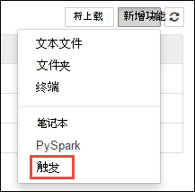
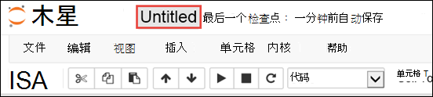
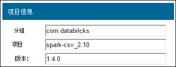

<properties 
    pageTitle="外部包使用 HDInsight 上的 Apache 触发簇中的 Jupyter 笔记本 |Azure"
    description="分步说明如何使用 HDInsight 触发群集配置可用的 Jupyter 笔记本使用外部触发包。" 
    services="hdinsight" 
    documentationCenter="" 
    authors="nitinme" 
    manager="jhubbard" 
    editor="cgronlun"
    tags="azure-portal"/>

<tags 
    ms.service="hdinsight" 
    ms.workload="big-data" 
    ms.tgt_pltfrm="na" 
    ms.devlang="na" 
    ms.topic="article" 
    ms.date="10/28/2016" 
    ms.author="nitinme"/>

# 与 Jupyter 笔记本 HDInsight Linux 上的 Apache 触发群集中使用外部包

>[AZURE.NOTE] 这篇文章是适用于姿 1.5.2 在 HDInsight 3.3 加上 HDInsight 3.4 1.6.2 触发。 

了解如何在 HDInsight (Linux) 要使用外部的 Apache 触发群集中配置 Jupyter 笔记本、 社区提供包不包括群集中的框。 

您可以搜索[Maven 存储库中](http://search.maven.org/)可用的软件包的完整列表。 您还可以从其他源获取可用的软件包的列表。 例如，[触发包](http://spark-packages.org/)提供了完整的社区提供的程序包列表。

在本文中，您将学习如何使用 Jupyter 笔记本[触发 csv](http://search.maven.org/#artifactdetails%7Ccom.databricks%7Cspark-csv_2.10%7C1.4.0%7Cjar)包。

##系统必备组件

您必须具有以下各项︰

- Azure 的订阅。 请参阅[获取 Azure 免费试用版](https://azure.microsoft.com/documentation/videos/get-azure-free-trial-for-testing-hadoop-in-hdinsight/)。
- 一个 HDInsight Linux 上的 Apache 触发群集。 有关说明，请参阅[创建 Apache 触发群集在 Azure HDInsight](hdinsight-apache-spark-jupyter-spark-sql.md)。

## 外部包使用 Jupyter 笔记本 

1. 从[Azure 门户网站](https://portal.azure.com/)，startboard，从单击触发群集的拼贴 （如果您将它固定到 startboard）。 您还可以向下**浏览所有**群集导航 > **HDInsight 群集**。   

2. 从触发群集刀片式服务器，单击**快速链接**，然后从**群集仪表板**刀片式服务器，请单击**Jupyter 笔记本**。 出现提示时，输入群集管理员凭据。

    > [AZURE.NOTE] 通过在浏览器中打开下面的 URL，还可能会达到 Jupyter 笔记本为群集。 __群集名称__替换您的群集的名称︰
    >
    > `https://CLUSTERNAME.azurehdinsight.net/jupyter`

2. 创建新的笔记本。 单击**新建**，然后单击**触发**。

    

3. 创建并打开名为 Untitled.pynb 的新笔记本。 单击顶部的笔记本名称并输入好记的名称。

    

4. 您将使用`%%configure`配置的笔记本使用外部包的魔术。 在使用外部包的笔记本，请确保您调用`%%configure`魔术中的第一个代码单元。 这可确保内核被配置为使用该软件包，在培训开始之前。

        %%configure
        { "packages":["com.databricks:spark-csv_2.10:1.4.0"] }

    >[AZURE.IMPORTANT] 如果您忘记将内核配置在第一个单元格，则可以使用`%%configure`与`-f`参数，但会重新启动该会话，所有的进度将会丢失。

5. 在上面的代码段`packages`期望 maven 坐标 Maven 中央存储库中的列表。 在本段中，`com.databricks:spark-csv_2.10:1.4.0`是**触发 csv**包的 maven 坐标。 下面是如何构造一个包的坐标。

    一。 Maven 存储库中找到该程序包。 在本教程中，我们使用[触发 csv](http://search.maven.org/#artifactdetails%7Ccom.databricks%7Cspark-csv_2.10%7C1.4.0%7Cjar)。
    
    b。 从资料库，收集**GroupId**、 **ArtifactId**，和**版本**的值。

    

    c。 串联三个值，用冒号 （**:**）。

        com.databricks:spark-csv_2.10:1.4.0

6. 运行的代码单元格中`%%configure`魔术。 这将配置基础的晚会话，使用您提供的软件包。 在笔记本中的后续单元格，您现在可以使用该程序包，如下所示。

        val df = sqlContext.read.format("com.databricks.spark.csv").
        option("header", "true").
        option("inferSchema", "true").
        load("wasbs:///HdiSamples/HdiSamples/SensorSampleData/hvac/HVAC.csv")

7. 然后可以像运行这些代码段，示，若要查看在上一步中创建的 dataframe 中的数据。

        df.show()

        df.select("Time").count()

## 请参见

* [概述︰ 在 Azure HDInsight 上的 Apache 触发](hdinsight-apache-spark-overview.md)

### 方案

* [触发与 BI︰ 执行与 BI 工具一起使用在 HDInsight 中的触发交互式数据分析](hdinsight-apache-spark-use-bi-tools.md)

* [机器学习与触发︰ 用于分析使用 HVAC 数据的生成温度 HDInsight 中使用触发](hdinsight-apache-spark-ipython-notebook-machine-learning.md)

* [机器学习与触发︰ 使用 HDInsight 来预测食品检查结果中的触发](hdinsight-apache-spark-machine-learning-mllib-ipython.md)

* [HDInsight 用于构建实时流的应用程序中触发流︰ 使用触发](hdinsight-apache-spark-eventhub-streaming.md)

* [在 HDInsight 中使用触发网站日志分析](hdinsight-apache-spark-custom-library-website-log-analysis.md)

### 创建和运行应用程序

* [创建独立的应用程序使用 Scala](hdinsight-apache-spark-create-standalone-application.md)

* [在群集上使用晚触发远程运行作业](hdinsight-apache-spark-livy-rest-interface.md)

### 工具和扩展

* [使用 HDInsight 工具插件为 IntelliJ 创意来创建和提交触发 Scala applicatons](hdinsight-apache-spark-intellij-tool-plugin.md)

* [使用 HDInsight 工具插件为 IntelliJ 创意来触发应用程序进行远程调试](hdinsight-apache-spark-intellij-tool-plugin-debug-jobs-remotely.md)

* [在 HDInsight 上触发群集使用 Zeppelin 笔记本](hdinsight-apache-spark-use-zeppelin-notebook.md)

* [内核可用于触发 HDInsight 群集中的 Jupyter 笔记本](hdinsight-apache-spark-jupyter-notebook-kernels.md)

* [在您的计算机上安装 Jupyter 并连接到一个 HDInsight 触发的群集](hdinsight-apache-spark-jupyter-notebook-install-locally.md)

### 管理资源

* [管理在 Azure HDInsight Apache 触发群集的资源](hdinsight-apache-spark-resource-manager.md)

* [跟踪和调试 HDInsight 在 Apache 触发群集上运行的作业](hdinsight-apache-spark-job-debugging.md)
