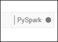

<properties
    pageTitle="HDInsight Linux 上创建触发群集和交互式分析使用触发 SQL 从 Jupyter |Microsoft Azure"
    description="如何快速创建 Apache 触发的分步说明在 HDInsight 群集，然后使用 Jupyter 笔记本从触发 SQL 运行交互式查询。"
    services="hdinsight"
    documentationCenter=""
    authors="nitinme"
    manager="jhubbard"
    editor="cgronlun"
    tags="azure-portal"/>

<tags
    ms.service="hdinsight"
    ms.workload="big-data"
    ms.tgt_pltfrm="na"
    ms.devlang="na"
    ms.topic="get-started-article"
    ms.date="10/28/2016"
    ms.author="nitinme"/>

# 入门︰ 创建 HDInsight Linux 上的 Apache 触发群集和运行交互式使用触发 SQL 的查询

了解如何在 HDInsight 中创建一个 Apache 触发的群集，然后使用[Jupyter](https://jupyter.org)笔记本在触发群集上运行触发 SQL 交互式查询。

   

[AZURE.INCLUDE [delete-cluster-warning](../../includes/hdinsight-delete-cluster-warning.md)]

## 系统必备组件

- **Azure 订阅**。 在开始本教程之前，您必须先 Azure 的订阅。 请参阅[获取 Azure 免费试用版](https://azure.microsoft.com/documentation/videos/get-azure-free-trial-for-testing-hadoop-in-hdinsight/)。

- **客户端安全外壳协议 (SSH)**: Linux、 Unix 和 OS X 系统提供参数的 SSH 客户端通过`ssh`命令。 对于 Windows 系统，我们建议[PuTTY](http://www.chiark.greenend.org.uk/~sgtatham/putty/download.html)。
    
- **安全外壳 (SSH) 键 （可选）**︰ 确保用于连接到群集使用公共密钥或密码的 SSH 帐户的安全。 使用密码获取您迅速开始工作，并应使用此选项，如果您想要快速创建群集和运行某些测试作业。 使用密钥是更安全，但是它也需要额外的设置。 您可能希望创建生产群集时，使用此方法。 在本文中，我们使用密码的方法。 有关如何创建和使用 HDInsight 的 SSH 密钥的说明，请参阅以下文章︰

    -  从 Linux 计算机-[使用 SSH 通过从 Linux、 Unix 或 OS X 的基于 Linux 的 HDInsight (Hadoop)](hdinsight-hadoop-linux-use-ssh-unix.md)。
    
    -  从 Windows 计算机[使用 SSH 与从 Windows 的基于 Linux 的 HDInsight (Hadoop)](hdinsight-hadoop-linux-use-ssh-windows.md)。

>[AZURE.NOTE] 本文使用 Azure 的资源管理器模板来创建触发群集使用[Azure 存储 Blob 的群集存储器](hdinsight-hadoop-use-blob-storage.md)。 您还可以创建触发群集[Azure 数据湖存储区](../data-lake-store/data-lake-store-overview.md)用作附加存储空间，除了作为默认存储区的 Azure 存储 Blob。 有关说明，请参阅[创建与数据湖商店 HDInsight 群集](../data-lake-store/data-lake-store-hdinsight-hadoop-use-portal.md)。

### 访问控制要求

[AZURE.INCLUDE [access-control](../../includes/hdinsight-access-control-requirements.md)]

## 创建触发群集

在本部分中，您将创建 HDInsight 版本 3.4 的群集 （触发版本 1.6.1） 使用 Azure 的资源管理器模板。 其服务级别协议和 HDInsight 版本有关的信息，请参阅[HDInsight 组件版本控制](hdinsight-component-versioning.md)。 其他群集创建方法，请参阅[创建 HDInsight 群集](hdinsight-hadoop-provision-linux-clusters.md)。

1. 请单击以下图像在 Azure 门户中打开模板。         

    
    
    该模板位于*https://hditutorialdata.blob.core.windows.net/armtemplates/create-linux-based-spark-cluster-in-hdinsight.json*的公钥 blob 容器中。 
   
2. 从参数刀片式服务器，输入以下命令︰

    - **群集名称**︰ 输入，您将创建的 Hadoop 群集的名称。
    - **群集登录名和密码**︰ 默认登录名是管理员。
    - **SSH 用户名称和密码**。
    
    请记下这些值。  在本教程后面部分，将需要它们。

    > [AZURE.NOTE] SSH 使用远程访问 HDInsight 群集使用的命令行。 连接到 SSH 通过群集时使用的用户名和密码，您在此处使用。 此外，SSH 用户名称必须是唯一的如 HDInsight 群集的所有节点上创建的用户帐户。 以下是一些保留用于群集服务的帐户名并不能用作 SSH 用户名称︰
    >
    > 根、 hdiuser、 风暴、 hbase、 ubuntu，zookeeper、 hdfs、 yarn、 mapred、 hbase、 配置单元、 oozie，falcon、 sqoop、 管理、 tez、 hcat、 hdinsight zookeeper。

    > 在 HDInsight 中使用 SSH 的详细信息，请参阅下列文章︰

    > * [HDInsight 从 Linux、 Unix 或 OS X 上的基于 Linux 的 Hadoop 使用 SSH](hdinsight-hadoop-linux-use-ssh-unix.md)
    > * [在从 Windows HDInsight 基于 Linux 的 Hadoop 使用 SSH](hdinsight-hadoop-linux-use-ssh-windows.md)

    
3.单击**确定**以保存参数。

4.从**自定义部署**刀片式服务器，**资源组**下拉框中，单击，然后单击**新建**以创建新的资源组。 资源组是群集、 从属存储帐户和其他链接的资源进行分组的容器。

5.单击**法律条款**，，然后单击**创建**。

6.单击**创建**。 您将看到标题为提交部署模板部署新的拼贴。 大约需要大约 20 分钟的时间来创建群集和 SQL 数据库。

## 运行触发 SQL 查询使用 Jupyter 笔记本

在本节中，您可以使用 Jupyter 笔记本对触发群集运行触发 SQL 查询。 HDInsight 触发群集提供了您可以使用 Jupyter 笔记本的两个内核。 它们是︰

* **PySpark**（对于用 Python 编写的应用程序）
* **触发**（对于在 Scala 中编写的应用程序）

在本文中，您将使用 PySpark 内核。 文章[在 Jupyter 笔记本与触发 HDInsight 群集上可用的内核](hdinsight-apache-spark-jupyter-notebook-kernels.md#why-should-i-use-the-new-kernels)中您可以阅读有关使用 PySpark 内核的优点的详细信息。 但是，几个使用 PySpark 内核的主要优点是︰

* 您不需要为添姿加配置单元中设置上下文。 这些自动为您设置。
* 您可以使用单元格 magics，如`%%sql`，直接运行 SQL 或配置单元查询，而无需任何前面的代码段。
* 对于 SQL 或配置单元查询输出自动进行可视化处理。

### 使用 PySpark 内核创建 Jupyter 笔记本 

1. 从[Azure 门户网站](https://portal.azure.com/)，startboard，从单击触发群集的拼贴 （如果您将它固定到 startboard）。 您还可以向下**浏览所有**群集导航 > **HDInsight 群集**。   

2. 从触发群集刀片式服务器，**群集的仪表板**，请单击，然后单击**Jupyter 笔记本**。 出现提示时，输入群集管理员凭据。

    > [AZURE.NOTE] 通过在浏览器中打开下面的 URL，还可能会达到 Jupyter 笔记本为群集。 __群集名称__替换您的群集的名称︰
    >
    > `https://CLUSTERNAME.azurehdinsight.net/jupyter`

2. 创建新的笔记本。 单击**新建**，然后单击**PySpark**。

    

3. 创建并打开名为 Untitled.pynb 的新笔记本。 单击顶部的笔记本名称并输入好记的名称。

    

4. 由于在创建笔记本使用 PySpark 内核，您不需要显式创建任何上下文。 运行第一个代码单元格时，将为您自动创建添姿加配置单元的上下文。 您可以通过导入该方案所需的类型。 为此，请在单元格中粘贴下面的代码段和按**SHIFT + ENTER**。

        from pyspark.sql.types import *
        
    每次 Jupyter 在运行作业时，您的 web 浏览器窗口标题将显示笔记本标题以及**（忙碌）**状态。 您还将看到右上角中的**PySpark**文本旁边实心圆。 在作业完成后，这将变成空心圆。

     

4. 将示例数据加载到临时表中。 在 HDInsight 中创建一个触发群集时，示例数据文件中， **hvac.csv**，复制到**\HdiSamples\HdiSamples\SensorSampleData\hvac**的关联的存储帐户。

    空单元格中粘贴下面的代码示例，请按**SHIFT + ENTER**。 此代码示例将数据注册到一个名为**hvac**的临时表。

        # Load the data
        hvacText = sc.textFile("wasbs:///HdiSamples/HdiSamples/SensorSampleData/hvac/HVAC.csv")
        
        # Create the schema
        hvacSchema = StructType([StructField("date", StringType(), False),StructField("time", StringType(), False),StructField("targettemp", IntegerType(), False),StructField("actualtemp", IntegerType(), False),StructField("buildingID", StringType(), False)])
        
        # Parse the data in hvacText
        hvac = hvacText.map(lambda s: s.split(",")).filter(lambda s: s[0] != "Date").map(lambda s:(str(s[0]), str(s[1]), int(s[2]), int(s[3]), str(s[6]) ))
        
        # Create a data frame
        hvacdf = sqlContext.createDataFrame(hvac,hvacSchema)
        
        # Register the data fram as a table to run queries against
        hvacdf.registerTempTable("hvac")

5. 因为您正在使用 PySpark 内核，您现在可以直接运行 SQL 查询上使用刚创建的临时表**hvac** `%%sql`魔术。 有关详细信息`%%sql`的神奇功能，以及其他 magics 与 PySpark 内核，可查看[Jupyter 笔记本与触发 HDInsight 群集上可用的内核](hdinsight-apache-spark-jupyter-notebook-kernels.md#why-should-i-use-the-new-kernels)。
        
        %%sql
        SELECT buildingID, (targettemp - actualtemp) AS temp_diff, date FROM hvac WHERE date = \"6/1/13\"

5. 一旦作业成功完成后，默认情况下显示下面的表格格式输出。

    

    您还可以查看其他的可视化项的结果。 例如，一个区域图，对于相同的输出应如下所示。

    

6. 运行应用程序之后，您应该关闭笔记本以释放资源。 为此，请从笔记本上的**文件**菜单上，单击**关闭并暂停**。 这将关闭和关闭笔记本。

##删除群集

[AZURE.INCLUDE [delete-cluster-warning](../../includes/hdinsight-delete-cluster-warning.md)]

## 请参见

* [概述︰ 在 Azure HDInsight 上的 Apache 触发](hdinsight-apache-spark-overview.md)

### 方案

* [触发与 BI︰ 执行与 BI 工具一起使用在 HDInsight 中的触发交互式数据分析](hdinsight-apache-spark-use-bi-tools.md)

* [机器学习与触发︰ 用于分析使用 HVAC 数据的生成温度 HDInsight 中使用触发](hdinsight-apache-spark-ipython-notebook-machine-learning.md)

* [机器学习与触发︰ 使用 HDInsight 来预测食品检查结果中的触发](hdinsight-apache-spark-machine-learning-mllib-ipython.md)

* [HDInsight 用于构建实时流的应用程序中触发流︰ 使用触发](hdinsight-apache-spark-eventhub-streaming.md)

* [在 HDInsight 中使用触发网站日志分析](hdinsight-apache-spark-custom-library-website-log-analysis.md)

* [在 HDInsight 中使用触发应用程序了解遥测数据分析](hdinsight-spark-analyze-application-insight-logs.md)

### 创建和运行应用程序

* [创建独立的应用程序使用 Scala](hdinsight-apache-spark-create-standalone-application.md)

* [在群集上使用晚触发远程运行作业](hdinsight-apache-spark-livy-rest-interface.md)

### 工具和扩展

* [使用 HDInsight 工具插件为 IntelliJ 创意来创建和提交触发 Scala applicatons](hdinsight-apache-spark-intellij-tool-plugin.md)

* [使用 HDInsight 工具插件为 IntelliJ 创意来触发应用程序进行远程调试](hdinsight-apache-spark-intellij-tool-plugin-debug-jobs-remotely.md)

* [在 HDInsight 上触发群集使用 Zeppelin 笔记本](hdinsight-apache-spark-use-zeppelin-notebook.md)

* [内核可用于触发 HDInsight 群集中的 Jupyter 笔记本](hdinsight-apache-spark-jupyter-notebook-kernels.md)

* [外部包使用 Jupyter 笔记本](hdinsight-apache-spark-jupyter-notebook-use-external-packages.md)

* [在您的计算机上安装 Jupyter 并连接到一个 HDInsight 触发的群集](hdinsight-apache-spark-jupyter-notebook-install-locally.md)

### 管理资源

* [管理在 Azure HDInsight Apache 触发群集的资源](hdinsight-apache-spark-resource-manager.md)

* [跟踪和调试 HDInsight 在 Apache 触发群集上运行的作业](hdinsight-apache-spark-job-debugging.md)

[hdinsight-versions]: hdinsight-component-versioning.md
[hdinsight-upload-data]: hdinsight-upload-data.md
[hdinsight-storage]: hdinsight-hadoop-use-blob-storage.md

[azure-purchase-options]: http://azure.microsoft.com/pricing/purchase-options/
[azure-member-offers]: http://azure.microsoft.com/pricing/member-offers/
[azure-free-trial]: http://azure.microsoft.com/pricing/free-trial/
[azure-management-portal]: https://manage.windowsazure.com/
[azure-create-storageaccount]: storage-create-storage-account.md
