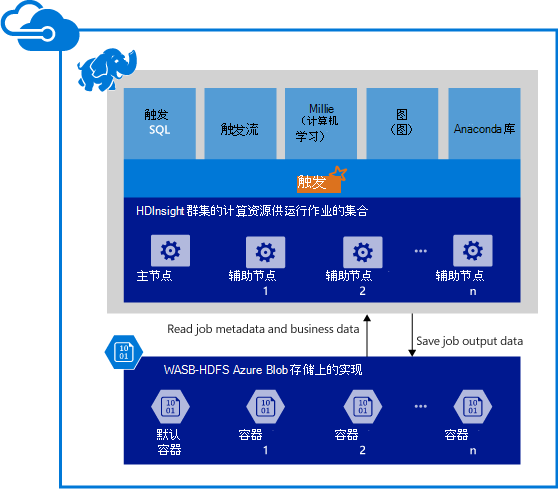

<properties 
    pageTitle="Apache HDInsight 中的触发事件的概述 |Microsoft Azure" 
    description="Apache HDInsight 中的触发和在您的应用程序在 HDInsight 上使用触发的方案简介。" 
    services="hdinsight" 
    documentationCenter="" 
    authors="nitinme" 
    manager="jhubbard" 
    editor="cgronlun"
    tags="azure-portal"/>

<tags 
    ms.service="hdinsight" 
    ms.workload="big-data" 
    ms.tgt_pltfrm="na" 
    ms.devlang="na" 
    ms.topic="get-started-article" 
    ms.date="08/25/2016" 
    ms.author="nitinme"/>

# 概述︰ HDInsight Linux 上的 Apache 触发
 
<a href="http://spark.apache.org/" target="_blank">Apache 触发</a>是开源的并行处理支持内存中处理大数据分析应用程序的性能提高的框架。 触发处理引擎构建速度，易用性和完善的分析功能。 触发的内存中计算能力使其适合用于迭代算法在机器学习和关系图的计算中。 触发也是 Azure Blob 存储 (WASB) 与兼容的所以您在 Azure 存储的现有数据可以轻松地处理通过触发。

在 HDInsight 中创建一个触发群集时，可以使用触发安装和配置创建 Azure 计算资源。 只需大约 10 分钟时间在 HDInsight 中创建一个触发群集。 要处理的数据存储在 Azure Blob 存储中。 请参阅[使用 Azure Blob 存储与 HDInsight][hdinsight-storage]。

**要开始使用 Azure HDInsight 上的 Apache 触发？** 请参阅[快速入门︰ HDInsight Linux 上创建触发群集和运行示例应用程序使用 Jupyter](hdinsight-apache-spark-jupyter-spark-sql.md)。

>[AZURE.NOTE] 已知的问题和限制与当前版本的列表，请参阅[已知的 Apache 触发在 Azure HDInsight (Linux) 的问题](hdinsight-apache-spark-jupyter-spark-sql.md)。

## 为什么在 Azure HDInsight 上使用触发？ 

Azure HDInsight 提供了一个完全托管的触发服务。 在 HDInsight 上使用触发的好处包括︰

| 功能                             | 说明       |
|-------------------------------------|-------------------|
| 创建群集的易用性            | 在几分钟内使用 Azure 管理门户，Azure PowerShell 或 HDInsight.NET SDK，可以在 HDInsight 上创建新的触发群集。 请参阅[开始使用 HDInsight 中的触发群集](hdinsight-apache-spark-jupyter-spark-sql.md) |
| 易用性                     | 触发 HDInsight 群集中的包含预配置的 Jupyter 笔记本电脑。 您可以使用这些交互式数据处理和可视化效果。 Url 的是 https://CLUSTERNAME.azurehdinsight.net/jupyter。 __群集名称__替换您触发 HDInsight 群集的名称。|
| REST Api                       | 在 HDInsight 中的触发包括[晚](https://github.com/cloudera/hue/tree/master/apps/spark/java#welcome-to-livy-the-rest-spark-server)，REST API 基于触发远程提交并监视正在运行的作业的作业服务器。 |
| 对 Azure 数据湖存储支持 | 可以配置触发 HDInsight 在 Azure 数据湖存储区用作额外的存储空间。 数据湖存储区的详细信息，请参阅[Azure 数据湖存储概述](../data-lake-store/data-lake-store-overview.md)。
| 与 Azure 服务集成 | 在 HDInsight 上的触发到 Azure 事件集线器带有连接器。 客户可以构建流的应用程序使用事件集线器，除了[Kafka](http://kafka.apache.org/)，已可作为触发的一部分。 |
| 对 R 服务器支持  | 您可以设置 HDInsight 触发群集上的 R 服务器以运行分布式的 R 计算承诺与触发群集的速度。 有关详细信息，请参阅[开始使用 R 服务器 HDInsight 上](hdinsight-hadoop-r-server-get-started.md)。   |
| IntelliJ 的想法与集成  | IntelliJ HDInsight 插件可用于创建和提交到 HDInsight 触发群集的应用程序。 有关更多信息，请参见[为 IntelliJ 创意来创建触发 HDInsight 触发 Linux 群集的应用程序使用 HDInsight 工具插件](hdinsight-apache-spark-intellij-tool-plugin.md)。 |
| 并行查询              | 在 HDInsight 中的触发支持并发查询。 这样，从一个用户或多个查询，从各种用户和应用程序共享相同的群集资源的多个查询。 |
| 在 SSDs 缓存                 | 您可以在内存中或在 SSDs 连接到群集节点中的缓存数据。 缓存在内存中提供的最佳查询性能，但可能是昂贵的;在 SSDs 缓存提供选项非常适合于提高查询性能，而无需创建群集的内存中容纳整个数据集所需的大小。|
| 与 BI 工具的集成       | HDInsight 的触发提供连接器[电源 BI](http://www.powerbi.com/)和[Tableau](http://www.tableau.com/products/desktop) BI 工具进行数据分析。|
| 预加载的 Anaconda 库        | 触发 HDInsight 上的群集都附带有预装 Anaconda 库。 [Anaconda](http://docs.continuum.io/anaconda/)会接近 200 库提供了用于机器学习、 数据分析、 可视化等。|
| 可扩展性                     | 虽然在创建过程中，您可以指定群集中的节点数，您可以扩大或缩小群集以匹配工作负载。 所有 HDInsight 群集都允许您更改群集中的节点数。 此外，触发群集可以删除而不会丢失的数据因为所有数据都存储在 Azure Blob 存储。 |
| 24/7 支持                    | 在 HDInsight 上的触发提供了企业级 24/7 支持，99.9%正常运行时间 SLA。|

## 在 HDInsight 上触发的使用情形有哪些？

Apache HDInsight 中的触发使以下关键方案。

### 交互式数据分析和 BI

[看一看教程](hdinsight-apache-spark-use-bi-tools.md)

Apache HDInsight 中的触发在 Azure Blob 存储数据。 业务专家和关键决策者可以分析和生成报表，该数据并使用 Microsoft 电源 BI 构建交互式报告分析的数据。 分析师可以在 Azure 存储中开始从非结构化/半结构化数据、 定义使用笔记本的数据架构，然后生成使用 Microsoft 电源 BI 数据模型。 在 HDInsight 中的触发还支持大量第三方 BI 工具如 Tableau、 Qlikview 和 SAP Lumira 使其对数据分析师、 企业专家和关键决策者的理想平台。

### 迭代的机器学习

[看一看教程︰ 预测构建 uisng HVAC 数据的温度](hdinsight-apache-spark-ipython-notebook-machine-learning.md)

[看一看教程︰ 预测食品检查结果](hdinsight-apache-spark-machine-learning-mllib-ipython.md)

Apache 触发配有[MLlib](http://spark.apache.org/mllib/)，机器学习基于触发生成的库中。 除此之外，在 HDInsight 上的触发还包括 Anaconda，Python 分发了大量的机器学习的包。 再加上对 Jupyter 笔记本电脑的内置支持，您必须创建机器学习应用程序的顶级的环境。  

### 流式处理和实时数据分析

[看一看教程](hdinsight-apache-spark-eventhub-streaming.md)

实时数据分析用于从数据了解到减少处理数据，如落，构建真正的流式传输解决方案的时间的方案。 在 HDInsight 中的触发提供有力的支持，构建实时分析解决方案。 虽然触发已连接器可以摄取像 Kafka，Flume、 Twitter，ZeroMQ 或 TCP 套接字的多个来源的数据，触发 HDInsight 中的增加对接收数据的 Azure 事件集线器的一流支持。 事件集线器是 Azure 上最广泛使用的队列服务。 具有优秀的支持事件集线器的 HDInsight 在一个理想的平台，构建实时分析管道的激励使。

##作为触发群集的一部分包括哪些组件？

在 HDInsight 中的触发包括下列组件默认情况下的群集上可用。

- [触发的核心](https://spark.apache.org/docs/1.5.1/)。 包括触发核、 触发 SQL、 流式 Api、 GraphX 和 MLlib 的触发。
- [Anaconda](http://docs.continuum.io/anaconda/)
- [晚](https://github.com/cloudera/hue/tree/master/apps/spark/java#welcome-to-livy-the-rest-spark-server)
- [Jupyter 笔记本](https://jupyter.org)

在 HDInsight 中的触发还提供了[ODBC 驱动程序](http://go.microsoft.com/fwlink/?LinkId=616229)连接到 HDInsight 中的触发群集从 Microsoft 电源 BI 和 Tableau BI 工具。

## 在其中启动？

从开始创建触发群集 HDInsight Linux 上。 请参阅[快速入门︰ HDInsight Linux 上创建触发群集和运行示例应用程序使用 Jupyter](hdinsight-apache-spark-jupyter-spark-sql.md)。 

## 下一步行动

### 方案

* [触发与 BI︰ 执行与 BI 工具一起使用在 HDInsight 中的触发交互式数据分析](hdinsight-apache-spark-use-bi-tools.md)

* [机器学习与触发︰ 用于分析使用 HVAC 数据的生成温度 HDInsight 中使用触发](hdinsight-apache-spark-ipython-notebook-machine-learning.md)

* [机器学习与触发︰ 使用 HDInsight 来预测食品检查结果中的触发](hdinsight-apache-spark-machine-learning-mllib-ipython.md)

* [HDInsight 用于构建实时流的应用程序中触发流︰ 使用触发](hdinsight-apache-spark-eventhub-streaming.md)

* [在 HDInsight 中使用触发网站日志分析](hdinsight-apache-spark-custom-library-website-log-analysis.md)

### 创建和运行应用程序

* [创建独立的应用程序使用 Scala](hdinsight-apache-spark-create-standalone-application.md)

* [在群集上使用晚触发远程运行作业](hdinsight-apache-spark-livy-rest-interface.md)

### 工具和扩展

* [使用 HDInsight 工具插件为 IntelliJ 创意来创建和提交触发 Scala applicatons](hdinsight-apache-spark-intellij-tool-plugin.md)

* [使用 HDInsight 工具插件为 IntelliJ 创意来触发应用程序进行远程调试](hdinsight-apache-spark-intellij-tool-plugin-debug-jobs-remotely.md)

* [在 HDInsight 上触发群集使用 Zeppelin 笔记本](hdinsight-apache-spark-use-zeppelin-notebook.md)

* [内核可用于触发 HDInsight 群集中的 Jupyter 笔记本](hdinsight-apache-spark-jupyter-notebook-kernels.md)

* [外部包使用 Jupyter 笔记本](hdinsight-apache-spark-jupyter-notebook-use-external-packages.md)

* [在您的计算机上安装 Jupyter 并连接到一个 HDInsight 触发的群集](hdinsight-apache-spark-jupyter-notebook-install-locally.md)

### 管理资源

* [管理在 Azure HDInsight Apache 触发群集的资源](hdinsight-apache-spark-resource-manager.md)

* [跟踪和调试 HDInsight 在 Apache 触发群集上运行的作业](hdinsight-apache-spark-job-debugging.md)

[hdinsight-storage]: hdinsight-hadoop-use-blob-storage.md
