<properties 
    pageTitle="使用资源管理器将资源分配到 Apache 触发群集中 HDInsight |Microsoft Azure" 
    description="了解如何使用触发群集在 HDInsight 上更好的性能资源管理器。" 
    services="hdinsight" 
    documentationCenter="" 
    authors="nitinme" 
    manager="jhubbard" 
    editor="cgronlun"
    tags="azure-portal"/>

<tags 
    ms.service="hdinsight" 
    ms.workload="big-data" 
    ms.tgt_pltfrm="na" 
    ms.devlang="na" 
    ms.topic="article" 
    ms.date="08/25/2016" 
    ms.author="nitinme"/>

# 管理 HDInsight Linux 上的 Apache 触发群集的资源

在本文中，您将学习如何访问类似 Ambari 用户界面，YARN UI 接口和触发历史记录服务器与触发群集。 您还将了解如何优化群集配置以获得最佳性能。

**系统必备组件︰**

您必须具有以下各项︰

- Azure 的订阅。 请参阅[获取 Azure 免费试用版](https://azure.microsoft.com/documentation/videos/get-azure-free-trial-for-testing-hadoop-in-hdinsight/)。
- 一个 HDInsight Linux 上的 Apache 触发群集。 有关说明，请参阅[创建 Apache 触发群集在 Azure HDInsight](hdinsight-apache-spark-jupyter-spark-sql.md)。

## 如何启动 Ambari Web 用户界面？

1. 从[Azure 门户网站](https://portal.azure.com/)，startboard，从单击触发群集的拼贴 （如果您将它固定到 startboard）。 您还可以向下**浏览所有**群集导航 > **HDInsight 群集**。 
 
2. 从触发群集刀片式服务器，单击**仪表板**。 出现提示时，输入触发群集管理员凭据。

    

3. 这应当启动 Ambari Web 用户界面，如下所示。

    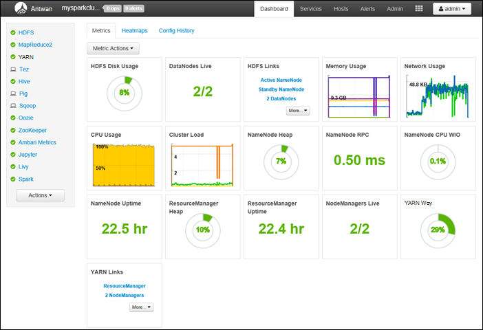   

## 如何启动触发历史记录服务器？

1. 从[Azure 门户网站](https://portal.azure.com/)，startboard，从单击触发群集的拼贴 （如果您将它固定到 startboard）。

2. 从群集刀片下**快速链接**，, 单击**群集仪表板**。 在**群集的仪表板**刀片式服务器，请单击**触发历史记录服务器**。

    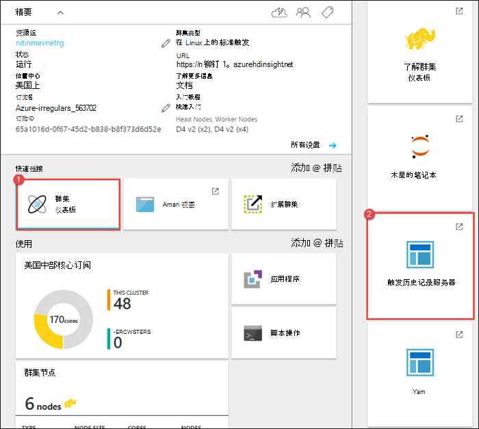

    出现提示时，输入触发群集管理员凭据。

## 如何启动 Yarn UI？

YARN UI 用于监视当前触发群集运行的应用程序。 

1. 从群集刀片式服务器，**群集的仪表板**，请单击，然后单击**YARN**。

    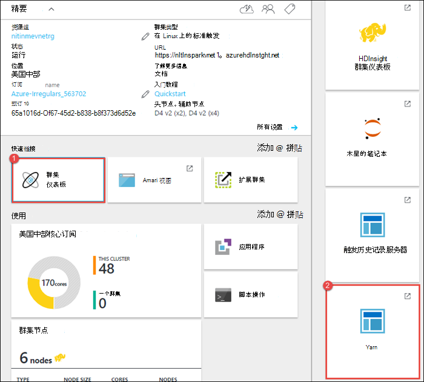

    >[AZURE.TIP] 或者，也可以启动从 Ambari 用户界面 YARN UI。 若要启动 Ambari 用户界面中的从群集刀片式服务器、**群集的仪表板**，请单击，然后单击**HDInsight 群集仪表板**。 从 Ambari 用户界面，然后单击**YARN**、**快速链接**、 活动资源管理器中，和**ResourceManager 用户界面**。

## 优化群集配置运行触发应用程序是什么？

可用于触发配置根据应用程序要求的三个主要参数是`spark.executor.instances`， `spark.executor.cores`，和`spark.executor.memory`。 执行器是触发应用程序启动的进程。 它在辅助节点上运行，并负责执行这些任务的应用程序。 基于辅助节点，工作节点大小数计算默认执行器，并为每个群集的执行器大小的数。 这些模板存储在`spark-defaults.conf`群集的头节点上。 

这三种配置参数进行配置的群集级别 （在群集运行的所有应用程序），或可为每个单独的应用程序以及指定。

### 更改使用 Ambari 用户界面参数

1. Ambari 用户界面中单击**触发**，请单击**配置**，然后再展开**自定义默认值触发**。

    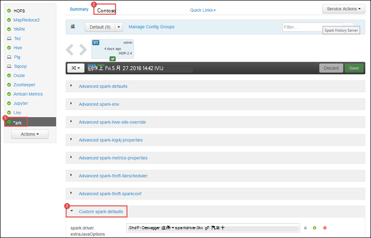

2. 默认值是趋向于 4 触发应用程序同时运行在群集。 可以更改这些值从用户界面中，如下所示。

    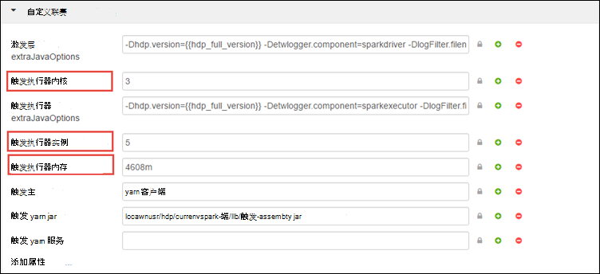

3. 单击**保存**以保存配置更改。 在页面的顶部，将提示您重新启动受影响的服务。 单击**重新启动**。

    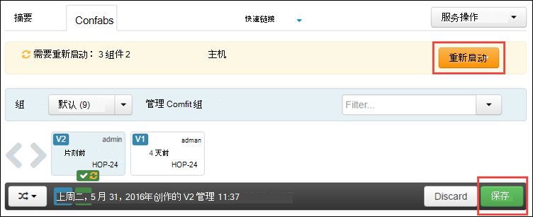

### 更改应用程序运行在 Jupyter 笔记本中的参数

对于 Jupyter 笔记本电脑中运行的应用程序，您可以使用`%%configure`魔术进行配置更改。 理想情况下，您必须在该应用程序，运行您的第一个代码单元格之前开始进行此类更改。 这样可确保配置将应用到晚会话中，获取创建时。 如果您想要更改的配置在应用程序的后续阶段，则必须使用`-f`参数。 但是，通过这样的应用程序中的所有进度将都会丢失。

下面的代码段演示如何更改在 Jupyter 中运行的应用程序的配置。

    %%configure 
    {"executorMemory": "3072M", "executorCores": 4, “numExecutors”:10}

配置参数必须为一个 JSON 字符串中传递和之后，必须是在下一行上神奇之处，列中的示例所示。 

### 提交使用的应用程序的参数触发提交的更改

以下命令来举例说明如何更改提交时使用一个批处理应用程序的配置参数`spark-submit`。

    spark-submit --class <the application class to execute> --executor-memory 3072M --executor-cores 4 –-num-executors 10 <location of application jar file> <application parameters>

### 更改应用程序使用 cURL 提交的参数

以下命令是如何更改使用 cURL 提交的批处理应用程序的配置参数的一个示例。

    curl -k -v -H 'Content-Type: application/json' -X POST -d '{"file":"<location of application jar file>", "className":"<the application class to execute>", "args":[<application parameters>], "numExecutors":10, "executorMemory":"2G", "executorCores":5' localhost:8998/batches

### 如何更改这些参数触发储蓄服务器上？

触发储蓄服务器提供了 JDBC/ODBC 访问触发群集，用于为服务触发 SQL 查询。 工具，如电源 BI，Tableau 等等。 使用 ODBC 协议与触发储蓄服务器执行触发 SQL 查询作为触发应用程序进行通信。 当创建触发群集时，启动触发储蓄服务器的两个实例，一个在头的每个节点上。 每个触发储蓄服务器是作为触发应用程序 YARN UI 中可见。 

触发储蓄服务器使用触发执行器的动态分配，因此`spark.executor.instances`不使用。 相反，触发储蓄服务器使用`spark.dynamicAllocation.minExecutors`和`spark.dynamicAllocation.maxExecutors`指定的执行器计数。 配置参数`spark.executor.cores`，`spark.executor.memory`用来修改执行器的大小。 您可以更改这些参数，如下所示。

* 展开**高级的触发的储蓄-sparkconf**类别来更新参数`spark.dynamicAllocation.minExecutors`， `spark.dynamicAllocation.maxExecutors`，和`spark.executor.memory`。

    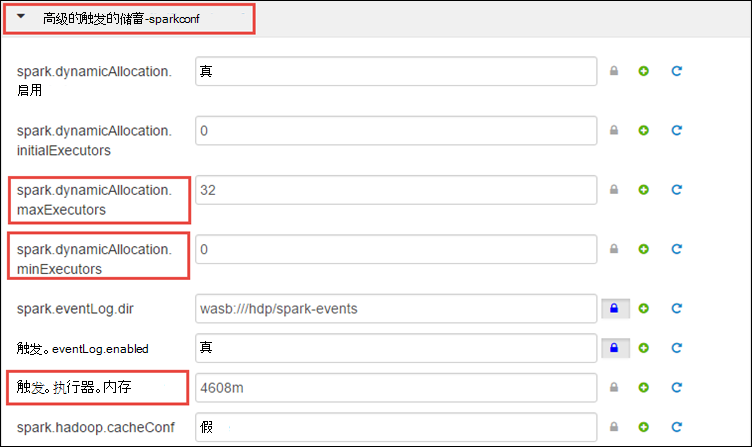 

* 展开要更新参数的**自定义触发储蓄 sparkconf**类别`spark.executor.cores`。

    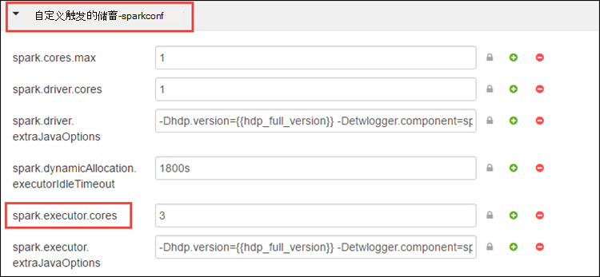

### 如何更改驱动程序的内存中的触发储蓄服务器？

触发储蓄服务器驱动程序内存提供头节点的内存总量大于 14 GB、 配置头节点 RAM 大小的 25%。 您可以使用 Ambari UI 更改驱动程序的内存配置，如下所示。

* Ambari 用户界面中单击**触发****配置**展开**高级触发环境**，和，然后为**spark_thrift_cmd_opts**提供值。

    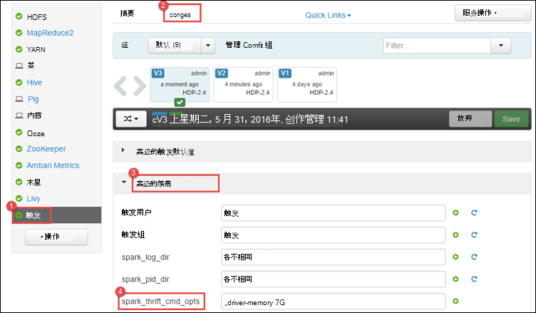

## 我没有与触发群集使用 BI。 如何重新采取资源？

由于我们使用触发动态分配，由储蓄服务器消耗的唯一资源是两个应用程序主服务器的资源。 要回收这些资源必须停止储蓄服务器运行在群集上的服务器服务。

1. 从 Ambari 用户界面，从左边的窗格中，单击**触发**。

2. 在下一个页面中，单击**触发储蓄服务器**。

    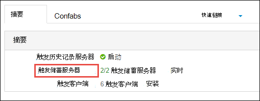

3. 您应该看到两个触发储蓄服务器正在其运行的 headnodes。 单击其中一个 headnodes。

    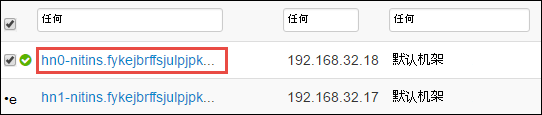

4. 下一页上列出的 headnode 上运行的所有服务。 从列表中单击触发储蓄服务器，旁边的下拉按钮，然后单击**停止**。

    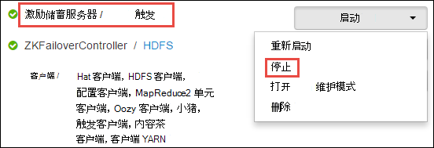

5. 重复这些步骤上其他 headnode。

## 我 Jupyter 笔记本未按预期方式运行。 如何重新启动该服务？

1. 如上所示，请启动 Ambari Web 用户界面。 从左侧的导航窗格中，单击**Jupyter**，单击**服务操作**，然后单击**重新启动所有**。 这将启动 Jupyter 服务在所有 headnodes。

    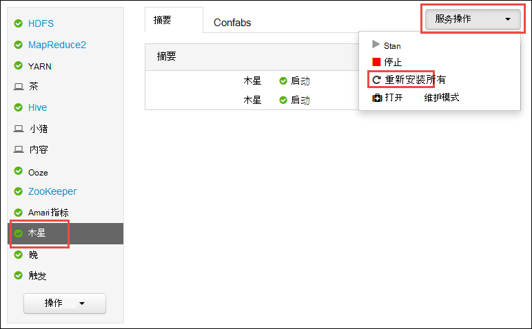

    

## 请参见

* [概述︰ 在 Azure HDInsight 上的 Apache 触发](hdinsight-apache-spark-overview.md)

### 方案

* [触发与 BI︰ 执行与 BI 工具一起使用在 HDInsight 中的触发交互式数据分析](hdinsight-apache-spark-use-bi-tools.md)

* [机器学习与触发︰ 用于分析使用 HVAC 数据的生成温度 HDInsight 中使用触发](hdinsight-apache-spark-ipython-notebook-machine-learning.md)

* [机器学习与触发︰ 使用 HDInsight 来预测食品检查结果中的触发](hdinsight-apache-spark-machine-learning-mllib-ipython.md)

* [HDInsight 用于构建实时流的应用程序中触发流︰ 使用触发](hdinsight-apache-spark-eventhub-streaming.md)

* [在 HDInsight 中使用触发网站日志分析](hdinsight-apache-spark-custom-library-website-log-analysis.md)

### 创建和运行应用程序

* [创建独立的应用程序使用 Scala](hdinsight-apache-spark-create-standalone-application.md)

* [在群集上使用晚触发远程运行作业](hdinsight-apache-spark-livy-rest-interface.md)

### 工具和扩展

* [使用 HDInsight 工具插件为 IntelliJ 创意来创建和提交触发 Scala applicatons](hdinsight-apache-spark-intellij-tool-plugin.md)

* [使用 HDInsight 工具插件为 IntelliJ 创意来触发应用程序进行远程调试](hdinsight-apache-spark-intellij-tool-plugin-debug-jobs-remotely.md)

* [在 HDInsight 上触发群集使用 Zeppelin 笔记本](hdinsight-apache-spark-use-zeppelin-notebook.md)

* [内核可用于触发 HDInsight 群集中的 Jupyter 笔记本](hdinsight-apache-spark-jupyter-notebook-kernels.md)

* [外部包使用 Jupyter 笔记本](hdinsight-apache-spark-jupyter-notebook-use-external-packages.md)

* [在您的计算机上安装 Jupyter 并连接到一个 HDInsight 触发的群集](hdinsight-apache-spark-jupyter-notebook-install-locally.md)

### 管理资源

* [跟踪和调试 HDInsight 在 Apache 触发群集上运行的作业](hdinsight-apache-spark-job-debugging.md)

[hdinsight-versions]: hdinsight-component-versioning.md
[hdinsight-upload-data]: hdinsight-upload-data.md
[hdinsight-storage]: hdinsight-hadoop-use-blob-storage.md

[azure-purchase-options]: http://azure.microsoft.com/pricing/purchase-options/
[azure-member-offers]: http://azure.microsoft.com/pricing/member-offers/
[azure-free-trial]: http://azure.microsoft.com/pricing/free-trial/
[azure-management-portal]: https://manage.windowsazure.com/
[azure-create-storageaccount]: storage-create-storage-account.md 
