<properties 
    pageTitle="在 HDInsight Linux 安装 Apache 触发群集 Zeppelin 笔记本 |Microsoft Azure" 
    description="有关如何安装和使用 HDInsight Linux 上的触发群集使用 Zeppelin 笔记本的分步指导。" 
    services="hdinsight" 
    documentationCenter="" 
    authors="nitinme" 
    manager="jhubbard" 
    editor="cgronlun"/>

<tags 
    ms.service="hdinsight" 
    ms.workload="big-data" 
    ms.tgt_pltfrm="na" 
    ms.devlang="na" 
    ms.topic="article" 
    ms.date="10/28/2016" 
    ms.author="nitinme"/>

# 在 HDInsight Linux 安装 Apache 触发群集 Zeppelin 笔记本

了解如何在 Apache 触发群集上安装 Zeppelin 笔记本，以及如何使用 Zeppelin 笔记本运行作业的触发。

> [AZURE.IMPORTANT] 目前有默认情况下，如果使用触发群集 Zeppelin 笔记本。 您不需要明确其触发在群集上安装了。 有关详细信息，请参阅[使用 Zeppelin 投产，Apache 触发 HDInsight linux 群集](hdinsight-apache-spark-zeppelin-notebook.md)。 

**系统必备组件︰**

* 在开始本教程之前，您必须先 Azure 的订阅。 请参阅[获取 Azure 免费试用版](https://azure.microsoft.com/documentation/videos/get-azure-free-trial-for-testing-hadoop-in-hdinsight/)。
* 一个 Apache 触发的群集。 有关说明，请参阅[创建 Apache 触发群集在 Azure HDInsight](hdinsight-apache-spark-jupyter-spark-sql.md)。
* SSH 客户端。 Linux 和 Unix 分发或 Macintosh OS X`ssh`命令提供与操作系统。 对于 Windows，我们建议[PuTTY](http://www.chiark.greenend.org.uk/~sgtatham/putty/download.html)

    > [AZURE.NOTE] 如果想要而不使用 SSH 客户端`ssh`或 PuTTY，对于如何建立 SSH 隧道客户端，请参阅文档。

* Web 浏览器，可以将配置为使用 SOCKS 代理服务器

* __（可选）__︰ 如可应用的[FoxyProxy](http://getfoxyproxy.org/,)插件规则，仅路由通过隧道的具体请求。

    > [AZURE.WARNING] 如 FoxyProxy 插件，不可能通过隧道路由通过浏览器进行的所有请求。 这可能会导致 web 页在浏览器中加载速度较慢。

## 触发群集上安装 Zeppelin

您可以使用脚本操作触发群集上安装 Zeppelin。 将操作脚本保存使用自定义脚本来将组件安装在群集不可用，默认情况下的。 自定义脚本可用于从 Azure 门户安装 Zeppelin，通过使用 HDInsight.NET SDK，或通过使用 Azure PowerShell。 脚本可用于安装 Zeppelin 作为的一部分，群集创建群集后启动并运行。 以下各节中的链接提供有关如何执行此操作指导。 

### 使用 Azure 门户

要安装 Zeppelin 如何使用 Azure 门户运行脚本操作说明，请参阅[自定义 HDInsight 群集使用脚本的操作](hdinsight-hadoop-customize-cluster-linux.md#use-a-script-action-from-the-azure-portal)。 几种更改必须对该文章中的说明进行操作。

* 您必须使用脚本安装 Zeppelin。 在 HDInsight 上的一个触发群集上安装 Zeppelin 的自定义脚本是可从下面的链接︰
    * 为触发 1.6.0 群集-`https://hdiconfigactions.blob.core.windows.net/linuxincubatorzeppelinv01/install-zeppelin-spark160-v01.sh`
    * 为触发 1.5.2 群集-`https://hdiconfigactions.blob.core.windows.net/linuxincubatorzeppelinv01/install-zeppelin-spark151-v01.sh`

* 仅在 headnode 上，您必须运行脚本操作。

* 该脚本不需要任何参数。 

### 使用 HDInsight.NET SDK

要安装 Zeppelin 如何使用 HDInsight.NET SDK 来运行脚本的操作说明，请参阅[自定义 HDInsight 群集使用脚本的操作](hdinsight-hadoop-customize-cluster-linux.md#use-a-script-action-from-the-hdinsight-net-sdk)。 几种更改必须对该文章中的说明进行操作。

* 您必须使用脚本安装 Zeppelin。 在 HDInsight 上的一个触发群集上安装 Zeppelin 的自定义脚本是可从下面的链接︰
    * 为触发 1.6.0 群集-`https://hdiconfigactions.blob.core.windows.net/linuxincubatorzeppelinv01/install-zeppelin-spark160-v01.sh`
    * 为触发 1.5.2 群集-`https://hdiconfigactions.blob.core.windows.net/linuxincubatorzeppelinv01/install-zeppelin-spark151-v01.sh`

* 该脚本不需要任何参数。 

* 您正在创建的群集类型设置为触发。

### 使用 Azure PowerShell

使用下面的 PowerShell 段创建触发群集安装 Zeppelin 与 HDInsight Linux 上。 根据触发群集，您拥有的版本，您必须更新 PowerShell 段包含相应的自定义脚本链接。 

* 为触发 1.6.0 群集-`https://hdiconfigactions.blob.core.windows.net/linuxincubatorzeppelinv01/install-zeppelin-spark160-v01.sh`
* 为触发 1.5.2 群集-`https://hdiconfigactions.blob.core.windows.net/linuxincubatorzeppelinv01/install-zeppelin-spark151-v01.sh`

[AZURE.INCLUDE [upgrade-powershell](../../includes/hdinsight-use-latest-powershell.md)]

    Login-AzureRMAccount
    
    # PROVIDE VALUES FOR THE VARIABLES
    $clusterAdminUsername="admin"
    $clusterAdminPassword="<<password>>"
    $clusterSshUsername="adminssh"
    $clusterSshPassword="<<password>>"
    $clusterName="<<clustername>>"
    $clusterContainerName=$clusterName
    $resourceGroupName="<<resourceGroupName>>"
    $location="<<region>>"
    $storage1Name="<<storagename>>"
    $storage1Key="<<storagekey>>"
    $subscriptionId="<<subscriptionId>>"
    
    Select-AzureRmSubscription -SubscriptionId $subscriptionId
    
    $passwordAsSecureString=ConvertTo-SecureString $clusterAdminPassword -AsPlainText -Force
    $clusterCredential=New-Object System.Management.Automation.PSCredential ($clusterAdminUsername, $passwordAsSecureString)
    $passwordAsSecureString=ConvertTo-SecureString $clusterSshPassword -AsPlainText -Force
    $clusterSshCredential=New-Object System.Management.Automation.PSCredential ($clusterSshUsername, $passwordAsSecureString)
    
    $azureHDInsightConfigs= New-AzureRmHDInsightClusterConfig -ClusterType Spark
    $azureHDInsightConfigs.DefaultStorageAccountKey = $storage1Key
    $azureHDInsightConfigs.DefaultStorageAccountName = "$storage1Name.blob.core.windows.net"
    
    Add-AzureRMHDInsightScriptAction -Config $azureHDInsightConfigs -Name "Install Zeppelin" -NodeType HeadNode -Parameters "void" -Uri "https://hdiconfigactions.blob.core.windows.net/linuxincubatorzeppelinv01/install-zeppelin-spark151-v01.sh"
    
    New-AzureRMHDInsightCluster -Config $azureHDInsightConfigs -OSType Linux -HeadNodeSize "Standard_D12" -WorkerNodeSize "Standard_D12" -ClusterSizeInNodes 2 -Location $location -ResourceGroupName $resourceGroupName -ClusterName $clusterName -HttpCredential $clusterCredential -DefaultStorageContainer $clusterContainerName -SshCredential $clusterSshCredential -Version "3.3"
 
## 设置 SSH 隧道访问 Zeppelin 笔记本

您将使用 SSH 隧道访问 Zeppelin 笔记本在触发 HDInsight Linux 上的群集上运行。 下面的步骤演示如何创建使用 ssh 命令行 (Linux) 和 (Windows) PuTTY SSH 隧道。

### 使用 SSH 命令 (Linux) 创建隧道

使用以下命令来创建一个 SSH 隧道使用`ssh`命令。 替换为 HDInsight 群集，SSH 用户的__用户名__，并用 HDInsight 群集的名称替换__群集名称__

    ssh -C2qTnNf -D 9876 USERNAME@CLUSTERNAME-ssh.azurehdinsight.net

这将创建一个通过 SSH 将通信路由到本地端口 9876 到群集的连接。 包含以下选项︰

* **D 9876** -将路由通信通过该隧道的本地端口。

* **C** -压缩所有数据，因为 web 通讯为主要文字。

* **2** -强制 SSH 协议版本 2 只试一次。

* **q** -安静模式。

* **T** -禁用伪 tty 分配，因为我们只转发端口。

* **n** -防止读取标准输入，因为我们只转发端口。

* **N** -不执行远程命令，因为我们只转发端口。

* **f** -在后台运行。

如果您配置了群集，SSH 密钥，您可能需要使用`-i`参数并指定 SSH 密钥的路径。

一旦通过将路由命令完成后，发送到本地计算机上的端口 9876 流量安全套接字层 (SSL) 到群集头节点，看上去是那里。

### 使用 PuTTY (Windows) 创建隧道

使用以下步骤创建使用 PuTTY SSH 隧道。

1. 打开 PuTTY，并输入连接信息。 如果您还不熟悉 PuTTY，信息，请参阅[使用 SSH 与从 Windows HDInsight 上的基于 Linux 的 Hadoop](hdinsight-hadoop-linux-use-ssh-windows.md)如何使用 HDInsight。

2. 在对话框左侧的**类别**部分中，展开**连接**， **SSH**，展开，然后选择**隧道**。

3. 在**控制 SSH 端口转发选项**窗体中提供以下信息︰

    * **源端口**--您希望转发客户端上的端口。 例如，为**9876**。

    * **目标**-SSH 基于 Linux 的 HDInsight 群集地址。 例如， **mycluster-ssh.azurehdinsight.net**。

    * **动态**-启用动态路由的 SOCKS 代理。

    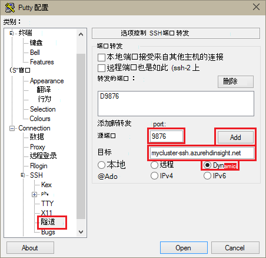

4. 单击**添加**以添加设置，然后再单击**打开**来打开 SSH 连接。

5. 如果出现提示，请登录到服务器。 这会建立 SSH 会话并启用隧道。

### 使用您的浏览器从隧道

> [AZURE.NOTE] 本节中的步骤使用 FireFox 浏览器，因为它是免费的 Linux、 Unix、 Macintosh OS X 和 Windows 系统。 Google Chrome、 Microsoft 边缘或苹果 Safari 等其他现代浏览器应该正常工作;但是，在某些步骤中使用 FoxyProxy 插件不可能适用于所有的浏览器。

1. 配置浏览器以将**localhost:9876**用作**SOCKS v5**代理。 这里是 Firefox 设置如下所示。 如果您使用不同的端口比 9876，请将端口更改为您使用︰

    

    > [AZURE.NOTE] 选择**远程 DNS**将使用 HDInsight 群集中解决域名系统 (DNS) 的请求。 如果未选中，则将本地解析 DNS。

2. 验证，由 vising [http://www.whatismyip.com/](http://www.whatismyip.com/)等网站启用和禁用在 Firefox 中的代理设置路由通过隧道通信。 设置被启用，IP 地址将在 Microsoft Azure 数据中心机。

### 浏览器扩展

配置浏览器以使用该隧道的工作方式，而通常不想要通过隧道路由所有通信。 如[FoxyProxy](http://getfoxyproxy.org/)浏览器扩展支持模式匹配的 URL 请求 (FoxyProxy 标准或加上只)，因此，只对特定 Url 的请求将被发送通过隧道。

如果您已经安装了 FoxyProxy 标准，使用以下步骤将其配置为仅为 HDInsight 通过隧道转发通信。

1. 在浏览器中打开 FoxyProxy 扩展名。 例如，在 Firefox 中，选择地址字段旁边的 FoxyProxy 图标。

    

2. 选择**添加新的代理服务器**，选择**常规**选项卡，然后输入代理服务器名称的**HDInsightProxy**。

    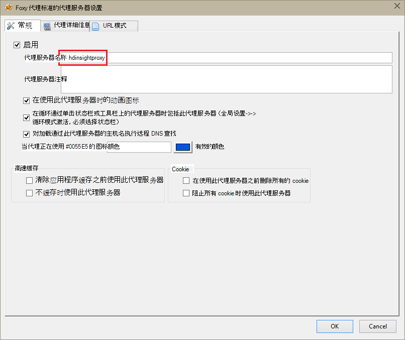

3. 选择**代理详细信息**选项卡，并填写以下字段︰

    * **主机或 IP 地址**-这是本地主机，因为我们在本地机器上使用 SSH 隧道。

    * **端口**--这是 SSH 隧道使用的端口。

    * **SOCKS 代理服务器**-选择此选项可启用浏览器代理服务器作为使用该隧道。

    * **SOCKS v5** -选择此选项可设置为代理服务器所需的版本。

    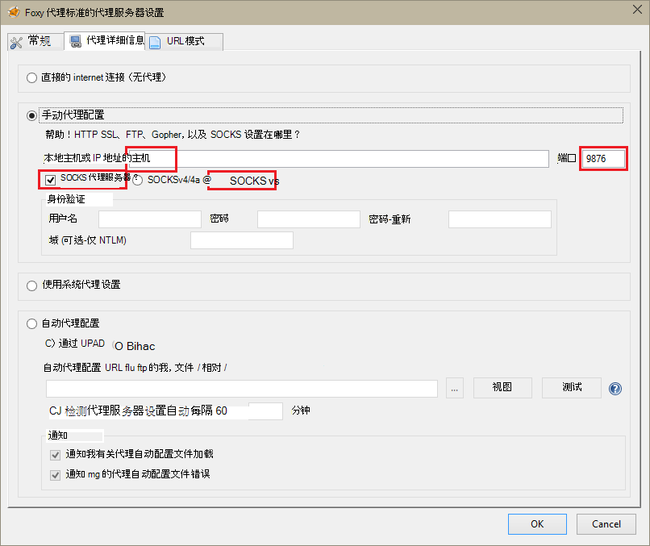

4. 选择**URL 模式**选项卡，然后选择**添加新模式**。 使用以下方法来定义该模式中，并单击**确定**:

    * **图案名称** - **zeppelinnotebook** -这是只是该模式的友好名称。

    * **URL 模式** - **\*hn0** * -此属性定义的模式相匹配的终结点所在 Zeppelin 笔记本内部的完全限定的域名称。由于 Zeppelin 笔记本仅在群集中，headnode0 上可用并且终结点通常是`http://hn0-<string>.internal.cloudapp.net`，使用模式* *hn0** 可确保该请求被重定向到 Zeppelin 终结点。

        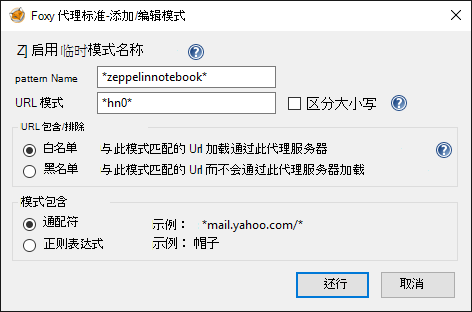

4. 单击**确定**以添加代理并关闭**代理服务器设置**。

5. 在 FoxyProxy 对话框的顶部，**选择模式**更改为**使用代理服务器根据预定义的模式和优先级**，，然后单击**关闭**。

    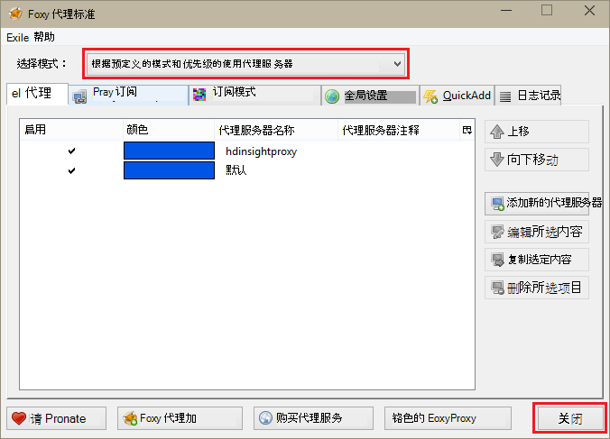

执行以下步骤后, 只包含字符串__hn0__的 Url 的请求将通过 SSL 隧道路由。 

## 访问 Zeppelin 笔记本

SSH 隧道安装程序之后，可以使用以下步骤来访问 Zeppelin 笔记本触发群集上的执行下列步骤。 在本节中，您将看到如何运行 %sql 和 %配置单元语句。

1. 从 web 浏览器中，打开下列终结点︰

        http://hn0-myspar:9995

    * **hn0**表示 headnode0
    * **myspar**是触发群集名称的前六个字母。
    * **9995**是其中 Zeppelin 笔记本是可访问的端口。

2. 创建新的笔记本。 从头窗格中，单击**笔记本**，然后单击**创建新便笺**。

    

    在同一页上，在**笔记本**标题下，应看到新的笔记本开始**注意 XXXXXXXXX**的名称。 单击新建笔记本。

3. 在 web 页上新笔记本，请单击该标题，和如果您想更改的笔记本名称。 按 ENTER 键保存更改后的名称。 此外，还要确保笔记本头中的右上角显示**已连接**状态。

    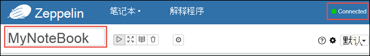

### 运行 SQL 语句

4. 将示例数据加载到临时表中。 在 HDInsight 中创建一个触发群集时，示例数据文件中， **hvac.csv**，复制到**\HdiSamples\SensorSampleData\hvac**的关联的存储帐户。

    默认情况下，新的笔记本中创建的空白段落，粘贴下面的代码段。

        // Create an RDD using the default Spark context, sc
        val hvacText = sc.textFile("wasbs:///HdiSamples/HdiSamples/SensorSampleData/hvac/HVAC.csv")
        
        // Define a schema
        case class Hvac(date: String, time: String, targettemp: Integer, actualtemp: Integer, buildingID: String)
        
        // Map the values in the .csv file to the schema
        val hvac = hvacText.map(s => s.split(",")).filter(s => s(0) != "Date").map(
            s => Hvac(s(0), 
                    s(1),
                    s(2).toInt,
                    s(3).toInt,
                    s(6)
            )
        ).toDF()
        
        // Register as a temporary table called "hvac"
        hvac.registerTempTable("hvac")
        
    按**SHIFT + enter 键**或单击**播放**按钮以运行该代码段的段。 段落的右角上的状态应从已准备好，待执行、 对已完成的运行进度。 输出显示在同一段落底部。 屏幕抓图如下所示︰

    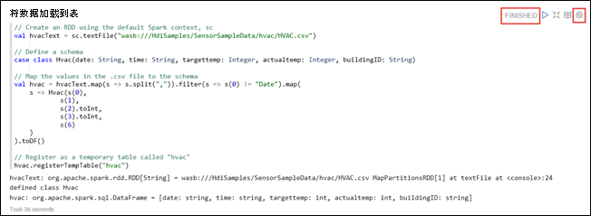

    您还可以提供对每个段落的标题。 从右下角，单击**设置**图标，然后单击**显示标题**。

5. 您现在可以在**hvac**表上运行触发 SQL 语句。 将以下查询粘贴在一个新的段落。 查询检索到的建筑物 ID 和目标和每个构建在给定日期的实际温度之间的差异。 按**SHIFT + ENTER**。

        %sql
        select buildingID, (targettemp - actualtemp) as temp_diff, date 
        from hvac
        where date = "6/1/13" 

    **%Sql**语句的开头告诉笔记本使用触发 SQL 解释器。 您可以查看从笔记本标头中的**解释器**选项卡上定义的译员。

    下面的屏幕快照显示的输出。

    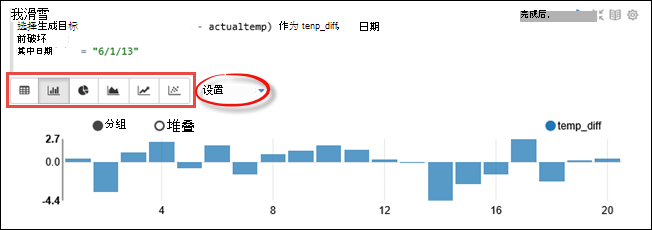

     单击显示选项 （突出显示的矩形） 为相同的输出的不同表示形式之间进行切换。 单击**设置**以在输出中的键和值选择何种 consitutes。 上面的屏幕捕获使用**buildingID**作为键， **temp_diff**的平均值作为值。

    
6. 您还可以运行触发 SQL 语句的查询中使用的变量。 下一步的代码段演示如何可能值与您要查询的查询中定义一个变量，**温度**。 第一次运行查询时，是为变量指定值自动填充下拉列表。

        %sql
        select buildingID, date, targettemp, (targettemp - actualtemp) as temp_diff
        from hvac
        where targettemp > "${Temp = 65,65|75|85}" 

    粘贴此代码段中一个新的段落，然后按**SHIFT + ENTER**。 下面的屏幕快照显示的输出。

    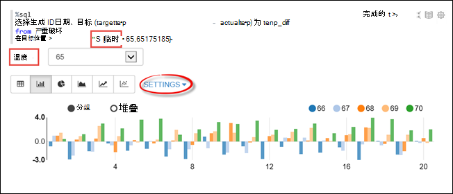

    随后的查询，可以从下拉列表中选择一个新值，并再次运行查询。 单击**设置**以在输出中的键和值选择何种 consitutes。 上面的屏幕捕获使用**buildingID**作为键， **temp_diff**作为值和**targettemp**作为组的平均值。

7. 重新启动触发 SQL 解释器退出应用程序。 单击**解释**选项卡的顶部，并触发解释程序，单击**重新启动**。

    

### 运行配置单元语句

1. Zeppelin 笔记本中，请单击**解释**按钮。

    

2. 为该**配置单元**解释器中，单击**编辑**。

    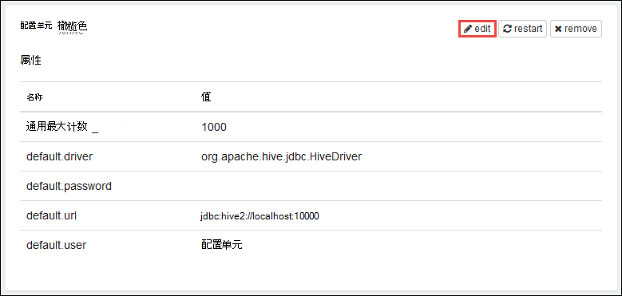

    更新以下属性。

    * **Default.password**为您指定的密码的管理用户设置创建 HDInsight 触发群集时。
    * 将**default.url**设置为`jdbc:hive2://<spark_cluster_name>.azurehdinsight.net:443/default;ssl=true?hive.server2.transport.mode=http;hive.server2.thrift.http.path=/hive2`。 更换**\<spark_cluster_name >**与触发群集的名称。
    * 将**default.user**设置为在创建群集时指定管理员用户的名称。 例如，*管理员*。

3. 单击**保存**，然后当系统提示您重新启动配置单元解释器，单击**确定**。

4. 创建新的笔记本，然后运行下面的语句可列出在群集上的所有配置单元表。

        %hive
        SHOW TABLES

    默认情况下，HDInsight 群集具有称为**hivesampletable** ，因此您应看到下面的输出的示例表。

    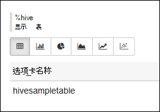

5. 运行以下语句列出表中的记录。

        %hive
        SELECT * FROM hivesampletable LIMIT 5

    应类似于下面的输出。

    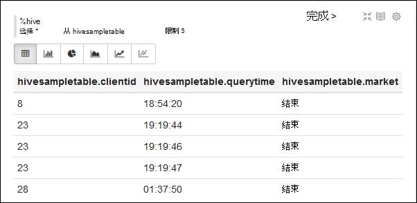

## 请参见

* [概述︰ 在 Azure HDInsight 上的 Apache 触发](hdinsight-apache-spark-overview.md)

### 方案

* [触发与 BI︰ 执行与 BI 工具一起使用在 HDInsight 中的触发交互式数据分析](hdinsight-apache-spark-use-bi-tools.md)

* [机器学习与触发︰ 用于分析使用 HVAC 数据的生成温度 HDInsight 中使用触发](hdinsight-apache-spark-ipython-notebook-machine-learning.md)

* [机器学习与触发︰ 使用 HDInsight 来预测食品检查结果中的触发](hdinsight-apache-spark-machine-learning-mllib-ipython.md)

* [HDInsight 用于构建实时流的应用程序中触发流︰ 使用触发](hdinsight-apache-spark-eventhub-streaming.md)

* [在 HDInsight 中使用触发网站日志分析](hdinsight-apache-spark-custom-library-website-log-analysis.md)

### 创建和运行应用程序

* [创建独立的应用程序使用 Scala](hdinsight-apache-spark-create-standalone-application.md)

* [在群集上使用晚触发远程运行作业](hdinsight-apache-spark-livy-rest-interface.md)

### 工具和扩展

* [使用 HDInsight 工具插件为 IntelliJ 创意来创建和提交触发 Scala applicatons](hdinsight-apache-spark-intellij-tool-plugin.md)

* [使用 HDInsight 工具插件为 IntelliJ 创意来触发应用程序进行远程调试](hdinsight-apache-spark-intellij-tool-plugin-debug-jobs-remotely.md)

* [内核可用于触发 HDInsight 群集中的 Jupyter 笔记本](hdinsight-apache-spark-jupyter-notebook-kernels.md)

* [外部包使用 Jupyter 笔记本](hdinsight-apache-spark-jupyter-notebook-use-external-packages.md)

* [在您的计算机上安装 Jupyter 并连接到一个 HDInsight 触发的群集](hdinsight-apache-spark-jupyter-notebook-install-locally.md)

### 管理资源

* [管理在 Azure HDInsight Apache 触发群集的资源](hdinsight-apache-spark-resource-manager.md)

* [跟踪和调试 HDInsight 在 Apache 触发群集上运行的作业](hdinsight-apache-spark-job-debugging.md)

[hdinsight-versions]: hdinsight-component-versioning.md
[hdinsight-upload-data]: hdinsight-upload-data.md
[hdinsight-storage]: hdinsight-hadoop-use-blob-storage.md

[azure-purchase-options]: http://azure.microsoft.com/pricing/purchase-options/
[azure-member-offers]: http://azure.microsoft.com/pricing/member-offers/
[azure-free-trial]: http://azure.microsoft.com/pricing/free-trial/
[azure-management-portal]: https://manage.windowsazure.com/
[azure-create-storageaccount]: storage-create-storage-account.md 

