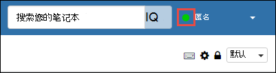
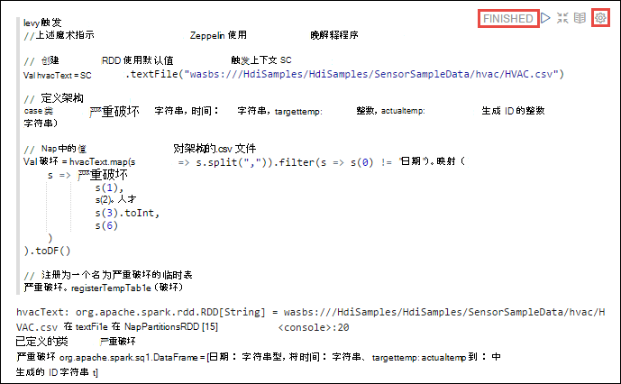
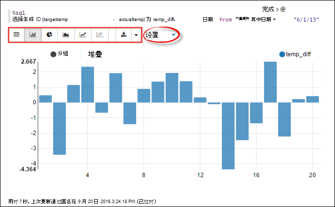
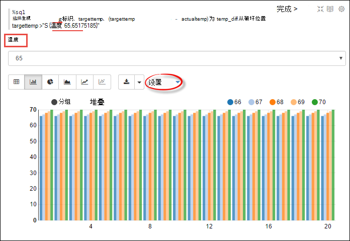
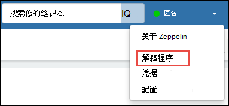
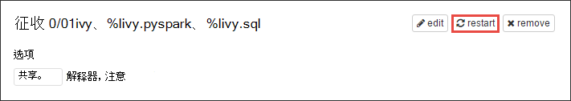
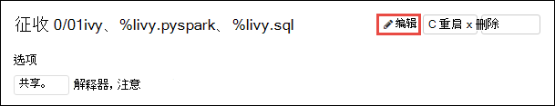
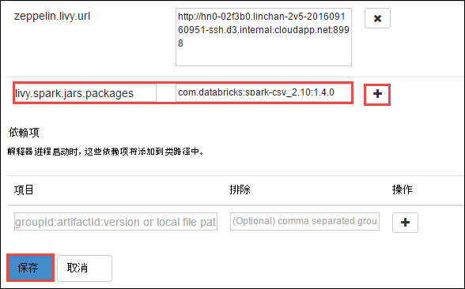
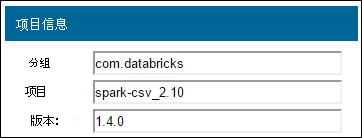

<properties 
    pageTitle="触发 HDInsight Linux 上的群集使用 Zeppelin 笔记本 |Microsoft Azure" 
    description="如何 Zeppelin 笔记本使用触发 HDInsight Linux 上的群集的分步指导。" 
    services="hdinsight" 
    documentationCenter="" 
    authors="nitinme" 
    manager="jhubbard" 
    editor="cgronlun"/>

<tags 
    ms.service="hdinsight" 
    ms.workload="big-data" 
    ms.tgt_pltfrm="na" 
    ms.devlang="na" 
    ms.topic="article" 
    ms.date="10/05/2016" 
    ms.author="nitinme"/>

# 使用 HDInsight Linux 上的 Apache 触发群集 Zeppelin 笔记本

HDInsight 触发群集包括 Zeppelin 笔记本，您可以使用运行作业的触发。 在本文中，您将学习如何使用 HDInsight 群集上 Zeppelin 笔记本。

**系统必备组件︰**

* Azure 的订阅。 请参阅[获取 Azure 免费试用版](https://azure.microsoft.com/documentation/videos/get-azure-free-trial-for-testing-hadoop-in-hdinsight/)。

* 一个 Apache 触发的群集。 有关说明，请参阅[创建 Apache 触发群集在 Azure HDInsight](hdinsight-apache-spark-jupyter-spark-sql.md)。

## 启动 Zeppelin 笔记本

1. 从触发群集刀片式服务器，**群集的仪表板**，请单击，然后单击**Zeppelin 笔记本**。 出现提示时，输入群集管理员凭据。

    > [AZURE.NOTE] 通过在浏览器中打开下面的 URL，还可能会达到 Zeppelin 笔记本为群集。 __群集名称__替换您的群集的名称︰
    >
    > `https://CLUSTERNAME.azurehdinsight.net/zeppelin`

2. 创建新的笔记本。 从头窗格中，单击**笔记本**，然后单击**创建新便笺**。

    

    为此笔记本中，输入一个名称，然后单击**创建注释**。

3. 此外，还要确保笔记本标题会显示连接的状态。 它由在右上角的绿色圆点表示。

    

4. 将示例数据加载到临时表中。 在 HDInsight 中创建一个触发群集时，示例数据文件中， **hvac.csv**，复制到**\HdiSamples\SensorSampleData\hvac**的关联的存储帐户。

    默认情况下，新的笔记本中创建的空白段落，粘贴下面的代码段。

        %livy.spark
        //The above magic instructs Zeppelin to use the Livy Scala interpreter

        // Create an RDD using the default Spark context, sc
        val hvacText = sc.textFile("wasbs:///HdiSamples/HdiSamples/SensorSampleData/hvac/HVAC.csv")
        
        // Define a schema
        case class Hvac(date: String, time: String, targettemp: Integer, actualtemp: Integer, buildingID: String)
        
        // Map the values in the .csv file to the schema
        val hvac = hvacText.map(s => s.split(",")).filter(s => s(0) != "Date").map(
            s => Hvac(s(0), 
                    s(1),
                    s(2).toInt,
                    s(3).toInt,
                    s(6)
            )
        ).toDF()
        
        // Register as a temporary table called "hvac"
        hvac.registerTempTable("hvac")
        
    按**SHIFT + enter 键**或单击**播放**按钮以运行该代码段的段。 段落的右角上的状态应从已准备好，待执行、 对已完成的运行进度。 输出显示在同一段落底部。 屏幕抓图如下所示︰

    

    您还可以提供对每个段落的标题。 从右下角，单击**设置**图标，然后单击**显示标题**。

5. 您现在可以在**hvac**表上运行触发 SQL 语句。 将以下查询粘贴在一个新的段落。 查询检索到的建筑物 ID 和目标和每个构建在给定日期的实际温度之间的差异。 按**SHIFT + ENTER**。

        %sql
        select buildingID, (targettemp - actualtemp) as temp_diff, date from hvac where date = "6/1/13" 

    **%Sql**语句的开头告诉笔记本使用晚 Scala 解释器。

    下面的屏幕快照显示的输出。

    

     单击显示选项 （突出显示的矩形） 为相同的输出的不同表示形式之间进行切换。 单击**设置**以在输出中的键和值选择何种 consitutes。 上面的屏幕捕获使用**buildingID**作为键， **temp_diff**的平均值作为值。

    
6. 您还可以运行触发 SQL 语句的查询中使用的变量。 下一步的代码段演示如何可能值与您要查询的查询中定义一个变量，**温度**。 第一次运行查询时，是为变量指定值自动填充下拉列表。

        %sql
        select buildingID, date, targettemp, (targettemp - actualtemp) as temp_diff from hvac where targettemp > "${Temp = 65,65|75|85}" 

    粘贴此代码段中一个新的段落，然后按**SHIFT + ENTER**。 下面的屏幕快照显示的输出。

    

    随后的查询，可以从下拉列表中选择一个新值，并再次运行查询。 单击**设置**以在输出中的键和值选择何种 consitutes。 上面的屏幕捕获使用**buildingID**作为键， **temp_diff**作为值和**targettemp**作为组的平均值。

7. 重新启动晚解释器退出应用程序。 为此，请通过单击右上角的用户名登录打开解释器设置，然后单击**解释器**。

    

2. 滚动到晚解释器设置，然后单击**重新启动**。

    

## 如何使用笔记本使用外部包？

您可以配置 Zeppelin 笔记本 HDInsight (Linux) 上的 Apache 触发群集中使用外部的社区提供所不包括的-瓜在群集中的包。 您可以搜索[Maven 存储库中](http://search.maven.org/)可用的软件包的完整列表。 您还可以从其他源获取可用的软件包的列表。 例如，[触发包](http://spark-packages.org/)提供了完整的社区提供的程序包列表。

在本文中，您将看到如何使用 Jupyter 笔记本[触发 csv](http://search.maven.org/#artifactdetails%7Ccom.databricks%7Cspark-csv_2.10%7C1.4.0%7Cjar)包。

1. 打开解释器设置。 从右上角，单击用户名称登录，然后单击**解释**。

    

2. 滚动到晚解释器设置，然后单击**编辑**。

    

3. 添加一个名为**livy.spark.jars.packages**的新项并将其值设置格式`group:id:version`。 因此，如果您想要使用[触发 csv](http://search.maven.org/#artifactdetails%7Ccom.databricks%7Cspark-csv_2.10%7C1.4.0%7Cjar)软件包，必须设置为关键字的值`com.databricks:spark-csv_2.10:1.4.0`。

    

    单击**保存**，然后重新启动晚解释器。

4. **提示**︰ 如果您想了解如何到达上面输入的键的值，这里是如何。

    一。 Maven 存储库中找到该程序包。 对于本教程中，我们使用[触发 csv](http://search.maven.org/#artifactdetails%7Ccom.databricks%7Cspark-csv_2.10%7C1.4.0%7Cjar)。
    
    b。 从资料库，收集**GroupId**、 **ArtifactId**，和**版本**的值。

    

    c。 串联三个值，用冒号 （**:**）。

        com.databricks:spark-csv_2.10:1.4.0

## Zeppelin 笔记本保存在何处？

Zeppelin 笔记本保存到群集 headnodes。 因此，如果删除了群集，笔记本也将被删除。 如果您想要保留您的笔记本以供将来使用的其他群集，必须将其导出，正在运行的作业之后。 要导出一个笔记本，请单击**导出**图标下面的图像所示。

这将另存为 JSON 文件在下载位置中的笔记本。

## 晚会话管理

Zeppelin 笔记本中运行的第一个代码段时，在 HDInsight 触发群集中创建新晚会话。 随后创建的所有 Zeppelin 笔记本都共享此会话。 如果由于某种原因晚会话被终止 （群集重新启动等），您将无法从 Zeppelin 笔记本上运行作业。

在这种情况下，您必须执行以下步骤，然后才可以开始从 Zeppelin 笔记本运行作业。 

1. 重新启动 Zeppelin 笔记本从晚解释器。 为此，请通过单击右上角的用户名登录打开解释器设置，然后单击**解释器**。

    

2. 滚动到晚解释器设置，然后单击**重新启动**。

    

3. 从现有 Zeppelin 笔记本上运行的代码单元。 这在 HDInsight 群集中创建了一个新的晚会话。

## 请参见

* [概述︰ 在 Azure HDInsight 上的 Apache 触发](hdinsight-apache-spark-overview.md)

### 方案

* [触发与 BI︰ 执行与 BI 工具一起使用在 HDInsight 中的触发交互式数据分析](hdinsight-apache-spark-use-bi-tools.md)

* [机器学习与触发︰ 用于分析使用 HVAC 数据的生成温度 HDInsight 中使用触发](hdinsight-apache-spark-ipython-notebook-machine-learning.md)

* [机器学习与触发︰ 使用 HDInsight 来预测食品检查结果中的触发](hdinsight-apache-spark-machine-learning-mllib-ipython.md)

* [HDInsight 用于构建实时流的应用程序中触发流︰ 使用触发](hdinsight-apache-spark-eventhub-streaming.md)

* [在 HDInsight 中使用触发网站日志分析](hdinsight-apache-spark-custom-library-website-log-analysis.md)

### 创建和运行应用程序

* [创建独立的应用程序使用 Scala](hdinsight-apache-spark-create-standalone-application.md)

* [在群集上使用晚触发远程运行作业](hdinsight-apache-spark-livy-rest-interface.md)

### 工具和扩展

* [使用 HDInsight 工具插件为 IntelliJ 创意来创建和提交触发 Scala applicatons](hdinsight-apache-spark-intellij-tool-plugin.md)

* [使用 HDInsight 工具插件为 IntelliJ 创意来触发应用程序进行远程调试](hdinsight-apache-spark-intellij-tool-plugin-debug-jobs-remotely.md)

* [内核可用于触发 HDInsight 群集中的 Jupyter 笔记本](hdinsight-apache-spark-jupyter-notebook-kernels.md)

* [外部包使用 Jupyter 笔记本](hdinsight-apache-spark-jupyter-notebook-use-external-packages.md)

* [在您的计算机上安装 Jupyter 并连接到一个 HDInsight 触发的群集](hdinsight-apache-spark-jupyter-notebook-install-locally.md)

### 管理资源

* [管理在 Azure HDInsight Apache 触发群集的资源](hdinsight-apache-spark-resource-manager.md)

* [跟踪和调试 HDInsight 在 Apache 触发群集上运行的作业](hdinsight-apache-spark-job-debugging.md)

[hdinsight-versions]: hdinsight-component-versioning.md
[hdinsight-upload-data]: hdinsight-upload-data.md
[hdinsight-storage]: hdinsight-hadoop-use-blob-storage.md

[azure-purchase-options]: http://azure.microsoft.com/pricing/purchase-options/
[azure-member-offers]: http://azure.microsoft.com/pricing/member-offers/
[azure-free-trial]: http://azure.microsoft.com/pricing/free-trial/
[azure-management-portal]: https://manage.windowsazure.com/
[azure-create-storageaccount]: storage-create-storage-account.md 

