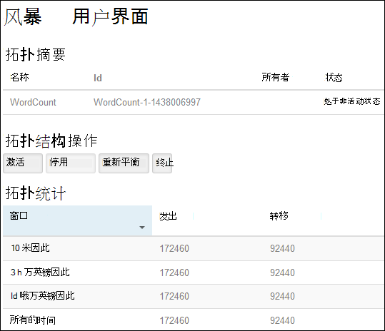
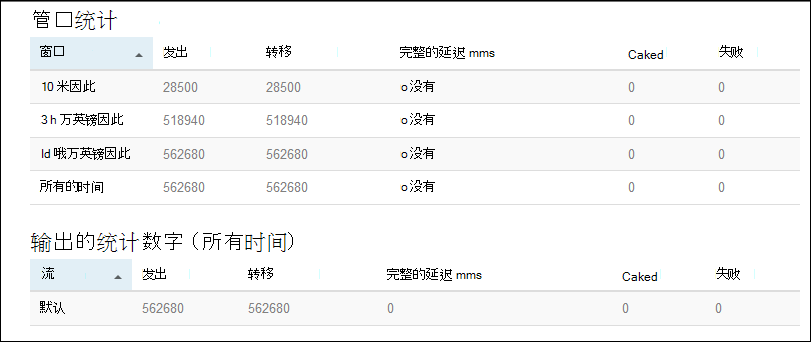

<properties
    pageTitle="Apache 风暴教程︰ 开始使用 HDInsight 上的基于 Linux 的风暴 |Microsoft Azure"
    description="开始使用大数据分析使用基于 Linux 的 HDInsight 上的 Apache 风暴和风暴初学者样本。 了解如何使用用于实时处理数据的冲击。"
    keywords="apache 的暴风雨，apache 风暴教程、 大数据分析，风暴初学者"
    services="hdinsight"
    documentationCenter=""
    authors="Blackmist"
    manager="jhubbard"
    editor="cgronlun"/>

<tags
   ms.service="hdinsight"
   ms.devlang="java"
   ms.topic="get-started-article"
   ms.tgt_pltfrm="na"
   ms.workload="big-data"
   ms.date="10/12/2016"
   ms.author="larryfr"/>

# Apache 风暴教程︰ 开始使用大数据分析，在 HDInsight 上的风暴初学者示例

Apache 风暴是可扩展、 容错、 分布式、 实时计算系统进行处理的数据的流。 使用 Azure HDInsight 的冲击，可以创建实时执行大数据分析的基于云的风暴群集。

> [AZURE.NOTE] 这篇文章中的步骤创建一个基于 Linux 的 HDInsight 群集。 在 HDInsight 群集上创建基于 Windows 的风暴的步骤，请参阅[Apache 风暴教程︰ 入门风暴初学者示例在 HDInsight 上使用数据分析](hdinsight-apache-storm-tutorial-get-started.md)

## 系统必备组件

[AZURE.INCLUDE [delete-cluster-warning](../../includes/hdinsight-delete-cluster-warning.md)]

必须具备下列条件，成功地完成本 Apache 风暴教程︰

- **Azure 订阅**。 请参阅[获取 Azure 免费试用版](https://azure.microsoft.com/documentation/videos/get-azure-free-trial-for-testing-hadoop-in-hdinsight/)。

- **SSH 和 SCP 的熟悉**。 在 HDInsight 中使用 SSH 和 SCP 的详细信息，请参阅以下资源︰

    - **Linux、 Unix 或 OS X 客户机**︰ 请[使用 SSH 基于 Linux 的 Hadoop HDInsight 从 Linux、 OS X 或 Unix 上使用](hdinsight-hadoop-linux-use-ssh-unix.md)

    - **Windows 客户端**︰ 请[使用 SSH 在从 Windows HDInsight 基于 Linux 的 Hadoop 使用](hdinsight-hadoop-linux-use-ssh-windows.md)

### 访问控制要求

[AZURE.INCLUDE [access-control](../../includes/hdinsight-access-control-requirements.md)]

## 创建风暴群集

在本节中，您创建 HDInsight 3.2 版本的群集 （风暴 0.9.3 版本） 使用 Azure 资源管理器模板。 其服务级别协议和 HDInsight 版本有关的信息，请参阅[HDInsight 组件版本控制](hdinsight-component-versioning.md)。 其他群集创建方法，请参阅[创建 HDInsight 群集](hdinsight-hadoop-provision-linux-clusters.md)。

1. 请单击下面的图像可以在 Azure 的门户打开该模板。         

    
    
    该模板位于*https://hditutorialdata.blob.core.windows.net/armtemplates/create-linux-based-storm-cluster-in-hdinsight.json*的公钥 blob 容器中。 
   
2. 从参数刀片式服务器，输入以下命令︰

    - **群集名称**︰ 输入，您将创建的 Hadoop 群集的名称。
    - **群集登录名和密码**︰ 默认登录名是管理员。
    - **SSH 用户名称和密码**。
    
    请记下这些值。  在本教程后面部分，将需要它们。

    > [AZURE.NOTE] SSH 使用远程访问 HDInsight 群集使用的命令行。 连接到 SSH 通过群集时使用的用户名和密码，您在此处使用。 此外，SSH 用户名称必须是唯一的如 HDInsight 群集的所有节点上创建的用户帐户。 以下是一些保留用于群集服务的帐户名并不能用作 SSH 用户名称︰
    >
    > 根、 hdiuser、 风暴、 hbase、 ubuntu，zookeeper、 hdfs、 yarn、 mapred、 hbase、 配置单元、 oozie，falcon、 sqoop、 管理、 tez、 hcat、 hdinsight zookeeper。

    > 在 HDInsight 中使用 SSH 的详细信息，请参阅下列文章︰

    > * [HDInsight 从 Linux、 Unix 或 OS X 上的基于 Linux 的 Hadoop 使用 SSH](hdinsight-hadoop-linux-use-ssh-unix.md)
    > * [在从 Windows HDInsight 基于 Linux 的 Hadoop 使用 SSH](hdinsight-hadoop-linux-use-ssh-windows.md)

    
3.单击**确定**以保存参数。

4.从**自定义部署**刀片式服务器，**资源组**下拉框中，单击，然后单击**新建**以创建新的资源组。 资源组是群集、 从属存储帐户和其他链接的资源进行分组的容器。

5.单击**法律条款**，，然后单击**创建**。

6.单击**创建**。 您将看到标题为提交部署模板部署新的拼贴。 大约需要大约 20 分钟的时间来创建群集和 SQL 数据库。

##在 HDInsight 上运行冲击初学者示例

这些[风暴初学者](https://github.com/apache/storm/tree/master/examples/storm-starter)示例都包括在 HDInsight 群集。 在以下步骤中，您将运行 WordCount 示例。

1. 连接到使用 SSH 的 HDInsight 群集︰

        ssh USERNAME@CLUSTERNAME-ssh.azurehdinsight.net
        
    如果您使用密码来保护您的 SSH 用户帐户时，将提示您重新输入一遍。 如果您使用公用密钥，您可能需要使用`-i`参数指定的匹配的私钥。 例如， `ssh -i ~/.ssh/id_rsa USERNAME@CLUSTERNAME-ssh.azurehdinsight.net`。
        
    在 SSH 中使用基于 Linux 的 HDInsight 的详细信息，请参阅下列文章︰
    
    * [HDInsight 从 Linux、 Unix 或 OS X 上的基于 Linux 的 Hadoop 使用 SSH](hdinsight-hadoop-linux-use-ssh-unix.md)

    * [在从 Windows HDInsight 基于 Linux 的 Hadoop 使用 SSH](hdinsight-hadoop-linux-use-ssh-windows)

2. 使用下面的命令启动一个示例拓扑︰

        storm jar /usr/hdp/current/storm-client/contrib/storm-starter/storm-starter-topologies-*.jar storm.starter.WordCountTopology wordcount
        
    > [AZURE.NOTE] `*`的文件的名称的一部分被用来匹配更改 HDInsight 更新的版本号。

    这将启动示例 WordCount 拓扑在集群上，使用字数统计的友好名称。 它将随机生成的句子并计数在句子中的每个单词的匹配项。

    > [AZURE.NOTE] 当提交到群集拓扑，必须先将复制使用之前包含群集的 jar 文件`storm`命令。 这可通过`scp`命令从客户端文件所在的位置。 例如，`scp FILENAME.jar USERNAME@CLUSTERNAME-ssh.azurehdinsight.net:FILENAME.jar`
    >
    > 字数统计等和其他风暴初学者的示例中，已包含在群集上`/usr/hdp/current/storm-client/contrib/storm-starter/`。

##显示器拓扑

风暴用户界面提供了一个 web 界面处理运行的拓扑，并将包括在 HDInsight 群集。

使用以下步骤来监视通过风暴 UI 的拓扑︰

1. 打开 web 浏览器访问 https://CLUSTERNAME.azurehdinsight.net/stormui，其中__群集名称__是该群集的名称。 这将打开风暴 UI。

    > [AZURE.NOTE] 如果要求提供用户名和密码，输入群集管理员 （管理员） 和密码时使用创建群集。

2. 在**拓扑摘要**中，在**名称**列中选择**wordcount**条目。 这将显示有关拓扑的详细信息。

    

    此页提供以下信息︰

    * **拓扑统计**-拓扑性能，基本信息归类为不同的时间窗口。

        > [AZURE.NOTE] 选择一个特定的时间窗口更改页面的其他部分中显示的信息的时间窗口。

    * **Spouts** -spouts，包括每个管口通过返回的最后一个错误的基本信息。

    * **螺栓**的螺栓的基本信息。

    * **拓扑配置**-拓扑配置有关的详细信息。

    此页还提供了可在拓扑结构采取措施︰

    * **激活**的简历处理已停用的拓扑结构。

    * **停用**-暂停正在运行的拓扑结构。

    * **重新平衡**的调整拓扑结构的并行的度。 已更改群集中的节点数后，应该重新平衡运行拓扑。 这使拓扑结构调整并行度来弥补增加/减少的群集中的节点数。 有关详细信息，请参阅[了解风暴拓扑结构的并行性](http://storm.apache.org/documentation/Understanding-the-parallelism-of-a-Storm-topology.html)。

    * 在指定的超时时间后**终止**的终止风暴拓扑。

3. 在此页面中，选择**Spouts**或**螺栓**部分中的条目。 这将显示有关所选组件的信息。

    

    此页显示以下信息︰

    * **管口/螺栓统计**-组件性能的基本信息归类为不同的时间窗口。

        > [AZURE.NOTE] 选择一个特定的时间窗口更改页面的其他部分中显示的信息的时间窗口。

    * **输入统计数据**（只螺栓的） 的产生由螺栓的数据的组件的信息。

    * **输出的统计数字**-发出该螺栓的数据信息。

    * **执行器**的此组件的实例的信息。

    * **错误**-该组件所产生的错误。

4. 当查看管口或螺栓的详细信息，请从**端口**列以查看详细信息组件的特定实例的**执行**部分中选择一个条目。

        2015-01-27 14:18:02 b.s.d.task [INFO] Emitting: split default ["with"]
        2015-01-27 14:18:02 b.s.d.task [INFO] Emitting: split default ["nature"]
        2015-01-27 14:18:02 b.s.d.executor [INFO] Processing received message source: split:21, stream: default, id: {}, [snow]
        2015-01-27 14:18:02 b.s.d.task [INFO] Emitting: count default [snow, 747293]
        2015-01-27 14:18:02 b.s.d.executor [INFO] Processing received message source: split:21, stream: default, id: {}, [white]
        2015-01-27 14:18:02 b.s.d.task [INFO] Emitting: count default [white, 747293]
        2015-01-27 14:18:02 b.s.d.executor [INFO] Processing received message source: split:21, stream: default, id: {}, [seven]
        2015-01-27 14:18:02 b.s.d.task [INFO] Emitting: count default [seven, 1493957]

    从这些数据可以看到 word**七**发生 1493957 次。 这是多少次遇到自启动此拓扑。

##停止了拓扑

返回的字数统计拓扑中，**拓扑摘要**页，然后从**拓扑操作**部分中选择**取消**按钮。 出现提示时，输入 10 停止拓扑之前要等待的秒数。 在超时期间后, 访问仪表板的**冲击 UI**部分时将不再显示拓扑。

##删除群集

[AZURE.INCLUDE [delete-cluster-warning](../../includes/hdinsight-delete-cluster-warning.md)]

##下一步行动

在 Apache 风暴本教程中，您可以使用风暴初学者学会如何 HDInsight 群集上创建有暴风雨，风暴仪表板用于部署、 监视和管理风暴拓扑。 接下来，学习如何[使用 Maven 基于 Java 开发的拓扑结构](hdinsight-storm-develop-java-topology.md)。

如果您已经熟悉开发基于 Java 的拓扑结构并希望将现有的拓扑部署到 HDInsight，请参阅[部署和管理在 HDInsight 上的 Apache 风暴拓扑](hdinsight-storm-deploy-monitor-topology-linux.md)。

如果您是.NET 开发人员，您可以创建 C# 或混合 C# / 使用 Visual Studio 的 Java 拓扑。 有关详细信息，请参见[开发 C# HDInsight 使用 Visual Studio 的 Hadoop 工具上的 Apache 风暴的拓扑](hdinsight-storm-develop-csharp-visual-studio-topology.md)。

例如可以使用 HDInsight，在风暴的拓扑参见以下示例︰

    * [在 HDInsight 上的风暴的示例拓扑](hdinsight-storm-example-topology.md)

[apachestorm]: https://storm.incubator.apache.org
[stormdocs]: http://storm.incubator.apache.org/documentation/Documentation.html
[stormstarter]: https://github.com/apache/storm/tree/master/examples/storm-starter
[stormjavadocs]: https://storm.incubator.apache.org/apidocs/
[azureportal]: https://manage.windowsazure.com/
[hdinsight-provision]: hdinsight-provision-clusters.md
[preview-portal]: https://portal.azure.com/
