<properties
    pageTitle="Apache 风暴教程︰ 风暴开始 |Microsoft Azure"
    description="开始使用大数据分析，在 HDInsight 上使用 Apache 的冲击以及冲击初学者样本。 了解如何使用用于实时处理数据的冲击。"
    keywords="apache 的暴风雨，apache 风暴教程、 大数据分析，风暴初学者"
    services="hdinsight"
    documentationCenter=""
    authors="Blackmist"
    manager="jhubbard"
    editor="cgronlun"
    tags="azure-portal"/>

<tags
   ms.service="hdinsight"
   ms.devlang="java"
   ms.topic="article"
   ms.tgt_pltfrm="na"
   ms.workload="big-data"
   ms.date="09/07/2016"
   ms.author="larryfr"/>

# Apache 风暴教程︰ 开始使用大数据分析，在 HDInsight 上的风暴初学者示例

Apache 风暴是可扩展、 容错、 分布式、 实时计算系统进行处理的数据的流。 使用 Microsoft Azure HDInsight 的冲击，可以创建实时执行大数据分析的基于云的风暴群集。 

> [AZURE.NOTE] 这篇文章中的步骤创建基于 Windows 的 HDInsight 群集。 在 HDInsight 群集上创建基于 Linux 的风暴的步骤，请参阅[Apache 风暴教程︰ 入门风暴初学者示例在 HDInsight 上使用数据分析](hdinsight-apache-storm-tutorial-get-started-linux.md)

## 系统必备组件

[AZURE.INCLUDE [delete-cluster-warning](../../includes/hdinsight-delete-cluster-warning.md)]

必须具备下列条件，成功地完成本 Apache 风暴教程︰

- **Azure 订阅**。 请参阅[获取 Azure 免费试用版](https://azure.microsoft.com/documentation/videos/get-azure-free-trial-for-testing-hadoop-in-hdinsight/)。

### 访问控制要求

[AZURE.INCLUDE [access-control](../../includes/hdinsight-access-control-requirements.md)]

## 创建风暴群集

风暴在 HDInsight 上的使用 Azure Blob 存储用于存储日志文件，并提交给群集拓扑。 使用以下步骤创建群集使用 Azure 存储帐户︰

1. 登录到[Azure 的门户网站][preview-portal]。

2. 选择**新建**，选择__数据分析__，然后选择__HDInsight__。

    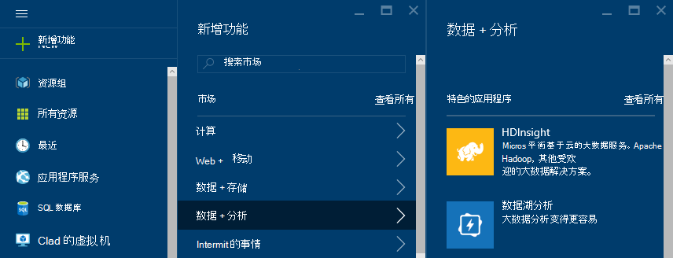

3. 输入的__群集名称__。 如果可用，__群集名称__的旁边会出现绿色复选标记。

4. 如果您有多个订阅，则选择__订阅__条目选择 Azure 用于群集的订阅。

5.  __选择群集类型__可用于选择__风暴__群集。 __操作系统__，请选择窗口。 对于__群集层__，选择标准。 最后，使用选择按钮以保存这些设置。

    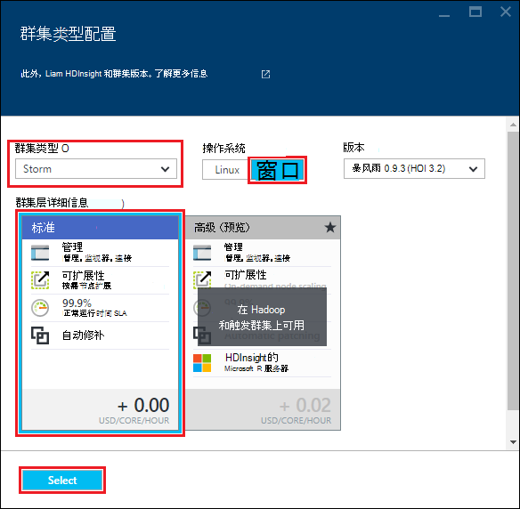

5. 对于__资源组__中，可以通过我们的下拉列表来查看现有资源组的列表，然后选择要创建的群集中的一个。 或者，您可以选择__新建__，然后输入新的资源组的名称。 绿色复选标记显示以指示新组的名称是否可用。

6. 选择__凭据__，然后再输入__登录用户名群集__和__群集的登录密码__。 最后，使用__选择__设置凭据。 远程桌面将不采用在此文档中，以便您可以将其禁用。

    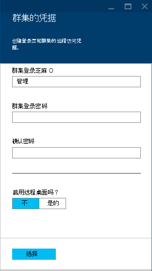

6. 为__数据源__，可以选择的项中选择现有的数据源，或新建一个。

    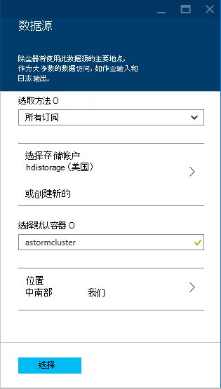

    目前您可以用作数据源的 HDInsight 群集选择 Azure 存储帐户。 使用以下方法来了解__数据源__刀片式服务器上的项。

    - __选择方法__︰ 将此值设置为__所有订阅__启用浏览在您的订阅的存储帐户。 如果您要输入的__存储名称__和现有存储帐户的__访问键__，设置为__访问键__。

    - __新建__︰ 用于创建新的存储帐户。 使用字段显示输入存储帐户的名称。 绿色复选标记显示名称是否可用。

    - __选择默认容器__︰ 用于输入要用于群集的默认容器的名称。 您可以输入任何名称，我们建议为群集使用相同的名称，以便您可以轻松地识别该容器用于此特定群集。

    - __位置__︰ 存储帐户将地理区域中，或将被创建。

        > [AZURE.IMPORTANT] 选择默认的数据源的位置还设置 HDInsight 群集的位置。 在同一区域必须位于群集和默认数据源。

    - __选择__︰ 用于保存数据源配置。

7. 选择要显示的节点，则为此群集创建信息__节点定价层__。 默认情况下，辅助节点的数目设置为__4__。 设置为__1__，这足以使本教程，并减少了群集的成本。 此刀片底部显示了群集的估计的成本。

    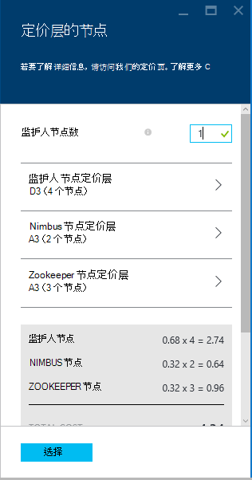

    使用__选择__以保存__节点定价层__信息。

8. 选择__可选的配置__。 此刀片式服务器允许您选择群集版本，以及配置其他可选设置，如加入__虚拟网络__。

    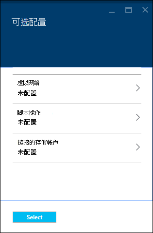

9. 确保__锁定到 Startboard__选中，然后选择__创建__。 这创建群集，并到 Azure 门户网站 Startboard 为其添加一个图块。 图标表示该群集资源调配时，要显示一次调配的 HDInsight 图标更改已完成。

  	| 在资源调配时 | 设置完成 |
  	| ------------------ | --------------------- |
  	|  | 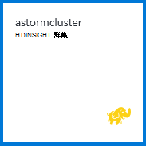 |

    > [AZURE.NOTE] 它需要一些时间对群集创建，通常大约 15 分钟。 使用 Startboard 或__通知__条目左侧的页上平铺在资源调配过程检查。

## 在 HDInsight 上运行冲击初学者示例

本 Apache 风暴教程向您介绍在 GitHub 上使用风暴初学者样本的大数据分析。

每个风暴 HDInsight 群集上的附带了风暴控制板，可用于上载和运行在群集上的风暴拓扑。 每个群集还配有可以直接从风暴仪表板运行的示例拓扑。

### 连接到仪表板

仪表板是位于**https://&lt;群集名称 >.azurehdinsight.net//**，其中**群集名称**是该群集的名称。 此外可以通过从 Startboard 选择群集和顶部刀片式服务器的__仪表板__链接到仪表板的链接。

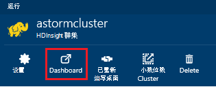

> [AZURE.NOTE] 连接到仪表板时，则会提示您输入用户名和密码。 这是管理员 (**管理员**) 的名称和创建群集时使用的密码。

风暴的仪表板已加载后，您将看到**拓扑提交**窗体。

**提交的拓扑**形式可用于上载和运行包含风暴拓扑的.jar 文件。 它还包括一些与群集提供的基本示例。

### 从 GitHub 在风暴起始项目运行字数统计示例

与群集中提供的示例包括单词计数的拓扑结构的几种变体。 这些示例包括**spout**随机发出句子，**螺栓**，每个句子分成单个的单词，然后每个单词出现的次数进行计数。 这些示例包括从[风暴初学者样本](https://github.com/apache/storm/tree/master/examples/storm-starter)，这些 Apache 风暴的一部分。

执行以下步骤来运行冲击初学者示例︰

1. 从**Jar 文件**下拉列表中选择**StormStarter 的字数统计**。 这将填充此示例的参数的**类名**和**附加参数**字段。

    

    * **类名**-提交拓扑的.jar 文件中的类。
    * **其他参数**-拓扑所需的任何参数。 在此示例中，该字段用于提供提交拓扑的友好名称。

2. 单击**提交**。 稍后，**结果**字段显示用于提交作业，以及命令的结果的命令。 **错误**字段显示提交拓扑结构中出现的任何错误。

    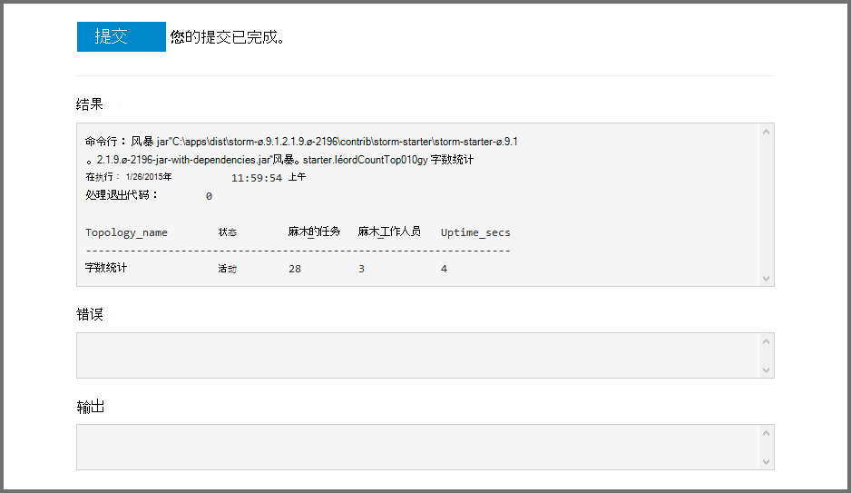

    > [AZURE.NOTE] 结果并不表明，拓扑结构已完成的**风暴拓扑中，一旦启动，运行，直到您停止它。** 字数统计拓扑生成随机的句子，并保持它遇到的每个单词，直到您停止它的次数的计数。

### 显示器拓扑

风暴的 UI 可以用于监视拓扑结构。

1. 从顶部的风暴操控板中选择**风暴 UI** 。 这将显示群集和所有正在运行的拓扑结构的摘要信息。

    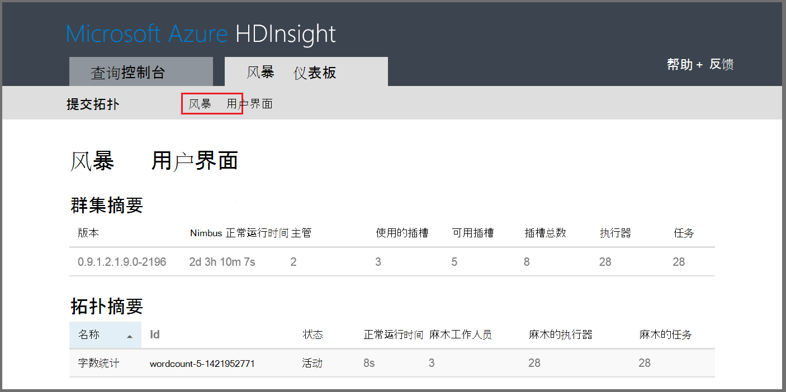

    从上面的页面中，您可以看到拓扑已处于活动状态，时间以及工作人员、 执行器和正在使用的任务的数目。

    > [AZURE.NOTE] **名称**列包含前面提供通过**附加参数**字段的友好名称。

4. 在**拓扑摘要**中，在**名称**列中选择**wordcount**条目。 这将显示有关拓扑的详细信息。

    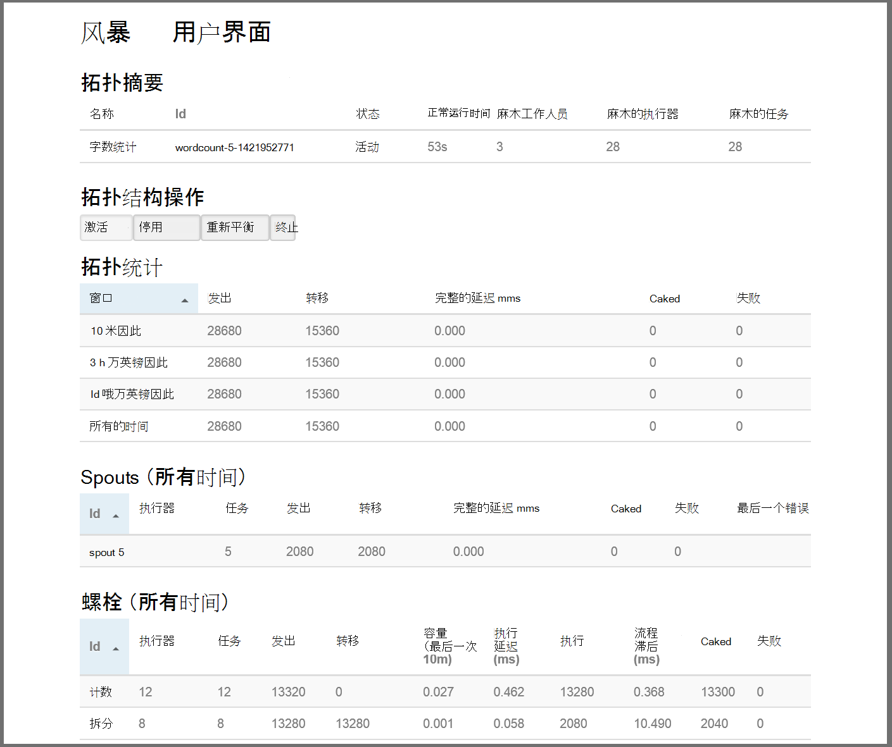

    此页提供以下信息︰

    * **拓扑统计**-拓扑性能，基本信息归类为不同的时间窗口。

        > [AZURE.NOTE] 选择一个特定的时间窗口更改页面的其他部分中显示的信息的时间窗口。

    * **Spouts** -spouts，包括每个管口通过返回的最后一个错误的基本信息。

    * **螺栓**的螺栓的基本信息。

    * **拓扑配置**-拓扑配置有关的详细信息。

    此页还提供了可在拓扑结构采取措施︰

    * **激活**的简历处理已停用的拓扑结构。

    * **停用**-暂停正在运行的拓扑结构。

    * **重新平衡**的调整拓扑结构的并行的度。 已更改群集中的节点数后，应该重新平衡运行拓扑。 这使拓扑结构调整并行度来弥补增加/减少的群集中的节点数。 有关详细信息，请参阅[了解风暴拓扑结构的并行性](http://storm.apache.org/documentation/Understanding-the-parallelism-of-a-Storm-topology.html)。

    * 在指定的超时时间后**终止**的终止风暴拓扑。

5. 在此页面中，选择**Spouts**或**螺栓**部分中的条目。 这将显示有关所选组件的信息。

    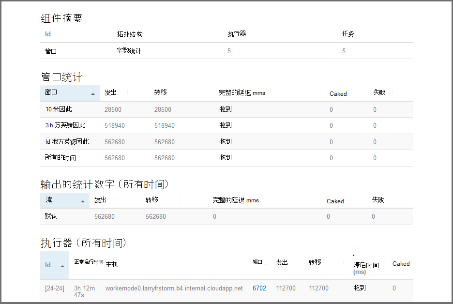

    此页显示以下信息︰

    * **管口/螺栓统计**-组件性能的基本信息归类为不同的时间窗口。

        > [AZURE.NOTE] 选择一个特定的时间窗口更改页面的其他部分中显示的信息的时间窗口。

    * **输入统计数据**（只螺栓的） 的产生由螺栓的数据的组件的信息。

    * **输出的统计数字**-发出该螺栓的数据信息。

    * **执行器**的此组件的实例的信息。

    * **错误**-该组件所产生的错误。

5. 当查看管口或螺栓的详细信息，请从**端口**列以查看详细信息组件的特定实例的**执行**部分中选择一个条目。

        2015-01-27 14:18:02 b.s.d.task [INFO] Emitting: split default ["with"]
        2015-01-27 14:18:02 b.s.d.task [INFO] Emitting: split default ["nature"]
        2015-01-27 14:18:02 b.s.d.executor [INFO] Processing received message source: split:21, stream: default, id: {}, [snow]
        2015-01-27 14:18:02 b.s.d.task [INFO] Emitting: count default [snow, 747293]
        2015-01-27 14:18:02 b.s.d.executor [INFO] Processing received message source: split:21, stream: default, id: {}, [white]
        2015-01-27 14:18:02 b.s.d.task [INFO] Emitting: count default [white, 747293]
        2015-01-27 14:18:02 b.s.d.executor [INFO] Processing received message source: split:21, stream: default, id: {}, [seven]
        2015-01-27 14:18:02 b.s.d.task [INFO] Emitting: count default [seven, 1493957]

    从这些数据中，可以看到 word**七**发生 1,493,957 次。 这是多少次遇到自启动此拓扑。

### 停止了拓扑

返回到字数统计拓扑中，**拓扑摘要**页，然后从**拓扑操作**部分选择**终止**。 出现提示时，输入 10 停止拓扑之前要等待的秒数。 在超时期间后, 拓扑时不再显示访问仪表板的**冲击 UI**部分。

##删除群集

[AZURE.INCLUDE [delete-cluster-warning](../../includes/hdinsight-delete-cluster-warning.md)]

## 摘要

在 Apache 风暴本教程中，您可以使用风暴初学者学会如何 HDInsight 群集上创建有暴风雨，风暴仪表板用于部署、 监视和管理风暴拓扑。

## 下一步行动

* **Visual Studio 的 HDInsight 工具**-HDInsight 工具允许您使用 Visual Studio 的提交、 监视和管理风暴拓扑类似于前面提到的暴风雨仪表板。 HDInsight 工具还提供了创建 C# 风暴拓扑的能力，并包括样本拓扑结构，您可以部署并在群集上运行。

    有关详细信息，请参阅[开始使用 Visual Studio 的 HDInsight 工具](hdinsight-hadoop-visual-studio-tools-get-started.md)。

* **示例文件**-HDInsight 风暴群集提供了几个示例中的**%STORM_HOME%\contrib**目录。 每个示例应包含下列信息︰

    * 源代码-例如，风暴-初学者-0.9.1.2.1.5.0-2057年-sources.jar

    * Java 文档-例如，风暴-初学者-0.9.1.2.1.5.0-2057年-javadoc.jar

    * 示例-例如 storm-starter-0.9.1.2.1.5.0-2057-jar-with-dependencies.jar

    使用 jar 命令来提取源代码或 Java 文档。 例如，jar-xvf 风暴-初学者-0.9.1.2.1.5.0.2057-javadoc.jar。

    > [AZURE.NOTE] Java 文档包含的网页。 一旦提取、 使用浏览器查看**index.html**文件。

    若要访问这些示例，必须启用远程桌面的 HDInsight 群集上风暴，然后从**%STORM_HOME%\contrib**复制文件。

* 下面的文档包含可在 HDInsight 上的风暴与其他示例的列表︰

    * [在 HDInsight 上的风暴的示例拓扑](hdinsight-storm-example-topology.md)

[apachestorm]: https://storm.incubator.apache.org
[stormdocs]: http://storm.incubator.apache.org/documentation/Documentation.html
[stormstarter]: https://github.com/apache/storm/tree/master/examples/storm-starter
[stormjavadocs]: https://storm.incubator.apache.org/apidocs/
[azureportal]: https://manage.windowsazure.com/
[hdinsight-provision]: hdinsight-provision-clusters.md
[preview-portal]: https://portal.azure.com/
