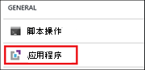
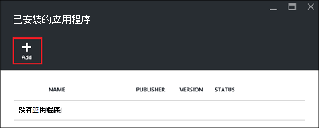
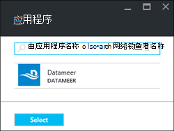
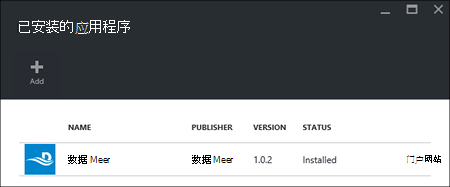

<properties
    pageTitle="在 HDInsight 上安装 Hadoop 应用程序 |Microsoft Azure"
    description="了解如何安装在 HDInsight 应用程序的 HDInsight 应用程序。"
    services="hdinsight"
    documentationCenter=""
    authors="mumian"
    manager="jhubbard"
    editor="cgronlun"
    tags="azure-portal"/>

<tags
    ms.service="hdinsight"
    ms.devlang="na"
    ms.topic="hero-article"
    ms.tgt_pltfrm="na"
    ms.workload="big-data"
    ms.date="09/14/2016"
    ms.author="jgao"/>

# 将 HDInsight 应用程序安装

HDInsight 应用程序是用户可以在一个基于 Linux 的 HDInsight 群集安装应用程序。 这些应用程序可以通过 Microsoft，独立软件供应商 (ISV) 或自己开发。 在本文中，您将学习如何安装发布的应用程序。 安装您自己的应用程序，请参阅[安装自定义的 HDInsight 应用程序](hdinsight-apps-install-custom-applications.md)。 

目前，没有一个已发布的应用程序︰

- **Datameer**: [Datameer](http://www.datameer.com/documentation/display/DAS50/Home?ls=Partners&lsd=Microsoft&c=Partners&cd=Microsoft)为分析师提供发现、 分析和可视化的结果对大数据的交互式方式。 在附加数据源中轻松地要发现新的关系，并获得您需要快速的答案中拉出。

>[AZURE.NOTE] Datameer 目前仅支持在 Azure HDInsight 3.2 版本的群集中。

本文中提供的说明进行操作，使用 Azure 的门户。 此外可以将 Azure 资源管理器模板导出从门户或从供应商获得的资源管理器模板的副本并使用 Azure PowerShell 和 Azure CLI 来配置的模板。  请参阅[创建 Linux 基于 Hadoop 群集中使用资源管理器模板 HDInsight](hdinsight-hadoop-create-linux-clusters-arm-templates.md)。

## 系统必备组件

如果您想要在现有的 HDInsight 群集上安装 HDInsight 应用程序，您必须具有 HDInsight 群集。 若要创建文档库，请参阅[创建群集](hdinsight-hadoop-linux-tutorial-get-started.md#create-cluster)。 当您创建一个 HDInsight 的群集时，还可以安装 HDInsight 的应用程序。

## 安装到现有群集的应用程序

下面的过程演示了如何安装到现有的 HDInsight 群集的 HDInsight 应用程序。

**将 HDInsight 应用程序安装**

1. 登录到[Azure 的门户](https://portal.azure.com)。
2. 在左窗格中单击**HDInsight 群集**。  如果您看不到它，单击**浏览**，然后单击**HDInsight 群集**。
3. 单击 HDInsight 群集。  如果您没有，您必须创建一个第一。  请参阅[创建群集](hdinsight-hadoop-linux-tutorial-get-started.md#create-cluster)。
4. 从**设置**刀片式服务器，单击**常规**类别下的**应用程序**。 **安装应用程序**刀片式服务器列出所有已安装的应用程序。 

    

5. 从刀片式服务器菜单中单击**添加**。 

    

    您应看到现有的 HDInsight 应用程序的列表。

    

6. 单击某个应用程序、 接受的法律条款，然后单击**选择**。

您可以查看安装状态从门户通知 （单击顶部门户响铃图标）。 安装应用程序后，应用程序会在安装应用程序刀片式服务器上。

## 在群集创建过程中安装应用程序

您可以选择安装 HDInsight 应用程序，当您创建群集。 在过程中，HDInsight 应用程序安装后群集创建且处于运行状态。 下面的过程演示了如何安装 HDInsight 应用程序，当您创建群集。

**将 HDInsight 应用程序安装**

1. 登录到[Azure 的门户](https://portal.azure.com)。
2. 单击**新建**，单击**数据 + 分析**，然后单击**HDInsight**。
3. 输入**群集名称**︰ 此名称必须是全局唯一的。
4. 单击以选择用于群集的 Azure 订阅**订阅**。
5. 单击**选择群集类型**，然后选择︰

    - **群集类型**︰ 如果您不知道如何选择，选择**Hadoop**。 它是最受欢迎的群集类型。
    - **操作系统**︰ 选择**Linux**。
    - **版本**︰ 如果您不知道所要选择使用的默认版本。 有关详细信息，请参阅[HDInsight 群集版本](hdinsight-component-versioning.md)。
    - **群集层**︰ Azure HDInsight 提供了两个类别中的大数据云选项︰ 标准层和特优层。 有关详细信息，请参阅[群集层](hdinsight-hadoop-provision-linux-clusters.md#cluster-tiers)。
6. 单击**应用程序**，单击其中一个发布的应用程序，然后单击**选择**。
6. 单击**凭据**，然后输入管理员用户的密码。 此外必须输入**SSH 用户名**和**密码**或**公钥**，它将使用 SSH 用户进行身份验证。 使用公钥是推荐的方法。 在底部保存的凭据配置，请单击**选择**。
8. 单击**数据源**，选择一个现有的存储帐户或创建新的存储帐户用作群集默认存储帐户。
9. 单击**资源组**来选择一个现有的资源组，或单击**新建**以创建新的资源组

10. **新的 HDInsight 群集**刀片式服务器，请确保**附到 Startboard**被选中，然后单击**创建**。 

## 列出已安装的 HDInsight 应用程序和属性

门户显示群集安装的 HDInsight 应用程序的列表以及每个已安装的应用程序的属性。

**若要列出 HDInsight 应用程序并显示属性**

1. 登录到[Azure 的门户](https://portal.azure.com)。
2. 在左窗格中单击**HDInsight 群集**。  如果您看不到它，单击**浏览**，然后单击**HDInsight 群集**。
3. 单击 HDInsight 群集。
4. 从**设置**刀片式服务器，单击**常规**类别下的**应用程序**。 安装应用程序刀片式服务器列出所有已安装的应用程序。 

    

5. 单击其中一个已安装的应用程序，以显示属性。 列出了属性刀片式服务器︰

    - 应用程序名称︰ 应用程序名称。
    - 状态︰ 应用程序的状态。 
    - 网页︰ 部署到边缘节点是否有 web 应用程序的 URL。 凭据是作为群集配置的 HTTP 用户凭据相同。
    - HTTP 端点︰ 凭据就是您为群集配置的 HTTP 用户凭据。 
    - SSH 终结点︰ 您可以使用[SSH](hdinsight-hadoop-linux-use-ssh-unix.md)连接到边缘节点。 SSH 凭据与您为群集配置 SSH 用户凭据相同。

6. 若要删除一个应用程序，应用程序中，用鼠标右键单击，然后从上下文菜单中单击**删除**。

## 连接到边缘节点

您可以连接到使用 HTTP 和 SSH 在边缘节点。 从[门户网站](#list-installed-hdinsight-apps-and-properties)找不到的终结点信息。 使用 SSH 的详细信息，请参阅[使用 SSH 上从 Linux、 Unix 或 OS X HDInsight 基于 Linux 的 Hadoop 使用](hdinsight-hadoop-linux-use-ssh-unix.md)。 

HTTP 端点凭据已配置为 HDInsight 群集; HTTP 用户凭据SSH 端点凭据是为 HDInsight 群集配置 SSH 凭据。

## 疑难解答

请参阅[疑难解答安装](hdinsight-apps-install-custom-applications.md#troubleshoot-the-installation)。

## 下一步行动

- [安装自定义的 HDInsight 应用程序](hdinsight-apps-install-custom-applications.md)︰ 了解如何部署到 HDInsight 未发布的 HDInsight 应用程序。
- [发布的 HDInsight 应用程序](hdinsight-apps-publish-applications.md)︰ 了解如何发布您的自定义 HDInsight 应用程序到 Azure 市场。
- [MSDN︰ 安装应用程序 HDInsight](https://msdn.microsoft.com/library/mt706515.aspx)︰ 了解如何定义 HDInsight 应用程序。
- [基于自定义 Linux HDInsight 群集使用脚本操作](hdinsight-hadoop-customize-cluster-linux.md)︰ 了解如何使用脚本的操作来安装其他应用程序。
- [基于创建 Linux 的 Hadoop 群集中使用资源管理器模板 HDInsight](hdinsight-hadoop-create-linux-clusters-arm-templates.md)︰ 了解如何调用资源管理器模板来创建 HDInsight 群集。
- [使用 HDInsight 中的空的边缘节点](hdinsight-apps-use-edge-node.md)︰ 了解如何使用一个空的边缘节点访问 HDInsight 群集、 测试 HDInsight 的应用程序和承载 HDInsight 应用程序。

