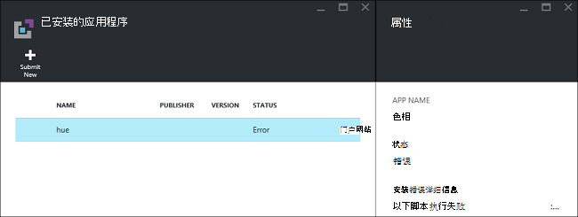
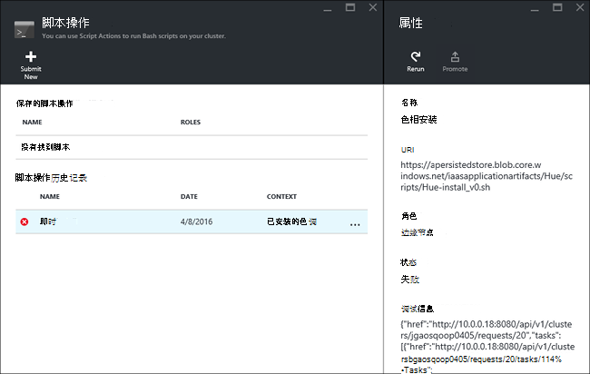

<properties
    pageTitle="在 HDInsight 上安装 Hadoop 应用程序 |Microsoft Azure"
    description="了解如何安装在 HDInsight 应用程序的 HDInsight 应用程序。"
    services="hdinsight"
    documentationCenter=""
    authors="mumian"
    manager="jhubbard"
    editor="cgronlun"
    tags="azure-portal"/>

<tags
    ms.service="hdinsight"
    ms.devlang="na"
    ms.topic="hero-article"
    ms.tgt_pltfrm="na"
    ms.workload="big-data"
    ms.date="09/14/2016"
    ms.author="jgao"/>

# 安装自定义的 HDInsight 应用程序

HDInsight 应用程序是用户可以在一个基于 Linux 的 HDInsight 群集安装应用程序。  这些应用程序可以通过 Microsoft，独立软件供应商 (ISV) 或自己开发。 在本文中，您将学习如何安装的 HDInsight 应用程序尚未发布到 Azure 门户网站 HDInsight 上。 将安装的应用程序是[色调](http://gethue.com/)。 

其他相关的文章︰

- [安装 HDInsight 应用程序](hdinsight-apps-install-applications.md)︰ 了解如何安装到群集应用程序 HDInsight。
- [发布的 HDInsight 应用程序](hdinsight-apps-publish-applications.md)︰ 了解如何发布您的自定义 HDInsight 应用程序到 Azure 市场。
- [MSDN︰ 安装应用程序 HDInsight](https://msdn.microsoft.com/library/mt706515.aspx)︰ 了解如何定义 HDInsight 应用程序。

 
## 系统必备组件

如果您想要在现有的 HDInsight 群集上安装 HDInsight 应用程序，您必须具有 HDInsight 群集。 若要创建文档库，请参阅[创建群集](hdinsight-hadoop-linux-tutorial-get-started.md#create-cluster)。 当您创建一个 HDInsight 的群集时，还可以安装 HDInsight 的应用程序。

## 将 HDInsight 应用程序安装

HDInsight 应用程序可以创建群集或向现有 HDInsight 群集安装。 用于定义 Azure 资源管理器模板，请参阅[MSDN︰ 安装 HDInsight 应用程序](https://msdn.microsoft.com/library/mt706515.aspx)。

部署此应用程序 （色调） 所需的文件︰

- [azuredeploy.json](https://github.com/hdinsight/Iaas-Applications/blob/master/Hue/azuredeploy.json): 资源管理器安装 HDInsight 应用程序的模板。 请参阅[MSDN︰ 安装 HDInsight 应用程序](https://msdn.microsoft.com/library/mt706515.aspx)来开发自己的资源管理器模板。
- [色调 install_v0.sh](https://github.com/hdinsight/Iaas-Applications/blob/master/Hue/scripts/Hue-install_v0.sh)︰ 通过配置边缘节点的资源管理器模板调用的脚本操作。 
- [色调 binaries.tgz](https://hdiconfigactions.blob.core.windows.net/linuxhueconfigactionv01/hue-binaries-14-04.tgz)︰ 从 hui install_v0.sh 正在调用的色相二进制文件。 
- [色调的二进制文件 14 04.tgz](https://hdiconfigactions.blob.core.windows.net/linuxhueconfigactionv01/hue-binaries-14-04.tgz)︰ 从 hui install_v0.sh 正在调用的色相二进制文件。 
- [webwasb tomcat.tar.gz](https://hdiconfigactions.blob.core.windows.net/linuxhueconfigactionv01/webwasb-tomcat.tar.gz)︰ 示例 web 应用程序 (Tomcat) 从中 hui install_v0.sh 调用。

**若要安装到现有的 HDInsight 群集的色调**

1. 单击以下图像中登录到 Azure 和 Azure 门户中打开资源管理器的模板。 

    

    此按钮将打开一个资源管理器模板基于 Azure 的门户。  资源管理器模板位于[https://github.com/hdinsight/Iaas-Applications/tree/master/Hue](https://github.com/hdinsight/Iaas-Applications/tree/master/Hue)。  若要了解如何编写此资源管理器模板的信息，请参阅[MSDN︰ 安装 HDInsight 应用程序](https://msdn.microsoft.com/library/mt706515.aspx)。
    
2. 从**参数**刀片式服务器，输入以下命令︰

    - **群集名称**︰ 输入要用来安装应用程序的群集名称。 此群集必须是一个现有的群集。
    
3. 单击**确定**以保存参数。
4. 从**自定义部署**刀片式服务器中，输入**资源组**。  资源组是群集、 从属存储帐户和其他资源组的容器。 它需要与群集使用相同的资源组。
5. **法律条款**，请单击，然后单击**创建**。
6. 验证**到仪表板的 pin 码**复选框已选中，然后单击**创建**。 您可以看到从固定到门户的仪表板和门户通知该图块的安装状态 （单击顶部门户响铃图标）。  大约需要 10 分钟来安装该应用程序。

**若要在创建群集时安装色调**

1. 单击以下图像中登录到 Azure 和 Azure 门户中打开资源管理器的模板。 

    

    此按钮将打开一个资源管理器模板基于 Azure 的门户。  资源管理器模板位于[https://hditutorialdata.blob.core.windows.net/hdinsightapps/create-linux-based-hadoop-cluster-in-hdinsight.json](https://hditutorialdata.blob.core.windows.net/hdinsightapps/create-linux-based-hadoop-cluster-in-hdinsight.json)。  若要了解如何编写此资源管理器模板的信息，请参阅[MSDN︰ 安装 HDInsight 应用程序](https://msdn.microsoft.com/library/mt706515.aspx)。

2. 按照说明创建群集并安装色调。 创建 HDInsight 群集的详细信息，请参阅[HDInsight 中的基于创建 Linux 的 Hadoop 群集](hdinsight-hadoop-provision-linux-clusters.md)。

除了 Azure 的门户网站，也可以使用[Azure PowerShell](hdinsight-hadoop-create-linux-clusters-arm-templates.md#deploy-with-powershell)和[Azure CLI](hdinsight-hadoop-create-linux-clusters-arm-templates.md#deploy-with-azure-cli)调用资源管理器模板

## 验证安装

您可以检查在 Azure 门户来验证应用程序的安装应用程序的状态。 此外，您还可以验证所有 HTTP 端点的随附如期和网页如果有的话︰

**若要打开色相门户网站**

1. 登录到[Azure 的门户](https://portal.azure.com)。
2. 在左窗格中单击**HDInsight 群集**。  如果您看不到它，单击**浏览**，然后单击**HDInsight 群集**。
3. 单击应用程序的安装位置的群集。
4. 从**设置**刀片式服务器，单击**常规**类别下的**应用程序**。 您应看到**色调**刀片式服务器**安装的应用程序**中列出。
5. 单击从列表列出属性的**色调**。  
6. 单击网页链接来验证该网站;若要验证色相 web 用户界面，请打开 SSH 终结点使用[PuTTY](hdinsight-hadoop-linux-use-ssh-windows.md)或其他[SSH 客户端](hdinsight-hadoop-linux-use-ssh-unix.md)的浏览器中打开的 HTTP 端点。
 
## 排除安装故障

您可以检查应用程序的安装状态从门户通知 （单击顶部门户响铃图标）。 

如果应用程序安装失败，可以查看错误消息和调试信息中的 3 个位置︰

- HDInsight 应用程序︰ 一般错误的信息。

    从门户，打开群集，然后单击设置刀片式服务器的应用程序︰

    

- HDInsight 脚本操作︰ 如果 HDInsight 应用程序的错误消息指示脚本操作失败，将脚本操作窗格中显示有关脚本失败的更多详细信息。

    从设置刀片式服务器，请单击脚本操作。 脚本操作历史记录都会显示的错误消息

    
    
- Ambari Web 用户界面︰ 如果安装脚本失败的原因，使用 Ambari Web 用户界面检查安装脚本有关的完整日志。

    有关详细信息，请参阅[疑难解答](hdinsight-hadoop-customize-cluster-linux.md#troubleshooting)。

## HDInsight 应用程序中移除

有几种方法来删除 HDInsight 应用程序。

### 使用门户网站

**若要删除使用门户应用程序**

1. 登录到[Azure 的门户](https://portal.azure.com)。
2. 在左窗格中单击**HDInsight 群集**。  如果您看不到它，单击**浏览**，然后单击**HDInsight 群集**。
3. 单击应用程序的安装位置的群集。
4. 从**设置**刀片式服务器，单击**常规**类别下的**应用程序**。 您应看到已安装的应用程序的列表。 对于本教程，**色调**刀片式服务器**安装的应用程序**中列出。
5. 用鼠标右键单击要删除的应用程序，然后单击**删除**。
6. 单击**是**确认。

从门户网站，也可以删除群集或删除包含应用程序的资源组。

### 使用 Azure PowerShell

使用 Azure PowerShell，您可以删除群集或删除该资源组。 请参阅[删除群集使用 Azure PowerShell](hdinsight-administer-use-powershell.md#delete-clusters)。

### 使用 Azure CLI

使用 Azure CLI，可以删除群集或删除该资源组。 请参阅[删除群集使用 Azure CLI](hdinsight-administer-use-command-line.md#delete-clusters)。

## 下一步行动

- [MSDN︰ 安装应用程序 HDInsight](https://msdn.microsoft.com/library/mt706515.aspx)︰ 学习如何开发部署 HDInsight 应用程序资源管理器模板。
- [安装 HDInsight 应用程序](hdinsight-apps-install-applications.md)︰ 了解如何安装到群集应用程序 HDInsight。
- [发布的 HDInsight 应用程序](hdinsight-apps-publish-applications.md)︰ 了解如何发布您的自定义 HDInsight 应用程序到 Azure 市场。
- [基于自定义 Linux HDInsight 群集使用脚本操作](hdinsight-hadoop-customize-cluster-linux.md)︰ 了解如何使用脚本的操作来安装其他应用程序。
- [基于创建 Linux 的 Hadoop 群集中使用资源管理器模板 HDInsight](hdinsight-hadoop-create-linux-clusters-arm-templates.md)︰ 了解如何调用资源管理器模板来创建 HDInsight 群集。
- [使用 HDInsight 中的空的边缘节点](hdinsight-apps-use-edge-node.md)︰ 了解如何使用一个空的边缘节点访问 HDInsight 群集、 测试 HDInsight 的应用程序和承载 HDInsight 应用程序。
