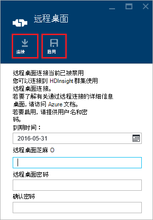
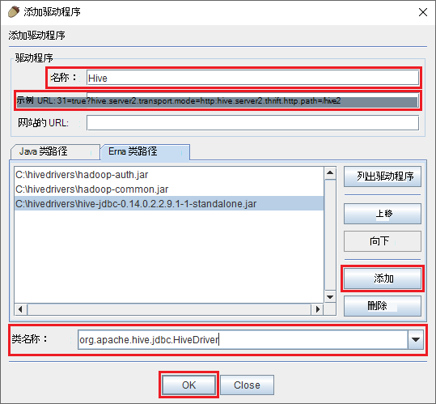
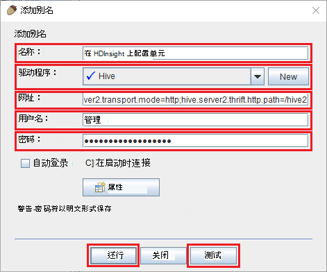
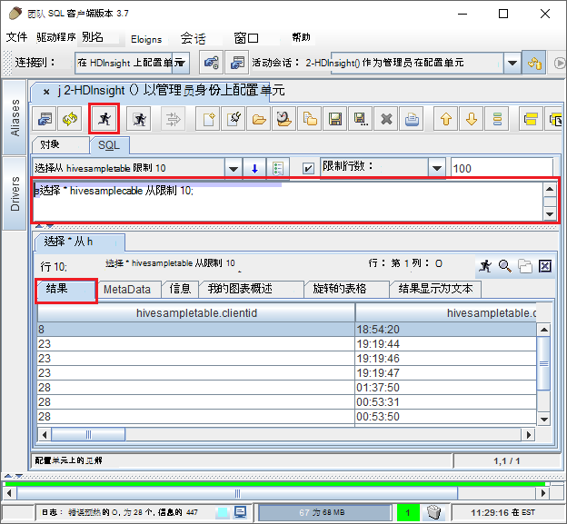

<properties
 pageTitle="使用 JDBC 查询在 Azure HDInsight 配置单元"
 description="了解如何使用 JDBC 连接到 Azure HDInsight 配置单元和远程存储在云中的数据上运行查询。"
 services="hdinsight"
 documentationCenter=""
 authors="Blackmist"
 manager="jhubbard"
 editor="cgronlun"
    tags="azure-portal"/>

<tags
 ms.service="hdinsight"
 ms.devlang="java"
 ms.topic="article"
 ms.tgt_pltfrm="na"
 ms.workload="big-data"
 ms.date="08/23/2016"
 ms.author="larryfr"/>

#连接到在 Azure HDInsight 使用的配置单元的 JDBC 驱动程序的配置单元

[AZURE.INCLUDE [ODBC-JDBC-selector](../../includes/hdinsight-selector-odbc-jdbc.md)]

在本文中，您将学习如何从 Java 应用程序使用 JDBC 远程提交到 HDInsight 群集配置单元查询。 您将了解如何从团队 SQL 客户端，连接以及如何从 Java 编程方式连接。

配置单元 JDBC 接口的详细信息，请参阅[HiveJDBCInterface](https://cwiki.apache.org/confluence/display/Hive/HiveJDBCInterface)。

##系统必备组件

若要完成本文中的步骤操作，您需要︰

* Hadoop HDInsight 群集上。 基于 linux * 的或基于 Windows 群集将起作用。

* [SQL 团队](http://squirrel-sql.sourceforge.net/)。 团队是 JDBC 客户机应用程序。

要生成并运行示例 Java 应用程序从这篇文章的链接，您将需要以下。

* [Java 开发人员工具箱 (JDK) 版本 7](https://www.oracle.com/technetwork/java/javase/downloads/jdk7-downloads-1880260.html)或更高版本。

* [Apache Maven](https://maven.apache.org)。 Maven 是项目生成的 Java 项目系统，由与此项目关联的项目。

##连接字符串

JDBC 连接到 HDInsight 群集在 Azure 上进行超过 443，和使用 SSL 来保护通信。 坐在后面的群集公用网关将通信重定向到 HiveServer2 实际上正在侦听的端口。 因此，典型的连接字符串将类似以下内容︰

    jdbc:hive2://CLUSTERNAME.azurehdinsight.net:443/default;ssl=true?hive.server2.transport.mode=http;hive.server2.thrift.http.path=/hive2

__群集名称__替换 HDInsight 群集的名称。

##身份验证

建立连接时，必须使用 HDInsight 群集管理员名称和密码来验证到群集网关。 时从团队 SQL 如 JDBC 客户机连接，必须在客户机设置中输入管理员名称和密码。

从 Java 应用程序，必须在建立连接时使用的用户名和密码。 例如，下面的 Java 代码将打开一个新的连接使用的连接字符串、 管理员名和密码︰

    DriverManager.getConnection(connectionString,clusterAdmin,clusterPassword);

##与团队 SQL 客户端连接

SQL 团队是可用于运行 HDInsight 群集配置单元查询远程 JDBC 客户机。 以下步骤假定您已经安装了团队 SQL，并将指导您完成下载和配置单元配置驱动程序。

1. 复制 HDInsight 群集配置单元的 JDBC 驱动程序。

    * 为__基于 Linux 的 HDInsight__，使用以下步骤来下载必需的 jar 文件。

        1. 创建新的目录将包含这些文件。 例如， `mkdir hivedriver`。

        2. 从命令提示符处、 大扫除、 PowerShell 或其他命令行提示符处，将目录更改到新的目录，使用以下命令将文件从 HDInsight 群集复制。

                scp USERNAME@CLUSTERNAME:/usr/hdp/current/hive-client/lib/hive-jdbc*standalone.jar .
                scp USERNAME@CLUSTERNAME:/usr/hdp/current/hadoop-client/hadoop-common.jar .
                scp USERNAME@CLUSTERNAME:/usr/hdp/current/hadoop-client/hadoop-auth.jar .

            __用户名__替换群集的 SSH 用户帐户名。 __群集名称__替换 HDInsight 群集名称。

            > [AZURE.NOTE] 在 Windows 环境中，您需要使用 PSCP 实用程序，而不是 scp。 您可以从[http://www.chiark.greenend.org.uk/~sgtatham/putty/download.html](http://www.chiark.greenend.org.uk/~sgtatham/putty/download.html)下载它。

    * 对于__基于 Windows 的 HDInsight__，使用以下步骤将 jar 文件下载。

        1. 从 Azure 门户，选择 HDInsight 群集，然后选择__远程桌面__图标。

            

        2. 在远程桌面刀片式服务器，使用__连接__按钮连接到群集。 如果未启用远程桌面，则使用窗体提供用户名和密码，然后选择__启用__群集启用远程桌面。

            

            在选择__连接__后，将下载的.rdp 文件。 使用此文件来启动远程桌面客户端。 出现提示时，请使用用户名称和密码输入远程桌面访问。

        3. 建立连接后，可将以下文件复制从远程桌面会话，到您的本地计算机。 将它们放入本地目录命名为`hivedriver`。

            * C:\apps\dist\hive-0.14.0.2.2.9.1-7\lib\hive-jdbc-0.14.0.2.2.9.1-7-standalone.jar
            * C:\apps\dist\hadoop-2.6.0.2.2.9.1-7\share\hadoop\common\hadoop-common-2.6.0.2.2.9.1-7.jar
            * C:\apps\dist\hadoop-2.6.0.2.2.9.1-7\share\hadoop\common\lib\hadoop-auth-2.6.0.2.2.9.1-7.jar

            > [AZURE.NOTE] 包含的路径和文件名称的版本号可能不同群集。

        4. 断开远程桌面会话文件复制完成。

3. 启动团队 SQL 应用程序。 从窗口的左侧，选择__驱动程序__。

    

4. 从__驱动程序__对话框顶部的图标，选择__+__图标可创建新的驱动程序。

    

5. 在添加驱动程序对话框中，添加以下信息。

    * __名称__︰ 配置单元
    * __示例 URL__: jdbc:hive2://localhost:443/default;ssl=true?hive.server2.transport.mode=http;hive.server2.thrift.http.path=/hive2
    * __额外的类路径__︰ 使用添加按钮添加的 jar 文件之前下载
    * __类名称__︰ org.apache.hive.jdbc.HiveDriver

    

    单击__确定__以保存这些设置。

6. 在团队 SQL 窗口的左侧，选择__别名__。 然后单击__+__图标以创建新的连接别名。

    

7. 使用__添加别名__对话框中的以下值。

    * __名称__︰ 在 HDInsight 上配置单元
    * __驱动程序__︰ 使用下拉列表来选择__配置单元__的驱动程序
    * __URL__: jdbc:hive2://CLUSTERNAME.azurehdinsight.net:443/default;ssl=true?hive.server2.transport.mode=http;hive.server2.thrift.http.path=/hive2

        __群集名称__替换 HDInsight 群集的名称。

    * __用户名__︰ HDInsight 群集的群集登录的帐户名。 默认值是`admin`。
    * __密码__︰ 群集的登录帐户的密码。 这是创建 HDInsight 群集时提供一个密码。

    

    使用__测试__按钮来验证该连接有效。 当__连接到︰ 在 HDInsight 上配置单元__对话框，选择__连接__以执行测试。 如果测试成功，您将看到一个__成功的连接__对话框。

    底部的__添加别名__对话框中使用__确定__按钮保存连接别名。

8. 从顶部的团队 SQL__连接到__下拉列表中，选择__配置单元在 HDInsight 上__。 出现提示时，选择__连接__。

    ![[连接] 对话框](./media/hdinsight-connect-hive-jdbc-driver/connect.png)

9. 一旦建立连接，在 SQL 查询对话框中，输入下面的查询，然后选择__运行__图标。 结果区域应显示查询的结果。

        select * from hivesampletable limit 10;

    

##从示例 Java 应用程序连接

[Https://github.com/Azure-Samples/hdinsight-java-hive-jdbc](https://github.com/Azure-Samples/hdinsight-java-hive-jdbc)提供了一种在 HDInsight 上使用 Java 客户端查询配置单元。 按照在存储库中生成并运行示例的说明。

##故障排除

### 试图打开的 SQL 连接时发生意外的错误。

__症状__︰ 当连接到版本 3.3 或 3.4 HDInsight 群集时，您可能会收到出错时发生意外的错误。 此错误的堆栈跟踪将开始使用下面的行︰

    java.util.concurrent.ExecutionException: java.lang.RuntimeException: java.lang.NoSuchMethodError: org.apache.commons.codec.binary.Base64.<init>(I)V
    at java.util.concurrent.FutureTas...(FutureTask.java:122)
    at java.util.concurrent.FutureTask.get(FutureTask.java:206)

__原因__︰ 此错误由团队，另一个从 HDInsight 群集配置单元 JDBC 组件需要使用的一些 codec.jar 文件的版本不匹配。

__解决方法__︰ 要修复此错误，请执行下列步骤。

1. 从 HDInsight 群集中下载一些编解码器的 jar 文件。

        scp USERNAME@CLUSTERNAME:/usr/hdp/current/hive-client/lib/commons-codec*.jar ./commons-codec.jar

2. 退出团队，然后再转至目录团队在您系统上的安装位置。 在团队目录中，在`lib`目录，替换现有的一些 codec.jar 其中一个从 HDInsight 群集。

3. 重新启动团队。 在连接到在 HDInsight 上的配置单元时不会再发生这种错误。

##下一步行动

现在，您已经学习了如何使用 JDBC 配置单元处理，使用下面的链接继续探讨其他方法以使用 Azure HDInsight。

* [将数据上传到 HDInsight](hdinsight-upload-data.md)
* [使用 HDInsight 配置单元](hdinsight-use-hive.md)
* [使用 HDInsight 的小猪](hdinsight-use-pig.md)
* [HDInsight 使用 MapReduce 作业](hdinsight-use-mapreduce.md)
