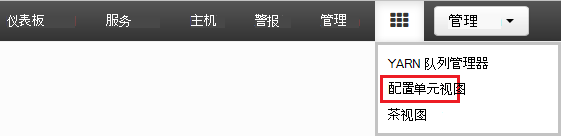
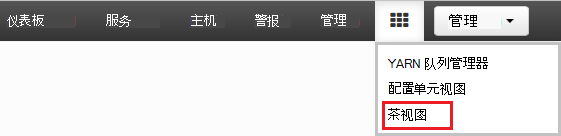
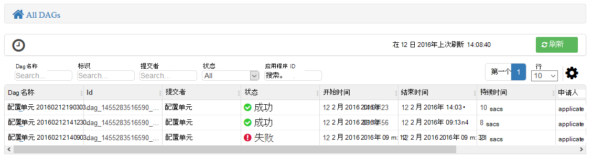
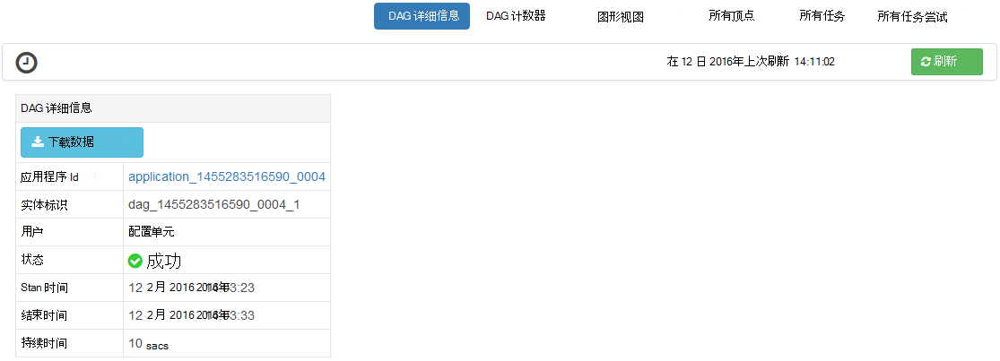
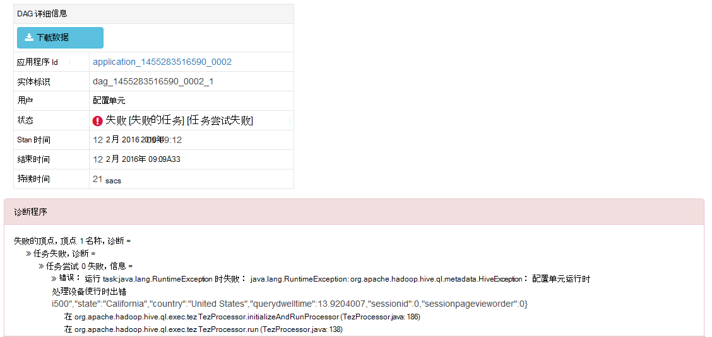
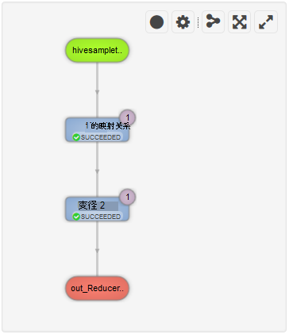
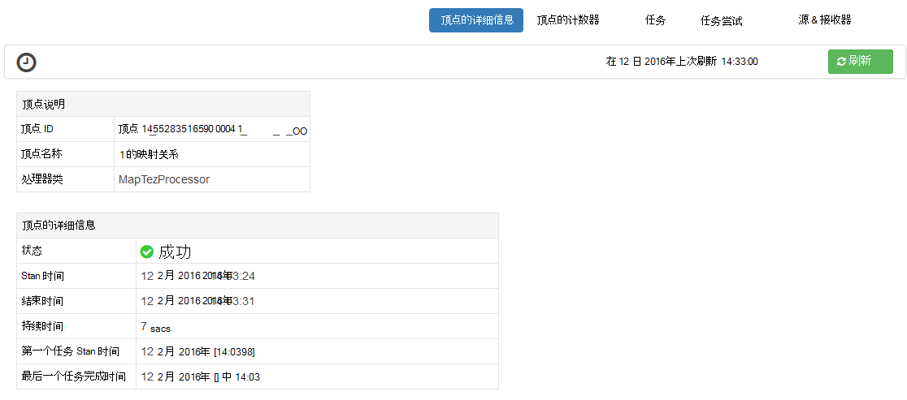
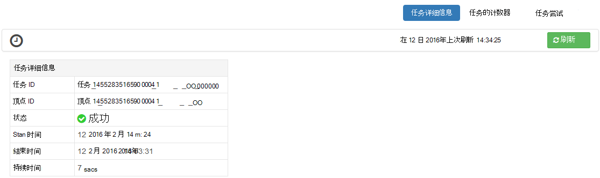

<properties
pageTitle="Ambari Tez 视图中使用 HDInsight |Azure"
description="了解如何使用 Ambari Tez 查看调试 Tez HDInsight 上的作业。"
services="hdinsight"
documentationCenter=""
authors="Blackmist"
manager="jhubbard"
editor="cgronlun"/>

<tags
ms.service="hdinsight"
ms.devlang="na"
ms.topic="article"
ms.tgt_pltfrm="na"
ms.workload="big-data"
ms.date="10/04/2016"
ms.author="larryfr"/>

# Ambari 视图用于调试 Tez HDInsight 上的作业

HDInsight Ambari Web UI 包含一个 Tez 视图可以用来理解和调试 Tez 用作执行引擎的作业。 Tez 视图允许您直观显示为图形的连接项目的作业，深入到每个项目，并检索统计信息和日志信息。

> [AZURE.NOTE] 此文档中的信息是特定于基于 Linux 的 HDInsight 群集。 有关调试使用基于 Windows 的 HDInsight Tez 作业的信息，请参阅[使用 Tez 用户界面，若要调试在基于 Windows 的 HDInsight Tez 作业](hdinsight-debug-tez-ui.md)。

## 系统必备组件

* 基于 linux * 的 HDInsight 群集。 有关创建新群集的步骤，请参阅[开始使用基于 Linux 的 HDInsight](hdinsight-hadoop-linux-tutorial-get-started.md)。

* 现代 web 浏览器支持 HTML5。

## 了解 Tez

Tez 是可扩展框架中提供更高速度比传统的 MapReduce 处理的 Hadoop 的数据处理。 对于基于 Linux 的 HDInsight 群集，则配置单元的默认引擎。

当工作提交到 Tez 时，它会创建定向非循环图 (DAG) 描述的作业所需的操作的执行顺序。 各个操作被称为顶点，并执行一种整体的作业。 通过顶点所述的工作的实际执行称为一项任务，并可能分布在多个节点的群集中。

### 了解 Tez 视图

Tez 视图提供有关进程正在运行，或之前运行使用 Tez。 它使您可以查看生成的 Tez，DAG 如何分布在群集，如任务和顶点和错误的信息所使用的内存计数器。 它可能会提供以下方案中的有用信息︰

* 监控长时间运行进程，查看地图的进度和减少任务。

* 分析历史数据成功或失败的进程，若要了解可以如何改进处理或失败的原因。

## 生成 DAG

如果使用 Tez 引擎当前正在运行或已过去运行的作业，Tez 视图将只包含数据。 简单配置单元通常可以解析查询而无需使用 Tez，但是更复杂进行筛选、 分组、 排序，联接等通常将需要 Tez 的查询。

使用以下步骤配置单元查询，将使用 Tez 执行。

1. 在 web 浏览器中，导航到 https://CLUSTERNAME.azurehdinsight.net，其中__群集名称__是 HDInsight 群集的名称。

2. 从页面顶部的菜单中，选择__视图__图标。 这看上去像一系列的平方和。 在显示下拉列表，选择__配置单元视图__。 

    

3. 当配置单元查看负载时，粘贴到查询编辑器中的以下，然后单击__执行__。

        select market, state, country from hivesampletable where deviceplatform='Android' group by market, country, state;
    
    完成作业后，您应该看到__查询过程结果__部分中显示的输出。 结果应类似于以下
    
        market  state       country
        en-GB   Hessen      Germany
        en-GB   Kingston    Jamaica
        
4. 选择__日志__选项卡。 您将看到类似于以下的信息︰
    
        INFO : Session is already open
        INFO :

        INFO : Status: Running (Executing on YARN cluster with App id application_1454546500517_0063)

    保存__应用程序 id__值，这将在下一节中使用。

## 使用 Tez 视图

1. 从页面顶部的菜单中，选择__视图__图标。 在显示下拉列表，选择__Tez 视图__。

    

2. Tez 视图加载时，您将看到一份 Dag，当前正在运行或已运行在群集上。 默认视图包括 Dag 名称、 Id、 提交者、 状态、 开始时间、 结束时间、 持续时间、 应用程序 ID 和队列。 可以在页面的右侧使用齿轮图标添加更多的列。

    

3. 如果只有一个条目，将上一节中运行该查询。 如果您有多个条目，您可以通过在__应用程序 ID__字段中输入的应用程序 ID 搜索，然后按回车键。

4. 选择的__Dag 名称__。 这将显示有关 DAG，信息以及下载 zip 的 JSON 文件包含有关 DAG 信息的选项。

    

5. __DAG 细节__上面是几个可用于显示有关 DAG 的信息的链接。

    * __DAG 计数器__显示此 DAG 的计数器信息。
    
    * __图形视图__显示此 DAG 的图形化表示。
    
    * __所有顶点__将都显示在此 DAG 顶点的列表。
    
    * __所有任务__都显示在此 DAG 的所有顶点的任务列表。
    
    * __所有 TaskAttempts__都显示尝试运行此 DAG 任务有关的信息。
    
    > [AZURE.NOTE] 如果您滚动的列显示的顶点、 任务和 TaskAttempts，请注意有链接，以查看__计数器__并__查看或下载日志__的每一行。

    如果有作业失败，DAG 详细信息将显示状态为失败，以及失败的任务有关的信息的链接。 将下面的 DAG 详细信息显示诊断信息。
    
    

7. 选择__图形视图__。 这将显示 DAG 的图形化表示。 您可以将鼠标放在视图中显示有关它的信息的每个顶点。

    

8. 顶点上单击将加载该项目的__顶点的详细信息__。 __图 1__顶点，以显示此项的详细信息，请单击。

    

9. 请注意，您现在有链接在页面的顶部与顶点和任务相关的。

    > [AZURE.NOTE] 您还可以通过回到__DAG 的详细信息__，选择__顶点的详细信息__，然后选择__映射 1__顶点到达此页。

    * __顶点计数器__显示此顶点的计数器信息。
    
    * __任务__显示为此顶点的任务。
    
    * __任务尝试__显示尝试运行此顶点的任务有关的信息。
    
    * __源和接收器__显示数据源和接收器为此顶点。

    > [AZURE.NOTE] 作为与上一个菜单，您可以滚动列显示为任务、 任务尝试以及源和 Sinks__ 来显示每个项的详细信息的链接。

10. 选择__任务__，然后选择该项目名为__00_000000__。 这将为该任务显示__任务详细信息__。 在此屏幕中，您可以查看__任务计数器__和__任务的尝试次数__。

    

## 下一步行动

现在，您已经学习了如何使用 Tez 查看，了解有关[使用在 HDInsight 配置单元](hdinsight-use-hive.md)。

在 Tez 上的更多详细技术信息，请参阅[Hortonworks Tez 页](http://hortonworks.com/hadoop/tez/)。

在 Ambari 中使用 HDInsight 的详细信息，请参阅[管理 HDInsight 群集使用 Ambari Web 用户界面](hdinsight-hadoop-manage-ambari.md)
