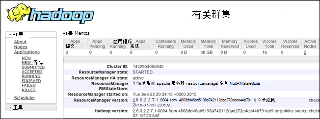

<properties
    pageTitle="调试中 HDInsight 的 Hadoop︰ 查看日志和解释错误消息 |Microsoft Azure"
    description="了解有关管理使用 PowerShell，HDInsight 时，您可能会收到错误消息以及您可以采取的步骤来恢复。"
    services="hdinsight"
    tags="azure-portal"
    editor="cgronlun"
    manager="jhubbard"
    authors="mumian"
    documentationCenter=""/>

<tags
    ms.service="hdinsight"
    ms.workload="big-data"
    ms.tgt_pltfrm="na"
    ms.devlang="na"
    ms.topic="article"
    ms.date="09/02/2016"
    ms.author="jgao"/>

# 分析 HDInsight 日志

在 Azure HDInsight 每个 Hadoop 群集拥有 Azure 存储帐户用作默认的文件系统。 存储帐户被称为默认存储帐户。 群集使用 Azure 表存储和 Blob 存储在默认的存储帐户存储其日志。  若要查找您的群集的默认存储帐户，请参阅[HDInsight 中的管理 Hadoop 群集](hdinsight-administer-use-management-portal.md#find-the-default-storage-account)。 日志文件保留在存储帐户即使群集中被删除。

##日志写入到 Azure 表

日志写入到 Azure 表提供一个级别的洞察与 HDInsight 群集发生了什么。

当您创建一个 HDInsight 群集时，6 表会自动创建默认表存储在基于 Linux 的群集︰

- hdinsightagentlog
- 系统日志
- daemonlog
- hadoopservicelog
- ambariserverlog
- ambariagentlog

对于基于 Windows 群集创建 3 表︰

- setuplog︰ 日志的事件/提供/设置的 HDInsight 群集中遇到的异常。
- hadoopinstalllog︰ 在群集上安装 Hadoop 时遇到的事件/异常日志。 此表可能有助于调试群集创建的自定义参数与相关的问题。
- hadoopservicelog︰ 事件中的异常日志记录的 Hadoop 的所有服务。 此表可能有助于调试作业 HDInsight 群集上的失败与相关的问题。

表的文件名是**u<ClusterName>DDMonYYYYatHHMMSSsss<TableName>**。

这些表包含以下字段︰

- ClusterDnsName
- 组件
- EventTimestamp
- 主机
- MALoggingHash
- 消息
- N
- PreciseTimeStamp
- 角色
- RowIndex
- 租户
- 时间戳
- TraceLevel

### 用于访问日志工具

有许多工具可用来访问这些表中的数据︰

-  Visual Studio
-  Azure 存储资源管理器
-  Excel 的电源查询

#### Excel 使用电源的查询

可以从[www.microsoft.com/en-us/download/details.aspx?id=39379]( http://www.microsoft.com/en-us/download/details.aspx?id=39379)安装电源查询。 请参阅下载页面的系统要求。

**若要使用电源查询来打开和分析服务日志**

1. 打开**Microsoft Excel**。
2. 从**电源查询**菜单上，单击**从 Azure**，，然后单击**从 Microsoft Azure 表存储**。
 
    
3. 输入存储帐户名。 这可以是短名称或 FQDN。
4. 输入存储帐户密钥。 您应看到表的列表︰

    
5. 用鼠标右键单击**导航**窗格中的 hadoopservicelog 表，并选择**编辑**。 您应看到 4 列。 或者，通过选择它们，然后单击功能区中的选项中的**删除列**删除**分区键**、**行键**和**时间戳**列。
6. 单击展开图标内容的列，可以选择您想要导入到 Excel 电子表格的列上。 对于本演示，我选择了 TraceLevel 和组件︰ 它可以为我提供的组件有问题的一些基本信息。

    
7. 单击**确定**以导入数据。
8. **TraceLevel**、 角色和**组件**列中，选择，然后单击**组通过**功能区中的控件。
9. 单击分组依据对话框中的**确定**
10. 单击**应用和关闭**。
 
现在，您可以使用 Excel 来筛选和排序，根据需要。 显然，要以深入到问题发生，但选择并组合上面所述的列提供了正在发生的事情与 Hadoop 服务不错图片时包括其他列 （如消息）。 相同的思想可以应用到 setuplog 和 hadoopinstalllog 的表。

#### 使用 Visual Studio

**若要使用 Visual Studio**

1. 打开 Visual Studio。
2. 从**视图**菜单上，单击**云资源管理器**。 只需单击或者**CTRL +\, CTRL + X**。
3. 从**云资源管理器中**，选择**资源类型**。  其他可用的选项是**资源组**。
4. 展开**存储帐户**，您的群集的默认存储帐户，然后选择**表**。
5. 双击**hadoopservicelog**。
6. 添加筛选器。 例如︰
    
        TraceLevel eq 'ERROR'

    

    有关构建筛选器的详细信息，请参阅[表设计器中构建筛选器字符串](../vs-azure-tools-table-designer-construct-filter-strings.md)。
 
##日志写入到 Azure Blob 存储

[日志写入到 Azure 表](#log-written-to-azure-tables)提供一个级别的洞察与 HDInsight 群集发生了什么。 但是，这些表不提供任务级日志，有助于深化进一步时出现的问题。 要提供此下一级别的明细数据，HDInsight 群集配置任务日志写入 Blob 存储帐户通过 Templeton 提交任何作业。 实际上，这意味着使用 Microsoft Azure PowerShell cmdlet 或.NET 作业提交 Api 不通过 RDP/命令行访问群集的权限提交的作业提交的作业。 

若要查看日志，请参阅[访问 YARN 应用程序登录基于 Linux 的 HDInsight](hdinsight-hadoop-access-yarn-app-logs-linux.md)。

有关应用程序日志的详细信息，请参阅[Simplifying 用户日志管理和访问中 YARN](http://hortonworks.com/blog/simplifying-user-logs-management-and-access-in-yarn/)。
 
 
## 查看群集运行状况和作业日志

###访问 Hadoop UI

从 Azure 门户，单击以打开群集刀片 HDInsight 群集名称。 从群集刀片式服务器，请单击**仪表板**。

出现提示时，输入群集管理员凭据。 在查询控制台中打开，请单击**Hadoop UI**。

###访问 Yarn UI

从 Azure 门户，单击以打开群集刀片 HDInsight 群集名称。 从群集刀片式服务器，请单击**仪表板**。 出现提示时，输入群集管理员凭据。 在查询控制台中打开，请单击**YARN UI**。

YARN 用户界面可用于执行下列操作︰

* **获取群集状态**。 从左窗格中，展开**群集**，并单击**关于**。 此显示群集状态的详细信息，如总分配内存，内核使用，群集资源管理器的状态、 群集版本等。

    

* **获取节点状态**。 左窗格中，展开**群集**，然后单击**节点**。 这将列出所有节点在群集中，每个节点的 HTTP 地址资源分配给每个节点，等等。

* **监视作业状态**。 从左窗格中，展开**群集**，，然后单击**应用程序**可列出在群集中的所有作业。 如果您想要查看特定状态 （如新的提交，运行等） 中的作业，在**应用程序**下单击相应的链接。 进一步可以单击了解更多有关作业包括输出、 日志等此类的作业名。

###访问 HBase UI

从 Azure 门户，单击以打开群集刀片 HDInsight HBase 群集名称。 从群集刀片式服务器，请单击**仪表板**。 出现提示时，输入群集管理员凭据。 在查询控制台中打开，请单击**HBase UI**。

## HDInsight 错误代码

在这一节中列出的错误消息提供了有助于 Hadoop 在 Azure HDInsight 的用户了解管理使用 Azure PowerShell 的服务时，它们就可能会遇到的可能的错误情况和建议的步骤，它可以采取从错误中恢复。

这些错误消息的一些可能也会出现在 Azure 门户时使用它来管理 HDInsight 群集。 但您可能会遇到其他错误消息有粗放由于在此上下文中可能的补救措施的约束。 很明显缓解所在的上下文中提供了其他错误消息。 

### AtleastOneSqlMetastoreMustBeProvided
- **说明**︰ 请提供至少一个组件的 SQL Azure 数据库详细信息，以用于配置单元和 Oozie metastores 的自定义设置。
- **缓解**︰ 用户需要提供有效的 SQL Azure metastore，然后重试此请求。  

### AzureRegionNotSupported
- **描述**︰ 无法在区域*nameOfYourRegion*创建群集。 使用有效的 HDInsight 地区，然后重试请求。
- **缓解**︰ 客户应该创建当前支持的群集地区︰ 东南亚、 西欧、 北欧、 东亚美国或西部美国。  

### ClusterContainerRecordNotFound
- **描述**︰ 服务器找不到请求的群集记录。  
- **缓解**︰ 重试该操作。

### ClusterDnsNameInvalidReservedWord
- **说明**︰ 群集 DNS 名称*yourDnsName*是无效的。 请确保名称开头和结尾字母数字，只包含一个 '的' 特殊字符  
- **缓解**︰ 请确保您已经使用一个有效的 DNS 名称用于群集开始和结尾字母数字、 不包含任何特殊字符以外的短划线-，然后重试该操作。

### ClusterNameUnavailable
- **说明**︰ 群集名称*yourClusterName*是不可用的。 请选择其他名称。  
- **缓解**︰ 用户应指定群集名称都是唯一的并不存在，然后重试。 如果用户使用门户，用户界面将通知它们如果群集名称已被使用在创建步骤中。

### ClusterPasswordInvalid
- **说明**︰ 群集密码是无效的。 密码必须至少包含 10 个字符长和必须包含至少一个数字、 大写字母、 小写字母和特殊字符并且不包含空格，不应包含用户名作为它的一部分。  
- **缓解**︰ 提供一个有效的群集的密码，然后重试该操作。

### ClusterUserNameInvalid
- **说明**︰ 群集用户名无效。 请确保用户名不能包含特殊字符或空格。  
- **缓解**︰ 提供有效的群集用户名，然后重试操作。

### ClusterUserNameInvalidReservedWord
- **说明**︰ 群集 DNS 名称*yourDnsClusterName*是无效的。 请确保名称开头和结尾字母数字，只包含一个 '的' 特殊字符  
- **缓解**︰ 提供一个有效的 DNS 群集用户名，然后重试该操作。

### ContainerNameMisMatchWithDnsName
- **说明**︰ 在 URI *yourcontainerURI*容器名称和请求主体中的 DNS 名称*yourDnsName*必须是相同的。  
- **缓解**︰ 确保容器名称和您的 DNS 名称相同并且重试该操作。

### DataNodeDefinitionNotFound
- **说明**︰ 无效的群集配置。 找不到任何数据节点定义的节点的大小。  
- **缓解**︰ 重试该操作。

### DeploymentDeletionFailure
- **说明**︰ 删除部署群集失败  
- **缓解**︰ 重试删除操作。

### DnsMappingNotFound
- **说明**︰ 服务配置错误。 找不到所需的 DNS 映射信息。  
- **缓解**︰ 删除群集，然后创建一个新的群集。

### DuplicateClusterContainerRequest
- **说明**︰ 复制群集容器创建尝试。 *NameOfYourContainer*的存在记录但不是匹配 Etag。
- **缓解**︰ 提供容器的唯一的名称，然后重试创建操作。

### DuplicateClusterInHostedService
- **说明**︰ 托管的服务*nameOfYourHostedService*已包含群集。 托管的服务中不能包含多个群集  
- **缓解**︰ 主机群集中另一个托管服务。

### FailureToUpdateDeploymentStatus
- **描述**︰ 服务器无法更新群集部署的状态。  
- **缓解**︰ 重试该操作。 如果多次出现此情况，请联系 CSS。

### HdiRestoreClusterAltered
- **说明**︰ 删除群集*yourClusterName*作为维护的一部分。 请重新创建群集。
- **缓解**︰ 重新创建群集。

### HeadNodeConfigNotFound
- **说明**︰ 无效的群集配置。 在节点大小中找不到所需的头节点配置。
- **缓解**︰ 重试该操作。

### HostedServiceCreationFailure
- **描述**︰ 无法创建托管的服务*nameOfYourHostedService*。 请重试请求。  
- **缓解**︰ 重试此请求。

### HostedServiceHasProductionDeployment
- **说明**︰ 托管的服务*nameOfYourHostedService*已有的生产部署。 托管的服务中不能包含多个生产部署。 请重试该请求与一个不同的群集名称。
- **缓解**︰ 使用一个不同的群集名称，然后重试该请求。

### HostedServiceNotFound
- **说明**︰ 为找不到群集承载服务*nameOfYourHostedService* 。  
- **缓解**︰ 群集处于错误状态，如果将其删除，然后再试一次。

### HostedServiceWithNoDeployment
- **说明**︰ 托管的服务*nameOfYourHostedService*有任何关联的部署。  
- **缓解**︰ 群集处于错误状态，如果将其删除，然后再试一次。

### InsufficientResourcesCores
- **说明**︰ SubscriptionId *yourSubscriptionId*不需要内核左创建群集*yourClusterName*。 要求︰*因此*，可用︰ *resourcesAvailable*。  
- **缓解**︰ 释放更多资源在您的订阅或增加资源，可供订阅并尝试重新创建群集。

### InsufficientResourcesHostedServices
- **说明**︰ 订阅 ID *yourSubscriptionId*没有配额的新 HostedService 创建群集*yourClusterName*。  
- **缓解**︰ 释放更多资源在您的订阅或增加资源，可供订阅并尝试重新创建群集。

### InternalErrorRetryRequest
- **描述**︰ 服务器遇到一个内部错误。 请重试请求。  
- **缓解**︰ 重试此请求。

### InvalidAzureStorageLocation
- **说明**︰ *dataRegionName*的 Azure 存储位置不是有效的位置。 请确认该地区正确，然后重试请求。
- **缓解**︰ 选择支持 HDInsight 的存储位置，请检查您的群集是否并存并重试该操作。

### InvalidNodeSizeForDataNode
- **说明**︰ 数据节点无效 VM 大小。 对所有数据节点支持只 ' 大 VM 大小。  
- **缓解**︰ 指定的数据节点支持的节点大小，然后重试操作。

### InvalidNodeSizeForHeadNode
- **说明**︰ 无效的 VM 大小头节点。 仅 ExtraLarge VM 大小头节点支持。  
- **缓解**︰ 指定头节点的受支持的节点大小，然后重试此操作

### InvalidRightsForDeploymentDeletion
- **说明**︰ 所使用的订阅 ID *yourSubscriptionId*没有足够的权限来执行群集*yourClusterName*的删除操作。  
- **缓解**︰ 如果群集处于错误状态，除去它并再试一次。  

### InvalidStorageAccountBlobContainerName
- **说明**︰ 外部存储帐户 blob 容器名称*yourContainerName*是无效的。 确保名称以字母开头并包含小写字母、 数字和短划线。  
- **缓解**︰ 指定有效的存储帐户 blob 容器名称，然后重试该操作。

### InvalidStorageAccountConfigurationSecretKey
- **说明**︰ 配置外部存储帐户*yourStorageAccountName*需要机密密钥的详细信息，必须设置。  
- **缓解**︰ 指定有效的存储帐户密钥，然后重试操作。

### InvalidVersionHeaderFormat
- **说明**︰ 版头*yourVersionHeader*不是有效格式 yyyy-毫米-dd.  
- **缓解**︰ 指定版本标头的有效格式，然后重试该请求。

### MoreThanOneHeadNode
- **说明**︰ 无效的群集配置。 找到多个头节点配置。  
- **缓解**︰ 因此，onloy 有一个头节点指定编辑配置。

### OperationTimedOutRetryRequest
- **说明**︰ 不能在允许的时间内完成该操作或最大重试次数可能。 请重试请求。  
- **缓解**︰ 重试此请求。

### ParameterNullOrEmpty
- **说明**︰ *yourParameterName*的参数不能为 null 或为空。  
- **缓解**︰ 指定该参数的有效值。

### PreClusterCreationValidationFailure
- **说明**︰ 一个或多个群集创建请求输入了无效。 请确保输入的值正确，然后重试请求。  
- **缓解**︰ 请确保输入的值是否正确，然后重试请求。

### RegionCapabilityNotAvailable
- **说明**︰ 区域功能区域*yourRegionName*和*yourSubscriptionId*的订阅 ID 不可用。  
- **缓解**︰ 指定区域支持 HDInsight 群集。 公开支持的地区是︰ 东南亚、 西欧、 北欧、 东亚美国或西部美国。

### StorageAccountNotColocated
- **说明**︰ 存储帐户*yourStorageAccountName*处于区域*currentRegionName*。 它应该是相同群集地区*yourClusterRegionName*。  
- **缓解**︰ 群集处于同一区域中指定存储帐户，或者如果您的数据位于存储帐户，在同一区域的现有存储帐户创建新的群集。 如果您正在使用门户，用户界面将提前通知他们这个问题。

### SubscriptionIdNotActive
- **说明**︰ 指定订阅 ID *yourSubscriptionId*处于非活动状态。  
- **缓解措施**︰ 重新激活您的订阅或获取新的有效的订阅。

### SubscriptionIdNotFound
- **描述**︰ 找不到预订 ID *yourSubscriptionId* 。  
- **缓解**︰ 检查您的订购 ID 是否有效，然后重试操作。

### UnableToResolveDNS
- **描述**︰ 无法解析 DNS *yourDnsUrl*。 请确保提供 blob 终结点的完全限定的 URL。  
- **缓解**︰ 提供有效的 blob URL。 URL 必须是完全有效的包括以*http://*开头并以*.com*结尾。

### UnableToVerifyLocationOfResource
- **描述**︰ 无法验证资源*yourDnsUrl*的位置。 请确保提供 blob 终结点的完全限定的 URL。  
- **缓解**︰ 提供有效的 blob URL。 URL 必须是完全有效的包括以*http://*开头并以*.com*结尾。

### VersionCapabilityNotAvailable
- **说明**︰ 版本功能版本*specifiedVersion*和*yourSubscriptionId*的订阅 ID 不可用。  
- **缓解**︰ 选择可用的版本，然后重试该操作。

### VersionNotSupported
- **说明**︰ 不支持的版本*specifiedVersion* 。
- **缓解**︰ 选择受支持的版本，然后重试该操作。

### VersionNotSupportedInRegion
- **说明**︰ 版本*specifiedVersion*不是 Azure 地区*specifiedRegion*中可用。  
- **缓解**︰ 选择在指定的区域中支持的版本，然后重试操作。

### WasbAccountConfigNotFound
- **说明**︰ 无效的群集配置。 在外部帐户中未找到所需的 WASB 帐户配置。  
- **缓解**︰ 验证该帐户存在并且正确配置中指定，然后重试该操作。

## 下一步行动

- [Ambari 视图用于调试 Tez HDInsight 上的作业](hdinsight-debug-ambari-tez-view.md)
- [启用基于 Linux 的 HDInsight 上的 Hadoop 服务的堆转储](hdinsight-hadoop-collect-debug-heap-dump-linux.md)
- [通过使用 Ambari Web 用户界面管理 HDInsight 群集](hdinsight-hadoop-manage-ambari.md)
