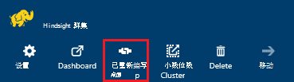
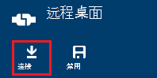
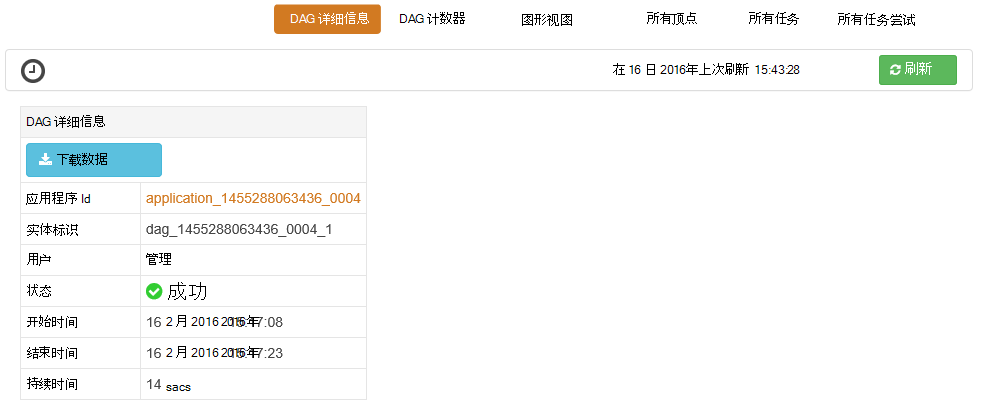
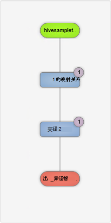
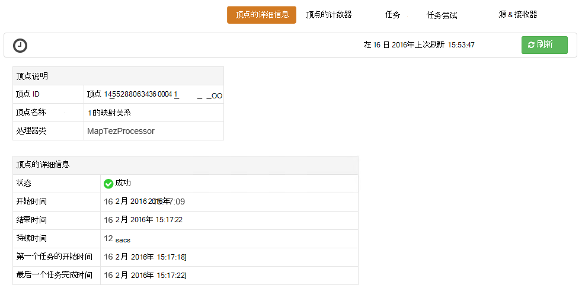
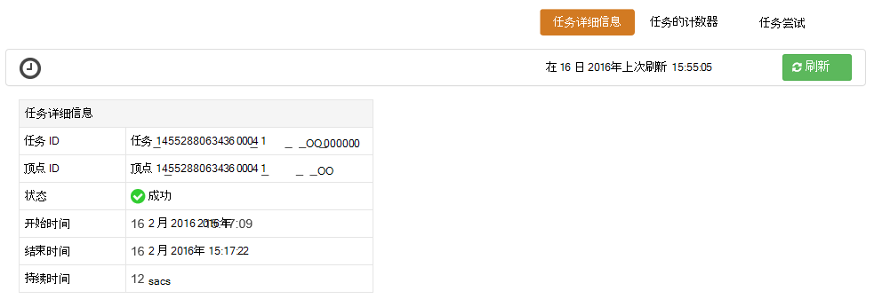

<properties
pageTitle="Tez 用户界面中使用的基于 Windows 的 HDInsight |Azure"
description="了解如何使用 Tez 用户界面来调试在基于 Windows 的 HDInsight HDInsight Tez 作业。"
services="hdinsight"
documentationCenter=""
authors="Blackmist"
manager="jhubbard"
editor="cgronlun"/>

<tags
ms.service="hdinsight"
ms.devlang="na"
ms.topic="article"
ms.tgt_pltfrm="na"
ms.workload="big-data"
ms.date="10/04/2016"
ms.author="larryfr"/>

# Tez 用户界面用于调试上的基于 Windows 的 HDInsight Tez 作业

Tez 用户界面是一个 web 页，可用来理解和调试 Tez 用作执行引擎的基于 Windows 的 HDInsight 群集上的作业。 Tez 用户界面可以直观地显示为图形的连接项作业，深入到每个项目，并检索统计信息和日志记录信息。

> [AZURE.NOTE] 此文档中的信息是特定于基于 Windows HDInsight 群集。 查看和调试上基于 Linux 的 HDInsight Tez 的信息，请参阅[使用 Ambari 视图调试 Tez HDInsight 上的作业](hdinsight-debug-ambari-tez-view.md)。

## 系统必备组件

* 基于 Windows 的 HDInsight 群集。 有关创建新群集的步骤，请参阅[开始使用基于 Windows 的 HDInsight](hdinsight-hadoop-tutorial-get-started-windows.md)。

    > [AZURE.IMPORTANT] Tez 用户界面才在 2 月第八，2016年之后创建的基于 Windows 的 HDInsight 群集上可用。

* 基于 Windows 的远程桌面客户端。

## 了解 Tez

Tez 是可扩展框架中提供更高速度比传统的 MapReduce 处理的 Hadoop 的数据处理。 对于基于 Windows 的 HDInsight 群集，则可以配置单元查询中通过下面的命令来配置单元来启用可选引擎︰

    set hive.execution.engine=tez;

当工作提交到 Tez 时，它会创建定向非循环图 (DAG) 描述的作业所需的操作的执行顺序。 各个操作被称为顶点，并执行一种整体的作业。 通过顶点所述的工作的实际执行称为一项任务，并可能分布在多个节点的群集中。

### 了解 Tez 用户界面

Tez 用户界面中，网页提供有关进程正在运行，或之前运行使用 Tez。 它使您可以查看生成的 Tez，DAG 如何分布在群集，如任务和顶点和错误的信息所使用的内存计数器。 它可能会提供以下方案中的有用信息︰

* 监控长时间运行进程，查看地图的进度和减少任务。

* 分析历史数据成功或失败的进程，若要了解可以如何改进处理或失败的原因。

## 生成 DAG

如果使用 Tez 引擎当前正在运行或已过去运行的作业，Tez 用户界面将只包含数据。 简单配置单元通常可以解析查询而无需使用 Tez，但是更复杂进行筛选、 分组、 排序，联接等通常将需要 Tez 的查询。

使用以下步骤配置单元查询，将使用 Tez 执行。

1. 在 web 浏览器中，导航到 https://CLUSTERNAME.azurehdinsight.net，其中__群集名称__是 HDInsight 群集的名称。

2. 从页面顶部的菜单中，选择__配置单元编辑器__。 这将显示与以下示例查询页面。

        Select * from hivesampletable

    删除示例查询并将其替换为以下。

        set hive.execution.engine=tez;
        select market, state, country from hivesampletable where deviceplatform='Android' group by market, country, state;

3. 选择__提交__按钮。 在页面底部__作业会话__部分将显示查询的状态。 一旦状态更改为__已完成__时，选择__查看详细信息__链接以查看结果。 __作业输出__内容应类似如下︰
        
        en-GB   Hessen      Germany
        en-GB   Kingston    Jamaica
        en-GB   Nairobi Area    Kenya

## 使用 Tez 用户界面

> [AZURE.NOTE] 因此，您必须使用远程桌面连接到 head 节点，Tez 用户界面才可用群集的头节点，在桌面上。

1. 从[Azure 的门户网站](https://portal.azure.com)，选择 HDInsight 群集。 从 HDInsight 刀片的顶部，选择__远程桌面__图标。 这将显示远程桌面刀片式服务器

    

2. 从远程桌面刀片式服务器，选择__连接__以连接到群集的头节点。 出现提示时，使用群集远程桌面用户名称和密码进行身份验证的连接。

    

    > [AZURE.NOTE] 如果您没有启用远程桌面连接，提供用户名、 密码和到期日期，然后选择__启用__来启用远程桌面。 一旦启用，使用前面的步骤连接。

3. 接通后，在远程桌面上打开 Internet Explorer 在右上角的浏览器中选择齿轮图标，然后选择__兼容性视图设置__。

4. 从__兼容性视图设置__底部，__兼容性视图中的显示 intranet 站点__，并__使用 Microsoft 兼容性列表__，清除复选框，然后选择__关闭__。

5. 在 Internet Explorer 浏览到 http://headnodehost:8188/tezui / #/。 这将显示 Tez 用户界面

    

    当加载 Tez 用户界面时，您将看到一份 Dag，当前正在运行或已运行在群集上。 默认视图包括 Dag 名称、 Id、 提交者、 状态、 开始时间、 结束时间、 持续时间、 应用程序 ID 和队列。 可以在页面的右侧使用齿轮图标添加更多的列。

    如果只有一个条目，将上一节中运行该查询。 如果您有多个条目，您可以在 Dag，上方的字段中输入搜索条件来搜索，然后按__enter 键__。

4. 选择最近的 DAG 条目的__Dag 名称__。 这将显示有关 DAG，信息以及下载 zip 的 JSON 文件包含有关 DAG 信息的选项。

    

5. __DAG 细节__上面是几个可用于显示有关 DAG 的信息的链接。

    * __DAG 计数器__显示此 DAG 的计数器信息。
    
    * __图形视图__显示此 DAG 的图形化表示。
    
    * __所有顶点__将都显示在此 DAG 顶点的列表。
    
    * __所有任务__都显示在此 DAG 的所有顶点的任务列表。
    
    * __所有 TaskAttempts__都显示尝试运行此 DAG 任务有关的信息。
    
    > [AZURE.NOTE] 如果您滚动的列显示的顶点、 任务和 TaskAttempts，请注意有链接，以查看__计数器__并__查看或下载日志__的每一行。

    如果有作业失败，DAG 详细信息将显示状态为失败，以及失败的任务有关的信息的链接。 将下面的 DAG 详细信息显示诊断信息。

7. 选择__图形视图__。 这将显示 DAG 的图形化表示。 您可以将鼠标放在视图中显示有关它的信息的每个顶点。

    

8. 顶点上单击将加载该项目的__顶点的详细信息__。 __图 1__顶点，以显示此项的详细信息，请单击。 选择__确认__确认导航。

    

9. 请注意，您现在有链接在页面的顶部与顶点和任务相关的。

    > [AZURE.NOTE] 您还可以通过回到__DAG 的详细信息__，选择__顶点的详细信息__，然后选择__映射 1__顶点到达此页。

    * __顶点计数器__显示此顶点的计数器信息。
    
    * __任务__显示为此顶点的任务。
    
    * __任务尝试__显示尝试运行此顶点的任务有关的信息。
    
    * __源和接收器__显示数据源和接收器为此顶点。

    > [AZURE.NOTE] 作为与上一个菜单，您可以滚动列显示为任务、 任务尝试以及源和 Sinks__ 来显示每个项的详细信息的链接。

10. 选择__任务__，然后选择该项目名为__00_000000__。 这将为该任务显示__任务详细信息__。 在此屏幕中，您可以查看__任务计数器__和__任务的尝试次数__。

    

## 下一步行动

现在，您已经学习了如何使用 Tez 查看，了解有关[使用在 HDInsight 配置单元](hdinsight-use-hive.md)。

在 Tez 上的更多详细技术信息，请参阅[Hortonworks Tez 页](http://hortonworks.com/hadoop/tez/)。
