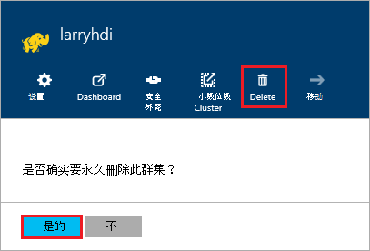

<properties
pageTitle="如何删除 HDInsight 群集 |Azure"
description="您可以删除 HDInsight 群集的各种方式的信息。"
services="hdinsight"
documentationCenter=""
authors="Blackmist"
manager="jhubbard"
editor="cgronlun"/>

<tags
ms.service="hdinsight"
ms.devlang="na"
ms.topic="article"
ms.tgt_pltfrm="na"
ms.workload="big-data"
ms.date="10/28/2016"
ms.author="larryfr"/>

#如何删除 HDInsight 群集

HDInsight 群集创建并停止群集删除了，并会按比例支付每分钟，以便不再使用时，应该始终删除群集后付费启动群集。 在本文中，您将学习如何使用 Azure 门户、 Azure PowerShell 和 Azure CLI 的群集中删除。

> [AZURE.IMPORTANT] 删除 HDInsight 群集不会删除与群集相关的 Azure 存储帐户。 这使您能够保留和重新使用群集存储的任何数据。

##Azure 门户

1. 登录到[Azure 的门户网站](https://portal.azure.com)，并选择 HDInsight 群集。 如果 HDInsight 群集不固定到仪表板后，您可以为它按名称搜索使用搜索字段 （放大镜图标），在导航栏的右侧。

    

2. 一旦对群集打开刀片式服务器，选择__删除__图标。 出现提示时，选择__是__以删除该群集。

    

##Azure PowerShell

在 PowerShell 提示符下使用以下命令删除群集︰

    Remove-AzureRmHDInsightCluster -ClusterName CLUSTERNAME

__群集名称__替换 HDInsight 群集的名称。

##Azure CLI

在提示符下，使用以下方法来删除群集︰

    azure hdinsight cluster delete CLUSTERNAME
    
__群集名称__替换 HDInsight 群集的名称。
