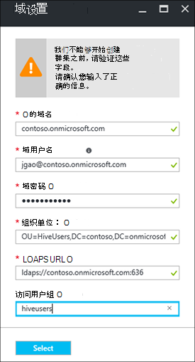

<properties
    pageTitle="配置群集加入域的 HDInsight |Microsoft Azure"
    description="了解如何设置和配置域加入 HDInsight 群集"
    services="hdinsight"
    documentationCenter=""
    authors="saurinsh"
    manager="jhubbard"
    editor="cgronlun"
    tags=""/>

<tags
    ms.service="hdinsight"
    ms.devlang="na"
    ms.topic="article"
    ms.tgt_pltfrm="na"
    ms.workload="big-data"
    ms.date="10/26/2016"
    ms.author="saurinsh"/>

# 配置域加入 HDInsight 群集 （预览）

了解如何设置 Azure HDInsight 群集使用 Azure 活动目录 (AD Azure) 和[Apache 兵兵](http://hortonworks.com/apache/ranger/)利用强身份验证和丰富的基于角色的访问控制 (RBAC) 策略。  加入域的 HDInsight 只能在基于 Linux 的群集配置。 有关详细信息，请参阅[HDInsight 引入了域加入群集](hdinsight-domain-joined-introduction.md)。

本文是一系列中的第一个教程︰

- 与 Apache 兵兵启用创建 HDInsight 群集连接到 Azure AD （通过 Azure 目录域服务功能）。
- 创建和应用策略配置单元是通过 Apache 兵兵，并允许用户连接到使用基于 ODBC 的工具，例如 Excel 等 Tableau 配置单元 （例如，数据科学家）。Microsoft 正在向很快加入域的 HDInsight 中添加其他工作负载，如 HBase、 触发，并占领。

最终拓扑的示例如下所示︰

由于 Azure AD 当前仅支持传统虚拟网络 (VNets) 和基于 Linux 的 HDInsight 群集仅支持 Azure 资源管理器基于 VNets，HDInsight Azure AD 集成要求两个 VNets 和它们之间对等。 两种部署模型之间的比较信息，请参阅[Azure 资源管理器与传统的部署︰ 了解部署模型和资源的状态](../resource-manager-deployment-model.md)。 两个 VNets 必须在同一区域为 Azure 的 AD DS。

Azure 服务名称都必须是全局唯一的。 在本教程中使用下面的名称。 Contoso 是一个虚构的名称。 在学习本教程时，则必须使用一个不同的名称替换*contoso* 。 
    
**名称︰**

|属性|值|
|--------|-----|
| Azure AD VNet|contosoaadvnet|
| Azure AD 虚拟机 (VM)|contosoaadadmin。 此虚拟机用来配置组织单位和反向 DNS 区域。|
| Azure 的广告目录|contosoaaddirectory|
| Azure AD 域的名称|contoso (contoso.onmicrosoft.com)|
| HDInsight VNet|contosohdivnet|
| HDInsight VNet 资源组|contosohdirg|
| HDInsight 群集|contosohdicluster|

本教程提供的步骤配置域加入 HDInsight 群集。 每个部分具有更多背景信息的其他文章的链接。

## 系统必备组件︰

- 熟悉使用[Azure AD 域服务](https://azure.microsoft.com/services/active-directory-ds/)的[定价](https://azure.microsoft.com/pricing/details/active-directory-ds/)结构。
- 请确保您的订阅此公共预览的白名单。 就可以通过发送电子邮件至hdipreview@microsoft.com与您的订阅 id。
- 一个经过签名的机构签名为您的域的 SSL 证书。 该证书被必需的配置安全 LDAP。 不能使用自签名的证书。

## 过程

1. 创建 Azure 的经典 VNet Azure 广告。  
2. 创建和配置 Azure 的 AD 和 Azure AD DS。
3. 将虚拟机添加到用于创建组织单位经典的 VNet。 
4. 创建组织单位的 Azure AD DS。
5. 在 Azure 资源管理模式下创建 HDInsight VNet。
6. 为 Azure 的 AD DS 安装反向 DNS 区域。
6. 对两个 VNets 等。
7. 创建一个 HDInsight 的群集。

> [AZURE.NOTE] 本教程假定您没有 Azure 的广告。 如果有的话，则可以跳过第 2 步中的部分。
    
## 创建 Azure 的经典 VNet

在本节中，您将创建使用 Azure 门户经典 VNet。 接下来，在经典的 VNet Azure 广告来启用 Azure 的 AD DS。 下面的过程使用其他 VNet 创建方法的更多信息，请参阅[创建虚拟网络使用 Azure 门户 （经典）](../virtual-network/virtual-networks-create-vnet-classic-portal.md)。

**若要创建经典 VNet**

1. 登录到[Azure 的门户](https://portal.azure.com)。 
2. 单击**新建** > **网络** > **虚拟网络**。
3. 在**选择一种部署模型**，选择**经典**，，然后单击**创建**。
4. 输入或选择以下值︰

    - **名称**︰ contosoaadvnet
    - **地址空间**︰ 10.1.0.0/16
    - **子网名称**︰ Subnet1
    - **子网的地址范围**︰ 10.1.0.0/24
    - **订阅**: （选择用来创建此 VNet 的订阅）。
    - **ResourceGroup**:
    - **位置**: （选择 HDInsight 群集的一个地区）。

        > [AZURE.IMPORTANT] 您必须选择支持 Azure AD DS 的位置。 有关详细信息，请参阅[产品按地区提供](https://azure.microsoft.com/en-us/regions/services/)。 
        >
        > 经典的 VNet 和资源组 VNet 必须在同一区域为 Azure 的 AD DS 中。

5. 单击**创建**来创建 VNet。

## 创建和配置 Azure AD DS 的 Azure 广告

在本节中，您将︰

1. 创建 Azure 的广告。
2. 创建 Azure AD 用户。 这些用户是域用户。 可以使用第一个用户使用 Azure AD 配置 HDInsight 群集。  出于本教程的其他两个用户是可选的。 它们将被用在[加入域的 HDInsight 群集配置配置单元策略](hdinsight-domain-joined-run-hive.md)配置 Apache 兵兵策略时。
3. 创建 AAD DC 管理员组和 Azure AD 用户添加到组。 您可以使用该用户创建的组织单位。
4. 启用 Azure AD 域服务 (Azure AD DS) 的 Azure 的广告。
7. 配置 LDAPS Azure 的广告。 轻量目录访问协议 (LDAP) 用于读取和写入到 Azure 的广告。

如果您希望使用现有的 Azure AD，则可以跳过步骤 1 和 2。

**若要创建 Azure 的广告**

1. 从[Azure 的传统门户网站](https://manage.windowsazure.com)，单击**新建** > **应用程序服务** > **Active Directory** > **目录** > **自定义创建**。 
3. 输入或选择以下值︰

    - **名称**︰ contosoaaddirectory
    - **域名**︰ contoso。  此名称必须是全局唯一的。
    - **国家或地区**︰ 选择您的国家或地区。
4. 单击**完成**。

**创建 Azure AD 用户**

1. 从[Azure 的传统门户网站](https://manage.windowsazure.com)，请单击**Active Directory** -> **contosoaaddirectory**。 
3. 从顶部的菜单中单击**用户**。
4. 单击**添加用户**。
4. 输入**用户名称**，，然后单击**下一步**。 
5. 配置用户配置文件;在**角色**中，选择**全局管理**;然后单击**下一步**。  全局管理员角色需要创建组织单位。
6. 单击**创建**来获取临时密码。
7. 使密码，一份，然后单击**完成**。 稍后在本教程中，您将使用此全局管理员用户登录到管理 VM 创建组织单位和配置反向 DNS。

按照相同的过程来创建与**用户**角色、 hiveuser1 和 hiveuser2 两个更多的用户。 在[加入域的 HDInsight 群集配置配置单元的策略](hdinsight-domain-joined-run-hive.md)将使用下列用户。

**若要创建 AAD DC 管理员组，并添加 Azure AD 用户**

1. 从[Azure 的传统门户网站](https://manage.windowsazure.com)，请单击**Active Directory** > **contosoaaddirectory**。 
3. 从顶部的菜单中单击**组**。
4. 单击**添加组**或**添加组**。
5. 输入或选择以下值︰

    - **名称**︰ AAD DC 管理员。  不更改组的名称。
    - **组类型**︰ 安全。
6. 单击**完成**。
7. 单击**AAD DC 管理员**打开的组。
8. 单击**添加成员**。
9. 选择您在前面步骤中创建的第一个用户，然后单击**完成**。
10. 重复相同的步骤来创建名为**HiveUsers**，另一个组并向组中添加两个配置单元用户。

有关详细信息，请参阅[Azure AD 域服务 （预览）-创建 AAD DC 管理员组](../active-directory-domain-services/active-directory-ds-getting-started.md)。

**若要启用 Azure 广告 Azure AD DS**

1. 从[Azure 的传统门户网站](https://manage.windowsazure.com)，请单击**Active Directory** > **contosoaaddirectory**。 
3. 从顶部的菜单中单击**配置**。
4. 向下滚动到**域服务**，并设置以下值︰

    - **启用此目录的域服务**︰ 是的。
    - **DNS 域名的域服务**︰ 这显示了 Azure 的目录的默认 DNS 名称。 例如，contoso.onmicrosoft.com。
    - **连接到此虚拟网络的域服务**︰ 选择您在前面创建，即**contosoaadvnet**的经典的虚拟网络。
    
6. 单击页面底部的**保存**。 您将看到**挂起...**旁边**启用此目录的域服务**。  
7. 等待，直到**挂起...**消失，并填充获取**IP 地址**。 将填充两个 IP 地址。 这些都是由域服务的域控制器的 IP 地址。 相应的域控制器已调配并准备好后，每个 IP 地址可以看到。 记下两个 IP 地址。 您将稍后需要它们。

有关详细信息，请参阅[Azure AD 域服务 （预览）-启用 Azure AD 域服务](../active-directory-domain-services/active-directory-ds-getting-started-enableaadds.md)。

**若要同步密码**

如果您使用您自己的域，您需要同步密码。 请参阅[启用密码同步到 Azure AD 域仅云 Azure 服务广告目录](../active-directory-domain-services/active-directory-ds-getting-started-password-sync.md)。

**若要配置为 Azure AD LDAPS**

1. 获取一个经过签名的机构签名为您的域的 SSL 证书。 不能使用自签名的证书。 如果无法获取 SSL 证书，请访问hdipreview@microsoft.com的异常。
1. 从[Azure 的传统门户网站](https://manage.windowsazure.com)，请单击**Active Directory** > **contosoaaddirectory**。 
3. 从顶部的菜单中单击**配置**。
4. 滚动到**域服务**。
5. 单击**配置证书**。
6. 按照指定的证书文件和密码的指令。 您将看到**挂起...**旁边**启用此目录的域服务**。  
7. 等待，直到**挂起...**消失，并有填充**安全 LDAP 证书**。  此操作可能需要 10 分钟或更多。
 
>[AZURE.NOTE] 如果某些后台任务正在运行在 Azure 的 AD DS，上载证书时，可能会遇到错误-有<i>是为本组织所执行的操作。请稍后再试</i>。  如果您遇到此错误，请尝试一段时间。 第二个域控制器 IP 可能需要长达 3 小时设置。

有关详细信息，请参阅[配置安全 LDAP (LDAPS) Azure AD 域服务管理域](../active-directory-domain-services/active-directory-ds-admin-guide-configure-secure-ldap.md)。

## 反向 DNS 并配置一个组织单元

在本节中，您可以将虚拟机添加到 Azure AD VNet，并在此虚拟机上安装管理工具，以便您可以配置一个组织单位和反向 DNS。 反向 DNS 查找，Kerberos 身份验证。

**到了虚拟的网络中创建虚拟机**

1. 从[Azure 的传统门户网站](https://manage.windowsazure.com)，单击**新建** > **计算** > **虚拟机** > **剪辑库中**。
3. 选择图像，然后单击**下一步**。  如果您不知道使用哪一个，请选择默认情况下， **Windows Server 2012 R2 数据中心**。
4. 输入或选择以下值︰

    - 虚拟机名称︰ **contosoaadadmin**
    - 层︰**基本**
    - 新用户名: （输入用户名称）
    - 密码: （输入密码）
    
    请注意，用户名和密码是本地管理员。
    
5. 单击**下一步**
6. 在**地区/虚拟网络**中，选择您在 (contosoaadvnet) 的最后一步中创建的新虚拟网络，然后单击**下一步**。
7. 单击**完成**。

**为给 VM 的 RDP**

1. 从[Azure 的传统门户网站](https://manage.windowsazure.com)，请单击**虚拟机** > **contosoaadadmin**。
3. 从顶部的菜单中单击**仪表板**。
4. 单击页面底部的**连接**。
5. 请按照指令，使用本地管理员用户名和密码来连接。

**若要将虚拟机加入到 Azure AD 域**

1. 从 RDP 会话，请单击**开始**，然后单击**服务器管理器**。
2. 从左侧的菜单中单击**本地服务器**。
3. 从工作组中，请单击**工作组**。
4. 单击**更改**。
5. 单击**域**，输入**contoso.onmicrosoft.com**，然后单击**确定**。
6. 请输入域用户凭据，然后单击**确定**。
7. 单击**确定**。
8. 单击**确定**以同意重新启动计算机。
9. 单击**关闭**。
10. 单击**立即重新启动**。

有关详细信息，请参阅[加入 Windows Server 虚拟机到托管域](../active-directory-domain-services/active-directory-ds-admin-guide-join-windows-vm.md)。

**若要安装 Active Directory 管理工具以及 DNS 的工具**

1. RDP 到**contosoaadadmin**使用 Azure AD 用户帐户。
2. 单击**开始**，然后单击**服务器管理器**。
3. 从左侧的菜单中单击**仪表板**。
4. 单击**管理**，然后单击**添加角色和功能**。
5. 单击**下一步**。
6. 选择**基于角色或功能的安装**，，然后单击**下一步**。
7. 池中的服务器，选择当前的虚拟机并单击**下一步**。
8. 单击**下一步**要跳过的角色。
9. 展开**远程服务器管理工具**、**角色管理**工具、 选择**AD DS 和 AD LDS 工具**和**DNS 服务器工具**，，然后单击**下一步**。 
10. 单击**下一步**
10. 单击**安装**。

有关详细信息，请参阅[在虚拟机上的安装 Active Directory 管理工具](../active-directory-domain-services/active-directory-ds-admin-guide-administer-domain.md#task-2---install-active-directory-administration-tools-on-the-virtual-machine)。

**要配置反向 DNS**

1. Contosoaadadmin 使用 Azure AD 用户帐户对 RDP。
2. 单击**开始**，单击**管理工具**，然后单击**DNS**。 
3. 单击**否**跳过添加 ContosoAADAdmin。
4. 选择**下列计算机**，输入更早版本，配置的第一个 DNS 服务器的 IP 地址，然后单击**确定**。  您应看到 DC/DNS 添加到左侧的窗格中。
3. 展开的 DC/DNS 服务器，**反向搜索区域**，请用鼠标右键单击，然后单击**新建区域**。 新建区域向导将打开。
4. 单击**下一步**。
5. 选择**主要区域**，，然后单击**下一步**。
6. **到此域中的域控制器上运行的所有 DNS 服务器**，选择，然后单击**下一步**。
6. 选择**IPv4 反向查找区域**，然后单击**下一步**。
7. 在**网络 ID**，输入前缀 HDInsight VNET 网络范围，对，然后单击**下一步**。 下一节中，您将创建 HDInsight VNet。
8. 单击**下一步**。
9. 单击**下一步**。
10. 单击**完成**。

您创建的组织单位接下来将创建时使用 HDInsight 群集。 Hadoop 的系统用户和计算机帐户将被置于此 OU。

**在 Azure AD 域服务管理域中创建组织单位 (OU)**

1. 这是到**contosoaadadmin**使用域帐户的 RDP **AAD DC 管理员组**中。
2. 单击**开始**，单击**管理工具**，然后单击**Active Directory 管理中心**。
5. 单击左窗格中的域名。 例如，contoso。
6. 在域名中的**任务**窗格中，单击**新建**，然后单击**组织单位**。
7. 输入一个名称，例如为**HDInsightOU**，，然后单击**确定**。 

有关详细信息，请参阅[创建组织单位 (OU) 管理 Azure AD 域服务域上](../active-directory-domain-services/active-directory-ds-admin-guide-create-ou.md)。

## 创建资源管理器 VNet HDInsight 群集

在本节中，您将创建将用于 HDInsight 群集 Azure 资源管理器 VNet。 创建 Azure VNET 使用其他方法的详细信息，请参阅[创建虚拟网络](../virtual-network/virtual-networks-create-vnet-arm-pportal.md)

在创建后的 VNet，您将配置使用 Azure AD VNet 与同一 DNS 服务器资源管理器 VNet。 如果您在本教程中创建传统的 VNet 和 Azure AD 中执行的步骤，DNS 服务器将是 10.1.0.4 和 10.1.0.5。

**若要创建资源管理器 VNet**

1. 登录到[Azure 的门户](https://portal.azure.com)。
2. 单击**新建**的**网络**，然后在**虚拟的网络**。 
3. 在**选择一种部署模型**中，**资源管理器**中，选择，然后单击**创建**。
4. 键入或选择以下值︰

    - **名称**︰ contosohdivnet
    - **地址空间**︰ 10.2.0.0/16。 请确保地址范围不能重叠与经典的 VNet 的 IP 地址范围。
    - **子网名称**︰ Subnet1
    - **子网的地址范围**︰ 10.2.0.0/24
    - **订阅**: （选择 Azure 订购）。
    - **资源组**︰ contosohdirg
    - **位置**: （Azure AD VNet，即 contosoaadvnet 作为选择相同的位置）。

5. 单击**创建**。

**若要将 DNS 配置为资源管理器 VNet**

1. 从[Azure 的门户网站](https://portal.azure.com)，请单击**更多服务** -> **虚拟网络**。 确保单击**虚拟网络 （经典）**。
2. 单击**contosohdivnet**。
4. 单击左侧新刀片式服务器的**DNS 服务器**。
6. 单击**自定义**、，然后输入以下值︰

    - 10.1.0.4
    - 10.1.0.5

    这些 DNS 服务器 IP 地址必须匹配到 Azure AD VNet (经典 VNet) 中的 DNS 服务器。
7. 单击**保存**。

## 对等 Azure 的 AD VNet 和 HDInsight VNet

**对两个 VNet 等**

1. 登录到[Azure 的门户](https://portal.azure.com)。
2. 从左侧的菜单中单击**更多的服务**。
3. 单击**虚拟网络**。 不要单击**虚拟网络 （经典）**。
4. 单击**contosohdivnet**。  这是 HDInsight VNet。
5. 刀片式服务器的左侧的菜单上单击**Peerings** 。
6. 从顶部的菜单中单击**添加**。 将打开**添加对等**刀片式服务器。
7. **添加对等**刀片式服务器，设置或选择以下值︰

    - **名称**︰ ContosoAADHDIVNetPeering
    - **虚拟网络部署模型**︰ 经典
    - **订阅**︰ 选择用于经典 (Azure AD) vnet 您订阅名称。
    - **虚拟网络**︰ contosoaadvnet。
    - **允许虚拟网络访问**: （检查）
    - **允许转发通信**: （检查）。 保留其他两个复选框为未选中状态。

8. 单击**确定**。

## 创建 HDInsight 群集

在本节中，您将创建基于 Linux 的 Hadoop 群集中使用 Azure 门户或[Azure 资源管理器模板](../resource-group-template-deploy.md)HDInsight。 其他群集创建方法和了解这些设置，请参阅[创建 HDInsight 群集](hdinsight-hadoop-provision-linux-clusters.md)。 有关使用资源管理器模板在 HDInsight 中创建 Hadoop 群集的详细信息，请参阅[创建 Hadoop 群集中使用资源管理器模板 HDInsight](hdinsight-hadoop-create-windows-clusters-arm-templates.md)

**若要创建域加入 HDInsight 群集使用 Azure 门户**

1. 登录到[Azure 的门户](https://portal.azure.com)。
2. 单击**新建**的**情报 + 分析**，然后在**HDInsight**。
3. 从**新 HDInsight 群集**刀片式服务器，请输入或选择以下值︰

    - **群集名称**︰ 输入域加入 HDInsight 群集的新群集名称。
    - **订阅**︰ 选择用于创建此群集 Azure 订购。
    - **群集配置**︰

        - **群集类型**︰ Hadoop。 加入域的 HDInsight 目前只在受支持的 Hadoop 群集。
        - **操作系统**︰ Linux。  加入域的 HDInsight 仅支持基于 linux * 的 HDInsight 群集上。
        - **版本**︰ Hadoop 2.7.3 (HDI 3.5)。 加入域的 HDInsight HDInsight 群集版本 3.5 上才支持。
        - **群集类型**︰ 高级

        单击**选择**以保存所做的更改。

    - **凭据**︰ 配置群集用户和 SSH 用户的凭据。
    - **数据源**︰ 创建新的存储帐户或使用现有的存储帐户作为默认的存储帐户 HDInsight 群集。 该位置必须是两个 VNets 相同。  位置也是 HDInsight 群集的位置。
    - **定价**︰ 选择群集的辅助节点的数目。
    - **高级配置**︰ 

        - **域加入 & Vnet/子网**︰ 

            - **域设置**︰ 

                - **域的名称**︰ contoso.onmicrosoft.com
                - **域用户名称**︰ 输入域用户名。 此域必须具有以下权限︰ 将计算机加入到域并将其放置在前面; 配置的组织单位创建服务主体内前面配置的组织单位创建反向 DNS 条目。 此域的用户将成为此域加入 HDInsight 群集管理员。
                - **域密码**︰ 请输入域用户密码。
                - **组织单位**︰ 输入 OU tht 早先配置的可分辨的名称。 例如︰ OU = HDInsightOU，DC = contoso，DC = onmicrosoft，DC = com
                - **LDAPS URL**: ldaps://contoso.onmicrosoft.com:636
                - **访问用户组**︰ 指定安全组想向群集同步的用户。 例如，HiveUsers。

                单击**选择**以保存所做的更改。

                
            - **虚拟网络**︰ contosohdivnet
            - **子网**︰ Subnet1

            单击**选择**以保存所做的更改。       
        单击**选择**以保存所做的更改。
    - **资源组**︰ 选择用于 HDInsight VNet (contosohdirg) 的资源组。

4. 单击**创建**。  

创建域加入 HDInsight 群集的另一种方法是使用 Azure 资源管理模板。 下面的过程介绍如何︰

**若要创建域加入 HDInsight 群集使用资源管理模板**

1. 请单击以下图像在 Azure 的门户打开资源管理器模板。 资源管理器模板位于公钥 blob 容器中。 

    

2. 从**参数**刀片式服务器，请输入以下值︰

    - **订阅**: （选择 Azure 订购）。
    - **资源组**︰ 请单击**使用现有的**，并指定您一直使用相同的资源组。  例如 contosohdirg。 
    - **位置**︰ 指定资源组位置。
    - **群集名称**︰ 输入，您将创建的 Hadoop 群集的名称。 例如 contosohdicluster。
    - **群集类型**︰ 选择一种群集类型。  默认值为**hadoop**。
    - **位置**︰ 选择群集的位置。  默认的存储帐户使用相同的位置。
    - **群集辅助节点计数**︰ 选择辅助节点的数目。
    - **群集登录名和密码**︰ 默认登录名是**管理员**。
    - **SSH 的用户名和密码**︰ 默认的用户名是**sshuser**。  您可以重命名它。 
    - **虚拟的网络 Id**: /subscriptions/&lt;SubscriptionID > /resourceGroups/&lt;ResourceGroupName > /providers/Microsoft.Network/virtualNetworks/&lt;VNetName >
    - **虚拟的网络子网**︰ /subscriptions/&lt;SubscriptionID > /resourceGroups/&lt;ResourceGroupName > /providers/Microsoft.Network/virtualNetworks/&lt;VNetName >/子网/Subnet1
    - **域的名称**︰ contoso.onmicrosoft.com
    - **组织单位 DN**: OU = HDInsightOU，DC = contoso，DC = onmicrosoft，DC = com
    - **群集的用户组 D Ns**:"\"CN = HiveUsers，OU = AADDC 用户，DC =<DomainName>，DC = onmicrosoft，DC = com\""
    - **LDAPUrls**:"ldaps://contoso.onmicrosoft.com:636"
    - **DomainAdminUserName**: （输入域管理员的用户名）
    - **DomainAdminPassword**: （输入域管理员的用户密码）
    - **我同意的条款和条件如以上所述**: （检查）
    - **对仪表板针**: （检查）

6. 单击**购买**。 您将看到名为**部署模板部署**新的拼贴。 大约需要大约 20 分钟的时间来创建一个群集。 创建群集后，您可以单击以打开它的门户群集刀片。

完成本教程后，您可能想要删除该群集。 使用 HDInsight，您的数据以便不使用时，可以安全地删除群集 Azure 存储中存储。 您还收取 HDInsight 群集，即使不在使用中。 由于群集的费用超过存储的费用很多时候，它删除群集时未使用经济意义。 删除群集的说明，请参阅[管理 Hadoop 群集中使用 Azure 的门户网站 HDInsight](hdinsight-administer-use-management-portal.md#delete-clusters)。

## 下一步行动

- 有关配置配置单元策略和运行配置单元查询，请参阅[用于加入域的 HDInsight 群集配置配置单元的策略](hdinsight-domain-joined-run-hive.md)。
- 运行在加入域的 HDInsight 群集上使用 SSH 的配置单元查询，请参阅[使用 SSH 上从 Linux、 Unix 或 OS X HDInsight 基于 Linux 的 Hadoop 使用](hdinsight-hadoop-linux-use-ssh-unix.md#connect-to-a-domain-joined-hdinsight-cluster)。
