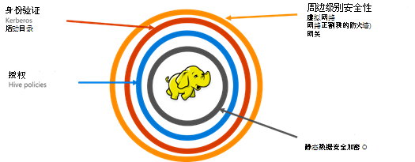

<properties
    pageTitle="安全的 HDInsight 概述 |Microsoft Azure"
    description="学习..."
    services="hdinsight"
    documentationCenter=""
    authors="saurinsh"
    manager="jhubbard"
    editor="cgronlun"
    tags="azure-portal"/>

<tags
    ms.service="hdinsight"
    ms.devlang="na"
    ms.topic="hero-article"
    ms.tgt_pltfrm="na"
    ms.workload="big-data"
    ms.date="10/24/2016"
    ms.author="saurinsh"/>

# 介绍加入域的 HDInsight 群集 （预览）

Azure HDInsight 直到今天支持只有单个用户本地管理员。 这对于较小的应用程序团队或部门处理好。 随着 Hadoop 基础获得了更多的受欢迎程度在企业部门中的工作负载，如身份验证、 多用户的支持和基于角色的访问控制，基于活动目录的企业级功能的需求变得越来越重要。 使用加入域的 HDInsight 群集，您可以创建 HDInsight 群集加入到 Active Directory 域、 配置可以通过 Azure Active Directory 以登录到 HDInsight 群集验证身份从企业员工的列表。 企业外部的任何人都不能登录或访问 HDInsight 群集。 企业管理员可以配置基于角色的访问控制配置单元安全使用[Apache 兵兵](http://hortonworks.com/apache/ranger/)，从而限制到仅为所需的数据的访问。 最后，管理员可以审核由员工，数据访问和访问控制策略，因此可以达到很高的治理及其公司的资源所做的任何更改。

[AZURE.NOTE]> 此预览中所述的新功能是仅适用于基于 Linux 的 HDInsight 群集配置单元工作负载。 工作负荷，例如 HBase、 触发、 风暴和 Kafka，将在未来版本中启用。 

## 优点

企业安全包含四个大支柱 – 周边安全、 身份验证、 授权和加密。

.

### 周边安全

周边安全的 HDInsight 是使用虚拟网络和网关服务来实现的。 如今，企业管理员可以创建 HDInsight 群集在虚拟的网络中并使用网络安全组 （入站或出站防火墙规则） 来限制对虚拟网络的访问。 入站的防火墙规则中定义的 IP 地址将能够与 HDInsight 群集，从而提供周边安全通信。 周边安全的另一层是使用网关服务来实现的。 网关是作为第一防线 HDInsight 群集对任何传入请求的服务。 它接受请求，对它进行验证并仅允许该请求传递给其他节点在群集中，从而提供周边安全到群集中的其他节点名称和数据。

### 身份验证

此公共预览，企业管理员可以设置域加入 HDInsight 群集中，在[虚拟的网络](https://azure.microsoft.com/services/virtual-network/)中。 HDInsight 在群集的节点将被加入到企业管理的域。 这被通过使用[Azure Active Directory 域服务](https://technet.microsoft.com/library/cc770946.aspx)。 在群集中的所有节点都加入到企业管理的域。 在此设置中，企业员工可以登录到群集节点上使用其域凭据。 他们还可以使用其域凭据通过色调、 Ambari 视图、 ODBC、 JDBC，PowerShell 和 REST Api 进行交互与群集等其他批准终结点进行身份验证。 管理员有完全控制与群集通过这些终结点进行交互的用户的数目进行限制。

### 授权

跟大多数企业最佳做法是不是每个雇员都有访问所有企业资源。 同样，使用此版本中，管理员可以定义群集资源的基于角色访问控制策略。 例如，管理员可以配置[Apache 兵兵](http://hortonworks.com/apache/ranger/)设置访问控制策略的配置单元。 此功能可确保雇员能够仅访问尽可能多的数据，因为它们需要在工作中成功。 SSH 访问群集的权限也是仅限于管理员。

### 审核

防止未经授权的用户，HDInsight 群集资源和确保数据的安全，所有访问群集资源和数据的审核有必要跟踪未经授权或意外的资源的访问。 此预览，管理员可以查看和报告给 HDInsight 群集资源和数据的所有访问权限。 管理员还可以查看和访问控制策略在 Apache 兵兵支持终结点中完成对报告的所有更改。 加入域的 HDInsight 群集使用熟悉的 Apache 兵兵 UI 搜索审核日志。 在后端，兵兵用于存储和搜索日志使用[Apache Solr]( http://hortonworks.com/apache/solr/) 。

### 加密

保护数据是非常重要的会议组织的安全和法规遵从性要求，并限制未经授权的员工数据访问，同时它也应该受到保护的加密。 HDInsight 群集，Azure 存储 Blob 和 Azure 数据湖存储数据存储支持透明服务器端[的数据加密](../storage/storage-service-encryption.md)存放。 安全的 HDInsight 群集将无缝地使用此服务器端加密的数据在其余部分能力。

## 下一步行动

- 配置的域加入 HDInsight 群集，请参阅[配置域加入 HDInsight 群集](hdinsight-domain-joined-configure.md)。
- 管理加入域的 HDInsight 群集，请参阅[管理域加入 HDInsight 群集](hdinsight-domain-joined-manage.md)。
- 有关配置配置单元策略和运行配置单元查询，请参阅[用于加入域的 HDInsight 群集配置配置单元的策略](hdinsight-domain-joined-run-hive.md)。
- 运行在加入域的 HDInsight 群集上使用 SSH 的配置单元查询，请参阅[使用 SSH 上从 Linux、 Unix 或 OS X HDInsight 基于 Linux 的 Hadoop 使用](hdinsight-hadoop-linux-use-ssh-unix.md#connect-to-a-domain-joined-hdinsight-cluster)。