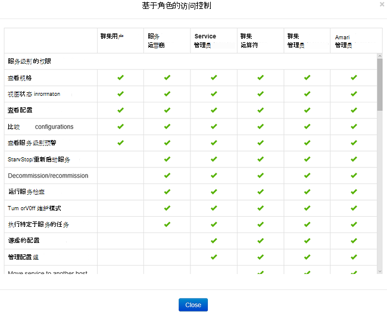
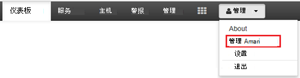
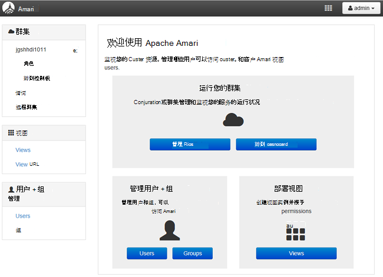
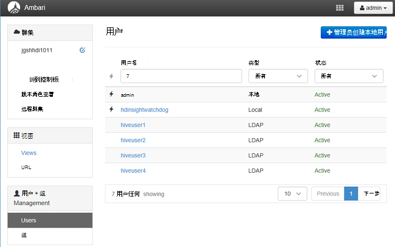
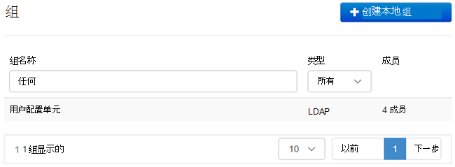
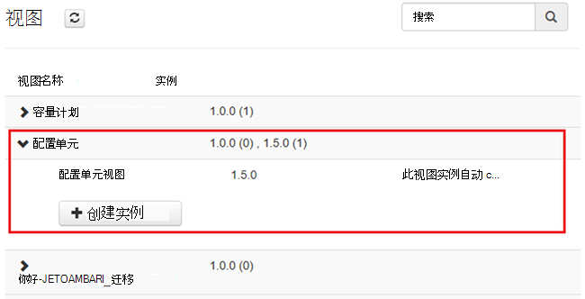
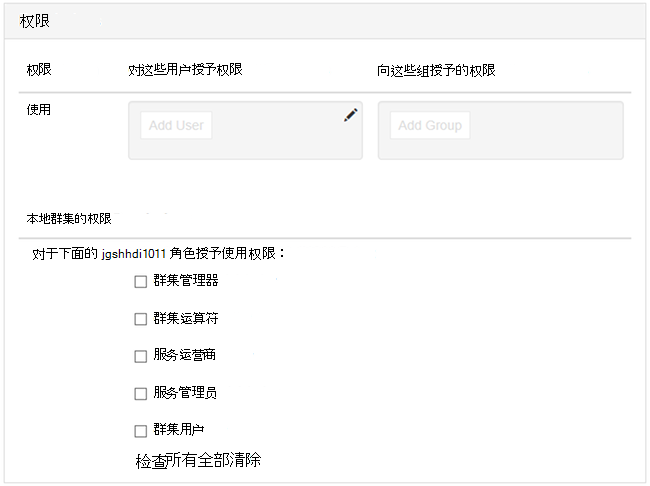

<properties
    pageTitle="管理加入域的 HDInsight 群集 |Microsoft Azure"
    description="了解如何管理加入域的 HDInsight 群集"
    services="hdinsight"
    documentationCenter=""
    authors="saurinsh"
    manager="jhubbard"
    editor="cgronlun"
    tags=""/>

<tags
    ms.service="hdinsight"
    ms.devlang="na"
    ms.topic="article"
    ms.tgt_pltfrm="na"
    ms.workload="big-data"
    ms.date="10/25/2016"
    ms.author="saurinsh"/>

# 管理加入域的 HDInsight 群集 （预览）

了解用户和加入域的 HDInsight，以及如何管理加入域的 HDInsight 群集中的角色。

## 加入域的 HDInsight 群集的用户

没有域联接 HDInsight 群集有两个在群集创建过程中创建的用户帐户︰

- **Ambari 管理**︰ 此帐户也称为*Hadoop 用户*或*HTTP 用户*。 可以使用此帐户登录到 Ambari 以 https://&lt;群集名称 >。 azurehdinsight.net。 它还可以用来运行在 Ambari 视图上的查询、 执行作业通过外部工具 （即 PowerShell Templeton、 Visual Studio），和使用的配置单元的 ODBC 驱动程序和 BI 工具 （即 Excel、 PowerBI 或 Tableau） 进行身份验证。

- **SSH 用户**︰ 该帐户可以使用 SSH，并执行 sudo 命令。 它具有根特权的 Linux 虚拟机。

加入域的 HDInsight 群集有三个新的用户和 Ambari 管理和 SSH 用户。

- **兵兵管理**︰ 此帐户是本地的 Apache 兵兵 admin 帐户。 它不是活动目录域用户。 此帐户可以用于设置策略，并使其他用户管理员或委派的管理员 （以便那些用户可以管理策略）。 默认情况下，用户名是*admin* ，密码是 Ambari 管理员密码相同。 兵兵在设置页中，可以更新的密码。

- **群集管理员域用户**︰ 此帐户被指定为包括 Ambari 和兵兵 Hadoop 群集管理活动目录域用户。 在群集创建过程中，您必须提供此用户的凭据。 此用户具有以下权限︰

    - 将计算机加入到域并将其放置在群集创建过程中指定的 OU 中。
    - 创建服务主体在群集创建过程中指定的 OU 中。 
    - 创建反向 DNS 条目。

    注意其他 AD 用户也具有这些权限。 

    有几点结束群集 (例如，Templeton) 内不受兵兵，也因此是不安全。 这些终结点是群集管理员域用户以外的所有用户都锁定。 

- **常规**︰ 在群集创建过程中，您可以提供多个 active directory 组。 这些组中的用户将被同步到兵兵和 Ambari。 这些用户是域用户，并将有权仅兵兵管理终结点 (例如，Hiveserver2)。 所有的 RBAC 策略和审核将适用于这些用户。

## 加入域的 HDInsight 群集的角色

加入域的 HDInsight 具有下列角色︰

- 群集管理器
- 群集运算符
- 服务管理员
- 服务运营商
- 群集用户

**若要查看这些角色的权限**

1. 打开 Ambari 管理用户界面。  请参阅[打开 Ambari 管理 UI](#open-the-ambari-management-ui)。
2. 从左侧的菜单中，单击**角色**。
3. 请单击蓝色的问号按钮，以查看权限︰

    

## 打开 Ambari 管理用户界面

1. 登录到[Azure 的门户](https://portal.azure.com)。
2. 在刀片式服务器中打开 HDInsight 群集。 请参阅[列表和显示群集](hdinsight-administer-use-management-portal.md#list-and-show-clusters)。
3. 从顶部的菜单打开 Ambari 单击**仪表板**。
4. 登录到 Ambari 使用群集管理员域用户名称和密码。
5. 单击从右上角的**管理**下拉菜单，然后单击**管理 Ambari**。

    

    用户界面如下所示︰

    

## 列出域用户从活动目录同步

1. 打开 Ambari 管理用户界面。  请参阅[打开 Ambari 管理 UI](#open-the-ambari-management-ui)。
2. 从左侧的菜单中，单击**用户**。 您应看到 HDInsight 群集同步活动目录中的所有用户。

    

## 列出从活动目录同步的域组

1. 打开 Ambari 管理用户界面。  请参阅[打开 Ambari 管理 UI](#open-the-ambari-management-ui)。
2. 从左侧的菜单中，单击**组**。 您应看到 HDInsight 群集同步活动目录中的所有组。

    

## 配置配置单元视图权限

1. 打开 Ambari 管理用户界面。  请参阅[打开 Ambari 管理 UI](#open-the-ambari-management-ui)。
2. 从左侧的菜单中，单击**视图**。
3. 单击**配置单元**以显示详细信息。

    

4. 单击**配置单元查看**链接来配置配置单元的视图。
5. 向下滚动到**权限**部分。

    

6. 单击**添加用户**或**添加组**，并指定相应的用户或组可以使用配置单元的视图。 

## 配置用户角色

 若要查看角色及其权限的列表，请参阅[角色的域加入 HDInsight 群集](#roles-of-domain---joined-hdinsight-clusters)。

1. 打开 Ambari 管理用户界面。  请参阅[打开 Ambari 管理 UI](#open-the-ambari-management-ui)。
2. 从左侧的菜单中，单击**角色**。
3. 单击**添加用户**或**添加组**可将用户和组分配给不同的角色。
 
## 下一步行动

- 配置的域加入 HDInsight 群集，请参阅[配置域加入 HDInsight 群集](hdinsight-domain-joined-configure.md)。
- 有关配置配置单元策略和运行配置单元查询，请参阅[用于加入域的 HDInsight 群集配置配置单元的策略](hdinsight-domain-joined-run-hive.md)。
- 运行在加入域的 HDInsight 群集上使用 SSH 的配置单元查询，请参阅[使用 SSH 上从 Linux、 Unix 或 OS X HDInsight 基于 Linux 的 Hadoop 使用](hdinsight-hadoop-linux-use-ssh-unix.md#connect-to-a-domain-joined-hdinsight-cluster)。
