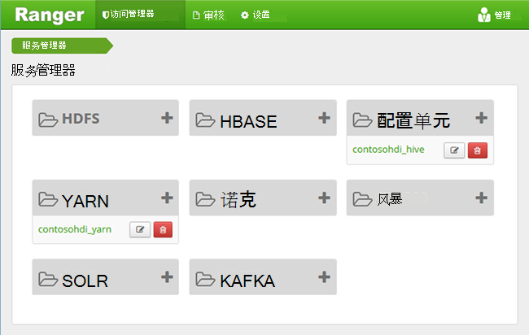
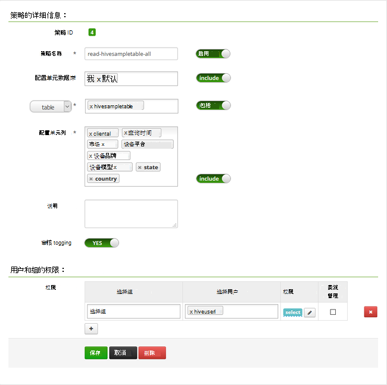

<properties
    pageTitle="在加入域的 HDInsight 配置配置单元策略 |Microsoft Azure"
    description="学习..."
    services="hdinsight"
    documentationCenter=""
    authors="saurinsh"
    manager="jhubbard"
    editor="cgronlun"
    tags="azure-portal"/>

<tags
    ms.service="hdinsight"
    ms.devlang="na"
    ms.topic="hero-article"
    ms.tgt_pltfrm="na"
    ms.workload="big-data"
    ms.date="10/25/2016"
    ms.author="saurinsh"/>

# 在加入域的 HDInsight （预览） 配置配置单元策略

了解如何配置 Apache 兵兵策略配置单元。 在本文中，您将创建两个兵兵策略来限制对 hivesampletable 的访问。 Hivesampletable 带有 HDInsight 群集。 配置完策略后，您使用 Excel 和 ODBC 驱动程序连接到 HDInsight 中的配置单元表。

## 系统必备组件

- 加入域的 HDInsight 群集。 请参阅[配置域加入 HDInsight 群集](hdinsight-domain-joined-configure.md)。
- 与 Office 2016、 Office 2013 专业加、 Office 365 专业人员加上，Excel 2013 独立或 Office 2010 专业版加工作站。

## 连接到 Apache 兵兵管理用户界面

**若要连接到兵兵 Admin UI**

1. 从浏览器连接到兵兵 Admin UI。 URL 是 https://&lt;群集名称 >.azurehdinsight.net/Ranger/。 

    >[AZURE.NOTE] 兵兵使用 Hadoop 群集比不同的凭据。 若要防止浏览器使用 Hadoop 的缓存的凭据，使用 inprivate 浏览器新窗口连接到兵兵 Admin UI。
4. 使用群集管理员域用户名称和密码登录︰

    

    目前，兵兵仅适用于 Yarn 和配置单元。

## 创建域用户

在[配置域加入 HDInsight 群集](hdinsight-domain-joined-configure.md#create-and-configure-azure-ad-ds-for-your-azure-ad)，您创建了 hiveruser1 和 hiveuser2。 在本教程中，您将使用两个用户帐户。

## 创建兵兵策略

在本节中，您将创建用于访问 hivesampletable 两个兵兵策略。 您在另一组列授予 select 权限。 在[配置域加入 HDInsight 群集](hdinsight-domain-joined-configure.md#create-and-configure-azure-ad-ds-for-your-azure-ad)中创建两个用户。  在下一节中，您将测试在 Excel 中的两个策略。

**若要创建兵兵策略**

1. 打开兵兵 Admin UI。 请参阅[连接到 Apache 兵兵 Admin UI](#connect-to-apache-ranager-admin-ui)。
2. 单击**&lt;群集名称 > _hive**，在**配置单元**。 您应看到两个预配置的策略。
3. 单击**添加新策略**，然后输入下面的值︰

    - 策略名称︰ 读取 hivesampletable 全部
    - 配置单元数据库︰ 默认
    - 表︰ hivesampletable
    - 配置单元列: *
    - 选择用户︰ hiveuser1
    - 权限︰ 选择

    .

    >[AZURE.NOTE] 如果未选择用户在填充域用户，稍等片刻的兵兵 AAD 与进行同步。

4. 单击**添加**以保存该策略。
5. 重复最后两个步骤创建另一个策略具有以下属性︰

    - 策略名称︰ 读-hivesampletable-devicemake
    - 配置单元数据库︰ 默认
    - 表︰ hivesampletable
    - 配置单元列︰ 客户机 id，devicemake
    - 选择用户︰ hiveuser2
    - 权限︰ 选择

## 创建配置单元的 ODBC 数据源

[创建配置单元的 ODBC 数据源](hdinsight-connect-excel-hive-odbc-driver.md)中找不到说明进行操作。  

    属性|说明
    ---|---
    数据源名称|为您的数据源名称
    主机|输入&lt;HDInsightClusterName >。 azurehdinsight.net。 例如，myHDICluster.azurehdinsight.net
    端口|使用<strong>443</strong>。 （此端口已从 563 443。）
    数据库|使用<strong>默认值</strong>。
    配置单元服务器类型|选择<strong>配置单元服务器 2</strong>
    机制|选择<strong>Azure HDInsight 服务</strong>
    HTTP 路径|保留为空。
    用户名称|输入hiveuser1@contoso158.onmicrosoft.com。 如果不是，请更新的域名称。
    密码|Hiveuser1 中输入的密码。
    </table>

请确保保存数据源之前，请单击**测试**。

##将数据导入 Excel 从 HDInsight

在最后一节中，您已配置两个策略。  hiveuser1 在所有列上具有 select 权限和 hiveuser2 两个列具有 select 权限。 在本节中，您可以模拟两个用户将数据导入 Excel。

1. 在 Excel 中打开新的或现有的工作簿。
2. 从**数据**选项卡，单击**从其他数据源**，然后单击**来自数据连接向导**，以启动**数据连接向导**。

    ![打开数据连接向导][img 的 hdi-simbahiveodbc.excel.dataconnection]

3. 作为数据源，选择**ODBC DSN** ，然后单击**下一步**。
4. 从 ODBC 数据源，选择您在前面步骤中创建的数据源名称，然后单击**下一步**。
5. 重新输入密码以便在向导中，群集，然后单击**确定**。 等待**选择数据库和表**对话框中打开。 这可能需要几秒钟。
8. 选择**hivesampletable**，，然后单击**下一步**。 
8. 单击**完成**。
9. 在**导入数据**对话框中，您可以更改或指定的查询。 要执行此操作，请单击**属性**。 这可能需要几秒钟。 
10. 单击**定义**选项卡。 命令文本为︰

        SELECT * FROM "HIVE"."default"."hivesampletable"

    由您定义的兵兵策略，hiveuser1 上所有的列具有 select 权限。  因此此查询的工作原理与 hiveuser1 的凭据，但此查询不使用 hiveuser2 的凭据。

    !连接属性[img 的 hdi-simbahiveodbc-excel-connectionproperties]

11. 单击**确定**以关闭连接属性对话框。
12. 单击**确定**以关闭**导入数据**对话框。  
13. 重新输入 hiveuser1，密码，然后单击**确定**。 需要数据获取导入到 Excel 之前的几秒钟。 完成后，您应看到 11 列的数据。

若要测试 (读-hivesampletable-devicemake) 在最后一节中创建的第二个策略

1. 在 Excel 中添加新工作表。
2. 按照导入数据的最后一个步骤。  需要进行的唯一更改是使用 hiveuser2 的凭据，而不是 hiveuser1 的。 这将失败，因为 hiveuser2 仅有权看到两列。 应出现以下错误︰

        [Microsoft][HiveODBC] (35) Error from Hive: error code: '40000' error message: 'Error while compiling statement: FAILED: HiveAccessControlException Permission denied: user [hiveuser2] does not have [SELECT] privilege on [default/hivesampletable/clientid,country ...]'.

3. 按照相同的过程来导入数据。 这一次，使用 hiveuser2 的凭据，并修改 select 语句中︰

        SELECT * FROM "HIVE"."default"."hivesampletable"

    自：

        SELECT clientid, devicemake FROM "HIVE"."default"."hivesampletable"

    完成后，您应看到两个导入的数据的列。

## 下一步行动

- 配置的域加入 HDInsight 群集，请参阅[配置域加入 HDInsight 群集](hdinsight-domain-joined-configure.md)。
- 管理加入域的 HDInsight 群集，请参阅[管理域加入 HDInsight 群集](hdinsight-domain-joined-manage.md)。
- 运行在加入域的 HDInsight 群集上使用 SSH 的配置单元查询，请参阅[使用 SSH 上从 Linux、 Unix 或 OS X HDInsight 基于 Linux 的 Hadoop 使用](hdinsight-hadoop-linux-use-ssh-unix.md#connect-to-a-domain-joined-hdinsight-cluster)。
- 为连接配置单元使用 JDBC 配置单元，请参阅[连接到 Azure HDInsight 使用的配置单元的 JDBC 驱动程序配置单元](hdinsight-connect-hive-jdbc-driver.md)
- 将 Excel 连接到 Hadoop 使用 ODBC 配置单元，请参阅[连接到 Microsoft 配置单元 ODBC 驱动器使用 Hadoop 的 Excel](hdinsight-connect-excel-hive-odbc-driver.md)
- 将 Excel 连接到 Hadoop 使用电源的查询，请参阅[将 Excel 连接到 Hadoop 使用电源查询](hdinsight-connect-excel-power-query.md)