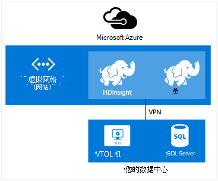

<properties
    pageTitle="扩展虚拟网络与 HDInsight |Microsoft Azure"  
    description="了解如何使用 Azure 虚拟网络连接到其他云资源或在您的数据中心的资源的 HDInsight"
    services="hdinsight"
    documentationCenter=""
    authors="Blackmist"
    manager="jhubbard"
    editor="cgronlun"/>

<tags
   ms.service="hdinsight"
   ms.devlang="na"
   ms.topic="article"
   ms.tgt_pltfrm="na"
   ms.workload="big-data"
   ms.date="10/21/2016"
   ms.author="larryfr"/>


#<a name="extend-hdinsight-capabilities-by-using-azure-virtual-network"></a>通过使用 Azure 虚拟网络扩展 HDInsight 功能

Azure 的虚拟网络，可将 Hadoop 解决方案来结合本地资源，如 SQL Server、 组合多个 HDInsight 群集类型，或创建安全的专用网络之间在云中的资源扩展。

[AZURE.INCLUDE [upgrade-powershell](../../includes/hdinsight-use-latest-powershell-and-cli.md)]


##<a id="whatis"></a>什么是 Azure 虚拟网络？

[Azure 虚拟网络](https://azure.microsoft.com/documentation/services/virtual-network/)允许您创建安全、 持久网络包含针对您的解决方案所需的资源。 虚拟的网络，您可以︰

* 连接在一起在专用网络 （仅云） 云资源。

    

    使用虚拟网络链接使用 Azure HDInsight Azure 服务启用以下方案︰

    * **调用 HDInsight 服务或作业**从 Azure 网站或 Azure 的虚拟机中运行的服务。

    * HDInsight 和 SQL Azure 数据库，SQL Server 或另一个虚拟机上运行的数据存储解决方案之间的**直接数据传输**。

    * 到一个解决方案中**组合多个 HDInsight 服务器**。 HDInsight 群集分为多种类型，分别对应于工作负荷或群集进行的优化的技术。 没有受支持的方法，以创建一个组合多个类型，如风暴和 HBase 在一个群集上的群集。 使用虚拟网络允许多个群集可以直接相互通信。

* 通过使用虚拟专用网络 (VPN) 连接到您的本地数据中心网络 （站点到站点或点到站点） 云资源。

    站点的配置允许您将多个资源从您的数据中心连接到 Azure 的虚拟网络，通过硬件 VPN 或路由和远程访问服务。

    

    点到站点配置允许您通过使用 VPN 软件连接到 Azure 的虚拟网络的特定资源。

    

    使用虚拟网络链接云，您的数据中心，使到仅云配置类似的方案。 但是，而不再局限于使用云中的资源，您还可以使用资源在您的数据中心。

    * HDInsight 和数据中心之间的**直接数据传输**。 一个示例使用 Sqoop 来将 SQL Server 或读取数据生成的业务线 (LOB) 应用程序之间的数据传输。

    * **调用 HDInsight 服务或作业**从 LOB 应用程序。 一个示例使用 HBase Java Api 来存储和检索数据来自 HDInsight HBase 群集。

虚拟网络的功能、 好处和功能的详细信息，请参阅[Azure 虚拟网络概述](../virtual-network/virtual-networks-overview.md)。

> [AZURE.NOTE] 资源调配 HDInsight 群集之前，必须创建 Azure 的虚拟网络。 有关详细信息，请参阅[虚拟网络配置任务](https://azure.microsoft.com/documentation/services/virtual-network/)。

## <a name="virtual-network-requirements"></a>虚拟的网络要求

> [AZURE.IMPORTANT] 在虚拟网络上创建一个 HDInsight 群集要求特定的虚拟网络配置，此部分所述。

###<a name="location-based-virtual-networks"></a>基于位置的虚拟网络

Azure HDInsight 支持仅基于位置的虚拟网络，并且当前不使用基于相似性组的虚拟网络。

###<a name="classic-or-v2-virtual-network"></a>经典或 v2 的虚拟网络

基于 Windows 群集需要经典的虚拟网络，而基于 Linux 的群集需要 Azure 资源管理器的虚拟网络。 如果您没有正确的网络类型，它将不能使用时创建群集。

如果您具有不可用的计划创建的群集的虚拟网络上的资源，可以创建新的虚拟网络使用群集，并将其连接到兼容的虚拟网络。 然后可以创建群集，它需要，网络版中，它将能访问另一网络中的资源因为两个相连。 有关连接的新的和经典的虚拟网络的详细信息，请参阅[连接到新的 VNets 的经典 VNets](../vpn-gateway/vpn-gateway-connect-different-deployment-models-portal.md)。

###<a name="custom-dns"></a>自定义 DNS

当创建虚拟网络时，Azure Azure 服务，如 HDInsight 安装在网络中提供默认名称解析。 但是，您可能需要使用您的域名系统 (DNS) 如网络域名解析交叉的情况下。 例如，位于两个服务之间进行通讯时加入虚拟网络。 HDInsight 支持同时默认 Azure 的名称解析，以及自定义的 DNS 使用 Azure 虚拟网络。

在 Azure 虚拟网络中使用 DNS 服务器的详细信息，请参阅__使用 DNS 服务器的名称解析__部分中[的虚拟机和角色实例名称解析](../virtual-network/virtual-networks-name-resolution-for-vms-and-role-instances.md#name-resolution-using-your-own-dns-server)文档。

###<a name="secured-virtual-networks"></a>受保护的虚拟网络

HDInsight 服务是一个托管的服务，并在资源调配过程中和运行时需要访问互联网。 因此该 Azure 可以监控其运行状况的群集中，这是启动故障转移群集资源，请更改群集中的通过缩放操作，以及其他管理任务中的节点数。

如果您需要将 HDInsight 安装到受保护的虚拟网络，您必须通过端口 443 的下面的 IP 地址，允许 Azure HDInsight 群集进行管理允许入站的访问。

* 168.61.49.99
* 23.99.5.239
* 168.61.48.131
* 138.91.141.162

允许这些地址从端口 443 入站访问权限可以成功安装到了一个安全的虚拟网络的 HDInsight。

> [AZURE.IMPORTANT] HDInsight 不支持限制出站通信流，仅入站通信。 在定义包含 HDInsight 的子网的网络安全组规则时，只使用入站的规则。

下面的示例演示如何创建一个新的网络安全组允许所需的地址，并将安全组应用到虚拟网络内的子网。 这些步骤假定已创建您想要安装到的 HDInsight 的虚拟网络和子网。

__使用 Azure PowerShell__

    $vnetName = "Replace with your virtual network name"
    $resourceGroupName = "Replace with the resource group the virtual network is in"
    $subnetName = "Replace with the name of the subnet that HDInsight will be installed into"
    # Get the Virtual Network object
    $vnet = Get-AzureRmVirtualNetwork `
        -Name $vnetName `
        -ResourceGroupName $resourceGroupName
    # Get the region the Virtual network is in.
    $location = $vnet.Location
    # Get the subnet object
    $subnet = $vnet.Subnets | Where-Object Name -eq $subnetName
    # Create a new Network Security Group.
    # And add exemptions for the HDInsight health and management services.
    $nsg = New-AzureRmNetworkSecurityGroup `
        -Name "hdisecure" `
        -ResourceGroupName $resourceGroupName `
        -Location $location `
        | Add-AzureRmNetworkSecurityRuleConfig `
            -name "hdirule1" `
            -Description "HDI health and management address 168.61.49.99" `
            -Protocol "*" `
            -SourcePortRange "*" `
            -DestinationPortRange "443" `
            -SourceAddressPrefix "168.61.49.99" `
            -DestinationAddressPrefix "VirtualNetwork" `
            -Access Allow `
            -Priority 300 `
            -Direction Inbound `
        | Add-AzureRmNetworkSecurityRuleConfig `
            -Name "hdirule2" `
            -Description "HDI health and management 23.99.5.239" `
            -Protocol "*" `
            -SourcePortRange "*" `
            -DestinationPortRange "443" `
            -SourceAddressPrefix "23.99.5.239" `
            -DestinationAddressPrefix "VirtualNetwork" `
            -Access Allow `
            -Priority 301 `
            -Direction Inbound `
        | Add-AzureRmNetworkSecurityRuleConfig `
            -Name "hdirule3" `
            -Description "HDI health and management 168.61.48.131" `
            -Protocol "*" `
            -SourcePortRange "*" `
            -DestinationPortRange "443" `
            -SourceAddressPrefix "168.61.48.131" `
            -DestinationAddressPrefix "VirtualNetwork" `
            -Access Allow `
            -Priority 302 `
            -Direction Inbound `
        | Add-AzureRmNetworkSecurityRuleConfig `
            -Name "hdirule4" `
            -Description "HDI health and management 138.91.141.162" `
            -Protocol "*" `
            -SourcePortRange "*" `
            -DestinationPortRange "443" `
            -SourceAddressPrefix "138.91.141.162" `
            -DestinationAddressPrefix "VirtualNetwork" `
            -Access Allow `
            -Priority 303 `
            -Direction Inbound
    # Set the changes to the security group
    Set-AzureRmNetworkSecurityGroup -NetworkSecurityGroup $nsg
    # Apply the NSG to the subnet
    Set-AzureRmVirtualNetworkSubnetConfig `
        -VirtualNetwork $vnet `
        -Name $subnetName `
        -AddressPrefix $subnet.AddressPrefix `
        -NetworkSecurityGroupId $nsg

__使用 Azure CLI__

1. 使用下面的命令来创建新的网络安全组名为`hdisecure`。 __RESOURCEGROUPNAME__和__位置__替换为包含 Azure 虚拟网络和在创建组的位置 （区域），该资源组。

        azure network nsg create RESOURCEGROUPNAME hdisecure LOCATION
    
    创建组后，您将收到新组的信息。 查找类似于下面的行并保存`/subscriptions/GUID/resourceGroups/RESOURCEGROUPNAME/providers/Microsoft.Network/networkSecurityGroups/hdisecure`的信息。 将在后面的步骤中使用它。
    
        data:    Id                              : /subscriptions/GUID/resourceGroups/RESOURCEGROUPNAME/providers/Microsoft.Network/networkSecurityGroups/hdisecure

2. 使用以下方法来添加新的网络安全组允许从 Azure HDInsight 健康和管理服务的端口 443 上的入站的通信规则。 __RESOURCEGROUPNAME__替换为包含 Azure 虚拟网络的资源组的名称。

        azure network nsg rule create RESOURCEGROUPNAME hdisecure hdirule1 -p "*" -o "*" -u "443" -f "168.61.49.99" -e "VirtualNetwork" -c "Allow" -y 300 -r "Inbound"
        azure network nsg rule create RESOURCEGROUPNAME hdisecure hdirule2 -p "*" -o "*" -u "443" -f "23.99.5.239" -e "VirtualNetwork" -c "Allow" -y 301 -r "Inbound"
        azure network nsg rule create RESOURCEGROUPNAME hdisecure hdirule3 -p "*" -o "*" -u "443" -f "168.61.48.131" -e "VirtualNetwork" -c "Allow" -y 302 -r "Inbound"
        azure network nsg rule create RESOURCEGROUPNAME hdisecure hdirule4 -p "*" -o "*" -u "443" -f "138.91.141.162" -e "VirtualNetwork" -c "Allow" -y 303 -r "Inbound"

3. 一旦已经创建了规则，使用以下方法来将新的网络安全组应用到的子网。 __RESOURCEGROUPNAME__替换为包含 Azure 虚拟网络的资源组的名称。 __VNETNAME__和__SUBNETNAME__替换为 Azure 虚拟网络和安装 HDInsight 时将使用的子网的名称。

        azure network vnet subnet set RESOURCEGROUPNAME VNETNAME SUBNETNAME -w "/subscriptions/GUID/resourceGroups/RESOURCEGROUPNAME/providers/Microsoft.Network/networkSecurityGroups/hdisecure"
    
    完成此命令后，您成功可以安装到受保护的虚拟网络上在以下步骤中使用的子网 HDInsight。

> [AZURE.IMPORTANT] 在 Azure 的云上使用上述步骤仅开放访问 HDInsight 健康和管理服务。 这允许您成功安装 HDInsight 群集子网，但是从 HDInsight 群集虚拟网络外部访问被阻止默认。 您需要添加其他网络安全组的规则，如果您想要启用从虚拟网络外部进行访问。
>
> 例如，若要从互联网允许 SSH 访问，并将需要添加类似于下面的规则︰ 
>
> * Azure PowerShell 的```Add-AzureRmNetworkSecurityRuleConfig -Name "SSSH" -Description "SSH" -Protocol "*" -SourcePortRange "*" -DestinationPortRange "22" -SourceAddressPrefix "*" -DestinationAddressPrefix "VirtualNetwork" -Access Allow -Priority 304 -Direction Inbound```
> * Azure CLI —```azure network nsg rule create RESOURCEGROUPNAME hdisecure hdirule4 -p "*" -o "*" -u "22" -f "*" -e "VirtualNetwork" -c "Allow" -y 304 -r "Inbound"```

网络安全组的详细信息，请参阅[网络安全组概述](../virtual-network/virtual-networks-nsg.md)。 有关控制 Azure 虚拟网络中的路由选择的信息，请参阅[用户定义的路由和 IP 转发](../virtual-network/virtual-networks-udr-overview.md)。

##<a id="tasks"></a>任务和信息

本部分包含常见任务的信息和虚拟的网络中使用 HDInsight 时，您可能需要的信息。

###<a name="determine-the-fqdn"></a>确定 FQDN

HDInsight 群集将被分配的虚拟网络接口特定完全合格的域名称 (FQDN)。 这是连接到群集中虚拟的网络上的其他资源时，应使用的地址。 要确定 FQDN，请使用以下 URL 查询 Ambari 管理服务︰

    https://<clustername>.azurehdinsight.net/ambari/api/v1/clusters/<clustername>.azurehdinsight.net/services/<servicename>/components/<componentname>

> [AZURE.NOTE] 在 Ambari 中使用 HDInsight 的详细信息，请参阅[监视 Hadoop 群集中使用 Ambari API 的 HDInsight](hdinsight-monitor-use-ambari-api.md)。

必须指定群集名称、 服务和群集，如 YARN 资源管理器上运行的组件。

> [AZURE.NOTE] 返回的数据是信息的 JavaScript 对象符号 (JSON) 文档，其中包含了大量有关组件。 要提取只 FQDN，应使用 JSON 解析器来检索`host_components[0].HostRoles.host_name`值。

例如，若要返回从 HDInsight Hadoop 群集的 FQDN，可用于以下方法之一 YARN 资源管理器中检索数据︰

* [Azure PowerShell](../powershell-install-configure.md)

        $ClusterDnsName = <clustername>
        $Username = <cluster admin username>
        $Password = <cluster admin password>
        $DnsSuffix = ".azurehdinsight.net"
        $ClusterFQDN = $ClusterDnsName + $DnsSuffix

        $webclient = new-object System.Net.WebClient
        $webclient.Credentials = new-object System.Net.NetworkCredential($Username, $Password)

        $Url = "https://" + $ClusterFQDN + "/ambari/api/v1/clusters/" + $ClusterFQDN + "/services/yarn/     components/resourcemanager"
        $Response = $webclient.DownloadString($Url)
        $JsonObject = $Response | ConvertFrom-Json
        $FQDN = $JsonObject.host_components[0].HostRoles.host_name
        Write-host $FQDN

* [弯曲](http://curl.haxx.se/)和[jq](http://stedolan.github.io/jq/)

        curl -G -u <username>:<password> https://<clustername>.azurehdinsight.net/ambari/api/v1/clusters/<clustername>.azurehdinsight.net/services/yarn/components/resourcemanager | jq .host_components[0].HostRoles.host_name

###<a name="connecting-to-hbase"></a>连接到 HBase

远程连接到 HBase 使用 Java API，您必须确定 HBase 群集 ZooKeeper 仲裁地址并指定此应用程序中。

要获取 ZooKeeper 仲裁地址，请使用以下方法之一来查询 Ambari 管理服务︰

* [Azure PowerShell](../powershell-install-configure.md)

        $ClusterDnsName = <clustername>
        $Username = <cluster admin username>
        $Password = <cluster admin password>
        $DnsSuffix = ".azurehdinsight.net"
        $ClusterFQDN = $ClusterDnsName + $DnsSuffix

        $webclient = new-object System.Net.WebClient
        $webclient.Credentials = new-object System.Net.NetworkCredential($Username, $Password)

        $Url = "https://" + $ClusterFQDN + "/ambari/api/v1/clusters/" + $ClusterFQDN + "/configurations?type=hbase-site&tag=default&fields=items/properties/hbase.zookeeper.quorum"
        $Response = $webclient.DownloadString($Url)
        $JsonObject = $Response | ConvertFrom-Json
        Write-host $JsonObject.items[0].properties.'hbase.zookeeper.quorum'

* [弯曲](http://curl.haxx.se/)和[jq](http://stedolan.github.io/jq/)

        curl -G -u <username>:<password> "https://<clustername>.azurehdinsight.net/ambari/api/v1/clusters/<clustername>.azurehdinsight.net/configurations?type=hbase-site&tag=default&fields=items/properties/hbase.zookeeper.quorum" | jq .items[0].properties[]

> [AZURE.NOTE] 在 Ambari 中使用 HDInsight 的详细信息，请参阅[监视 Hadoop 群集中使用 Ambari API 的 HDInsight](hdinsight-monitor-use-ambari-api.md)。

一旦仲裁信息，则客户端应用程序中使用它。

例如，对于使用 HBase API 的 Java 应用程序，将**hbase site.xml**文件添加到项目并指定仲裁信息文件中，如下所示︰

```
<configuration>
  <property>
    <name>hbase.cluster.distributed</name>
    <value>true</value>
  </property>
  <property>
    <name>hbase.zookeeper.quorum</name>
    <value>zookeeper0.address,zookeeper1.address,zookeeper2.address</value>
  </property>
  <property>
    <name>hbase.zookeeper.property.clientPort</name>
    <value>2181</value>
  </property>
</configuration>
```

###<a name="verify-network-connectivity"></a>验证网络连接性

某些服务，例如，SQL Server 可以将传入的网络连接限制。 这将防止 HDInsight 成功地使用这些服务。

如果您遇到从 HDInsight 访问服务时出现问题，请咨询服务，以确保您已启用了网络访问的文档。 您可以通过创建相同的虚拟网络，Azure 的虚拟机来验证网络访问和使用客户端实用程序来验证该虚拟机可以连接到该服务在虚拟的网络上。

##<a id="nextsteps"></a>下一步行动

下面的示例演示如何使用 HDInsight Azure 虚拟网络︰

* [分析传感器数据与风暴和 HBase 中 HDInsight](hdinsight-storm-sensor-data-analysis.md) -演示如何配置在虚拟网络中，风暴和 HBase 群集，以及如何从风暴向 HBase 远程写入数据。

* [在 HDInsight 中的提供 Hadoop 群集](hdinsight-hadoop-provision-linux-clusters.md)-提供有关配置 Hadoop 群集，包括使用 Azure 虚拟网络信息的信息。

* [使用 Sqoop 与 HDInsight 在 Hadoop](hdinsight-use-sqoop-mac-linux.md) -提供有关使用 Sqoop 与 SQL Server 通过虚拟网络的数据传输。

若要了解有关 Azure 的虚拟网络的详细信息，请参阅[Azure 虚拟网络概述](../virtual-network/virtual-networks-overview.md)。
