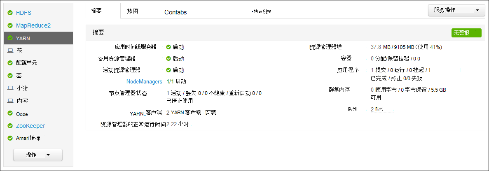
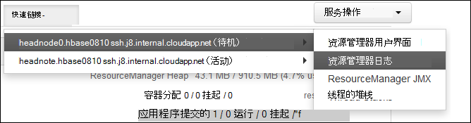

<properties
    pageTitle="访问 Hadoop YARN 应用程序登录基于 Linux 的 HDInsight |Microsoft Azure"
    description="了解如何访问 YARN 上使用命令行和 web 浏览器的基于 Linux 的 HDInsight (Hadoop) 群集的应用程序日志。"
    services="hdinsight"
    documentationCenter=""
    tags="azure-portal"
    authors="Blackmist" 
    manager="jhubbard"
    editor="cgronlun"/>

<tags
    ms.service="hdinsight"
    ms.workload="big-data"
    ms.tgt_pltfrm="na"
    ms.devlang="na"
    ms.topic="article"
    ms.date="10/21/2016"
    ms.author="larryfr"/>

# 在基于 Linux 的 HDInsight 登录访问 YARN 应用程序 

本文档说明如何访问 YARN （尚未另一个资源谈判者） 完 Azure HDInsight 在 Hadoop 群集的应用程序的日志。

> [AZURE.NOTE] 此文档中的信息是特定于基于 Linux 的 HDInsight 群集。 在基于 Windows 群集上的信息，请参阅[访问 YARN 应用程序登录基于 Windows HDInsight](hdinsight-hadoop-access-yarn-app-logs.md)

## 系统必备组件

* 基于 linux * 的 HDInsight 群集。

* 您可以访问 ResourceManager 日志 web 用户界面之前，必须[创建 SSH 隧道](hdinsight-linux-ambari-ssh-tunnel.md)。

## YARN 日程表服务器

[YARN 日程表服务器](http://hadoop.apache.org/docs/r2.4.0/hadoop-yarn/hadoop-yarn-site/TimelineServer.html)上已完成的应用程序以及特定于框架的应用程序信息，通过两个不同的接口提供一般信息。 具体来说︰

* HDInsight 群集的一般应用程序信息的存储和检索已启用版本 3.1.1.374 或更高版本。
* 时间线服务器的特定于框架的应用程序信息组件当前不可用 HDInsight 群集上。

应用程序的通用信息包括以下类型的数据︰

* 应用程序 ID，而应用程序的唯一标识符
* 启动应用程序的用户
* 尝试完成应用程序的信息
* 任何给定的应用程序尝试使用容器

## YARN 应用程序和日志

YARN 通过将资源管理的应用程序时间安排/监视支持多个编程模型 (MapReduce 是其中之一)。 这是通过全局*ResourceManager* (RM)、 每个工作节点*NodeManagers* (NMs) 和每个应用程序*ApplicationMasters* (AMs)。 每个应用程序上午协商资源 （CPU、 内存、 磁盘） 网络安装与运行您的应用程序 RM 使用 NMs 授予这些资源作为*容器*授予工作。 上午负责跟踪进度的 rm 分配给它的容器 应用程序可能需要很多的容器，这取决于应用程序的性质。

此外，每个应用程序可能包含多个*应用程序尝试*为完成存在崩溃时或由于上午之间的通信丢失和 rm。 因此，容器授予应用程序的具体尝试。 在某种意义上，容器提供的上下文 YARN 应用程序，执行工作的基本单位，在容器的上下文中完成的所有工作都执行单个辅助节点分配给该容器上。 请参阅[YARN 概念][YARN-concepts]供进一步参考。

应用程序日志 （和关联的容器日志） 中调试问题的 Hadoop 应用程序至关重要。 YARN 提供了一个很好的框架，用于收集、 聚合和存储与[日志聚合]应用程序日志[log-aggregation]功能。 日志聚合功能使访问应用程序日志更具有确定性，因为它在辅助节点上的所有容器聚合日志并将它们存储为一个聚合日志文件每个工作节点上的默认文件系统中，应用程序完成之后。 您的应用程序可能使用数百或数千的容器，但总是会聚集到一个文件中，从而导致每个应用程序所使用的辅助节点的一个日志文件的日志中的所有单个辅助节点上运行的容器。 默认情况下，对 HDInsight 群集启用日志聚合 (版本 3.0 及以上)，和聚合的日志可以在位于以下位置的群集的默认容器中找到︰

    wasbs:///app-logs/<user>/logs/<applicationId>

在该位置，*用户*启动该应用程序的用户的名称，并且*applicationId* YARN rm 指派的应用程序的唯一标识符

聚合的日志不是直接可读的因为它们用[TFile]编写[T-file]，[二进制格式][binary-format]按容器进行索引。 您必须使用 YARN ResourceManager 日志或 CLI 工具来查看这些日志以纯文本格式的应用程序或感兴趣的容器。 

##YARN CLI 工具

若要使用 YARN CLI 工具，您必须首先连接到 HDInsight 群集使用 SSH。 使用以下文档之一在 HDInsight 中使用 SSH 的信息︰

- [HDInsight 从 Linux、 Unix 或 OS X 上的基于 Linux 的 Hadoop 使用 SSH](hdinsight-hadoop-linux-use-ssh-unix.md)

- [在从 Windows HDInsight 基于 Linux 的 Hadoop 使用 SSH](hdinsight-hadoop-linux-use-ssh-windows.md)
    
您可以通过运行以下命令之一以纯文本格式查看这些日志︰

    yarn logs -applicationId <applicationId> -appOwner <user-who-started-the-application>
    yarn logs -applicationId <applicationId> -appOwner <user-who-started-the-application> -containerId <containerId> -nodeAddress <worker-node-address>
    
必须指定&lt;applicationId >，&lt;用户-用户-开始--应用程序 >， &lt;containerId >，并和 ltworker 节点地址 > 运行这些命令时的信息。

##YARN ResourceManager UI

YARN ResourceManager UI 运行在群集 headnode 中，并可以通过 Ambari web 用户界面;但是，您必须[创建 SSH 隧道](hdinsight-linux-ambari-ssh-tunnel.md)第一才能访问 ResourceManager UI。

创建 SSH 隧道后，使用以下步骤查看 YARN 日志︰

1. 在 web 浏览器中，导航到 https://CLUSTERNAME.azurehdinsight.net。 群集名称替换 HDInsight 群集的名称。

2. 从左侧的服务列表中，选择__YARN__。

    

3. 从__快速链接__下拉列表中，选择一个群集的头节点，然后选择__ResourceManager 日志__。

    
    
    您将看到 YARN 日志的链接的列表。

[YARN-timeline-server]:http://hadoop.apache.org/docs/r2.4.0/hadoop-yarn/hadoop-yarn-site/TimelineServer.html
[log-aggregation]:http://hortonworks.com/blog/simplifying-user-logs-management-and-access-in-yarn/
[T-file]:https://issues.apache.org/jira/secure/attachment/12396286/TFile%20Specification%2020081217.pdf
[binary-format]:https://issues.apache.org/jira/browse/HADOOP-3315
[YARN-concepts]:http://hortonworks.com/blog/apache-hadoop-yarn-concepts-and-applications/
