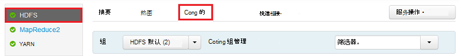
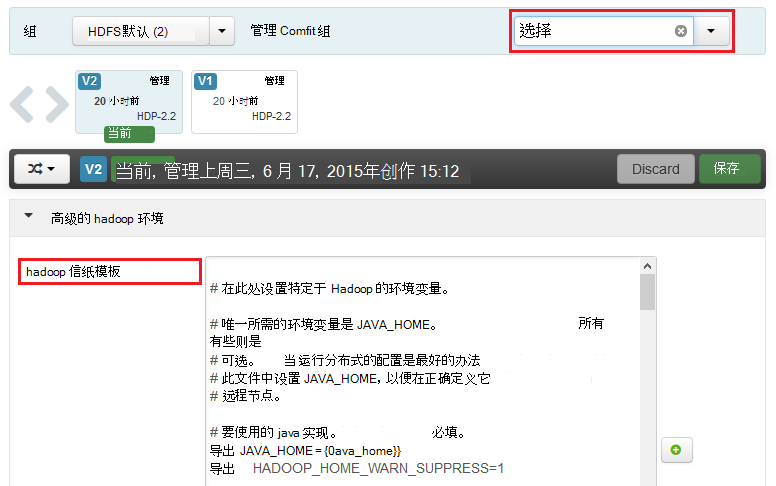
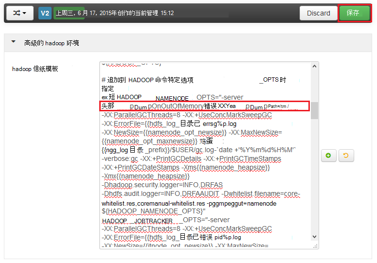
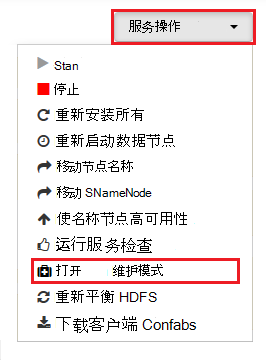

<properties
    pageTitle="启用在 HDInsight 上的 Hadoop 服务的堆转储 |Microsoft Azure"
    description="启用对 Hadoop 的基于 Linux 的 HDInsight 群集服务为调试和分析堆转储。"
    services="hdinsight"
    documentationCenter=""
    authors="Blackmist"
    manager="jhubbard"
    editor="cgronlun"
    tags="azure-portal"/>

<tags
    ms.service="hdinsight"
    ms.workload="big-data"
    ms.tgt_pltfrm="na"
    ms.devlang="na"
    ms.topic="article"
    ms.date="09/27/2016"
    ms.author="larryfr"/>

#启用基于 Linux 的 HDInsight （预览） 上的 Hadoop 服务的堆转储

[AZURE.INCLUDE [heapdump-selector](../../includes/hdinsight-selector-heap-dump.md)]

堆转储包含应用程序的内存，包括创建转储的时间变量的值的一个快照。 因此，它们是非常有用的诊断在运行时出现的问题。

> [AZURE.NOTE] 这篇文章中的信息仅适用于基于 Linux 的 HDInsight。 在基于 Windows 的 HDInsight 上的信息，请参阅[启用 Hadoop 服务的基于 Windows 的 HDInsight 上的堆转储](hdinsight-hadoop-collect-debug-heap-dumps.md)

## 服务

您可以启用下列服务的堆转储︰

*  **hcatalog** -tempelton
*  **配置单元**-hiveserver2、 metastore、 derbyserver
*  **mapreduce** -jobhistoryserver
*  **yarn** -resourcemanager、 nodemanager、 timelineserver
*  **hdfs** -datanode、 secondarynamenode、 namenode

此外可以启用映射的堆转储，并减少进程运行的 HDInsight。

## 了解堆转储配置

通过传递选项启用了堆转储 (有时也称为选择，或参数) 到 JVM 时启动服务。 对于大多数的 Hadoop 服务，这可以通过修改用来启动服务的 shell 脚本来实现。

在每个脚本中，为导出的**\* \_OPTS**，它包含传递给 JVM 的选项。 例如，在**hadoop env.sh**脚本中，行的开头`export HADOOP_NAMENODE_OPTS=`包含 NameNode 服务的选项。

映射和减少过程会稍有不同，因为这些子流程的 MapReduce 服务。 每个映射或降低进程运行在某个子容器，并有两个条目，包含这些 JVM 选项。 同时**mapred site.xml**中包含︰

* **mapreduce.admin.map.child.java.opts**
* **mapreduce.admin.reduce.child.java.opts**

> [AZURE.NOTE] 我们建议使用 Ambari 来修改脚本和 mapred site.xml 的设置，如 Ambari 将处理在群集中的节点间复制更改。 请参见[使用 Ambari](#using-ambari)的具体步骤。

###启用堆转储

发生内存不足错误发生时，下面的选项使堆转储︰

    -XX:+HeapDumpOnOutOfMemoryError

**+**表示此选项已启用。 默认值被禁用。

> [AZURE.WARNING] 堆转储不上 HDInsight 的 Hadoop 服务默认启用的如转储文件可能很大。 如果它们启用的疑难解答，请记住重现问题并收集转储文件后将其禁用。

###转储位置

转储文件的默认位置是当前工作目录。 您可以控制位置存储该文件使用以下选项︰

    -XX:HeapDumpPath=/path

例如，使用`-XX:HeapDumpPath=/tmp`将导致在 /tmp 目录中存储这些转储。

###脚本

**发生内存不足错误**发生时，也会触发脚本。 例如，触发通知，以便知道将发生错误。 这被控制使用以下选项︰

    -XX:OnOutOfMemoryError=/path/to/script

> [AZURE.NOTE] 因为 Hadoop 是一个分布式的系统，必须在服务运行在群集中所有节点上放置使用任何脚本。
>
> 该脚本必须也是由该服务运行，并且必须提供的帐户可以访问的位置执行权限。 例如，您可能希望存储在脚本`/usr/local/bin`，并使用`chmod go+rx /usr/local/bin/filename.sh`授予读取和执行权限。

##使用 Ambari

若要修改的配置服务，请使用以下步骤︰

1. 打开群集 Ambari web 用户界面。 该 URL 将是 https://YOURCLUSTERNAME.azurehdinsight.net。

    出现提示时，将验证到使用 HTTP 帐户名的网站 (默认︰ admin) 和您的群集的密码。

    > [AZURE.NOTE] 您可能会提示您第二次通过 Ambari 的用户名称和密码。 如果是这样，只需要重新输入相同的帐户名和密码

2. 使用左侧的列表中的，选择您要修改的服务区域。 例如， **HDFS**。 在中心区域中，选择**配置**选项卡。

    

3. 使用**筛选器**条目时，输入**选择**。 这将筛选为只包含此文本，配置项的列表，查找 shell 脚本或**模板**，可用来设置这些选项的快速方法。

    

4. 发现**\* \_OPTS**服务输入您想要启用堆转储，然后添加您想要启用的选项。 在下面的图像中，我添加了`-XX:+HeapDumpOnOutOfMemoryError -XX:HeapDumpPath=/tmp/`到**HADOOP\_NAMENODE\_OPTS**条目︰

    

    > [AZURE.NOTE] 当启用堆转储地图或减少子进程时，将改为查找字段标**mapreduce.admin.map.child.java.opts**和**mapreduce.admin.reduce.child.java.opts**。

    使用**保存**按钮保存所做的更改。 您将能够输入短信描述所做的更改。

5. 一旦应用了这些更改后，**重新启动所需**的图标将出现旁边一个或多个服务。

    

6. 选择每个服务需要重新启动计算机，并使用**在维护模式下打开**该**服务的操作**按钮。 这可以防止您在重新启动时从该服务生成警报。

    

7. 一旦您已经启用了维护模式，使用**重新启动**按钮**重新启动所有受影响**的服务

    

    > [AZURE.NOTE] **重新启动**按钮的条目可能会为其他服务不同。

8. 一旦重新启动服务后，使用**服务操作**按钮来**关闭维护模式**。 该 Ambari 继续监视警报服务。
