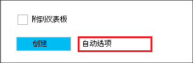

<properties
   pageTitle="HDInsight 使用 Azure 资源管理器模板在创建基于 Linux 的 Hadoop 群集 |Microsoft Azure"
    description="了解如何为 Azure HDInsight 使用 Azure Azure 资源管理器模板创建群集。"
   services="hdinsight"
   documentationCenter=""
   tags="azure-portal"
   authors="mumian"
   manager="jhubbard"
   editor="cgronlun"/>

<tags
   ms.service="hdinsight"
   ms.devlang="na"
   ms.topic="article"
   ms.tgt_pltfrm="na"
   ms.workload="big-data"
   ms.date="09/02/2016"
   ms.author="jgao"/>

# HDInsight 使用 Azure 资源管理器模板在创建基于 Linux 的 Hadoop 群集

[AZURE.INCLUDE [selector](../../includes/hdinsight-selector-create-clusters.md)]

了解如何创建 HDInsight 群集使用 Azure 资源 Manager(ARM) 模板。 有关详细信息，请参阅[部署了 Azure 资源管理器模板的应用程序](../resource-group-template-deploy.md)。 其他群集创建工具和功能单击此页面顶部选项卡中的选择或者查看[群集创建方法](hdinsight-provision-clusters.md#cluster-creation-methods)。

##系统必备组件︰

[AZURE.INCLUDE [delete-cluster-warning](../../includes/hdinsight-delete-cluster-warning.md)]

在开始这篇文章中的说明操作之前，必须具有下列︰

- [Azure 的订阅](https://azure.microsoft.com/documentation/videos/get-azure-free-trial-for-testing-hadoop-in-hdinsight/)。
- Azure PowerShell 和/或 Azure CLI

    [AZURE.INCLUDE [use-latest-version](../../includes/hdinsight-use-latest-powershell-and-cli.md)]

### 访问控制要求

[AZURE.INCLUDE [access-control](../../includes/hdinsight-access-control-requirements.md)]

## 资源管理器模板

资源管理器模板轻松地为您的应用程序在单一的协调操作中创建 HDInsight 群集、 及其依赖的资源 （如默认存储帐户） 和其他资源 （例如，要使用 Apache Sqoop Azure SQL 数据库）。 在模板中，您定义应用程序所需的资源，并指定部署参数输入不同的环境的值。 模板包含 JSON 和您可以使用它来构建您的部署的值的表达式。

用于创建 HDInsight 群集和从属的 Azure 存储帐户的资源管理器模板可在[附录 A](#appx-a-arm-template)。 使用跨平台[VSCode](https://code.visualstudio.com/#alt-downloads)与[资源管理器扩展](https://marketplace.visualstudio.com/items?itemName=msazurermtools.azurerm-vscode-tools)或文本编辑器，可以将该模板保存到您的工作站上的文件。 您将学习如何调用模板使用不同的方法。

有关资源管理器模板的详细信息，请参阅

- [作者 Azure 资源管理器模板](../resource-group-authoring-templates.md)
- [将与 Azure 资源管理器模板的应用程序部署](../resource-group-template-deploy.md)

若要查找特定元素的 JSON 架构，您可以按照下面的过程︰

1. 打开[Azure 门户](https://porta.azure.com)创建一个 HDInsight 的群集。  [HDInsight 使用 Azure 门户中的创建 Linux 基于群集](hdinsight-hadoop-create-linux-clusters-portal.md)，请参阅。
2. 配置所需的元素，以及所需的 JSON 架构元素。
3. 单击**创建**，然后单击**自动化选项**下面的屏幕快照中所示︰

    

    门户将创建基于您的配置的资源管理器模板。
## 使用 PowerShell 部署

下面的过程将创建基于 Linux 的 HDInsight 群集。

**部署群集使用资源管理器模板**

1. 在[附录 A](#appx-a-arm-template)中 json 文件保存到您的工作站。 PowerShell 脚本中的文件的名称是*C:\HDITutorials-ARM\hdinsight-arm-template.json*。
2. 如果需要，设置的参数和变量。
3. 运行使用以下 PowerShell 脚本的模板︰

        ####################################
        # Set these variables
        ####################################
        #region - used for creating Azure service names
        $nameToken = "<Enter an Alias>" 
        $templateFile = "C:\HDITutorials-ARM\hdinsight-arm-template.json"
        #endregion

        ####################################
        # Service names and varialbes
        ####################################
        #region - service names
        $namePrefix = $nameToken.ToLower() + (Get-Date -Format "MMdd")

        $resourceGroupName = $namePrefix + "rg"
        $hdinsightClusterName = $namePrefix + "hdi"
        $defaultStorageAccountName = $namePrefix + "store"
        $defaultBlobContainerName = $hdinsightClusterName

        $location = "East US 2"

        $armDeploymentName = $namePrefix
        #endregion

        ####################################
        # Connect to Azure
        ####################################
        #region - Connect to Azure subscription
        Write-Host "`nConnecting to your Azure subscription ..." -ForegroundColor Green
        try{Get-AzureRmContext}
        catch{Login-AzureRmAccount}
        #endregion

        # Create a resource group
        New-AzureRmResourceGroup -Name $resourceGroupName -Location $Location

        # Create cluster and the dependent storage accounge
        $parameters = @{clusterName="$hdinsightClusterName"}

        New-AzureRmResourceGroupDeployment `
            -Name $armDeploymentName `
            -ResourceGroupName $resourceGroupName `
            -TemplateFile $templateFile `
            -TemplateParameterObject $parameters

        # List cluster
        Get-AzureRmHDInsightCluster -ResourceGroupName $resourceGroupName -ClusterName $hdinsightClusterName 

    PowerShell 脚本仅配置群集的名称。 存储帐户名称是硬编码的模板中。 您将被提示输入群集用户密码 （默认的用户名是*管理员*）;和 SSH 用户密码 （默认的 SSH 用户名为*sshuser*）。  
    
有关详细信息，请参阅[使用 PowerShell 部署](../resource-group-template-deploy.md#deploy-with-powershell)。

## 使用 Azure CLI 部署

下面的示例通过调用资源管理器模板来创建群集及其从属存储帐户和容器︰

    azure login
    azure config mode arm
    azure group create -n hdi1229rg -l "East US"
    azure group deployment create --resource-group "hdi1229rg" --name "hdi1229" --template-file "C:\HDITutorials-ARM\hdinsight-arm-template.json"
    
系统将提示您输入的群集名称、 群集用户密码 （默认的用户名是*admin*） 和 SSH 用户密码 （默认的 SSH 用户名为*sshuser*）。 提供的行参数︰

    azure group deployment create --resource-group "hdi1229rg" --name "hdi1229" --template-file "c:\Tutorials\HDInsightARM\create-linux-based-hadoop-cluster-in-hdinsight.json" --parameters '{\"clusterName\":{\"value\":\"hdi1229\"},\"clusterLoginPassword\":{\"value\":\"Pass@word1\"},\"sshPassword\":{\"value\":\"Pass@word1\"}}'

## 部署时使用 REST API，

请参阅[使用 REST API 部署](../resource-group-template-deploy.md#deploy-with-the-rest-api)。

## 使用 Visual Studio 的部署

使用 Visual Studio 中，可以创建资源组项目，并通过用户界面将其部署到 Azure。 选择要包括在项目中的资源的类型，这些资源将自动添加到资源管理器模板。 该项目还提供了 PowerShell 脚本以部署模板。

资源组使用 Visual Studio 的简介，请参见[创建和部署通过 Visual Studio Azure 的资源组](../vs-azure-tools-resource-groups-deployment-projects-create-deploy.md)。

##下一步行动
在本文中，您学习了几种方法来创建一个 HDInsight 的群集。 若要了解详细信息，请参阅下列文章︰

- 通过.NET 客户端库的资源部署的示例，请参见[部署资源使用.NET 库和模板](../virtual-machines/virtual-machines-windows-csharp-template.md)。
- 部署应用程序的详细示例，请参见[规定部署预知在 Azure 中的 microservices 和](../app-service-web/app-service-deploy-complex-application-predictably.md)。
- 将解决方案部署到不同的环境的指导，请参见[开发和测试环境中 Microsoft Azure](../solution-dev-test-environments.md)。
- 若要了解详细信息的 Azure 资源管理器模板部分，请参阅[创作模板](../resource-group-authoring-templates.md)。
- 您可以在 Azure 资源管理器模板中使用的函数的列表，请参阅[模板函数](../resource-group-template-functions.md)。

##Appx 答︰ 资源管理器模板

以下的 Azure 资源管理器模板创建基于 Linux 的 Hadoop 群集与从属 Azure 存储帐户。 

> [AZURE.NOTE] 此示例包括用于配置单元 metastore 和 Oozie metastore 的配置信息。  删除部分或使用模板之前配置节。

    {
    "$schema": "https://schema.management.azure.com/schemas/2015-01-01/deploymentTemplate.json#",
    "contentVersion": "1.0.0.0",
    "parameters": {
        "clusterName": {
        "type": "string",
        "metadata": {
            "description": "The name of the HDInsight cluster to create."
        }
        },
        "clusterLoginUserName": {
        "type": "string",
        "defaultValue": "admin",
        "metadata": {
            "description": "These credentials can be used to submit jobs to the cluster and to log into cluster dashboards."
        }
        },
        "clusterLoginPassword": {
        "type": "securestring",
        "metadata": {
            "description": "The password must be at least 10 characters in length and must contain at least one digit, one non-alphanumeric character, and one upper or lower case letter."
        }
        },
        "sshUserName": {
        "type": "string",
        "defaultValue": "sshuser",
        "metadata": {
            "description": "These credentials can be used to remotely access the cluster."
        }
        },
        "sshPassword": {
        "type": "securestring",
        "metadata": {
            "description": "The password must be at least 10 characters in length and must contain at least one digit, one non-alphanumeric character, and one upper or lower case letter."
        }
        },
        "location": {
        "type": "string",
        "defaultValue": "East US",
        "allowedValues": [
            "East US",
            "East US 2",
            "North Central US",
            "South Central US",
            "West US",
            "North Europe",
            "West Europe",
            "East Asia",
            "Southeast Asia",
            "Japan East",
            "Japan West",
            "Australia East",
            "Australia Southeast"
        ],
        "metadata": {
            "description": "The location where all azure resources will be deployed."
        }
        },
        "clusterType": {
        "type": "string",
        "defaultValue": "hadoop",
        "allowedValues": [
            "hadoop",
            "hbase",
            "storm",
            "spark"
        ],
        "metadata": {
            "description": "The type of the HDInsight cluster to create."
        }
        },
        "clusterWorkerNodeCount": {
        "type": "int",
        "defaultValue": 2,
        "metadata": {
            "description": "The number of nodes in the HDInsight cluster."
        }
        }
    },
    "variables": {
        "defaultApiVersion": "2015-05-01-preview",
        "clusterApiVersion": "2015-03-01-preview",
        "clusterStorageAccountName": "[concat(parameters('clusterName'),'store')]"
    },
    "resources": [
        {
        "name": "[variables('clusterStorageAccountName')]",
        "type": "Microsoft.Storage/storageAccounts",
        "location": "[parameters('location')]",
        "apiVersion": "[variables('defaultApiVersion')]",
        "dependsOn": [ ],
        "tags": { },
        "properties": {
            "accountType": "Standard_LRS"
        }
        },
        {
        "name": "[parameters('clusterName')]",
        "type": "Microsoft.HDInsight/clusters",
        "location": "[parameters('location')]",
        "apiVersion": "[variables('clusterApiVersion')]",
        "dependsOn": [ "[concat('Microsoft.Storage/storageAccounts/',variables('clusterStorageAccountName'))]" ],
        "tags": {

        },
        "properties": {
            "clusterVersion": "3.4",
            "osType": "Linux",
            "tier": "standard",
            "clusterDefinition": {
            "kind": "[parameters('clusterType')]",
            "configurations": {
                "gateway": {
                "restAuthCredential.isEnabled": true,
                "restAuthCredential.username": "[parameters('clusterLoginUserName')]",
                "restAuthCredential.password": "[parameters('clusterLoginPassword')]"
                },
                "hive-site": {
                    "javax.jdo.option.ConnectionDriverName": "com.microsoft.sqlserver.jdbc.SQLServerDriver",
                    "javax.jdo.option.ConnectionURL": "jdbc:sqlserver://myadla0901dbserver.database.windows.net;database=myhive20160901;encrypt=true;trustServerCertificate=true;create=false;loginTimeout=300",
                    "javax.jdo.option.ConnectionUserName": "johndole",
                    "javax.jdo.option.ConnectionPassword": "myPassword$"
                },
                "hive-env": {
                    "hive_database": "Existing MSSQL Server database with SQL authentication",
                    "hive_database_name": "myhive20160901",
                    "hive_database_type": "mssql",
                    "hive_existing_mssql_server_database": "myhive20160901",
                    "hive_existing_mssql_server_host": "myadla0901dbserver.database.windows.net",
                    "hive_hostname": "myadla0901dbserver.database.windows.net"
                },
                "oozie-site": {
                    "oozie.service.JPAService.jdbc.driver": "com.microsoft.sqlserver.jdbc.SQLServerDriver",
                    "oozie.service.JPAService.jdbc.url": "jdbc:sqlserver://myadla0901dbserver.database.windows.net;database=myhive20160901;encrypt=true;trustServerCertificate=true;create=false;loginTimeout=300",
                    "oozie.service.JPAService.jdbc.username": "johndole",
                    "oozie.service.JPAService.jdbc.password": "myPassword$",
                    "oozie.db.schema.name": "oozie"
                },
                "oozie-env": {
                    "oozie_database": "Existing MSSQL Server database with SQL authentication",
                    "oozie_database_name": "myhive20160901",
                    "oozie_database_type": "mssql",
                    "oozie_existing_mssql_server_database": "myhive20160901",
                    "oozie_existing_mssql_server_host": "myadla0901dbserver.database.windows.net",
                    "oozie_hostname": "myadla0901dbserver.database.windows.net"
                }            
            }
            },
            "storageProfile": {
            "storageaccounts": [
                {
                "name": "[concat(variables('clusterStorageAccountName'),'.blob.core.windows.net')]",
                "isDefault": true,
                "container": "[parameters('clusterName')]",
                "key": "[listKeys(resourceId('Microsoft.Storage/storageAccounts', variables('clusterStorageAccountName')), variables('defaultApiVersion')).key1]"
                }
            ]
            },
            "computeProfile": {
            "roles": [
                {
                "name": "headnode",
                "targetInstanceCount": "2",
                "hardwareProfile": {
                    "vmSize": "Standard_D3"
                },
                "osProfile": {
                    "linuxOperatingSystemProfile": {
                    "username": "[parameters('sshUserName')]",
                    "password": "[parameters('sshPassword')]"
                    }
                }
                },
                {
                "name": "workernode",
                "targetInstanceCount": "[parameters('clusterWorkerNodeCount')]",
                "hardwareProfile": {
                    "vmSize": "Standard_D3"
                },
                "osProfile": {
                    "linuxOperatingSystemProfile": {
                    "username": "[parameters('sshUserName')]",
                    "password": "[parameters('sshPassword')]"
                    }
                }
                }
            ]
            }
        }
        }
    ],
    "outputs": {
        "cluster": {
        "type": "object",
        "value": "[reference(resourceId('Microsoft.HDInsight/clusters',parameters('clusterName')))]"
        }
    }
    }
