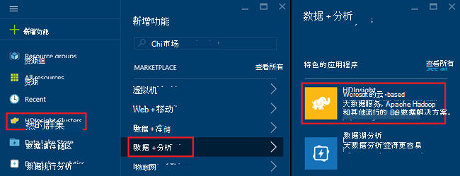
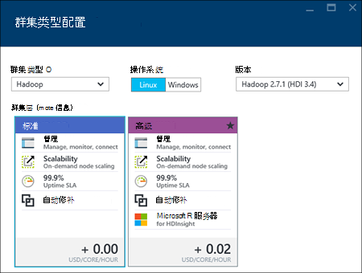
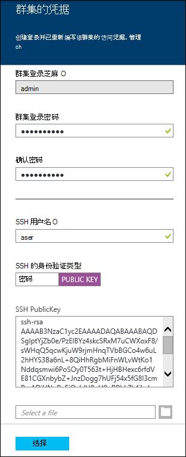
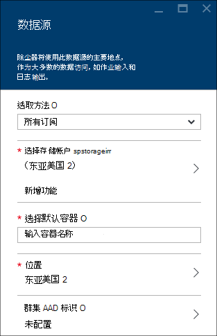
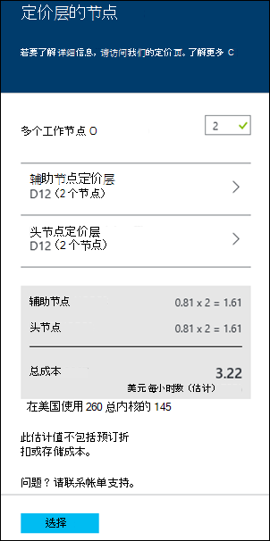
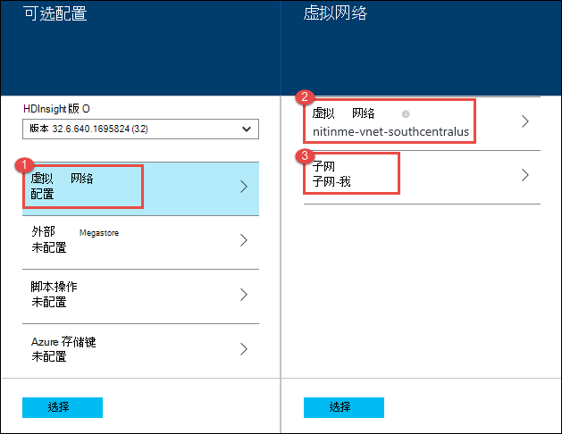
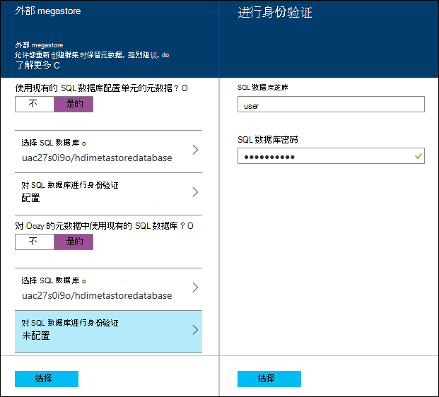
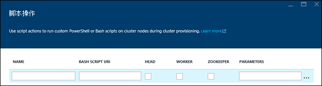
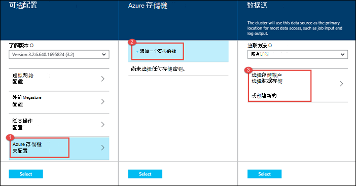
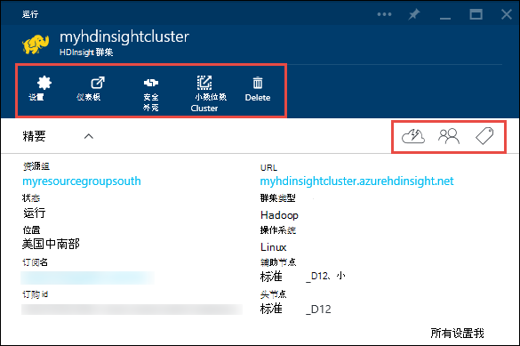

<properties
    pageTitle="在 Linux 中使用门户网站 HDInsight 上创建 Hadoop，HBase、 占领或触发群集 |Microsoft Azure"
    description="了解如何创建使用 web 浏览器和 Azure 预览门户网站 HDInsight 上 Linux Hadoop，HBase、 占领或触发的群集。"
    services="hdinsight"
    documentationCenter=""
    authors="nitinme"
    manager="jhubbard"
    editor="cgronlun"
    tags="azure-portal"/>

<tags
    ms.service="hdinsight"
    ms.devlang="na"
    ms.topic="article"
    ms.tgt_pltfrm="na"
    ms.workload="big-data"
    ms.date="10/05/2016"
    ms.author="nitinme"/>

#在 HDInsight 使用 Azure 门户中创建基于 Linux 的群集

[AZURE.INCLUDE [selector](../../includes/hdinsight-selector-create-clusters.md)]

Azure 的门户是服务和资源在 Microsoft Azure 云托管的基于 web 的管理工具。 在本文中，您将学习如何创建基于 Linux 的 HDInsight 群集使用门户。

## 系统必备组件

[AZURE.INCLUDE [delete-cluster-warning](../../includes/hdinsight-delete-cluster-warning.md)]

- **Azure 订阅**。 请参阅[获取 Azure 免费试用版](https://azure.microsoft.com/documentation/videos/get-azure-free-trial-for-testing-hadoop-in-hdinsight/)。
- __现代 web 浏览器__。 Azure 门户使用 HTML5 和 Javascript，并在较旧的 web 浏览器可能无法正常工作。

### 访问控制要求

[AZURE.INCLUDE [access-control](../../includes/hdinsight-access-control-requirements.md)]

##创建群集

Azure 门户公开的大多数群集属性。 使用 Azure 资源管理器模板，您可以隐藏大量的详细信息。 有关详细信息，请参阅[创建 Linux 基于 Hadoop 群集在 HDInsight 使用 Azure 资源管理器的模板](hdinsight-hadoop-create-linux-clusters-arm-templates.md)。

1. 登录到[Azure 的门户](https://portal.azure.com)。

2. 单击**新建**，单击**数据分析**，然后单击**HDInsight**。

    
3. 输入**群集名称**︰ 此名称必须是全局唯一的。
4. 单击**选择群集类型**，然后选择︰

    - **群集类型**︰ 如果您不知道如何选择，选择**Hadoop**。 它是最受欢迎的群集类型。

        > [AZURE.IMPORTANT] HDInsight 群集分为多种类型，分别对应于工作负荷或群集进行的优化的技术。 没有受支持的方法，以创建一个组合多个类型，如风暴和 HBase 在一个群集上的群集。 

    - **操作系统**︰ 选择**Linux**。
    - **版本**︰ 如果您不知道所要选择使用的默认版本。 有关详细信息，请参阅[HDInsight 群集版本](hdinsight-component-versioning.md)。
    - **群集层**︰ Azure HDInsight 提供了两个类别中的大数据云选项︰ 标准层和特优层。 有关详细信息，请参阅[群集层](hdinsight-hadoop-provision-linux-clusters.md#cluster-tiers)。
    
    

4. 单击以选择用于群集的 Azure 订阅**订阅**。

5. 单击**资源组**来选择一个现有的资源组，或单击**新建**以创建新的资源组

    > [AZURE.NOTE] 如果有的话，此项将默认为您现有的资源组之一。

6. 单击**凭据**，然后输入管理员用户的密码。 此外必须输入**SSH 用户名**和**密码**或**公钥**，它将使用 SSH 用户进行身份验证。 使用公钥是推荐的方法。 在底部保存的凭据配置，请单击**选择**。

    

    在 HDInsight 中使用 SSH 的详细信息，请参阅下列文章︰

    * [HDInsight 从 Linux、 Unix 或 OS X 上的基于 Linux 的 Hadoop 使用 SSH](hdinsight-hadoop-linux-use-ssh-unix.md)
    * [在从 Windows HDInsight 基于 Linux 的 Hadoop 使用 SSH](hdinsight-hadoop-linux-use-ssh-windows.md)

7. 单击要选择的群集中，现有的数据源的**数据源**或创建一个新。

    

    目前您可以用作数据源的 HDInsight 群集选择 Azure 存储帐户。 使用以下方法来了解**数据源**刀片式服务器上的项。

    - **选择方法**︰ 将此值设置为**所有订阅**允许浏览的所有订阅的存储帐户。 此设置为**访问键**如果想要输入的**存储名称**和现有存储帐户的**访问键**。

    - **选择存储帐户 / 新**︰ 单击**选择存储帐户**，浏览并选择您希望群集相关联的现有存储帐户。 或者，单击**新建**以创建新的存储帐户。 使用字段显示输入存储帐户的名称。 如果的名称可用，则会出现绿色复选标记。

    - **选择默认容器**︰ 用于输入要用于群集的默认容器的名称。 您可以输入任何名称，我们建议为群集使用相同的名称，以便您可以轻松地识别该容器用于此特定群集。

    - **位置**︰ 存储帐户，或将在中创建的地理区域。

        > [AZURE.IMPORTANT] 选择默认的数据源的位置还会设置 HDInsight 群集的位置。 在同一区域必须位于群集和默认数据源。
        
    - **群集 AAD 标识**︰ 通过配置它，您使群集能够访问基于 AAD 配置的 Azure 数据湖商店。

    单击**选择**以保存数据源配置。

8. 单击**节点定价层**以显示将为此群集创建的节点的信息。 设置所需的群集的辅助节点数。 刀片式服务器中，将显示群集的估计的成本。

    
    
    > [AZURE.IMPORTANT] 如果您计划多 32 个工作节点，在创建群集或通过创建之后，扩展群集您必须选择至少 8 核和 14 GB ram 的头节点大小。
    >
    > 节点的大小和相关的成本的详细信息，请参阅[HDInsight 定价](https://azure.microsoft.com/pricing/details/hdinsight/)。

    单击**选择**要保存节点定价配置。

9. 单击要选择的群集版本，以及配置其他可选设置，如加入**虚拟网络**的**可选配置**，设置用于保存数据的**外部 Metastore**配置单元和 Oozie，使用脚本的操作自定义群集安装自定义组件，或对群集使用额外的存储帐户。

    * **虚拟网络**︰ 如果您想要放置到一个虚拟的网络群集选择 Azure 的虚拟网络和子网。  

        

        在 HDInsight 中使用虚拟网络，包括在虚拟网络的具体配置要求的信息请参阅[扩展 HDInsight 使用 Azure 虚拟网络的能力](hdinsight-extend-hadoop-virtual-network.md)。

    * 单击**外部 Metastores** ，以指定要用来保存配置单元和 Oozie 与群集相关的元数据的 SQL 数据库。
    
        > [AZURE.NOTE] Metastore 配置不可用于 HBase 群集类型。

        

        对于**使用配置单元的现有 SQL 数据库**的元数据，单击**是**，选择一个 SQL 数据库，然后提供数据库的用户名/密码。 如果要**使用现有的 SQL 数据库对 Oozie 的元数据**，请重复这些步骤。 直到您回到位于**可选配置**刀片式服务器，请单击**选择**。

        >[AZURE.NOTE] Metastore 所使用的 SQL Azure 数据库必须允许连接到其他 Azure 服务，包括 Azure HDInsight。 在 SQL Azure 数据库仪表板，在右侧，单击服务器名称。 这是在其运行的 SQL 数据库实例的服务器。 一次您是在服务器视图中，请单击**配置**，然后**Azure 服务**，请单击**是**，然后单击**保存**。

        &nbsp;

        > [AZURE.IMPORTANT] 当创建 metastore，不使用数据库名称包含短划线或连字符，因为这可能会导致群集创建过程中失败。

    * **脚本操作**如果您想要使用自定义脚本自定义群集中，群集作为正在创建。 有关脚本操作的详细信息，请参阅[自定义 HDInsight 群集使用脚本的操作](hdinsight-hadoop-customize-cluster-linux.md)。 脚本操作刀片式服务器上提供的详细信息，如屏幕截图所示。

        

    * 单击以指定附加的存储帐户相关联的群集**存储帐户链接**。 在**Azure 存储键**刀片式服务器，单击**添加存储键**，然后选择一个现有的存储帐户或创建一个新帐户。

        

        在创建群集之后，还可以添加更多存储帐户。  请参阅[自定义 Linux 基于 HDInsight 群集使用脚本的操作](hdinsight-hadoop-customize-cluster-linux.md)。

        直到回到位于**新 HDInsight 群集**刀片式服务器，请单击**选择**。
        
        除了 Blob 存储帐户，也可以链接 Azure 数据湖商店。 配置可以完成的配置在您配置的默认存储帐户和默认容器的数据源中的 AAD。

10. **新的 HDInsight 群集**刀片式服务器，请确保**附到 Startboard**被选中，然后单击**创建**。 这会创建群集，并为其添加一个图块，到 Azure 门户网站 Startboard。 该图标将指示群集资源调配，并完成资源调配后显示的 HDInsight 图标将会更改。

  	| 在资源调配时 | 设置完成 |
  	| ------------------ | --------------------- |
  	|  |  |

    > [AZURE.NOTE] 它将需要一些时间为群集创建，通常大约 15 分钟。 使用 Startboard 或**通知**条目左侧的页上平铺在资源调配过程检查。

11. 创建过程完成后，单击 Startboard 启动群集刀片式服务器从群集的拼贴。 群集刀片提供群集的名称、 它所属的资源组、 位置、 操作系统群集控制板等的 URL 如有关的基本信息。

    

    使用以下方法来理解在此刀片，以及**精要**部分中的顶部的图标︰

    * **设置**和**所有设置**︰ 显示**设置**刀片式服务器群集，以便您可以访问该群集的详细的配置信息。

    * **仪表板**、**群集的仪表板**和**URL**︰ 这些是访问群集仪表板，它是在群集上运行作业的 Web 门户的所有方法。

    * **安全外壳**︰ 访问群集使用 SSH 所需的信息。

    * **删除**︰ 删除 HDInsight 群集。

    * **快速入门**(): 显示的信息将帮助您开始使用 HDInsight。

    * **用户**(): 使您可以在 Azure 订阅为其他用户设置_门户_管理该群集的权限。

        > [AZURE.IMPORTANT] 这_只_影响访问和向在 Azure 的门户中，该群集的权限，谁可以连接到或将作业提交到 HDInsight 群集没有影响。

    * **标记**(): 标记允许您设置键/值对来定义自定义分类的云服务。 例如，可能会创建一个密钥，该密钥命名__项目__，然后与特定项目关联的所有服务都使用一个公共值。

##自定义群集

- 请参阅[使用引导数据库的自定义 HDInsight 群集](hdinsight-hadoop-customize-cluster-bootstrap.md)。
- 请参阅[自定义 Linux 基于 HDInsight 群集使用脚本的操作](hdinsight-hadoop-customize-cluster-linux.md)。

##删除群集

[AZURE.INCLUDE [delete-cluster-warning](../../includes/hdinsight-delete-cluster-warning.md)]

##下一步行动

现在，您已成功创建一个 HDInsight 群集，使用以下方法来学习如何使用您的群集︰

###Hadoop 群集

* [使用 HDInsight 配置单元](hdinsight-use-hive.md)
* [使用 HDInsight 的小猪](hdinsight-use-pig.md)
* [HDInsight 使用 MapReduce](hdinsight-use-mapreduce.md)

###HBase 群集

* [在 HDInsight 上的 HBase 入门](hdinsight-hbase-tutorial-get-started-linux.md)
* [开发 HBase HDInsight 上的 Java 应用程序](hdinsight-hbase-build-java-maven-linux.md)

###风暴的群集

* [在 HDInsight 上的风暴为开发 Java 拓扑](hdinsight-storm-develop-java-topology.md)
* [在 HDInsight 上的风暴中使用 Python 组件](hdinsight-storm-develop-python-topology.md)
* [部署和监视在 HDInsight 上的风暴与拓扑](hdinsight-storm-deploy-monitor-topology-linux.md)

###触发群集

* [创建独立的应用程序使用 Scala](hdinsight-apache-spark-create-standalone-application.md)
* [在群集上使用晚触发远程运行作业](hdinsight-apache-spark-livy-rest-interface.md)
* [触发与 BI︰ 执行与 BI 工具一起使用在 HDInsight 中的触发交互式数据分析](hdinsight-apache-spark-use-bi-tools.md)
* [机器学习与触发︰ 使用 HDInsight 来预测食品检查结果中的触发](hdinsight-apache-spark-machine-learning-mllib-ipython.md)
* [HDInsight 用于构建实时流的应用程序中触发流︰ 使用触发](hdinsight-apache-spark-eventhub-streaming.md)
