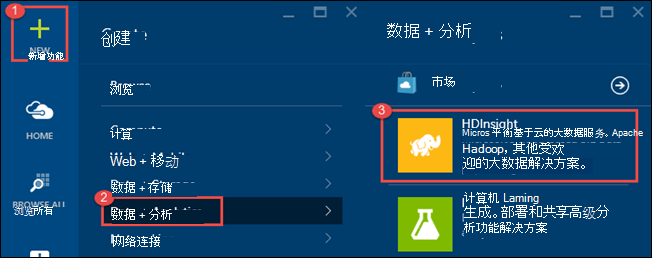
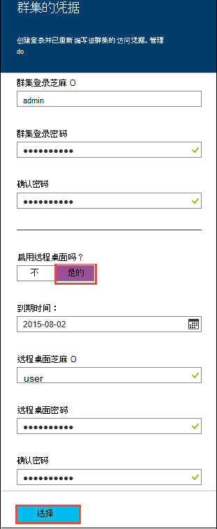
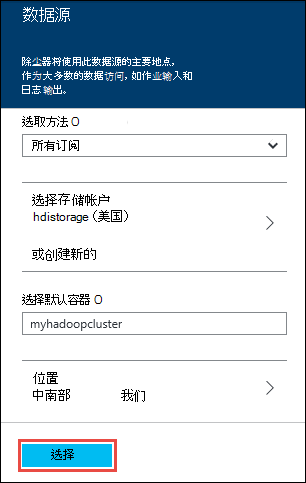
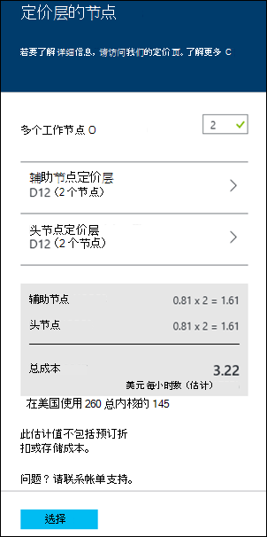
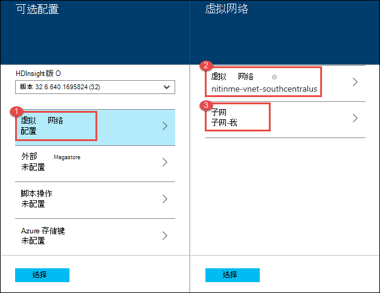
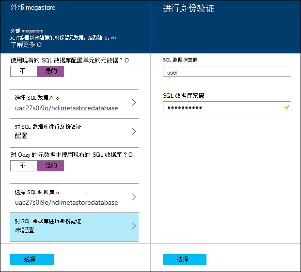
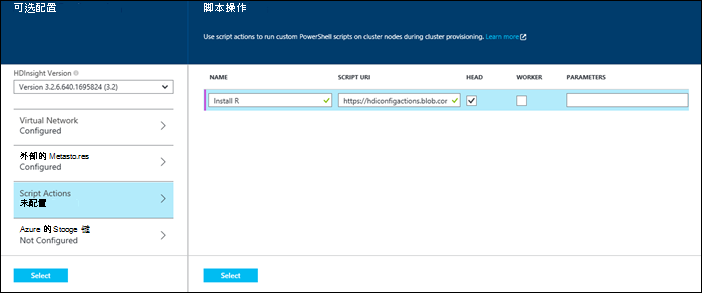
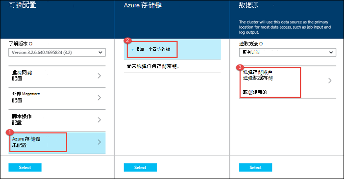
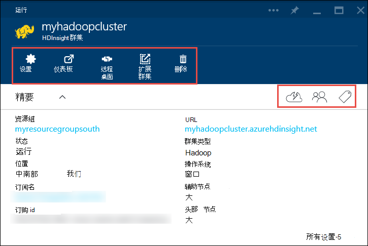

<properties
   pageTitle="在 HDInsight 中创建 Hadoop 群集 |Microsoft Azure"
    description="了解如何使用 Azure 门户为 Azure HDInsight 创建群集。"
   services="hdinsight"
   documentationCenter=""
   tags="azure-portal"
   authors="mumian"
   manager="jhubbard"
   editor="cgronlun"/>

<tags
   ms.service="hdinsight"
   ms.devlang="na"
   ms.topic="article"
   ms.tgt_pltfrm="na"
   ms.workload="big-data"
   ms.date="09/02/2016"
   ms.author="jgao"/>

# 在 HDInsight 使用 Azure 门户中创建基于 Windows 的 Hadoop 群集

[AZURE.INCLUDE [selector](../../includes/hdinsight-selector-create-clusters.md)]

了解如何创建在 HDInsight 使用 Azure 门户 Hadoop 群集。 Microsoft [Azure 的门户网站](../azure-portal-overview.md)是中心位置，您可以设置和管理 Azure 资源。 Azure 门户是一种可用于在 HDInsight 中创建基于 Linux 的或者基于 Windows 的 Hadoop 群集工具。 其他群集创建工具和功能单击此页面顶部选项卡中的选择或者查看[群集创建方法](hdinsight-provision-clusters.md#cluster-creation-methods)。

##系统必备组件︰

[AZURE.INCLUDE [delete-cluster-warning](../../includes/hdinsight-delete-cluster-warning.md)]

在开始这篇文章中的说明操作之前，必须具有下列︰

- Azure 的订阅。 请参阅[获取 Azure 免费试用版](https://azure.microsoft.com/documentation/videos/get-azure-free-trial-for-testing-hadoop-in-hdinsight/)。

### 访问控制要求

[AZURE.INCLUDE [access-control](../../includes/hdinsight-access-control-requirements.md)]

## 创建群集

**若要创建一个 HDInsight 群集**

1. 登录到[Azure 的门户](https://portal.azure.com)。
2. 单击**新建**，单击**数据分析**，然后单击**HDInsight**。

    

3. 键入或选择以下值︰

    * **群集名称**︰ 输入群集的名称。 绿色复选标记会出现群集名旁的名称可用。

    * **群集类型**︰ 选择**Hadoop**。 其他选项 inclue **HBase**、**暴风雨**，并**触发**。

        > [AZURE.IMPORTANT] HDInsight 群集分为多种类型，分别对应于工作负荷或群集进行的优化的技术。 没有受支持的方法，以创建一个组合多个类型，如风暴和 HBase 在一个群集上的群集。

    * **群集操作系统**︰ 选择**窗口**。 若要创建一个基于 Linux 的群集，请选择**Linux**。
    * **版本**︰ [HDInsight 版本](hdinsight-component-versioning.md)，请参阅。
    * **订阅**︰ 选择 Azure 订购，将用于创建该群集。
    * **资源组**︰ 选择一个现有的或创建新的资源组。 如果有的话，此项将默认为您现有的资源组之一。
    * **凭据**︰ 配置的用户名和密码的 Hadoop 用户 （HTTP 用户）。 如果您启用群集的远程桌面，需要配置远程桌面用户的用户名和密码和帐户过期日期。 底部以保存更改，请单击**选择**。

        

    * **数据源**︰ 创建新的或选择一个现有的 Azure 存储帐户用作群集的默认文件系统。

        

        * **选择方法**︰ 将此值设置为**所有订阅**允许浏览的所有订阅的存储帐户。 此设置为**访问键**如果想要输入的**存储名称**和现有存储帐户的**访问键**。
        * **选择存储帐户创建新 /**︰ 单击**选择存储帐户**，浏览并选择您希望群集相关联的现有存储帐户。 或者，单击**新建**以创建新的存储帐户。 使用字段显示输入存储帐户的名称。 如果的名称可用，则会出现绿色复选标记。
        * **选择默认容器**︰ 用于输入要用于群集的默认容器的名称。 您可以输入任何名称，我们建议为群集使用相同的名称，以便您可以轻松地识别该容器用于此特定群集。
        * **位置**︰ 存储帐户，或将在中创建的地理区域。 此位置将确定群集的位置。  群集和其默认存储帐户必须在相同的 Azure 数据中心共同找到。
    
    * **节点定价层**︰ 设置所需的群集的辅助节点数。 刀片式服务器中，将显示群集的估计的成本。
  

        

    * 要选择群集版本，以及配置其他可选设置，如加入**虚拟网络**，将**外部 Metastore**设置来配置单元和 Oozie，保存数据的**可选配置**脚本操作用于自定义群集安装自定义组件，或对群集使用额外的存储帐户。

    * **HDInsight 版本**︰ 选择要使用的群集的版本。 有关详细信息，请参阅[HDInsight 群集版本](hdinsight-component-versioning.md)。
    * **虚拟网络**︰ 如果您想要放置到一个虚拟的网络群集选择 Azure 的虚拟网络和子网。  

        

        在 HDInsight 中使用虚拟网络，包括在虚拟网络的具体配置要求的信息请参阅[扩展 HDInsight capbilities 使用 Azure 虚拟网络](hdinsight-extend-hadoop-virtual-network.md)。
  

        
    * **外部的 Metastores**︰ 指定 SQL Azure 数据库来存储配置单元和 Oozie 与群集相关的元数据。
 
        > [AZURE.NOTE] Metastore 配置不可用于 HBase 群集类型。

    

    对于**使用配置单元的现有 SQL 数据库**的元数据，单击**是**，选择一个 SQL 数据库，然后提供数据库的用户名/密码。 如果要**使用现有的 SQL 数据库对 Oozie 的元数据**，请重复这些步骤。 直到您回到位于**可选配置**刀片式服务器，请单击**选择**。

    >[AZURE.NOTE] Metastore 所使用的 SQL Azure 数据库必须允许连接到其他 Azure 服务，包括 Azure HDInsight。 在 SQL Azure 数据库仪表板，在右侧，单击服务器名称。 这是在其运行的 SQL 数据库实例的服务器。 一次您是在服务器视图中，请单击**配置**，然后**Azure 服务**，请单击**是**，然后单击**保存**。

            &nbsp;

            > [AZURE.IMPORTANT] 当创建 metastore，不使用数据库名称包含短划线或连字符，因为这可能会导致群集创建过程中失败。
        
        * **Script Actions** if you want to use a custom script to customize a cluster, as the cluster is being created. For more information about script actions, see [Customize HDInsight clusters using Script Action](hdinsight-hadoop-customize-cluster.md). On the Script Actions blade provide the details as shown in the screen capture.
    

            

        * **Azure Storage Keys**: Specify additional storage accounts to associate with the cluster. In the **Azure Storage Keys** blade, click **Add a storage key**, and then select an existing storage account or create a new account.
    

            

4. 单击**创建**。 选择**锁定到 Startboard**将添加到您的门户网站 Startboard 的群集的拼贴。 群集创建，并将会改为显示的 HDInsight 图标创建完成后，该图标将指示。
    
    它将需要一些时间为群集创建，通常大约 15 分钟。 使用 Startboard 或**通知**条目左侧的页上平铺在资源调配过程检查。
    

5. 完成创建后，单击 Startboard 启动群集刀片式服务器从群集的拼贴。 群集刀片提供群集的名称、 它所属的资源组、 位置、 操作系统群集控制板等的 URL 如有关的基本信息。

    

    使用以下方法来理解在此刀片，以及**精要**部分中的顶部的图标︰

    * **设置**和**所有设置**︰ 显示**设置**刀片式服务器群集，以便您可以访问该群集的详细的配置信息。
    * **仪表板**、**群集的仪表板**和**URL**︰ 这些是访问群集仪表板，它是在群集上运行作业的 Web 门户的所有方法。
    * **远程桌面**︰ 让您可以在群集节点上启用/禁用远程桌面。
    * **扩展群集**︰ 允许您更改工作人员为此群集的节点数。
    * **删除**︰ 删除 HDInsight 群集。
    * **快速入门**(): 显示的信息将帮助您开始使用 HDInsight。
    * **用户**(): 使您可以在 Azure 订阅为其他用户设置_门户_管理该群集的权限。
    

        > [AZURE.IMPORTANT] 这_只_影响访问和向在门户中，该群集的权限，谁可以连接到或将作业提交到 HDInsight 群集没有影响。
        
    * **标记**(): 标记允许您设置键/值对来定义自定义分类的云服务。 例如，可能会创建一个密钥，该密钥命名__项目__，然后与特定项目关联的所有服务都使用一个公共值。

##自定义群集

- 请参阅[使用引导数据库的自定义 HDInsight 群集](hdinsight-hadoop-customize-cluster-bootstrap.md)。
- 请参阅[基于自定义 Windows HDInsight 群集使用脚本的操作](hdinsight-hadoop-customize-cluster.md)。

##下一步行动
在本文中，您学习了几种方法来创建一个 HDInsight 的群集。 若要了解详细信息，请参阅下列文章︰

* [开始使用 Azure HDInsight](hdinsight-hadoop-linux-tutorial-get-started.md) -了解如何开始使用 HDInsight 群集
* [以编程方式提交 Hadoop 的作业](hdinsight-submit-hadoop-jobs-programmatically.md)-了解如何以编程方式将作业提交到 HDInsight
* [通过使用 Azure 门户管理中 HDInsight 的 Hadoop 群集](hdinsight-administer-use-management-portal.md)

