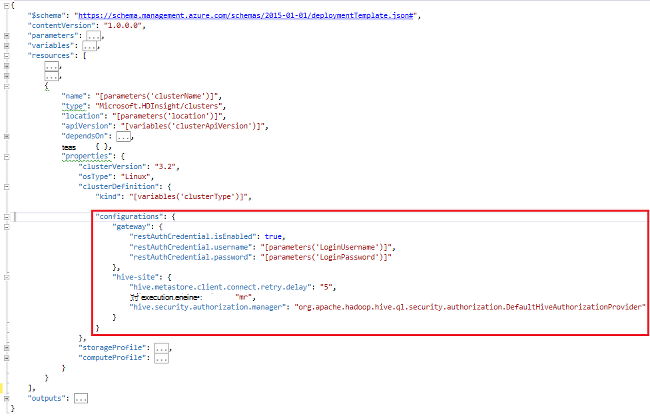

<properties
    pageTitle="自定义 HDInsight 群集使用引导数据库 |Microsoft Azure"
    description="了解如何自定义 HDInsight 群集使用的引导。"
    services="hdinsight"
    documentationCenter=""
    authors="mumian"
    manager="jhubbard"
    editor="cgronlun"
    tags="azure-portal"/>

<tags
    ms.service="hdinsight"
    ms.workload="big-data"
    ms.tgt_pltfrm="na"
    ms.devlang="na"
    ms.topic="article"
    ms.date="09/02/2016"
    ms.author="jgao"/>

# 自定义 HDInsight 群集使用引导

有时，您想要配置的配置文件，其中包括︰

- clusterIdentity.xml
- 核心-site.xml
- gateway.xml
- hbase env.xml
- hbase site.xml
- hdfs site.xml
- 配置单元 env.xml
- 配置单元 site.xml
- mapred 网站
- oozie site.xml
- oozie env.xml
- 暴 site.xml
- tez site.xml
- webhcat site.xml
- yarn site.xml

群集将不能保留由于重新映像的更改。 重新映像的详细信息，请参阅[角色实例重新启动由于操作系统升级](http://blogs.msdn.com/b/kwill/archive/2012/09/19/role-instance-restarts-due-to-os-upgrades.aspx)。 若要保留通过群集的生存期内更改，您可以使用 HDInsight 群集过程中创建的自定义。 这是推荐使用的方法更改群集的配置和保留这些 Azure 重新映像重新启动重新启动事件。 在服务启动之前正在应用这些配置更改，因此不需要重新启动服务。 

有三种方法用于引导︰

- 使用 Azure PowerShell

    [AZURE.INCLUDE [upgrade-powershell](../../includes/hdinsight-use-latest-powershell.md)]
    
- 使用.NET SDK
- 使用 Azure 资源管理器模板

在创建时在 HDInsight 群集上安装其他组件的信息，请参阅︰

- [自定义 HDInsight 群集使用脚本操作 (Linux)](hdinsight-hadoop-customize-cluster-linux.md)
- [自定义 HDInsight 群集使用脚本操作 (Windows)](hdinsight-hadoop-customize-cluster.md)

## 使用 Azure PowerShell

下面的 PowerShell 代码自定义配置单元配置︰

    # hive-site.xml configuration
    $hiveConfigValues = @{ "hive.metastore.client.socket.timeout"="90" }
    
    $config = New-AzureRmHDInsightClusterConfig `
        | Set-AzureRmHDInsightDefaultStorage `
            -StorageAccountName "$defaultStorageAccountName.blob.core.windows.net" `
            -StorageAccountKey $defaultStorageAccountKey `
        | Add-AzureRmHDInsightConfigValues `
            -HiveSite $hiveConfigValues 
    
    New-AzureRmHDInsightCluster `
        -ResourceGroupName $existingResourceGroupName `
        -ClusterName $clusterName `
        -Location $location `
        -ClusterSizeInNodes $clusterSizeInNodes `
        -ClusterType Hadoop `
        -OSType Windows `
        -Version "3.2" `
        -HttpCredential $httpCredential `
        -Config $config 

完成工作 PowerShell 脚本可在[附录 A](#hdinsight-hadoop-customize-cluster-bootstrap.md/appx-a:-powershell-sample)。

**若要验证此更改︰**

1. 登录到[Azure 的门户](https://portal.azure.com)。
2. 在左侧窗格中，单击**浏览**，然后单击**HDInsight 群集**。
3. 单击您刚创建使用 PowerShell 脚本的群集。
4. 单击**仪表板**从刀片式服务器上打开 Ambari 用户界面。
5. 单击左侧菜单中的**配置单元**。
6. 单击**HiveServer2**从**摘要**。
7. 单击**配置**选项卡。
8. 单击左侧菜单中的**配置单元**。
9. 单击**高级**选项卡。
10. 向下滚动，然后展开**高级配置单元站点**。
11. **Hive.metastore.client.socket.timeout**部分中查找。

某些自定义的其他配置文件的更多示例︰

    # hdfs-site.xml configuration
    $HdfsConfigValues = @{ "dfs.blocksize"="64m" } #default is 128MB in HDI 3.0 and 256MB in HDI 2.1

    # core-site.xml configuration
    $CoreConfigValues = @{ "ipc.client.connect.max.retries"="60" } #default 50

    # mapred-site.xml configuration
    $MapRedConfigValues = @{ "mapreduce.task.timeout"="1200000" } #default 600000

    # oozie-site.xml configuration
    $OozieConfigValues = @{ "oozie.service.coord.normal.default.timeout"="150" }  # default 120

有关详细信息，请参阅 Azim Uddin 博客标题[创建自定义 HDInsight 群集](http://blogs.msdn.com/b/bigdatasupport/archive/2014/04/15/customizing-hdinsight-cluster-provisioning-via-powershell-and-net-sdk.aspx)。

## 使用.NET SDK

请参阅[创建 Linux 基于 HDInsight 使用.NET SDK 中的群集](hdinsight-hadoop-create-linux-clusters-dotnet-sdk.md#use-bootstrap)。

## 使用资源管理器模板

在资源管理器模板中，您可以使用引导︰

    "configurations": {
        …
        "hive-site": {
            "hive.metastore.client.connect.retry.delay": "5",
            "hive.execution.engine": "mr",
            "hive.security.authorization.manager": "org.apache.hadoop.hive.ql.security.authorization.DefaultHiveAuthorizationProvider"
        }
    }

## 请参见

- [在 HDInsight 中创建 Hadoop 群集][ hdinsight-provision-cluster] HDInsight 群集通过使用来创建其他自定义选项提供了指导。
- [HDInsight 为开发脚本操作脚本][hdinsight-write-script]
- [安装和使用 HDInsight 群集上触发][hdinsight-install-spark]
- [上安装和使用 R HDInsight 群集][hdinsight-install-r]
- [Solr 在 HDInsight 上的安装和使用群集](hdinsight-hadoop-solr-install.md)。
- [Giraph 在 HDInsight 上的安装和使用群集](hdinsight-hadoop-giraph-install.md)。

[hdinsight-install-spark]: hdinsight-hadoop-spark-install.md
[hdinsight-install-r]: hdinsight-hadoop-r-scripts.md
[hdinsight-write-script]: hdinsight-hadoop-script-actions.md
[hdinsight-provision-cluster]: hdinsight-provision-clusters.md
[powershell-install-configure]: powershell-install-configure.md

[img-hdi-cluster-states]: ./media/hdinsight-hadoop-customize-cluster/HDI-Cluster-state.png "在群集创建过程的阶段"

## Appx 答︰ PowerShell 示例

此 PowerShell 脚本创建一个 HDInsight 群集和自定义配置单元设置︰

    ####################################
    # Set these variables
    ####################################
    #region - used for creating Azure service names
    $nameToken = "<ENTER AN ALIAS>" 
    #endregion

    #region - cluster user accounts
    $httpUserName = "admin"  #HDInsight cluster username
    $httpPassword = "<ENTER A PASSWORD>" #"<Enter a Password>"

    $sshUserName = "sshuser" #HDInsight ssh user name
    $sshPassword = "<ENTER A PASSWORD>" #"<Enter a Password>"
    #endregion

    ####################################
    # Service names and varialbes
    ####################################
    #region - service names
    $namePrefix = $nameToken.ToLower() + (Get-Date -Format "MMdd")

    $resourceGroupName = $namePrefix + "rg"
    $hdinsightClusterName = $namePrefix + "hdi"
    $defaultStorageAccountName = $namePrefix + "store"
    $defaultBlobContainerName = $hdinsightClusterName

    $location = "East US 2"
    #endregion

    # Treat all errors as terminating
    $ErrorActionPreference = "Stop"

    ####################################
    # Connect to Azure
    ####################################
    #region - Connect to Azure subscription
    Write-Host "`nConnecting to your Azure subscription ..." -ForegroundColor Green
    try{Get-AzureRmContext}
    catch{Login-AzureRmAccount}
    #endregion

    #region - Create an HDInsight cluster
    ####################################
    # Create dependent components
    ####################################
    Write-Host "Creating a resource group ..." -ForegroundColor Green
    New-AzureRmResourceGroup `
        -Name  $resourceGroupName `
        -Location $location

    Write-Host "Creating the default storage account and default blob container ..."  -ForegroundColor Green
    New-AzureRmStorageAccount `
        -ResourceGroupName $resourceGroupName `
        -Name $defaultStorageAccountName `
        -Location $location `
        -Type Standard_GRS

    $defaultStorageAccountKey = (Get-AzureRmStorageAccountKey `
                                    -ResourceGroupName $resourceGroupName `
                                    -Name $defaultStorageAccountName)[0].Value
    $defaultStorageContext = New-AzureStorageContext `
                                    -StorageAccountName $defaultStorageAccountName `
                                    -StorageAccountKey $defaultStorageAccountKey
    New-AzureStorageContainer `
        -Name $defaultBlobContainerName `
        -Context $defaultStorageContext #use the cluster name as the container name

    ####################################
    # Create a configuration object
    ####################################
    $hiveConfigValues = @{ "hive.metastore.client.socket.timeout"="90" }
        
    $config = New-AzureRmHDInsightClusterConfig `
        | Set-AzureRmHDInsightDefaultStorage `
            -StorageAccountName "$defaultStorageAccountName.blob.core.windows.net" `
            -StorageAccountKey $defaultStorageAccountKey `
        | Add-AzureRmHDInsightConfigValues `
            -HiveSite $hiveConfigValues 

    ####################################
    # Create an HDInsight cluster
    ####################################
    $httpPW = ConvertTo-SecureString -String $httpPassword -AsPlainText -Force
    $httpCredential = New-Object System.Management.Automation.PSCredential($httpUserName,$httpPW)

    $sshPW = ConvertTo-SecureString -String $sshPassword -AsPlainText -Force
    $sshCredential = New-Object System.Management.Automation.PSCredential($sshUserName,$sshPW)

    New-AzureRmHDInsightCluster `
        -ResourceGroupName $resourceGroupName `
        -ClusterName $hdinsightClusterName `
        -Location $location `
        -ClusterSizeInNodes 1 `
        -ClusterType Hadoop `
        -OSType Linux `
        -Version "3.2" `
        -HttpCredential $httpCredential `
        -SshCredential $sshCredential `
        -Config $config

    ####################################
    # Verify the cluster
    ####################################
    Get-AzureRmHDInsightCluster -ClusterName $hdinsightClusterName

    #endregion
