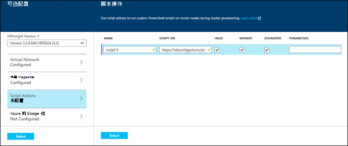
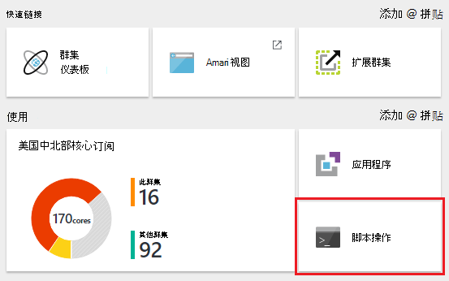
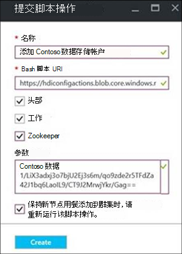
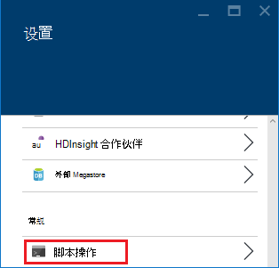
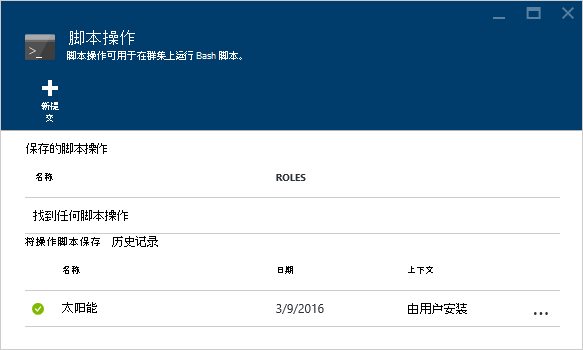
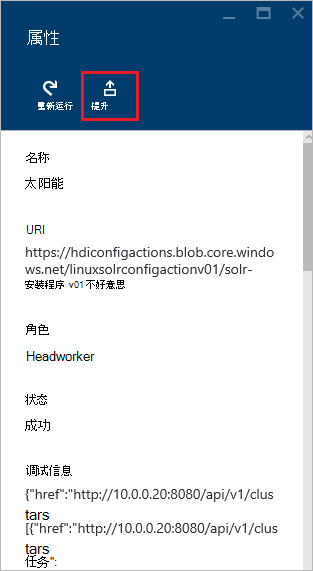
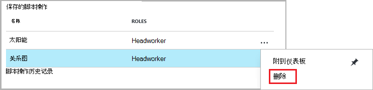
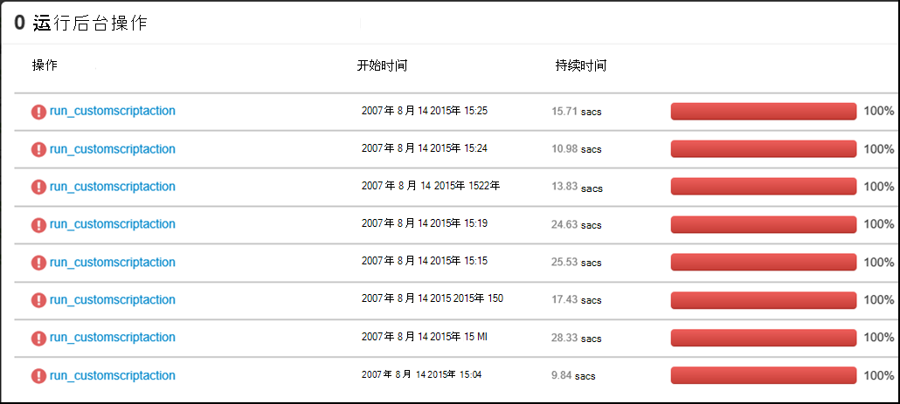
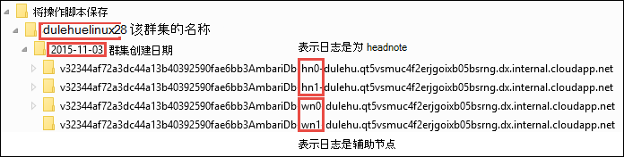

<properties
    pageTitle="自定义 HDInsight 群集使用脚本操作 |Microsoft Azure"
    description="了解如何使用脚本操作的基于 Linux 的 HDInsight 群集中添加自定义组件。 脚本操作的 Bash 脚本的群集节点，并可用于自定义群集配置或添加额外的服务和实用程序，如色调，Solr 或。"
    services="hdinsight"
    documentationCenter=""
    authors="Blackmist"
    manager="jhubbard"
    editor="cgronlun"
    tags="azure-portal"/>

<tags
    ms.service="hdinsight"
    ms.workload="big-data"
    ms.tgt_pltfrm="na"
    ms.devlang="na"
    ms.topic="article"
    ms.date="09/06/2016"
    ms.author="larryfr"/>

# 自定义的基于 Linux 的 HDInsight 群集使用脚本操作

HDInsight 提供了一个名为**脚本操作**调用自定义脚本自定义群集的配置选项。 这些脚本可用于在群集创建过程中，或已在运行的群集上，并用于安装其他组件或更改配置设置。

> [AZURE.NOTE] 已在运行的群集上使用脚本操作的能力才可用于基于 Linux 的 HDInsight 群集。 在使用基于 Windows 群集脚本操作的信息，请参阅[自定义 HDInsight 群集使用脚本操作 (Windows)](hdinsight-hadoop-customize-cluster.md)。

脚本操作也可以发布到 Azure 市场为 HDInsight 应用程序。 一些在此文档中的示例显示如何安装的 HDInsight 应用程序，使用 PowerShell 和.NET SDK 中的脚本操作命令。 HDInsight 应用程序的详细信息，请参阅[发布 HDInsight Azure 市场上到的应用程序](hdinsight-apps-publish-applications.md)。 

## 了解脚本操作

脚本操作时只需在 HDInsight 群集节点运行的脚本提供的 URL 和参数，并就大扫除。 以下是特性和功能的脚本操作。

* 必须存储在可从 HDInsight 群集访问一个 URI。 下面是可能存储位置︰

    * Blob 存储帐户 HDInsight 群集主或其他存储帐户。 由于 HDInsight 在创建群集期间授予对这两种类型的存储帐户的访问，这提供了一种使用非公共脚本操作方法。
    
    * 如 Azure Blob、 GitHub、 OneDrive、 收存箱等公开可读 URI。
    
    URI （公开可读） 的 blob 容器中存储脚本的示例，请参见部分中[的示例脚本操作脚本](#example-script-action-scripts)。

* 可以将限制为__仅特定节点类型上运行__，例如头节点或多个工作节点。

    > [AZURE.NOTE] 与 HDInsight 完美结合使用，可以指定应在边缘节点上使用的脚本。

* 可以是__保持不变__或__特殊__。

    __保留__脚本是脚本应用于辅助节点，并将自动运行时扩展群集创建的新节点上。

    持久的脚本可能还将更改应用于其他节点类型，如头节点，但从功能的角度来保持一个脚本的唯一原因是使它适用于群集扩容时，创建的新工作节点。

    > [AZURE.IMPORTANT] 保存的脚本操作必须具有唯一的名称。

    __特别__的脚本不会保留;但是，您随后可以提升特别将脚本保存到持久的脚本，或降低持久的脚本与特别的脚本。

    > [AZURE.IMPORTANT] 在群集创建过程中使用的脚本操作自动保持不变。
    >
    > 脚本失败不被保留，即使明确指出应将它们。

* 可以接受在执行期间使用的脚本的__参数__。

* 在运行__根级权限__与在群集节点上。

* 可以使用通过__Azure 的门户__， __Azure PowerShell__， __Azure CLI__或__HDInsight.NET SDK__

    [AZURE.INCLUDE [upgrade-powershell](../../includes/hdinsight-use-latest-powershell-cli-and-dotnet-sdk.md)]

来帮助了解哪些脚本已应用到群集中，并在确定用于升级或降级，群集的脚本的 ID 保留历史记录的所有脚本已运行。

> [AZURE.IMPORTANT] 没有自动的方法撤消脚本操作所做的更改。 如果您需要取消脚本的效果，必须了解所做的更改并手动进行反转 （或提供撤消它们的脚本操作。）

### 将操作脚本保存在群集创建过程中

在群集创建过程中使用的脚本操作是在一个现有的群集运行操作的脚本都略有不同︰

* 该脚本就是__自动保持不变__。

* 该脚本中的__故障__会导致群集创建过程中失败。

下图演示在创建过程中执行脚本操作时︰

![HDInsight 群集进行自定义和在群集创建过程的阶段][img-hdi-cluster-states]

HDInsight 配置时，运行该脚本。 在此阶段，该脚本显示群集中的所有指定节点上并行运行并在节点上，使用超级用户权限运行。

> [AZURE.NOTE] 因为以根用户权限级别在群集节点上，运行脚本，您可以执行操作，如停止和启动服务，包括与 Hadoop 相关的服务。 如果停止服务，则必须确保 Ambari 服务和其它与 Hadoop 相关服务是否启动并运行该脚本完成运行之前。 这些服务需要在创建时成功地确定群集的状态和正常运行。

在群集创建过程中您可以按指定的顺序指定调用多个脚本操作。

> [AZURE.IMPORTANT] 脚本操作必须在 60 分钟内，完成或他们将会超时。 群集资源调配过程是与安装和配置的其他进程同时运行脚本。 对 CPU 时间或网络带宽等资源的争夺可能会导致脚本需要较长时间才能完成比它在您的开发环境。
>
> 若要最小化运行该脚本所需的时间，避免下载和编译源的应用程序等任务。 相反，预编译应用程序，并将二进制文件存储在 Azure Blob 存储，以便它可以快速下载到群集。

###在群集上运行的脚本操作

与不同的群集创建，在脚本中的故障过程中使用的操作已在运行的群集运行的脚本不会自动导致群集更改为失败状态。 一旦脚本执行完毕，群集将返回到"运行"状态。

> [AZURE.IMPORTANT] 这并不意味着您正在运行群集不会受到这样做不好的事情。 例如，脚本可能会删除文件所需的群集配置更改，以便服务故障，等等。
>
> 脚本操作运行具有超级用户权限，因此您应该确保您了解脚本所做的将其应用于您的群集之前。

将脚本应用于群集中，群集状态将更改为__接受__，然后__HDInsight 配置__为__运行__，最后回到__运行__成功的脚本。 脚本状态登录脚本操作的历史记录，并使用这来确定脚本是成功还是失败。 例如， `Get-AzureRmHDInsightScriptActionHistory` PowerShell cmdlet 可以用于查看脚本的状态。 它将返回类似于以下内容的信息︰

    ScriptExecutionId : 635918532516474303
    StartTime         : 2/23/2016 7:40:55 PM
    EndTime           : 2/23/2016 7:41:05 PM
    Status            : Succeeded

> [AZURE.NOTE] 如果您更改了群集的用户 （管理员） 密码创建群集后，这可能会导致操作与此群集故障运行的脚本。 如果您有任何持久的脚本操作该目标辅助节点，这些可能会失败时添加节点到群集中通过调整大小操作。

## 示例脚本操作脚本

从 Azure 门户，Azure PowerShell，Azure CLI 或 HDInsight.NET SDK，可以使用脚本操作脚本。 HDInsight 提供了脚本 HDInsight 群集上安装以下组件︰

名称 | 脚本
----- | -----
**添加 Azure 存储帐户** | https://hdiconfigactions.blob.core.windows.net/linuxaddstorageaccountv01/add-storage-account-v01.sh。 请参阅[应用到正在运行群集脚本操作](#apply-a-script-action-to-a-running-cluster)。
**安装色调** | https://hdiconfigactions.blob.core.windows.net/linuxhueconfigactionv02/install-hue-uber-v02.sh。 请参阅[色调在 HDInsight 上的安装和使用群集](hdinsight-hadoop-hue-linux.md)。
**R 安装** | https://hdiconfigactions.blob.core.windows.net/linuxrconfigactionv01/r-installer-v01.sh。 请参阅[安装和使用 R HDInsight 群集上](hdinsight-hadoop-r-scripts-linux.md)。
**安装 Solr** | https://hdiconfigactions.blob.core.windows.net/linuxsolrconfigactionv01/solr-installer-v01.sh。 [Solr 在 HDInsight 上的安装和使用群集](hdinsight-hadoop-solr-install-linux.md)，请参阅。
**安装 Giraph** | https://hdiconfigactions.blob.core.windows.net/linuxgiraphconfigactionv01/giraph-installer-v01.sh。 请参阅[Giraph 在 HDInsight 上的安装和使用群集](hdinsight-hadoop-giraph-install-linux.md)。
| **预加载配置单元库** | https://hdiconfigactions.blob.core.windows.net/linuxsetupcustomhivelibsv01/setup-customhivelibs-v01.sh。 请参阅[HDInsight 群集添加配置单元库](hdinsight-hadoop-add-hive-libraries.md) |

## 在群集创建过程中使用脚本的操作

本部分提供示例，可以使用脚本操作时从 Azure 的门户，创建 HDInsight 群集-使用 Azure 资源管理器模板使用 PowerShell 的 Cmdlet，以及使用.NET SDK 的其他方法。

### 在从 Azure 门户群集创建过程中使用脚本的操作

1. 开始在[创建 Hadoop 群集在 HDInsight 中的](hdinsight-provision-clusters.md#portal)所述创建一个群集。

2. 在__可选配置__，**脚本操作**刀片式服务器，请单击**添加脚本操作**以提供详细信息的脚本操作，如下所示︰

    

  	| 属性 | 值 |
  	| -------- | ----- |
  	| 名称 | 指定脚本动作的名称。 |
  	| 脚本的 URI | 指定调用自定义群集脚本的 URI。 |
  	| 头/工作人员 | 在运行自定义脚本时指定节点 （**头**、**工作人员**或**ZooKeeper**）。 |
  	| 参数 | 指定的参数，如果所需的脚本。 |

    按回车键以添加要在群集上安装多个组件的多个脚本操作。

3. 单击**选择**以保存配置，然后继续使用群集创建。

### 使用脚本的操作从 Azure 资源管理器模板

在本节中，我们使用 Azure 资源管理器模板来创建一个 HDInsight 群集，并且使用脚本操作在群集上安装自定义组件 (在此示例中，R)。 本部分提供了一个示例模板来创建群集使用脚本的操作。

> [AZURE.NOTE] 本节中的步骤演示了创建群集使用脚本操作。 通过使用 HDInsight 应用程序模板创建群集的示例，请参阅[安装自定义的 HDInsight 应用程序](hdinsight-apps-install-custom-applications.md)。

#### 在开始之前

* 有关配置工作站运行 HDInsight Powershell cmdlet 的信息，请参阅[安装和配置 Azure PowerShell](../powershell-install-configure.md)。
* 有关如何创建模板的说明，请参阅[创作 Azure 资源管理器模板](../resource-group-authoring-templates.md)。
* 如果您先前没有使用 Azure PowerShell 与资源管理器，请参阅[使用 Azure PowerShell 使用 Azure 资源管理器中](../powershell-azure-resource-manager.md)。

#### 创建群集使用脚本操作

1. 将下面的模板复制到您的计算机上的某个位置。 此模板将在 headnodes 上安装 Giraph 以及工作人员与群集中的节点。 您还可以验证 JSON 模板是否有效。 将模板内容粘贴到[JSONLint](http://jsonlint.com/)，在线的 JSON 验证工具。

            {
            "$schema": "http://schema.management.azure.com/schemas/2015-01-01/deploymentTemplate.json#",
            "contentVersion": "1.0.0.0",
            "parameters": {
                "clusterLocation": {
                    "type": "string",
                    "defaultValue": "West US",
                    "allowedValues": [ "West US" ]
                },
                "clusterName": {
                    "type": "string"
                },
                "clusterUserName": {
                    "type": "string",
                    "defaultValue": "admin"
                },
                "clusterUserPassword": {
                    "type": "securestring"
                },
                "sshUserName": {
                    "type": "string",
                    "defaultValue": "username"
                },
                "sshPassword": {
                    "type": "securestring"
                },
                "clusterStorageAccountName": {
                    "type": "string"
                },
                "clusterStorageAccountResourceGroup": {
                    "type": "string"
                },
                "clusterStorageType": {
                    "type": "string",
                    "defaultValue": "Standard_LRS",
                    "allowedValues": [
                        "Standard_LRS",
                        "Standard_GRS",
                        "Standard_ZRS"
                    ]
                },
                "clusterStorageAccountContainer": {
                    "type": "string"
                },
                "clusterHeadNodeCount": {
                    "type": "int",
                    "defaultValue": 1
                },
                "clusterWorkerNodeCount": {
                    "type": "int",
                    "defaultValue": 2
                }
            },
            "variables": {
            },
            "resources": [
                {
                    "name": "[parameters('clusterStorageAccountName')]",
                    "type": "Microsoft.Storage/storageAccounts",
                    "location": "[parameters('clusterLocation')]",
                    "apiVersion": "2015-05-01-preview",
                    "dependsOn": [ ],
                    "tags": { },
                    "properties": {
                        "accountType": "[parameters('clusterStorageType')]"
                    }
                },
                {
                    "name": "[parameters('clusterName')]",
                    "type": "Microsoft.HDInsight/clusters",
                    "location": "[parameters('clusterLocation')]",
                    "apiVersion": "2015-03-01-preview",
                    "dependsOn": [
                        "[concat('Microsoft.Storage/storageAccounts/', parameters('clusterStorageAccountName'))]"
                    ],
                    "tags": { },
                    "properties": {
                        "clusterVersion": "3.2",
                        "osType": "Linux",
                        "clusterDefinition": {
                            "kind": "hadoop",
                            "configurations": {
                                "gateway": {
                                    "restAuthCredential.isEnabled": true,
                                    "restAuthCredential.username": "[parameters('clusterUserName')]",
                                    "restAuthCredential.password": "[parameters('clusterUserPassword')]"
                                }
                            }
                        },
                        "storageProfile": {
                            "storageaccounts": [
                                {
                                    "name": "[concat(parameters('clusterStorageAccountName'),'.blob.core.windows.net')]",
                                    "isDefault": true,
                                    "container": "[parameters('clusterStorageAccountContainer')]",
                                    "key": "[listKeys(resourceId('Microsoft.Storage/storageAccounts', parameters('clusterStorageAccountName')), '2015-05-01-preview').key1]"
                                }
                            ]
                        },
                        "computeProfile": {
                            "roles": [
                                {
                                    "name": "headnode",
                                    "targetInstanceCount": "[parameters('clusterHeadNodeCount')]",
                                    "hardwareProfile": {
                                        "vmSize": "Large"
                                    },
                                    "osProfile": {
                                        "linuxOperatingSystemProfile": {
                                            "username": "[parameters('sshUserName')]",
                                            "password": "[parameters('sshPassword')]"
                                        }
                                    },
                                    "scriptActions": [
                                        {
                                            "name": "installGiraph",
                                            "uri": "https://hdiconfigactions.blob.core.windows.net/linuxgiraphconfigactionv01/giraph-installer-v01.sh",
                                            "parameters": ""
                                        }
                                    ]
                                },
                                {
                                    "name": "workernode",
                                    "targetInstanceCount": "[parameters('clusterWorkerNodeCount')]",
                                    "hardwareProfile": {
                                        "vmSize": "Large"
                                    },
                                    "osProfile": {
                                        "linuxOperatingSystemProfile": {
                                            "username": "[parameters('sshUserName')]",
                                            "password": "[parameters('sshPassword')]"
                                        }
                                    },
                                    "scriptActions": [
                                        {
                                            "name": "installR",
                                            "uri": "https://hdiconfigactions.blob.core.windows.net/linuxrconfigactionv01/r-installer-v01.sh",
                                            "parameters": ""
                                        }
                                    ]
                                }
                            ]
                        }
                    }
                }
            ],
            "outputs": {
                "cluster":{
                    "type" : "object",
                    "value" : "[reference(resourceId('Microsoft.HDInsight/clusters',parameters('clusterName')))]"
                }
            }
        }

2. 到 Azure 帐户启动 Azure PowerShell 和日志中。 在让您的凭据后，该命令将返回有关您的帐户信息。

        Add-AzureRmAccount

        Id                             Type       ...
        --                             ----
        someone@example.com            User       ...

3. 如果您有多个订阅，提供您想要用于部署的订阅 id。

        Select-AzureRmSubscription -SubscriptionID <YourSubscriptionId>

    > [AZURE.NOTE] 您可以使用`Get-AzureRmSubscription`以获得与您的帐户，其中包括为每个订阅 Id 关联的所有订阅的列表。

5. 如果您没有现有资源组，创建新的资源组。 提供的资源组，您需要为您的解决方案的位置的名称。 返回新的资源组的摘要。

        New-AzureRmResourceGroup -Name myresourcegroup -Location "West US"

        ResourceGroupName : myresourcegroup
        Location          : westus
        ProvisioningState : Succeeded
        Tags              :
        Permissions       :
                            Actions  NotActions
                            =======  ==========
                            *
        ResourceId        : /subscriptions/######/resourceGroups/ExampleResourceGroup

6. 要创建新部署的资源组，请运行**新建 AzureRmResourceGroupDeployment**命令并提供必需的参数。 参数将包括您的部署，您的资源组的路径或 URL 的名称为您创建的模板的名称。 如果您的模板所需的任何参数，则必须传递这些参数也。 在这种情况下，要安装在群集上的 R 的脚本操作不需要任何参数。

        New-AzureRmResourceGroupDeployment -Name mydeployment -ResourceGroupName myresourcegroup -TemplateFile <PathOrLinkToTemplate>

    系统将提示您在模板中定义的参数提供值。

7. 在已部署的资源组中，您将看到部署的摘要。

          DeploymentName    : mydeployment
          ResourceGroupName : myresourcegroup
          ProvisioningState : Succeeded
          Timestamp         : 8/17/2015 7:00:27 PM
          Mode              : Incremental
          ...

8. 如果部署失败，可以使用以下 cmdlet 以获取有关失败的信息。

        Get-AzureRmResourceGroupDeployment -ResourceGroupName myresourcegroup -ProvisioningState Failed

### 在从 Azure PowerShell 的群集创建过程中使用脚本的操作

在本节中，我们使用[添加 AzureRmHDInsightScriptAction](https://msdn.microsoft.com/library/mt603527.aspx) cmdlet 来调用脚本，方法是使用脚本的操作自定义群集。 继续之前，请确保您已安装并配置 Azure PowerShell。 有关配置工作站运行 HDInsight PowerShell cmdlet 的信息，请参阅[安装和配置 Azure PowerShell](../powershell-install-configure.md)。

执行以下步骤︰

1. 打开 Azure PowerShell 控制台并使用登录到 Azure 订购以下一些 PowerShell 的变量声明︰

        # LOGIN TO ZURE
        Login-AzureRmAccount

        # PROVIDE VALUES FOR THESE VARIABLES
        $subscriptionId = "<SubscriptionId>"        # ID of the Azure subscription
        $clusterName = "<HDInsightClusterName>"         # HDInsight cluster name
        $storageAccountName = "<StorageAccountName>"    # Azure storage account that hosts the default container
        $storageAccountKey = "<StorageAccountKey>"      # Key for the storage account
        $containerName = $clusterName
        $location = "<MicrosoftDataCenter>"             # Location of the HDInsight cluster. It must be in the same data center as the storage account.
        $clusterNodes = <ClusterSizeInNumbers>          # The number of nodes in the HDInsight cluster.
        $resourceGroupName = "<ResourceGroupName>"      # The resource group that the HDInsight cluster will be created in

2. 指定的配置值 （例如，群集中的节点） 和要使用的默认存储。

        # SPECIFY THE CONFIGURATION OPTIONS
        Select-AzureRmSubscription -SubscriptionId $subscriptionId
        $config = New-AzureRmHDInsightClusterConfig
        $config.DefaultStorageAccountName="$storageAccountName.blob.core.windows.net"
        $config.DefaultStorageAccountKey=$storageAccountKey

3. 使用**添加 AzureRmHDInsightScriptAction** cmdlet 来调用该脚本。 下面的示例使用在群集安装 Giraph 的脚本︰

        # INVOKE THE SCRIPT USING THE SCRIPT ACTION FOR HEADNODE AND WORKERNODE
        $config = Add-AzureRmHDInsightScriptAction -Config $config -Name "Install Giraph"  -NodeType HeadNode -Uri https://hdiconfigactions.blob.core.windows.net/linuxgiraphconfigactionv01/giraph-installer-v01.sh
        $config = Add-AzureRmHDInsightScriptAction -Config $config -Name "Install Giraph"  -NodeType WorkerNode -Uri https://hdiconfigactions.blob.core.windows.net/linuxgiraphconfigactionv01/giraph-installer-v01.sh

    **添加 AzureRmHDInsightScriptAction** cmdlet 的参数如下︰

  	| 参数 | 定义 |
  	| --------- | ---------- |
  	| 配置 | 操作信息添加到哪个脚本的配置对象。 |
  	| 名称 | 脚本操作的名称。 |
  	| 节点类型 | 指定在其运行的自定义脚本的节点。 有效的值是**HeadNode** （要安装在头节点上）， **WorkerNode** （若要在数据的所有节点上安装），或**ZookeeperNode** （以 zookeeper 节点上安装）。 |
  	| 参数 | 所需的脚本的参数。 |
  	| Uri | 指定执行该脚本的 URI。 |

4. 为群集的管理/HTTPS 用户设置︰

        $httpCreds = get-credential

    出现提示时，输入管理员作为名称，并提供一个密码。

5. 设置的 SSH 凭据︰

        $sshCreds = get-credential

    出现提示时，输入 SSH 用户名称和密码。 如果您想要安全的证书而非密码的 SSH 帐户，使用空白密码并设置`$sshPublicKey`到您想要使用的证书公钥的内容。 例如︰

        $sshPublicKey = Get-Content .\path\to\public.key -Raw

4. 最后，创建群集︰

        New-AzureRmHDInsightCluster -config $config -clustername $clusterName -DefaultStorageContainer $containerName -Location $location -ResourceGroupName $resourceGroupName -ClusterSizeInNodes $clusterNodes -HttpCredential $httpCreds -SshCredential $sshCreds -OSType Linux

    如果使用公共密钥来保护您的 SSH 帐户，则还必须指定`-SshPublicKey $sshPublicKey`作为参数。

它可能需要几分钟才能创建群集。

### 在从 HDInsight.NET SDK 的群集创建过程中使用脚本的操作

HDInsight.NET SDK 提供了便于更方便地使用 HDInsight 从.NET 应用程序的客户端库。 有关代码示例，请参阅[创建 Linux 基于 HDInsight 使用.NET SDK 中的群集](hdinsight-hadoop-create-linux-clusters-dotnet-sdk.md#use-script-action)。

## 将脚本操作应用于正在运行群集

本部分提供了不同的方法可以应用于正在运行的 HDInsight 群集; 脚本操作示例从 Azure 的门户中，使用 PowerShell Cmdlet 使用跨平台 Azure CLI，以及使用.NET SDK。 本节中使用的保留的脚本操作将现有 Azure 存储帐户添加到正在运行群集。 您还可以使用其它脚本操作，请参阅[示例脚本操作的脚本](#example-script-action-scripts)。

### 将操作脚本保存到正在运行群集应用从 Azure 门户

1. 从[Azure 的门户网站](https://portal.azure.com)，选择 HDInsight 群集。

2. 从 HDInsight 群集刀片式服务器，选择__脚本操作__平铺。

    

    > [AZURE.NOTE] 您__的所有设置__信息，请参阅然后从刀片式服务器设置中选择__脚本操作__。

4. 从脚本操作刀片的顶部，选择__提交新__。

    

5. 从添加脚本操作刀片式服务器，请输入以下信息。

    * __名称__︰ 用于此脚本操作的友好名称。 在此示例中， `Add Storage account`。
    * __脚本的 URI__︰ 对脚本的 URI。 在此示例中，`https://hdiconfigactions.blob.core.windows.net/linuxaddstorageaccountv01/add-storage-account-v01.sh`
    * __头__、__工作人员__和__Zookeeper__︰ 检查此脚本应该应用到的节点。 在此示例中，头、 工作人员和 Zookeeper 进行检查。
    * __参数__︰ 如果脚本接受参数，请在此处输入。 在此示例中，输入存储帐户名称，以及存储帐户密码︰

        

        在屏幕快照中，`contosodata`是现有 Azure 存储帐户，第二行是存储帐户密码。
    * __保留__︰ 检查此项，如果要保持该脚本，因此它将应用于新的辅助节点时扩大群集。

6. 最后，使用__创建__按钮将该脚本应用于群集。

### 从 Azure PowerShell 将脚本操作应用于正在运行群集

继续之前，请确保您已安装并配置 Azure PowerShell。 有关配置工作站运行 HDInsight PowerShell cmdlet 的信息，请参阅[安装和配置 Azure PowerShell](../powershell-install-configure.md)。

1. 打开 Azure PowerShell 控制台并使用登录到 Azure 订购以下一些 PowerShell 的变量声明︰

        # LOGIN TO ZURE
        Login-AzureRmAccount

        # PROVIDE VALUES FOR THESE VARIABLES
        $clusterName = "<HDInsightClusterName>"         # HDInsight cluster name
        $saName = "<ScriptActionName>"                  # Name of the script action
        $saURI = "<URI to the script>"                  # The URI where the script is located
        $nodeTypes = "headnode", "workernode"
        
    > [AZURE.NOTE] 如果使用 HDInsight 高级群集，则可以使用节点类型的`"edgenode"`在边缘节点上运行的脚本。

2. 使用下面的命令适用于群集的脚本︰

        Submit-AzureRmHDInsightScriptAction -ClusterName $clusterName -Name $saName -Uri $saURI -NodeTypes $nodeTypes -PersistOnSuccess

    作业完成后，您会收到类似于以下的信息︰

        OperationState  : Succeeded
        ErrorMessage    :
        Name            : Giraph
        Uri             : https://hdiconfigactions.blob.core.windows.net/linuxgiraphconfigactionv01/giraph-installer-v01.sh
        Parameters      :
        NodeTypes       : {HeadNode, WorkerNode}

### 从 Azure CLI 将脚本操作应用于正在运行群集

继续之前，请确保您已安装并配置 Azure CLI。 有关详细信息，请参阅[安装 Azure CLI](../xplat-cli-install.md)。

    [AZURE.INCLUDE [use-latest-version](../../includes/hdinsight-use-latest-cli.md)] 

1. 打开 shell 会话、 终端、 命令提示符或其他系统的命令行，然后使用以下命令切换到 Azure 资源管理器模式。

        azure config mode arm

2. 使用以下方法来验证到 Azure 订购。

        azure login

3. 使用下面的命令将脚本操作应用于正在运行群集

        azure hdinsight script-action create <clustername> -g <resourcegroupname> -n <scriptname> -u <scriptURI> -t <nodetypes>

    如果省略了此命令的参数，系统将提示您为他们。 如果您使用指定的脚本`-u`接受参数，可以指定它们使用`-p`参数。

    有效的__nodetypes__是__headnode__、 __workernode__和__zookeeper__。 如果该脚本应该应用到多个节点类型，指定类型隔开;。 例如， `-n headnode;workernode`。

    若要保留该脚本，请添加`--persistOnSuccess`。 可以还保持该脚本在以后通过使用`azure hdinsight script-action persisted set`。
    
    作业完成后，您将收到类似于下面的输出。
    
        info:    Executing command hdinsight script-action create
        + Executing Script Action on HDInsight cluster
        data:    Operation Info
        data:    ---------------
        data:    Operation status:
        data:    Operation ID:  b707b10e-e633-45c0-baa9-8aed3d348c13
        info:    hdinsight script-action create command OK

### 将脚本操作应用于正在运行群集使用 REST API，

请参阅[运行在群集上运行的脚本操作](https://msdn.microsoft.com/library/azure/mt668441.aspx)。
### 从 HDInsight.NET SDK 将脚本操作应用于正在运行群集

有关使用.NET SDK 将脚本应用于群集的示例，请参见[https://github.com/Azure-Samples/hdinsight-dotnet-script-action](https://github.com/Azure-Samples/hdinsight-dotnet-script-action)。

## 查看历史记录、 升级和降级脚本操作

### 使用 Azure 门户

1. 从[Azure 的门户网站](https://portal.azure.com)，选择 HDInsight 群集。

2. 从 HDInsight 群集刀片式服务器，请选择__设置__。

    

3. 从设置刀片式服务器，选择__脚本操作__。

    

4. 持久的脚本，以及应用到群集中，脚本的历史记录列表显示在脚本操作刀片式服务器。 在下面的屏幕截图，您可以看到，Solr 脚本已运行在此群集，但已经保持了无脚本操作。

    

5. 从历史记录中选择一个脚本将显示此脚本属性刀片式服务器。 从刀片式服务器上，可以重新运行该脚本，或将其提升。

    

6. 您还可以使用__...__来执行操作，例如重新运行脚本操作刀片式服务器上的项的右侧，保持不变，或 （对于持久化操作） 删除。

    

### 使用 Azure PowerShell

| 使用下面... | 自。。。 |
| ----- | ----- |
| 获得 AzureRmHDInsightPersistedScriptAction | 检索保存的脚本操作的信息 |
| 获得 AzureRmHDInsightScriptActionHistory | 检索应用于群集或特定的脚本的详细信息的脚本操作的历史记录 |
| 一组 AzureRmHDInsightPersistedScriptAction | 促进特别将操作脚本保存到持久性的脚本的操作 |
| 删除 AzureRmHDInsightPersistedScriptAction | 特别行动的持久的脚本操作会将其降级 |

> [AZURE.IMPORTANT] 使用`Remove-AzureRmHDInsightPersistedScriptAction`不撤消由脚本执行的操作，则只删除持久的标志，以便不将新工作节点添加到群集上已运行该脚本。

以下示例脚本说明如何使用 cmdlet 将升级，然后将降级脚本。

    # Get a history of scripts
    Get-AzureRmHDInsightScriptActionHistory -ClusterName mycluster

    # From the list, we want to get information on a specific script
    Get-AzureRmHDInsightScriptActionHistory -ClusterName mycluster -ScriptExecutionId 635920937765978529

    # Promote this to a persisted script
    # Note: the script must have a unique name to be promoted
    # if the name is not unique, you will receive an error
    Set-AzureRmHDInsightPersistedScriptAction -ClusterName mycluster -ScriptExecutionId 635920937765978529

    # Demote the script back to ad hoc
    # Note that demotion uses the unique script name instead of
    # execution ID.
    Remove-AzureRmHDInsightPersistedScriptAction -ClusterName mycluster -Name "Install Giraph"

### 使用 Azure CLI

| 使用下面... | 自。。。 |
| ----- | ----- |
| `azure hdinsight script-action persisted list <clustername>` | 检索保存的脚本操作的列表 |
| `azure hdinsight script-action persisted show <clustername> <scriptname>` | 检索特定保留的脚本操作的信息 |
| `azure hdinsight script-action history list <clustername>` | 检索应用于群集脚本操作的历史记录 |
| `azure hdinsight script-action history show <clustername> <scriptname>` | 检索特定脚本操作的信息 |
| `azure hdinsight script action persisted set <clustername> <scriptexecutionid>` | 促进特别将操作脚本保存到持久性的脚本的操作 |
| `azure hdinsight script-action persisted delete <clustername> <scriptname>` | 特别行动的持久的脚本操作会将其降级 |

> [AZURE.IMPORTANT] 使用`azure hdinsight script-action persisted delete`不撤消由脚本执行的操作，则只删除持久的标志，以便不将新工作节点添加到群集上已运行该脚本。

### 使用 HDInsight.NET SDK

使用.NET SDK 来检索脚本历史记录从一个群集的示例中，将提升或降级脚本，请参阅[https://github.com/Azure-Samples/hdinsight-dotnet-script-action](https://github.com/Azure-Samples/hdinsight-dotnet-script-action)。

> [AZURE.NOTE] 此示例还演示如何使用.NET SDK 的 HDInsight 应用程序的安装。

## 故障排除

Ambari web 用户界面可用于查看记录的脚本操作的信息。 如果使用脚本期间群集创建，并且群集创建失败，脚本中的错误、 日志中还提供与群集相关的默认存储帐户。 本节提供有关如何检索日志使用这两个选项的信息。

### 使用 Ambari Web 用户界面

1. 在浏览器中，导航到 https://CLUSTERNAME.azurehdinsight.net。 群集名称替换 HDInsight 群集的名称。

    出现提示时，输入群集 （管理员） 的管理员帐户名和密码。 您可能需要重新输入 web 窗体中的管理员凭据。

2. 从页面顶部的栏，选择__操作__项。 这将显示当前和以前通过 Ambari 群集上执行的操作的列表。

    

3. 查找条目具有__运行\_customscriptaction__在__操作__列中。 这些脚本操作在运行时创建。

    

    选择此项，并向下钻取链接以查看生成脚本时的标准输出和 STDERR 输出运行在群集上。

### 从默认的存储帐户的访问日志

如果群集创建失败，脚本操作中的错误，仍可以直接从与群集相关的默认存储帐户访问脚本操作日志。

* 存储日志都在`\STORAGE_ACOCUNT_NAME\DEFAULT_CONTAINER_NAME\custom-scriptaction-logs\CLUSTER_NAME\DATE`。

    

    在此之下，headnode、 workernode，和 zookeeper 节点分别组织日志中。 一些示例包括︰
    * **Headnode** - `<uniqueidentifier>AmbariDb-hn0-<generated_value>.cloudapp.net`
    * **辅助节点** - `<uniqueidentifier>AmbariDb-wn0-<generated_value>.cloudapp.net`
    * **Zookeeper 节点** - `<uniqueidentifier>AmbariDb-zk0-<generated_value>.cloudapp.net`

* 所有标准输出和相应主机的 stderr 上载到的存储帐户。 有**输出-\*.txt**和**错误--\*.txt**的每个脚本操作。 该输出 *.txt 文件包含有关 URI 获得主机上运行的脚本的信息。 例如

        'Start downloading script locally: ', u'https://hdiconfigactions.blob.core.windows.net/linuxrconfigactionv01/r-installer-v01.sh'

* 它是可能重复使用相同的名称创建脚本操作群集。 在这种情况下，您可以区分基于日期的文件夹名称的相关日志。 例如，将会在不同日期创建一个群集 (mycluster) 的文件夹结构︰
    * `\STORAGE_ACOCUNT_NAME\DEFAULT_CONTAINER_NAME\custom-scriptaction-logs\mycluster\2015-10-04`
    * `\STORAGE_ACOCUNT_NAME\DEFAULT_CONTAINER_NAME\custom-scriptaction-logs\mycluster\2015-10-05`

* 如果在同一天用相同的名称创建脚本操作群集，您可以使用唯一的前缀标识相关的日志文件。

* 如果您在一天的末尾创建一个群集，则日志文件横跨两天。 在这种情况下，您将看到两个不同的日期文件夹相同的群集。

* 将日志文件上载到默认容器可能需要最多 5 分钟，尤其是对于大型群集。 因此，如果您想要访问的日志，您应立即删除群集如果脚本操作失败。

## 对 HDInsight 群集上使用的开放源码软件的支持

Microsoft Azure HDInsight 服务是使您能够通过使用 Hadoop 周围形成的开放源代码技术体系构建大数据在云中的应用程序的灵活平台。 Microsoft Azure [Azure 支持常见问题网站](https://azure.microsoft.com/support/faq/)的**支持范围**部分中所述，开放源码技术，提供一般意义上的支持。 HDInsight 服务提供额外的支持的某些组件，如下所述。

有两种类型的 HDInsight 服务中可用的开源的组件︰

- **内置组件**-HDInsight 群集上预先安装了这些组件，并提供核心功能的群集。 例如，YARN ResourceManager、 配置单元查询语言 (HiveQL) 和 Mahout 库都属于此类别。 群集组件的完整列表位于[由 HDInsight 提供的 Hadoop 群集版本中的新增功能？](hdinsight-component-versioning.md)。

- **自定义组件**，以在群集中，用户可以安装或使用您的工作负载在社区中提供或由您创建的任何组件。

> [AZURE.WARNING] 完全支持使用 HDInsight 群集提供组件和 Microsoft 支持将有助于确定和解决与这些组件相关的问题。
>
> 自定义组件接收商业上合理的支持，以帮助您进一步排查该问题。 这可能导致解决问题或要求您能够进行深入的专业技能，为该技术在其中找到的开放源代码技术可用的频道。 例如，有许多社区站点可以使用，如︰ [HDInsight 的 MSDN 论坛](https://social.msdn.microsoft.com/Forums/azure/en-US/home?forum=hdinsight)、 [http://stackoverflow.com](http://stackoverflow.com)。 Apache 项目还有项目网站上[http://apache.org](http://apache.org)，例如︰ [Hadoop](http://hadoop.apache.org/)。

HDInsight 服务提供了多种方法用于自定义组件。 不管如何使用或在群集上安装组件，适用于相同级别的支持。 下面是最常见的方式，可以在 HDInsight 群集上使用自定义组件的列表︰

1. 可以将作业提交的 Hadoop 或其他类型的作业的执行或使用自定义组件提交到群集。

2. 群集的自定义-在群集创建过程中您可以指定其他设置和自定义将在群集节点安装的组件。

3. 示例-常见的自定义组件、 Microsoft 和其他公司可能会提供如何在 HDInsight 群集上使用这些组件的示例。 不支持的情况下提供了这些示例。

##故障排除

###历史记录不会显示在群集创建过程中使用的脚本

如果您的群集创建之前 2016，3 月 15，可能看不到在群集创建过程中使用的任何脚本的脚本操作历史记录中的一个条目。 但是，如果群集调整后 2016，3 月 15 在群集创建过程中使用的脚本将显示在历史记录中它们被应用到新群集中的节点大小调整操作的一部分。

有两个例外︰

* 如果您的群集已于 2015 年 9 月 1 日之前创建的。 这是时引入了脚本操作，所以在此日期之前创建任何群集不可能使用脚本操作以创建群集。

* 如果在群集创建过程中使用多个脚本操作，用于多个脚本的相同名称的多个脚本，或者相同的名称、 相同的 URI，但不同的参数。 在这些情况下，您将收到下面的错误。

    没有新的脚本操作可以执行此群集中的现有脚本的脚本名称发生冲突。 在群集提供的脚本名称创建必须是唯一的所有。 在调整大小时，仍将执行现有的脚本。

## 下一步行动

有关创建和使用脚本自定义群集，请参阅下列信息和示例︰

- [HDInsight 为开发脚本操作脚本](hdinsight-hadoop-script-actions-linux.md)
- [上安装和使用 Solr HDInsight 群集](hdinsight-hadoop-solr-install-linux.md)
- [安装和使用 HDInsight 群集上的 Giraph](hdinsight-hadoop-giraph-install-linux.md)

[img-hdi-cluster-states]: ./media/hdinsight-hadoop-customize-cluster-linux/HDI-Cluster-state.png "在群集创建过程的阶段"
