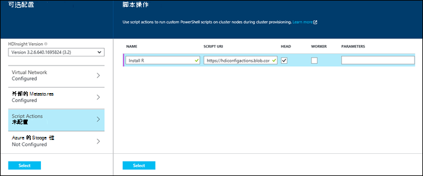

<properties
    pageTitle="自定义 HDInsight 群集使用脚本操作 |Microsoft Azure"
    description="了解如何自定义 HDInsight 群集使用脚本的操作。"
    services="hdinsight"
    documentationCenter=""
    authors="nitinme"
    manager="jhubbard"
    editor="cgronlun"
    tags="azure-portal"/>

<tags
    ms.service="hdinsight"
    ms.workload="big-data"
    ms.tgt_pltfrm="na"
    ms.devlang="na"
    ms.topic="article"
    ms.date="10/05/2016"
    ms.author="nitinme"/>

# 自定义的基于 Windows 的 HDInsight 群集使用脚本操作

**脚本操作**可用于在群集上安装其他软件的群集创建过程中调用[自定义脚本](hdinsight-hadoop-script-actions.md)。

这篇文章中的信息是特定于基于 Windows HDInsight 群集。 基于 Linux 的群集，请参阅[自定义 Linux 基于 HDInsight 群集使用脚本的操作](hdinsight-hadoop-customize-cluster-linux.md)。 

HDInsight 群集可以自定义多种其他方式，如包括其他 Azure 存储帐户，更改 Hadoop 配置文件 （核心 site.xml，配置单元 site.xml，等等），或添加到群集中的常见位置共享库 （例如，配置单元，Oozie）。 这些自定义项可以通过 Azure PowerShell，Azure HDInsight.NET SDK 或 Azure 门户网站。 有关详细信息，请参阅[创建 Hadoop 群集中 HDInsight][hdinsight-provision-cluster]。

[AZURE.INCLUDE [upgrade-powershell](../../includes/hdinsight-use-latest-powershell-cli-and-dotnet-sdk.md)]

## 将操作脚本保存在群集创建过程中

在创建群集时仅使用脚本的操作。 下图演示在创建过程中执行脚本操作时︰

![HDInsight 群集进行自定义和在群集创建过程的阶段][img-hdi-cluster-states]

当运行该脚本时，群集将进入**ClusterCustomization**舞台。 在此阶段，该脚本下系统管理员帐户在群集中，所有指定的节点上并行运行并在该节点上提供完全的管理员权限。

> [AZURE.NOTE] 因为**ClusterCustomization**阶段在群集节点上有管理员权限，可以使用脚本来执行操作，如停止和启动服务，包括与 Hadoop 相关的服务。 因此，作为一部分的脚本，您必须确保 Ambari 服务和其它与 Hadoop 相关服务启动并运行该脚本完成运行之前。 这些服务需要在创建时成功地确定群集的状态和正常运行。 如果您更改任何这些服务会影响群集上的配置，必须使用提供帮助器函数。 对有关 helper 函数的详细信息，请参见[开发脚本操作脚本 HDInsight][hdinsight-write-script]。

输出和错误日志中的脚本存储在群集中指定的默认存储帐户。 日志都存储在一个表的名称**u < \cluster-name-fragment >< \time-stamp > setuplog**。 这些都是聚合日志中的所有节点上 （head 节点和辅助节点） 在群集中运行的脚本。

每个群集可以接受指定它们的顺序调用多个脚本操作。 可以在头节点和 / 或辅助节点上运行脚本。

HDInsight 提供几个脚本 HDInsight 群集上安装以下组件︰

名称 | 脚本
----- | -----
**安装触发** | https://hdiconfigactions.blob.core.windows.net/sparkconfigactionv03/spark-installer-v03.ps1。 请参阅[安装和使用 HDInsight 群集上激励][hdinsight-install-spark]。
**R 安装** | https://hdiconfigactions.blob.core.windows.net/rconfigactionv02/r-installer-v02.ps1。 请参阅[安装和使用 HDInsight 群集上的 R][hdinsight-install-r]。
**安装 Solr** | https://hdiconfigactions.blob.core.windows.net/solrconfigactionv01/solr-installer-v01.ps1。 [Solr 在 HDInsight 上的安装和使用群集](hdinsight-hadoop-solr-install.md)，请参阅。
- **安装 Giraph** | https://hdiconfigactions.blob.core.windows.net/giraphconfigactionv01/giraph-installer-v01.ps1。 请参阅[Giraph 在 HDInsight 上的安装和使用群集](hdinsight-hadoop-giraph-install.md)。
| **预加载配置单元库** | https://hdiconfigactions.blob.core.windows.net/setupcustomhivelibsv01/setup-customhivelibs-v01.ps1。 请参阅[HDInsight 群集添加配置单元库](hdinsight-hadoop-add-hive-libraries.md) |

## 调用脚本使用 Azure 门户

**从 Azure 门户**

1. 开始在[创建 Hadoop 群集在 HDInsight 中的](hdinsight-provision-clusters.md#portal)所述创建一个群集。
2. 在可选配置，**脚本操作**刀片式服务器，请单击**添加脚本操作**以提供详细信息的脚本操作，如下所示︰

    

    <table border='1'>
        <tr><th>属性</th><th>值</th></tr>
        <tr><td>名称</td>
            <td>指定脚本动作的名称。</td></tr>
        <tr><td>脚本的 URI</td>
            <td>指定调用自定义群集脚本的 URI。 s</td></tr>
        <tr><td>头/工作人员</td>
            <td>在运行自定义脚本时指定节点 （**头部**或**工作人员**）。</b>.
        <tr><td>参数</td>
            <td>指定的参数，如果所需的脚本。</td></tr>
    </table>

    按回车键以添加要在群集上安装多个组件的多个脚本操作。

3. 单击**选择**保存脚本操作配置并继续创建群集。

## 调用使用 Azure PowerShell 的脚本

此下列 PowerShell 脚本演示如何在 Windows 根据 HDInsight 群集上安装触发。  

    # Provide values for these variables
    $subscriptionID = "<Azure Suscription ID>" # After "Login-AzureRmAccount", use "Get-AzureRmSubscription" to list IDs.

    $nameToken = "<Enter A Name Token>"  # The token is use to create Azure service names.
    $namePrefix = $nameToken.ToLower() + (Get-Date -Format "MMdd")
    
    $resourceGroupName = $namePrefix + "rg"
    $location = "EAST US 2" # used for creating resource group, storage account, and HDInsight cluster.
    
    $hdinsightClusterName = $namePrefix + "spark"
    $httpUserName = "admin"
    $httpPassword = "<Enter a Password>"
    
    $defaultStorageAccountName = "$namePrefix" + "store"
    $defaultBlobContainerName = $hdinsightClusterName
    
    #############################################################
    # Connect to Azure
    #############################################################
    
    Try{
        Get-AzureRmSubscription
    }
    Catch{
        Login-AzureRmAccount
    }
    Select-AzureRmSubscription -SubscriptionId $subscriptionID
    
    #############################################################
    # Prepare the dependent components
    #############################################################
    
    # Create resource group
    New-AzureRmResourceGroup -Name $resourceGroupName -Location $location
    
    # Create storage account
    New-AzureRmStorageAccount `
        -ResourceGroupName $resourceGroupName `
        -Name $defaultStorageAccountName `
        -Location $location `
        -Type Standard_GRS
    $defaultStorageAccountKey = (Get-AzureRmStorageAccountKey `
                                    -ResourceGroupName $resourceGroupName `
                                    -Name $defaultStorageAccountName)[0].Value
    $defaultStorageAccountContext = New-AzureStorageContext `
                                    -StorageAccountName $defaultStorageAccountName `
                                    -StorageAccountKey $storageAccountKey  
    New-AzureStorageContainer `
        -Name $defaultBlobContainerName `
        -Context $defaultStorageAccountContext
    
    #############################################################
    # Create cluster with ApacheSpark
    #############################################################
    
    # Specify the configuration options
    $config = New-AzureRmHDInsightClusterConfig `
                -DefaultStorageAccountName "$defaultStorageAccountName.blob.core.windows.net" `
                -DefaultStorageAccountKey $defaultStorageAccountKey 
                
    
    # Add a script action to the cluster configuration
    $config = Add-AzureRmHDInsightScriptAction `
                -Config $config `
                -Name "Install Spark" `
                -NodeType HeadNode `
                -Uri https://hdiconfigactions.blob.core.windows.net/sparkconfigactionv03/spark-installer-v03.ps1 `
    
    # Start creating a cluster with Spark installed
    New-AzureRmHDInsightCluster `
            -ResourceGroupName $resourceGroupName `
            -ClusterName $hdinsightClusterName `
            -Location $location `
            -ClusterSizeInNodes 2 `
            -ClusterType Hadoop `
            -OSType Windows `
            -DefaultStorageContainer $defaultBlobContainerName `
            -Config $config

若要安装其他的软件，您需要替换脚本中的脚本文件︰

出现提示时，输入群集的凭据。 它可能需要几分钟才能创建群集。

## 使用.NET SDK 调用脚本 

下面的示例演示如何在 Windows 根据 HDInsight 群集上安装触发。 若要安装其他的软件，您将需要替换代码中的脚本文件。

**若要创建具有触发的 HDInsight 群集** 

1. 在 Visual Studio 中创建一个 C# 控制台应用程序。
2. 从 Nuget 程序包管理器控制台上运行以下命令。

        Install-Package Microsoft.Rest.ClientRuntime.Azure.Authentication -Pre
        Install-Package Microsoft.Azure.Management.ResourceManager -Pre
        Install-Package Microsoft.Azure.Management.HDInsight

2. 使用以下方法使用 Program.cs 文件中的语句︰

        using System;
        using System.Security;
        using Microsoft.Azure;
        using Microsoft.Azure.Management.HDInsight;
        using Microsoft.Azure.Management.HDInsight.Models;
        using Microsoft.Azure.Management.ResourceManager;
        using Microsoft.IdentityModel.Clients.ActiveDirectory;
        using Microsoft.Rest;
        using Microsoft.Rest.Azure.Authentication;

3. 放置在类中使用以下代码︰

        private static HDInsightManagementClient _hdiManagementClient;

        // Replace with your AAD tenant ID if necessary
        private const string TenantId = UserTokenProvider.CommonTenantId; 
        private const string SubscriptionId = "<Your Azure Subscription ID>";
        // This is the GUID for the PowerShell client. Used for interactive logins in this example.
        private const string ClientId = "1950a258-227b-4e31-a9cf-717495945fc2";
        private const string ResourceGroupName = "<ExistingAzureResourceGroupName>";
        private const string NewClusterName = "<NewAzureHDInsightClusterName>";
        private const int NewClusterNumWorkerNodes = 2;
        private const string NewClusterLocation = "East US";
        private const string NewClusterVersion = "3.2";
        private const string ExistingStorageName = "<ExistingAzureStorageAccountName>";
        private const string ExistingStorageKey = "<ExistingAzureStorageAccountKey>";
        private const string ExistingContainer = "<ExistingAzureBlobStorageContainer>";
        private const string NewClusterType = "Hadoop";
        private const OSType NewClusterOSType = OSType.Windows;
        private const string NewClusterUsername = "<HttpUserName>";
        private const string NewClusterPassword = "<HttpUserPassword>";

        static void Main(string[] args)
        {
            System.Console.WriteLine("Running");

            // Authenticate and get a token
            var authToken = Authenticate(TenantId, ClientId, SubscriptionId);
            // Flag subscription for HDInsight, if it isn't already.
            EnableHDInsight(authToken);
            // Get an HDInsight management client
            _hdiManagementClient = new HDInsightManagementClient(authToken);

            CreateCluster();
        }

        private static void CreateCluster()
        {
            var parameters = new ClusterCreateParameters
            {
                ClusterSizeInNodes = NewClusterNumWorkerNodes,
                Location = NewClusterLocation,
                ClusterType = NewClusterType,
                OSType = NewClusterOSType,
                Version = NewClusterVersion,

                DefaultStorageAccountName = ExistingStorageName,
                DefaultStorageAccountKey = ExistingStorageKey,
                DefaultStorageContainer = ExistingContainer,

                UserName = NewClusterUsername,
                Password = NewClusterPassword,
            };

            ScriptAction sparkScriptAction = new ScriptAction("Install Spark",
                new Uri("https://hdiconfigactions.blob.core.windows.net/sparkconfigactionv03/spark-installer-v03.ps1"), "");

            parameters.ScriptActions.Add(ClusterNodeType.HeadNode, new System.Collections.Generic.List<ScriptAction> { sparkScriptAction });
            parameters.ScriptActions.Add(ClusterNodeType.WorkerNode, new System.Collections.Generic.List<ScriptAction> { sparkScriptAction });

            _hdiManagementClient.Clusters.Create(ResourceGroupName, NewClusterName, parameters);
        }

        /// 

        /// Authenticate to an Azure subscription and retrieve an authentication token
        /// 

        /// <param name="TenantId">The AAD tenant ID</param>
        /// <param name="ClientId">The AAD client ID</param>
        /// <param name="SubscriptionId">The Azure subscription ID</param>
        /// <returns></returns>
        static TokenCloudCredentials Authenticate(string TenantId, string ClientId, string SubscriptionId)
        {
            var authContext = new AuthenticationContext("https://login.microsoftonline.com/" + TenantId);
            var tokenAuthResult = authContext.AcquireToken("https://management.core.windows.net/", 
                ClientId, 
                new Uri("urn:ietf:wg:oauth:2.0:oob"), 
                PromptBehavior.Always, 
                UserIdentifier.AnyUser);
            return new TokenCloudCredentials(SubscriptionId, tokenAuthResult.AccessToken);
        }
        /// 

        /// Marks your subscription as one that can use HDInsight, if it has not already been marked as such.
        /// 

        /// <remarks>This is essentially a one-time action; if you have already done something with HDInsight
        /// on your subscription, then this isn't needed at all and will do nothing.</remarks>
        /// <param name="authToken">An authentication token for your Azure subscription</param>
        static void EnableHDInsight(TokenCloudCredentials authToken)
        {
            // Create a client for the Resource manager and set the subscription ID
            var resourceManagementClient = new ResourceManagementClient(new TokenCredentials(authToken.Token));
            resourceManagementClient.SubscriptionId = SubscriptionId;
            // Register the HDInsight provider
            var rpResult = resourceManagementClient.Providers.Register("Microsoft.HDInsight");
        }

4. 按**f5 键**以运行该应用程序。

## 对 HDInsight 群集上使用的开放源码软件的支持
Microsoft Azure HDInsight 服务是使您能够通过使用 Hadoop 周围形成的开放源代码技术体系构建大数据在云中的应用程序的灵活平台。 Microsoft Azure <a href="http://azure.microsoft.com/support/faq/" target="_blank">Azure 支持常见问题网站</a>的**支持范围**部分中所述，开放源码技术，提供一般意义上的支持。 HDInsight 服务提供额外的支持的某些组件，如下所述。

有两种类型的 HDInsight 服务中可用的开源的组件︰

- **内置组件**-HDInsight 群集上预先安装了这些组件，并提供核心功能的群集。 例如，YARN ResourceManager、 配置单元查询语言 (HiveQL) 和 Mahout 库都属于此类别。 群集组件的完整列表位于[由 HDInsight 提供的 Hadoop 群集版本中的新增功能？](hdinsight-component-versioning.md)</a>.
- **自定义组件**，以在群集中，用户可以安装或使用您的工作负载在社区中提供或由您创建的任何组件。

完全支持内置组件，并可以帮助 Microsoft 技术支持来隔离并解决与这些组件相关的问题。

> [AZURE.WARNING] 完全支持使用 HDInsight 群集提供组件和 Microsoft 支持将有助于确定和解决与这些组件相关的问题。
>
> 自定义组件接收商业上合理的支持，以帮助您进一步排查该问题。 这可能导致解决问题或要求您能够进行深入的专业技能，为该技术在其中找到的开放源代码技术可用的频道。 例如，有许多社区站点可以使用，如︰ [HDInsight 的 MSDN 论坛](https://social.msdn.microsoft.com/Forums/azure/en-US/home?forum=hdinsight)、 [http://stackoverflow.com](http://stackoverflow.com)。 Apache 项目还有项目网站上[http://apache.org](http://apache.org)，例如︰ [Hadoop](http://hadoop.apache.org/)，[触发](http://spark.apache.org/)。

HDInsight 服务提供了多种方法用于自定义组件。 不管如何使用或在群集上安装组件，适用于相同级别的支持。 下面是最常见的方式，可以在 HDInsight 群集上使用自定义组件的列表︰

1. 可以将作业提交的 Hadoop 或其他类型的作业的执行或使用自定义组件提交到群集。
2. 群集的自定义-在群集创建过程中您可以指定其他设置和自定义将在群集节点安装的组件。
3. 示例-常见的自定义组件、 Microsoft 和其他公司可能会提供如何在 HDInsight 群集上使用这些组件的示例。 不支持的情况下提供了这些示例。

## 开发脚本操作脚本

请参阅[HDInsight 的开发脚本操作脚本][hdinsight-write-script]。

## 请参见

- [在 HDInsight 中创建 Hadoop 群集][ hdinsight-provision-cluster] HDInsight 群集通过使用来创建其他自定义选项提供了指导。
- [HDInsight 为开发脚本操作脚本][hdinsight-write-script]
- [安装和使用 HDInsight 群集上触发][hdinsight-install-spark]
- [上安装和使用 R HDInsight 群集][hdinsight-install-r]
- [Solr 在 HDInsight 上的安装和使用群集](hdinsight-hadoop-solr-install.md)。
- [Giraph 在 HDInsight 上的安装和使用群集](hdinsight-hadoop-giraph-install.md)。

[hdinsight-install-spark]: hdinsight-hadoop-spark-install.md
[hdinsight-install-r]: hdinsight-hadoop-r-scripts.md
[hdinsight-write-script]: hdinsight-hadoop-script-actions.md
[hdinsight-provision-cluster]: hdinsight-provision-clusters.md
[powershell-install-configure]: powershell-install-configure.md

[img-hdi-cluster-states]: ./media/hdinsight-hadoop-customize-cluster/HDI-Cluster-state.png "在群集创建过程的阶段"
