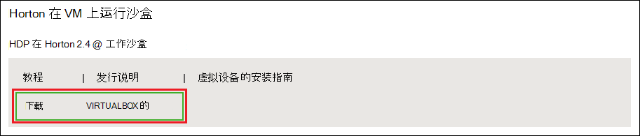
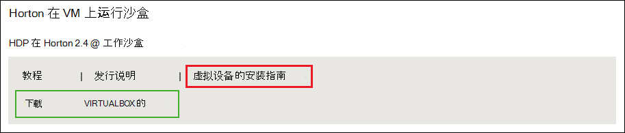
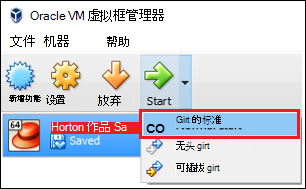

<properties
    pageTitle="使用 Hadoop 沙盒来了解 Hadoop |Microsoft Azure"
    description="若要开始学习有关使用 Hadoop 的生态系统，您可以设置 Hadoop 沙箱从 Hortonworks Azure 的虚拟机上。 "
    keywords="hadoop 的仿真程序，hadoop 沙盒"
    editor="cgronlun"
    manager="jhubbard"
    services="hdinsight"
    authors="nitinme"
    documentationCenter=""
    tags="azure-portal"/>

<tags
    ms.service="hdinsight"
    ms.workload="big-data"
    ms.tgt_pltfrm="na"
    ms.devlang="na"
    ms.topic="article"
    ms.date="08/24/2016"
    ms.author="nitinme"/>

# 开始在虚拟机上的 Hadoop 的 Hadoop 生态系统

了解如何安装从 Hortonworks 的 Hadoop 沙盒，若要了解有关 Hadoop 生态系统的虚拟机上。 在沙箱提供本地开发环境，以了解有关 Hadoop，Hadoop 分布式文件系统 (HDFS) 和作业提交。

## 系统必备组件

* [Oracle VirtualBox](https://www.virtualbox.org/)

一旦您熟悉 Hadoop，可以开始创建 HDInsight 群集在 Azure 上使用 Hadoop。 如何开始的详细信息，请参阅[开始使用 Hadoop HDInsight 上](hdinsight-hadoop-linux-tutorial-get-started.md)。

## 下载并安装虚拟机

1. [Http://hortonworks.com/downloads/#sandbox](http://hortonworks.com/downloads/#sandbox)，选择在 Hortonworks 沙盒 HDP 2.4__对于 VIRTUALBOX 下载__项。 系统将提示您注册 Hortonworks 下载开始之前。

    

2. 从相同的 web 页中，选择上 Hortonworks 沙盒 HDP 2.4 __VirtualBox 安装指南__。 这将下载 PDF 包含虚拟机的安装说明。

    

## 启动虚拟机

1. 启动 VirtualBox，选择 Hortonworks 沙盒，选择__开始__，然后__正常启动__。

    

2. 虚拟机已完成启动过程，则它将显示登录说明。 打开 web 浏览器，然后定位到的 URL 显示 (通常为 http://127.0.0.1:8888)。

## 设置密码

1. 从 Hortonworks 沙盒页的__入门__步骤中，选择__查看高级选项__。 在沙盒使用 SSH 登录到此页上使用的信息。 使用的用户名和密码提供。

    > [AZURE.NOTE] 如果您没有安装 SSH 客户端，则可以使用基于 web 的 SSH 提供在虚拟机__http://localhost:4200 /__。

    第一次连接使用 SSH，您将被提示更改超级用户帐户的密码。 请输入一个新密码，在将来使用 SSH 登录时，将使用。

2. 登录后，请输入以下命令︰

        ambari-admin-password-reset
    
    出现提示时，提供 Ambari 使用管理员帐户的密码。 当您访问 Ambari Web 用户界面将使用此。

## 使用配置单元命令

1. 从到的沙箱的 SSH 连接，使用下面的命令来启动配置单元外壳程序︰

        hive

2. 外壳程序启动后，使用以下方法来查看提供沙盒的表︰

        show tables;

3. 使用以下方法来检索从 10 行`sample_07`表︰

        select * from sample_07 limit 10;

## 下一步行动

* [了解如何使用 Visual Studio Hortonworks 沙盒](hdinsight-hadoop-emulator-visual-studio.md)
* [学习的 Hortonworks 沙箱方面的诀窍](http://hortonworks.com/hadoop-tutorial/learning-the-ropes-of-the-hortonworks-sandbox/)
* [Hadoop 教程-HDP 入门](http://hortonworks.com/hadoop-tutorial/hello-world-an-introduction-to-hadoop-hcatalog-hive-and-pig/)