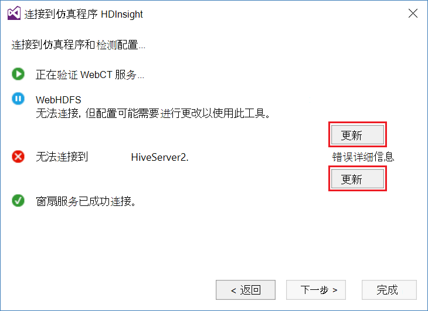
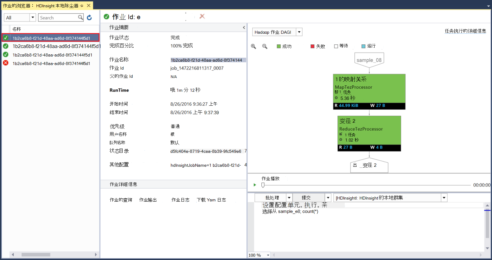

<properties
pageTitle="使用 Visual Studio Hortonworks 沙盒与 Microsoft Azure 数据湖工具 |Microsoft Azure"
description="了解如何通过来使用 Azure 数据湖工具 VIsual studio Hortonworks 沙盒 （在本地虚拟机正在运行）。利用这些工具，可以创建并运行配置单元和猪的作业上的沙盒并查看作业输出和历史记录。"
services="hdinsight"
documentationCenter=""
authors="Blackmist"
manager="paulettm"
editor="cgronlun"/>

<tags
ms.service="hdinsight"
ms.devlang="na"
ms.topic="article"
ms.tgt_pltfrm="na"
ms.workload="big-data"
ms.date="08/26/2016"
ms.author="larryfr"/>

# 对于 Hortonworks 沙盒使用 Visual Studio 中使用 Azure 数据湖工具

Visual Studio 的 Azure 数据湖工具包括用于处理一般的 Hadoop 群集，除了使用 Azure 数据湖和 HDInsight 的工具的工具。 本文档提供在本地虚拟机上运行的 Hortonworks 沙盒中使用 Azure 数据湖工具所需的步骤。

使用 Hortonworks 沙箱可以使用 Hadoop 本地开发环境。 一旦您已经开发了一种解决方案，想要将其部署在规模，然后可以移动到 HDInsight 群集。

## 系统必备组件

* 在您的开发环境在虚拟机上运行 Hortonworks 沙盒。 本文档是编写和测试与运行在 Oracle VirtualBox，[开始在 Hadoop 生态系统](hdinsight-hadoop-emulator-get-started.md)文档中使用的信息配置沙盒。

* Visual Studio 2013年或 2015，任何版本。

* [.NET 的 Azure SDK](https://azure.microsoft.com/downloads/) 2.7.1 或更高版本

* [Azure 数据湖 Visual Studio 工具](https://www.microsoft.com/download/details.aspx?id=49504)

## 配置沙盒的密码

请确保运行时 Hortonworks 沙盒，然后按照[入门的 Hadoop 生态系统中](hdinsight-hadoop-emulator-get-started.md#set-passwords)配置的密码的 SSH`root`帐户，并 Ambari`admin`帐户。 连接到沙箱从 Visual Studio 时将使用这些密码。

## 连接到沙盒的工具

1. 打开 Visual Studio，然后选择__视图__，然后__服务器资源管理器__。

2. 从__服务器资源管理器中__，右击__HDInsight__项目中，，然后选择__连接到 HDInsight 模拟器__。

    

3. 从__连接到 HDInsight 仿真程序__对话框中，输入您为 Ambari 配置的密码。

    

    选择__下一步__以继续。

4. 使用__密码__字段输入您为配置密码`root`帐户。 将其他字段的默认值。

    

    选择__下一步__以继续。

5. 等待验证的服务来完成。 在某些情况下，验证可能会失败，并且提示您更新配置。 这种情况下，选择__更新__按钮，并等待配置和验证服务来完成。

    

    > [AZURE.NOTE] 更新过程将使用 Ambari 来修改 Hortonworks 沙盒配置到 Azure 数据湖工具 Visual Studio 的期望值。

    完成验证后，选择__完成__完成配置。

    

    > [AZURE.NOTE] 这取决于您的开发环境和分配给虚拟机的内存量的速度，可能需要几分钟时间来配置和验证服务。

完这些步骤后，您现在拥有服务器资源管理器中的"HDInsight 本地群集"条目下的 HDInsight 部分。

## 编写配置单元查询

配置单元提供一种类似于 SQL 的查询语言 (HiveQL，) 使用结构化数据。 使用以下步骤来了解如何对本地群集运行 ad hoc 查询。

1. 在__服务器资源管理器__中用鼠标右键单击本地群集之前，添加的条目，然后选择__写入配置单元查询__。

    

    这将打开一个新的查询窗口，使您可以快速输入和提交查询本地群集。

2. 在新建查询窗口中，输入以下命令︰

        select count(*) from sample_08;
    
    从查询窗口的顶部，确保选中了本地群集，则该配置，然后选择__提交__。 保留默认值的其他值 （__批处理__和服务器名称）。

    

    请注意，您还可以使用__提交__旁的下拉菜单选择__高级__。 这将打开一个对话框，允许您在提交作业时提供更多选项。

    

3. 一旦您提交查询时，将显示作业状态。 这在岗上提供的信息，因为它由 Hadoop 处理。 __作业状态__项提供了作业的当前状态。 将定期更新的状态，或您可以使用刷新图标来手动刷新状态。

    

    一旦__作业状态__更改为__已完成__时，将显示定向非循环图 (DAG)。 这就由 Tez （默认执行引擎的配置单元在本地群集。） 的执行路径 
    
    > [AZURE.NOTE] 使用基于 Linux 的 HDInsight 群集时，Tez 也是默认值。 它不是默认值，在基于 Windows 的 HDInsight;要使用它，您必须添加行`set hive.execution.engine = tez;`配置单元查询的开头。 

    使用__作业输出__链接以查看输出。 在这种情况下，它是__823__;sample_08 表中的行数。 通过使用__作业日志__和__下载 YARN 日志__链接，可以查看有关作业的诊断信息。

4. 此外可以通过更改__批处理__字段到__交互__，以交互方式运行配置单元的作业，然后再选择__执行__。 

    

    这流到__HiveServer2 输出__窗口处理过程中生成的输出日志。
    
    > [AZURE.NOTE] 这是完成作业后__作业日志__链接中可用的相同信息。

    

## 创建一个配置单元项目

您还可以创建一个包含多个配置单元脚本项目。 您有相关的脚本，您需要将放在一起，或维护使用版本控制系统时，这非常有用。

1. 在 Visual Studio 中，选择__文件__、__新建__和 then__Project__。

2. 从项目列表中，展开__模板__， __Azure 数据湖__，然后选择__配置单元 (HDInsight)__。 从模板列表中，选择__配置单元的示例__。 输入的名称和位置，然后选择__确定__。

    

__配置单元的示例__项目包含两个脚本， __WebLogAnalysis.hql__和__SensorDataAnalysis.hql__。 您可以提交这些使用相同的__提交__按钮，在窗口的顶部。

## 创建一个猪的项目

虽然配置单元为处理结构化数据提供了一种类似于 SQL 的语言，小猪提供了允许您开发应用于数据的变换的管线的语言 （猪的拉丁语）。 使用以下步骤对本地群集使用猪的。

1. 打开 Visual Studio 并选择__文件__、__新建__和__项目__。 从项目列表中，展开__模板__， __Azure 数据湖__，，然后选择__猪 (HDInsight)__。 从模板列表中，选择__小猪应用__。 输入的名称、 位置，然后选择__确定__。

    

2. 输入与此项目创建的__script.pig__文件的内容如下。

        a = LOAD '/demo/data/Website/Website-Logs' AS (
            log_id:int, 
            ip_address:chararray, 
            date:chararray, 
            time:chararray, 
            landing_page:chararray, 
            source:chararray);
        b = FILTER a BY (log_id > 100);
        c = GROUP b BY ip_address;
        DUMP c;

    虽然猪比配置单元使用另一种语言，运行这些作业的方式是__提交__按钮通过两种语言之间保持一致。 小猪旁边__提交__下选择下拉显示高级的提交对话框。

    
    
3. 作业状态和输出也是作为配置单元查询显示相同。

    

## 查看作业

Azure 数据湖工具还允许您方便地查看信息作业已运行 Hadoop 上。 使用以下步骤来查看在本地群集上运行的作业已。

1. 从__服务器资源管理器中__，在本地群集中，右键单击，然后选择__查看作业__。 这将向群集中显示已提交的作业的列表。

    

2. 从作业列表中，选择一个要查看作业的详细信息。

    

    显示的信息是类似于您在运行查询配置单元或小猪，带有链接查看输出和日志信息后看到的内容。

3. 您还可以修改和重新提交的作业在这里。

## 查看配置单元数据库

1. 在__服务器资源管理器__中展开__HDInsight 本地群集__项，然后再展开__配置单元数据库__。 这将显示在本地群集的__默认__和__xademo__数据库。 扩充数据库显示数据库中的表。

    

2. 展开表将显示该表的列。 可以用鼠标右键单击表并选择要快速查看数据的__视图顶部 100 行__。

    

### 数据库和表属性

您可能已经注意到，您可以选择要查看在数据库或表__属性__。 这将在属性窗口中显示所选物料的详细信息。

### 创建表

若要创建一个新表，右击数据库，然后选择__创建表__。

然后，您可以使用窗体的表。 您可以看到原始的 HiveQL，可用于在此页的底部创建表。

## 下一步行动

* [学习的 Hortonworks 沙箱方面的诀窍](http://hortonworks.com/hadoop-tutorial/learning-the-ropes-of-the-hortonworks-sandbox/)
* [Hadoop 教程-HDP 入门](http://hortonworks.com/hadoop-tutorial/hello-world-an-introduction-to-hadoop-hcatalog-hive-and-pig/)