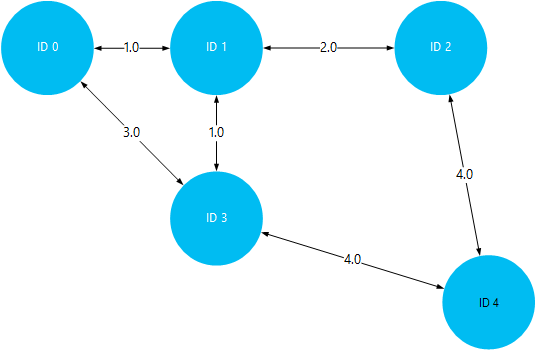

<properties
    pageTitle="安装和使用 Hadoop 群集在 HDInsight 上的 Giraph |Microsoft Azure"
    description="了解如何自定义与 Giraph，HDInsight 群集以及如何使用 Giraph。"
    services="hdinsight"
    documentationCenter=""
    authors="nitinme"
    manager="jhubbard"
    editor="cgronlun"
    tags="azure-portal"/>

<tags
    ms.service="hdinsight"
    ms.workload="big-data"
    ms.tgt_pltfrm="na"
    ms.devlang="na"
    ms.topic="article"
    ms.date="02/05/2016"
    ms.author="nitinme"/>

# 安装和使用在 HDInsight Giraph

了解如何使用 Giraph 脚本操作，请使用自定义 Windows 根据的 HDInsight 群集以及如何使用 Giraph 来处理大规模的关系图。 在 Giraph 中使用基于 Linux 的群集的信息，请参阅[HDInsight Hadoop 群集 (Linux) 上安装 Giraph](hdinsight-hadoop-giraph-install-linux.md)。
 
通过*脚本操作*，可以在 Azure HDInsight 上安装 Giraph 在任何类型的群集 Hadoop，风暴，HBase （触发）。 只读的 Azure 存储 blob，在[https://hdiconfigactions.blob.core.windows.net/giraphconfigactionv01/giraph-installer-v01.ps1](https://hdiconfigactions.blob.core.windows.net/giraphconfigactionv01/giraph-installer-v01.ps1)提供了在 HDInsight 群集上安装 Giraph 的示例脚本。 示例脚本仅适用于 HDInsight 群集版本 3.1。 HDInsight 群集版本的详细信息，请参阅[HDInsight 群集版本](hdinsight-component-versioning.md)。

**相关的文章**

- [在 HDInsight Hadoop 群集 (Linux) 上安装 Giraph](hdinsight-hadoop-giraph-install-linux.md)
- [在 HDInsight 中的创建 Hadoop 群集](hdinsight-provision-clusters.md)︰ 创建 HDInsight 群集的一般信息。
- [自定义 HDInsight 群集使用脚本操作][hdinsight-cluster-customize]︰ 自定义 HDInsight 群集使用脚本操作的一般信息。
- [HDInsight 的开发脚本操作脚本](hdinsight-hadoop-script-actions.md)。

## Giraph 是什么？

<a href="http://giraph.apache.org/" target="_blank">Apache Giraph</a>允许您执行图形使用 Hadoop，处理，并可以使用 Azure HDInsight。 关系图的模型对象，如大型互联网，如网络上的路由器或上社交网络 （有时称为社交图） 的人之间的关系之间的连接之间的关系。 图形处理允许您为图中的对象之间的关系有关的原因如︰

- 根据您当前的关系识别潜在的朋友。
- 用于标识网络中的两台计算机之间最短的路线。
- 计算网页的网页排名。

## 安装 Giraph 使用门户

1. 通过开始创建群集使用的**自定义**选项，在[创建 Hadoop 群集在 HDInsight 中的](hdinsight-provision-clusters.md#portal)所述。
2. 在向导的**脚本操作**页上，单击**添加脚本操作**以提供详细信息的脚本操作，如下所示︰

    

    <table border='1'>
        <tr><th>属性</th><th>值</th></tr>
        <tr><td>名称</td>
            <td>指定脚本动作的名称。 例如，为<b>安装 Giraph</b>。</td></tr>
        <tr><td>脚本的 URI</td>
            <td>指定脚本调用自定义群集的统一资源标识符 (URI)。 例如， <i>https://hdiconfigactions.blob.core.windows.net/giraphconfigactionv01/giraph-installer-v01.ps1</i></td></tr>
        <tr><td>节点类型</td>
            <td>指定在其运行的自定义脚本的节点。 您可以选择<b>所有节点</b>、<b>只头节点</b>或<b>仅辅助节点</b>。
        <tr><td>参数</td>
            <td>指定的参数，如果所需的脚本。 要安装 Giraph 的脚本不需要任何参数，因此您可以将其留空。</td></tr>
    </table>

    您可以添加多个安装在群集上的多个组件的脚本操作。 添加脚本后，单击以开始创建群集的选中标记。

## 使用 Giraph

我们使用 SimpleShortestPathsComputation 的示例来演示用于查找图中的对象之间的最短路径的基本<a href = "http://people.apache.org/~edwardyoon/documents/pregel.pdf">Pregel</a>实现。 使用以下步骤上载示例数据和示例 jar，SimpleShortestPathsComputation 的例子，来运行作业，然后查看结果。

1. 将示例数据文件上载到 Azure Blob 存储。 在您的本地工作站上创建一个名为**tiny_graph.txt**的新文件。 它应该包含以下行︰

        [0,0,[[1,1],[3,3]]]
        [1,0,[[0,1],[2,2],[3,1]]]
        [2,0,[[1,2],[4,4]]]
        [3,0,[[0,3],[1,1],[4,4]]]
        [4,0,[[3,4],[2,4]]]

    将 tiny_graph.txt 文件上传到 HDInsight 群集的主存储。 有关如何上载数据的说明，请参阅[HDInsight 中的 Hadoop 作业的数据上载](hdinsight-upload-data.md)。

    此数据描述了有向图，使用的格式中的对象之间的关系 [源\_id、 源\_值，[[目标\_id]，[边缘\_值]，...]]。 每行表示之间的关系**源\_id**对象和一个或多个**目标\_id**对象。 **边缘\_值**（或粗细） 可以被认为是强度或**source_id**之间的连接的距离和**目标\_id**。

    绘制出、 并用作对象之间的距离的值 （或称重），上面的数据可能如下所示︰

    

4. 运行 SimpleShortestPathsComputation 的示例。 使用下面的 Azure PowerShell cmdlet 要运行该示例通过使用 tiny_graph.txt 文件作为输入。 

    [AZURE.INCLUDE [upgrade-powershell](../../includes/hdinsight-use-latest-powershell.md)]

        $clusterName = "clustername"
        # Giraph examples jar
        $jarFile = "wasbs:///example/jars/giraph-examples.jar"
        # Arguments for this job
        $jobArguments = "org.apache.giraph.examples.SimpleShortestPathsComputation",
                        "-ca", "mapred.job.tracker=headnodehost:9010",
                        "-vif", "org.apache.giraph.io.formats.JsonLongDoubleFloatDoubleVertexInputFormat",
                        "-vip", "wasbs:///example/data/tiny_graph.txt",
                        "-vof", "org.apache.giraph.io.formats.IdWithValueTextOutputFormat",
                        "-op",  "wasbs:///example/output/shortestpaths",
                        "-w", "2"
        # Create the definition
        $jobDefinition = New-AzureHDInsightMapReduceJobDefinition
          -JarFile $jarFile
          -ClassName "org.apache.giraph.GiraphRunner"
          -Arguments $jobArguments

        # Run the job, write output to the Azure PowerShell window
        $job = Start-AzureHDInsightJob -Cluster $clusterName -JobDefinition $jobDefinition
        Write-Host "Wait for the job to complete ..." -ForegroundColor Green
        Wait-AzureHDInsightJob -Job $job
        Write-Host "STDERR"
        Get-AzureHDInsightJobOutput -Cluster $clusterName -JobId $job.JobId -StandardError
        Write-Host "Display the standard output ..." -ForegroundColor Green
        Get-AzureHDInsightJobOutput -Cluster $clusterName -JobId $job.JobId -StandardOutput

    在上面的示例中，您已安装的 Giraph 的 HDInsight 群集的名称替换**群集名称**。

5. 查看结果。 完成作业后，结果将存储在中的两个输出文件中__wasbs: / 示例/出/shotestpaths__文件夹。 这些文件称为__m 的一部分 00001__和__部件-m-00002__。 执行以下步骤来下载并查看输出︰

        $subscriptionName = "<SubscriptionName>"       # Azure subscription name
        $storageAccountName = "<StorageAccountName>"   # Azure Storage account name
        $containerName = "<ContainerName>"             # Blob storage container name

        # Select the current subscription
        Select-AzureSubscription $subscriptionName

        # Create the Storage account context object
        $storageAccountKey = Get-AzureStorageKey $storageAccountName | %{ $_.Primary }
        $storageContext = New-AzureStorageContext -StorageAccountName $storageAccountName -StorageAccountKey $storageAccountKey

        # Download the job output to the workstation
        Get-AzureStorageBlobContent -Container $containerName -Blob example/output/shortestpaths/part-m-00001 -Context $storageContext -Force
        Get-AzureStorageBlobContent -Container $containerName -Blob example/output/shortestpaths/part-m-00002 -Context $storageContext -Force

    这将在您的工作站上的当前目录中创建的__示例/输出/shortestpaths__目录结构，并将两个输出文件下载到该位置。

    使用__Cat__ cmdlet 来显示文件的内容︰

        Cat example/output/shortestpaths/part*

    输出应类似于以下内容︰

        0   1.0
        4   5.0
        2   2.0
        1   0.0
        3   1.0

    示例是硬编码在开头使用 SimpleShortestPathComputation 对象 ID 为 1，并查找其他对象的最短路径。 因此应作为读取输出`destination_id distance`，其中距离是旅游过的对象 ID 1 和目标 ID 之间的边缘值 （或称重）

    直观显示这种情况，可以通过旅行 ID 1 和所有其他对象之间的最短路径验证结果。 请注意，ID 1 和 ID 4 之间的最短路径 5。 这是ID 1 和 3，然后ID 3 和 4之间的总距离。

    

## 安装 Giraph 使用 Aure PowerShell

请参阅[自定义 HDInsight 群集使用脚本的操作](hdinsight-hadoop-customize-cluster.md#call_scripts_using_powershell)。  此示例说明如何安装使用 Azure PowerShell 的触发。 您需要自定义脚本，以使用[https://hdiconfigactions.blob.core.windows.net/giraphconfigactionv01/giraph-installer-v01.ps1](https://hdiconfigactions.blob.core.windows.net/giraphconfigactionv01/giraph-installer-v01.ps1)。

## 安装使用.NET SDK Giraph

请参阅[自定义 HDInsight 群集使用脚本的操作](hdinsight-hadoop-customize-cluster.md#call_scripts_using_azure_powershell)。 此示例说明如何安装使用.NET SDK 的触发。 您需要自定义脚本，以使用[https://hdiconfigactions.blob.core.windows.net/giraphconfigactionv01/giraph-installer-v01.ps1](https://hdiconfigactions.blob.core.windows.net/giraphconfigactionv01/giraph-installer-v01.ps1)。

## 请参见

- [在 HDInsight Hadoop 群集 (Linux) 上安装 Giraph](hdinsight-hadoop-giraph-install-linux.md)
- [在 HDInsight 中的创建 Hadoop 群集](hdinsight-provision-clusters.md)︰ 创建 HDInsight 群集的一般信息。
- [自定义 HDInsight 群集使用脚本操作][hdinsight-cluster-customize]︰ 自定义 HDInsight 群集使用脚本操作的一般信息。
- [HDInsight 的开发脚本操作脚本](hdinsight-hadoop-script-actions.md)。
- [安装和使用 HDInsight 群集上触发][hdinsight-install-spark]︰ 有关安装触发的脚本操作示例。
- [在 HDInsight 群集上安装 R][hdinsight-install-r]︰ 有关安装 R.脚本操作示例
- [在 HDInsight 群集上安装 Solr](hdinsight-hadoop-solr-install.md)︰ 有关安装 Solr 的脚本操作示例。

[tools]: https://github.com/Blackmist/hdinsight-tools
[aps]: http://azure.microsoft.com/documentation/articles/install-configure-powershell/

[powershell-install]: ../powershell-install-configure.md
[hdinsight-provision]: hdinsight-provision-clusters.md
[hdinsight-install-r]: hdinsight-hadoop-r-scripts.md
[hdinsight-install-spark]: hdinsight-hadoop-spark-install.md
[hdinsight-cluster-customize]: hdinsight-hadoop-customize-cluster.md
