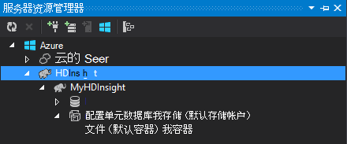

<properties
    pageTitle="对配置单元和猪的 Hadoop 在 HDInsight 上使用 C# |Microsoft Azure"
    description="了解如何使用 C# 的用户定义函数 (UDF) 配置单元和 Azure HDInsight 中流的小猪。"
    services="hdinsight"
    documentationCenter=""
    authors="Blackmist"
    manager="jhubbard"
    editor="cgronlun"
    tags="azure-portal"/>

<tags
    ms.service="hdinsight"
    ms.workload="big-data"
    ms.tgt_pltfrm="na"
    ms.devlang="dotnet"
    ms.topic="article"
    ms.date="10/28/2016"
    ms.author="larryfr"/>

#使用配置单元和猪流在 Hadoop HDInsight 在 C# 用户定义函数

配置单元和小猪非常适合在 Azure HDInsight 中使用数据，但是有时您需要一种更通用的语言。 配置单元和小猪，可以调用用户定义函数 (Udf) 或流通过外部代码。

在本文中，了解如何使用 C# 配置单元和小猪。

##系统必备组件

* Windows 7 或更高版本。

* 与以下版本的 Visual Studio:

    * Visual Studio 2012 专业/高级/旗舰版与[更新 4](http://www.microsoft.com/download/details.aspx?id=39305)

    * Visual Studio 2013年社区/专业/高级/旗舰版与[更新 4](https://www.microsoft.com/download/details.aspx?id=44921)

    * Visual Studio 2015 年

* Hadoop HDInsight 群集-上的看到[HDInsight 群集提供](hdinsight-provision-clusters.md)的步骤创建群集

* Visual Studio 的 Hadoop 工具。 有关安装和配置这些工具的步骤，请参阅[开始使用 Visual Studio 的 HDInsight Hadoop 工具](hdinsight-hadoop-visual-studio-tools-get-started.md)。

##在 HDInsight 上的.NET

默认情况下，基于 Windows 的 HDInsight 群集上安装.NET 公共语言运行时 (CLR) 和框架。 这使您可以使用 C# 应用程序配置单元和小猪流 （间传输数据时每个猪的配置单元和 C# 应用程序通过标准输出/stdin）。

> [AZURE.NOTE] 目前，并不支持基于 linux * 的 HDInsight 群集上运行.NET Framework Udf。 

##.NET 和流

流式处理涉及配置单元，并将数据传递给外部应用程序中，对标准输出，并通过标准输入接收结果的小猪。 对于 C# 应用程序，这最容易实现的通过`Console.ReadLine()`， `Console.WriteLine()`。

由于需要调用应用程序在运行时配置单元和小猪，则**控制台应用程序**模板应使用 C# 项目。

##配置单元和 C 和 #35;

###创建 C# 项目

1. 打开 Visual Studio 并创建一个新的解决方案。 项目类型中，选择**控制台应用程序**，并命名为**HiveCSharp**的新项目。

2. **Program.cs**中的内容替换为以下︰

        using System;
        using System.Security.Cryptography;
        using System.Text;
        using System.Threading.Tasks;

        namespace HiveCSharp
        {
            class Program
            {
                static void Main(string[] args)
                {
                    string line;
                    // Read stdin in a loop
                    while ((line = Console.ReadLine()) != null)
                    {
                        // Parse the string, trimming line feeds
                        // and splitting fields at tabs
                        line = line.TrimEnd('\n');
                        string[] field = line.Split('\t');
                        string phoneLabel = field[1] + ' ' + field[2];
                        // Emit new data to stdout, delimited by tabs
                        Console.WriteLine("{0}\t{1}\t{2}", field[0], phoneLabel, GetMD5Hash(phoneLabel));
                    }
                }
                /// 

                /// Returns an MD5 hash for the given string
                /// 

                /// <param name="input">string value</param>
                /// <returns>an MD5 hash</returns>
                static string GetMD5Hash(string input)
                {
                    // Step 1, calculate MD5 hash from input
                    MD5 md5 = System.Security.Cryptography.MD5.Create();
                    byte[] inputBytes = System.Text.Encoding.ASCII.GetBytes(input);
                    byte[] hash = md5.ComputeHash(inputBytes);

                    // Step 2, convert byte array to hex string
                    StringBuilder sb = new StringBuilder();
                    for (int i = 0; i < hash.Length; i++)
                    {
                        sb.Append(hash[i].ToString("x2"));
                    }
                    return sb.ToString();
                }
            }
        }

3. 生成项目。

###将上传到存储

1. 在 Visual Studio 中，打开**服务器资源管理器**。

3. 展开**Azure**，然后再展开**HDInsight**。

4. 如果出现提示，请输入 Azure 订阅您的凭据，，然后单击**登录**。

5. 展开您要部署此应用程序，对 HDInsight 群集，然后展开**默认存储帐户**。

    

6. 为群集中双击**默认容器**。 这将打开一个新窗口，显示默认容器的内容。

7. 单击上载图标，然后浏览到**HiveCSharp**项目的**bin\debug**文件夹。 最后，选择**HiveCSharp.exe**文件，然后单击**确定**。

    

8. 完成上载后，您将能够使用该应用程序从配置单元查询。

###配置单元查询

1. 在 Visual Studio 中，打开**服务器资源管理器**。

2. 展开**Azure**，然后再展开**HDInsight**。

5. 用鼠标右键单击群集部署**HiveCSharp**应用程序，然后选择**写入配置单元查询**。

6. 使用以下方法配置单元查询︰

        add file wasbs:///HiveCSharp.exe;

        SELECT TRANSFORM (clientid, devicemake, devicemodel)
        USING 'HiveCSharp.exe' AS
        (clientid string, phoneLabel string, phoneHash string)
        FROM hivesampletable
        ORDER BY clientid LIMIT 50;

    这将选择`clientid`， `devicemake`，和`devicemodel`字段从`hivesampletable`，并将字段传递给 HiveCSharp.exe 的应用程序。 查询要求应用程序返回三个字段，它存储为`clientid`， `phoneLabel`，和`phoneHash`。 查询还希望找到默认存储容器的根目录中的 HiveCSharp.exe (`add file wasbs:///HiveCSharp.exe`)。

5. 单击**提交**以提交到 HDInsight 群集作业。 将会打开**配置单元作业摘要**窗口。

6. 单击**刷新**来刷新该摘要，直到**作业状态**更改为**已完成**。 若要查看作业的输出，请单击**作业输出**。

##小猪和 C 和 #35;

###创建 C# 项目

1. 打开 Visual Studio 并创建一个新的解决方案。 项目类型中，选择**控制台应用程序**，并命名为**PigUDF**的新项目。

2. **Program.cs**文件的内容替换为以下︰

        using System;

        namespace PigUDF
        {
            class Program
            {
                static void Main(string[] args)
                {
                    string line;
                    // Read stdin in a loop
                    while ((line = Console.ReadLine()) != null)
                    {
                        // Fix formatting on lines that begin with an exception
                        if(line.StartsWith("java.lang.Exception"))
                        {
                            // Trim the error info off the beginning and add a note to the end of the line
                            line = line.Remove(0, 21) + " - java.lang.Exception";
                        }
                        // Split the fields apart at tab characters
                        string[] field = line.Split('\t');
                        // Put fields back together for writing
                        Console.WriteLine(String.Join("\t",field));
                    }
                }
            }
        }

    此应用程序将分析来自小猪，并重新格式化行开头的行`java.lang.Exception`。

3. 保存**Program.cs**，然后再生成项目。

###上载应用程序

1. 小猪流要求应用程序是本地群集文件系统上。 对于 HDInsight 群集中，启用远程桌面，然后按照下面的说明在[连接到 HDInsight 群集使用 RDP](hdinsight-administer-use-management-portal.md#rdp)连接到该。

2. 建立连接后，从您的本地计算机上的 PigUDF 项目的**bin/调试**目录复制**PigUDF.exe** ，并将其粘贴到此群集上的**%pig_home%**目录。

###使用该应用程序从猪的拉丁语

1. 从远程桌面会话中，在桌面上使用**Hadoop 命令行**图标启动 Hadoop 命令行。

2. 使用以下方法来启动猪的命令行︰

        cd %PIG_HOME%
        bin\pig

    您将看到`grunt>`提示。

3. 输入下列表达式，使用.NET Framework 应用程序中运行一个简单的猪的作业︰

        DEFINE streamer `pigudf.exe` SHIP('pigudf.exe');
        LOGS = LOAD 'wasbs:///example/data/sample.log' as (LINE:chararray);
        LOG = FILTER LOGS by LINE is not null;
        DETAILS = STREAM LOG through streamer as (col1, col2, col3, col4, col5);
        DUMP DETAILS;

    `DEFINE`语句创建的别名`streamer`pigudf.exe 应用程序，和`SHIP`将它分发到群集中的节点。 以后，`streamer`与`STREAM`运算符来处理日志中包含的单个行和列的一系列的形式返回数据。

> [AZURE.NOTE] 用于流的应用程序名称必须用\`（引号） 字符时用作别名，和 ' （单引号） 时使用的`SHIP`。

3. 在输入后的最后一行，应开始作业。 最终它将返回输出类似如下︰

        (2012-02-03 20:11:56 SampleClass5 [WARN] problem finding id 1358451042 - java.lang.Exception)
        (2012-02-03 20:11:56 SampleClass5 [DEBUG] detail for id 1976092771)
        (2012-02-03 20:11:56 SampleClass5 [TRACE] verbose detail for id 1317358561)
        (2012-02-03 20:11:56 SampleClass5 [TRACE] verbose detail for id 1737534798)
        (2012-02-03 20:11:56 SampleClass7 [DEBUG] detail for id 1475865947)

##摘要

在本文中，您学习了如何在 HDInsight 上使用.NET Framework 应用程序从配置单元和小猪。 如果您想要了解如何使用 Python 配置单元和小猪，请参阅[配置单元和猪的 HDInsight 中使用 Python](hdinsight-python.md)。

使用猪和配置单元，并学习如何使用 MapReduce 的其他方法，请参阅下列资源︰

* [使用 HDInsight 配置单元](hdinsight-use-hive.md)

* [使用 HDInsight 的小猪](hdinsight-use-pig.md)

* [HDInsight 使用 MapReduce](hdinsight-use-mapreduce.md)
