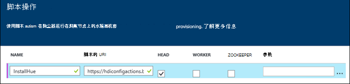
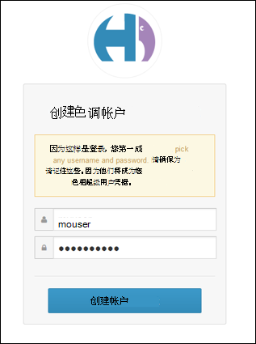
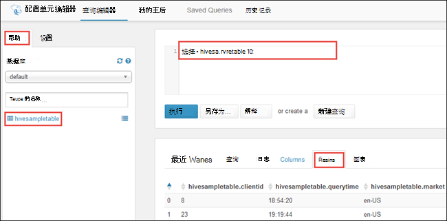
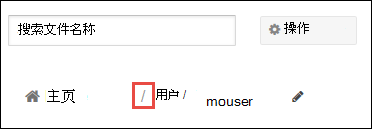
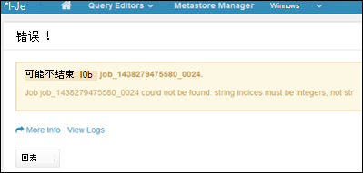

<properties
    pageTitle="在 HDInsight Linux 群集上使用 Hadoop 色调 |Microsoft Azure"
    description="了解如何安装和使用的 Hadoop 群集 HDInsight Linux 上的色调。"
    services="hdinsight"
    documentationCenter=""
    authors="nitinme"
    manager="jhubbard"
    editor="cgronlun"/>

<tags 
    ms.service="hdinsight" 
    ms.workload="big-data" 
    ms.tgt_pltfrm="na" 
    ms.devlang="na" 
    ms.topic="article" 
    ms.date="09/13/2016" 
    ms.author="nitinme"/>

# 安装和使用在 HDInsight Hadoop 群集上的色调

了解如何在 HDInsight Linux 群集上安装色调和使用隧道来将请求路由到色调。

## 色调是什么？

色调是一套用于与 Hadoop 群集进行交互的 Web 应用程序。 色调用于浏览与 Hadoop 群集 (在 HDInsight 群集的情况下为 WASB) 关联的存储，运行配置单元作业和猪的脚本等。以下组件可安装 HDInsight Hadoop 群集上的色调。

* Beeswax 配置单元编辑器
* 小猪
* Metastore 管理器
* Oozie
* FileBrowser （它交谈 WASB 默认容器）
* 作业的浏览器

> [AZURE.WARNING] 完全支持使用 HDInsight 群集提供组件和 Microsoft 支持将有助于确定和解决与这些组件相关的问题。
>
> 自定义组件接收商业上合理的支持，以帮助您进一步排查该问题。 这可能导致解决问题或要求您能够进行深入的专业技能，为该技术在其中找到的开放源代码技术可用的频道。 例如，有许多社区站点可以使用，如︰ [HDInsight 的 MSDN 论坛](https://social.msdn.microsoft.com/Forums/azure/en-US/home?forum=hdinsight)、 [http://stackoverflow.com](http://stackoverflow.com)。 Apache 项目还有项目网站上[http://apache.org](http://apache.org)，例如︰ [Hadoop](http://hadoop.apache.org/)。

## 安装使用脚本操作的色调

下面的脚本操作可用于基于 Linux 的 HDInsight 群集上安装色调。
https://hdiconfigactions.blob.core.windows.net/linuxhueconfigactionv02/install-hue-uber-v02.sh
    
本节提供有关如何在资源调配使用 Azure 门户群集时使用该脚本的说明。 

> [AZURE.NOTE] Azure PowerShell、 Azure CLI、 HDInsight.NET SDK 或 Azure 资源管理器模板还可应用脚本操作。 此外可以将脚本操作应用到已在运行的群集。 有关详细信息，请参阅[自定义 HDInsight 群集使用脚本的操作](hdinsight-hadoop-customize-cluster-linux.md)。

1. 开始调配通过步骤在[Linux 上的设置 HDInsight 群集](hdinsight-hadoop-provision-linux-clusters.md#portal)中，群集，但未完成资源调配。

    > [AZURE.NOTE] 要在 HDInsight 群集上安装色调，建议的 headnode 大小至少是 A4 （8 核、 14 g B 的内存）。

2. **可选配置**刀片式服务器，选择**脚本操作**，并提供信息，如下所示︰

    

    * __名称__︰ 输入脚本操作的友好名称。
    * __脚本的 URI__: https://hdiconfigactions.blob.core.windows.net/linuxhueconfigactionv02/install-hue-uber-v02.sh
    * __头部__︰ 选中该选项
    * __工作人员__︰ 将其留空。
    * __ZOOKEEPER__︰ 将其留空。
    * __参数__︰ 将其留空。

3. 底部的**脚本操作**，使用**选择**按钮以保存配置。 最后，使用**可选配置**刀片底部的**选择**按钮保存可选配置信息。

4. 继续[在 Linux 上的设置 HDInsight 群集](hdinsight-hadoop-provision-linux-clusters.md#portal)中所述配置群集。

## 使用 HDInsight 群集使用色调

SSH 隧道是色相访问群集上，一旦它开始运行的唯一方法。 通过 SSH 隧道允许通信直接转到该群集的 headnode 正在色调。 设置完群集后，使用以下步骤在 HDInsight Linux 群集上使用色调。

1. 使用中[使用 SSH 隧道访问 Ambari web 用户界面、 ResourceManager、 JobHistory、 NameNode，Oozie 和其他的 web 用户界面的](hdinsight-linux-ambari-ssh-tunnel.md)信息到 HDInsight 群集中，客户端系统创建 SSH 隧道，然后配置您的 Web 浏览器代理服务器作为使用 SSH 隧道。

2. 一旦您已经创建 SSH 隧道，并与代理服务器通信，它通过将浏览器配置，必须找到主要的头节点的主机名。 您可以通过连接到群集在端口 22 上使用 SSH 来执行此操作。 例如， `ssh USERNAME@CLUSTERNAME-ssh.azurehdinsight.net` ，__用户名__是您的 SSH 用户名称和__群集名称__是该群集的名称。

    使用 SSH 的详细信息，请参阅以下文档︰

    * [SSH 使用 Linux 和 Unix 中，Mac OS X 客户机的基于 Linux 的 HDInsight](hdinsight-hadoop-linux-use-ssh-unix.md)
    * [SSH 使用来自 Windows 客户端的基于 Linux 的 HDInsight](hdinsight-hadoop-linux-use-ssh-windows.md)

3. 建立连接后，使用下面的命令来获得主 headnode 的完全限定的域名称︰

        hostname -f

    这将返回一个名称与以下类似︰

        hn0-myhdi-nfebtpfdv1nubcidphpap2eq2b.ex.internal.cloudapp.net
    
    这是 headnode 的主要的主机名的色相网站所在的位置。

2. 使用浏览器打开 http://HOSTNAME:8888 在色相门户网站。 主机名替换为您在上一步中获得的名称。

    > [AZURE.NOTE] 当第一次登录时，将提示您创建一个帐户以登录到色相门户。 您在此处指定的凭据将被限制到门户网站，与管理或 SSH 用户凭据设置时指定群集无关。

    

### 运行配置单元查询

1. 从色相门户，**查询编辑器**，请单击，然后单击**配置单元**配置单元编辑器中打开。

    

2. 在**帮助**选项卡上，在**数据库**中，您应看到**hivesampletable**。 这是附带上 HDInsight 的所有 Hadoop 群集示例表。 在右窗格中输入的示例查询并在下方窗格中的**结果**选项卡上看到输出，如屏幕截图所示。

    

    您可以使用**图表**选项卡以查看结果的可视化表示形式。

### 浏览群集存储

1. 从色相门户网站，右上角的菜单栏中单击**文件浏览器**。

2. 默认情况下将在**/user/myuser**目录打开文件浏览器。 单击转到 Azure 存储容器与群集相关的根的路径中的用户目录之前正斜杠。

    

3. 右键单击文件或文件夹以查看可用的操作。 使用在右上角的**上载**按钮将文件上载到当前目录。 使用**新建**按钮创建新的文件或目录。

> [AZURE.NOTE] 色调文件浏览器只能显示与 HDInsight 群集关联的默认容器的内容。 不会使用文件浏览器可以访问任何附加的存储帐户/容器程序可能与群集相关。 但是，与群集相关的其他容器将始终可以访问用于配置单元作业。 例如，如果您输入的命令`dfs -ls wasbs://newcontainer@mystore.blob.core.windows.net`在配置单元编辑器中，您可以看到的内容以及其他容器。 在此命令中， **newcontainer**不是与群集相关的默认容器。

## 重要注意事项

1. 用于安装色调的脚本安装它只在群集中的主 headnode。

2. 在安装期间，多个 Hadoop 服务 （HDFS YARN、 MR2，Oozie） 是为更新的配置重新启动。 脚本结束安装色调之后，它可能需要一些时间的其它 Hadoop 服务启动。 最初，这可能影响色调的性能。 一旦启动所有服务，色调将完全起作用。

3.  色相不理解 Tez 作业，这是当前的默认的配置单元。 如果您想要作为配置单元执行引擎使用 MapReduce，更新该脚本，在脚本中使用以下命令︰

        set hive.execution.engine=mr;

4.  使用 Linux 群集，可以有一个资源管理器可能运行在辅助阵列时，您的服务主 headnode 的运行位置的方案。 使用色调以查看此群集上运行作业的详细信息时，这样的情况下可能会导致错误 （如下所示）。 但是，当在工作完成时可以查看作业的详细信息。

    

    这是因为一个已知的问题。 作为一种变通方法，以便在主 headnode 上还运行活动资源管理器修改 Ambari。

5.  色相了解 WebHDFS，而 HDInsight 群集使用 Azure 存储使用`wasbs://`。 因此，脚本操作一起使用的自定义脚本安装 WebWasb，这是与 WASB 的一个 WebHDFS 兼容服务。 因此，即使色调门户说 HDFS 中的位置 （例如，当您将鼠标移动**文件浏览器**），它应该被解释为 WASB。

## 下一步行动

- [在 HDInsight 群集上安装 Giraph](hdinsight-hadoop-giraph-install-linux.md)。 使用自定义群集在 HDInsight Hadoop 群集上安装 Giraph。 Giraph 允许您执行使用 Hadoop，图形处理和使用 Azure HDInsight。

- [在 HDInsight 群集上安装 Solr](hdinsight-hadoop-solr-install-linux.md)。 使用自定义群集在 HDInsight Hadoop 群集上安装 Solr。 Solr 允许您执行存储数据的功能强大的搜索操作。

- [在 HDInsight 群集上安装 R](hdinsight-hadoop-r-scripts-linux.md)。 使用自定义群集安装 HDInsight Hadoop 群集上的 R。 R 是一种开源的语言和环境统计计算的。 它提供了数百个内置统计函数和自己相结合方面的功能和面向对象的编程的编程语言。 它还提供了丰富的图形功能。

[powershell-install-configure]: install-configure-powershell-linux.md
[hdinsight-provision]: hdinsight-provision-clusters-linux.md
[hdinsight-cluster-customize]: hdinsight-hadoop-customize-cluster-linux.md
