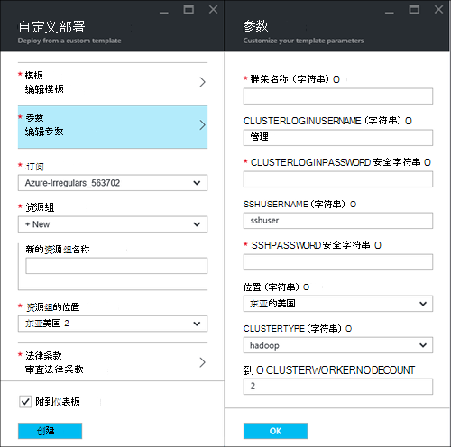
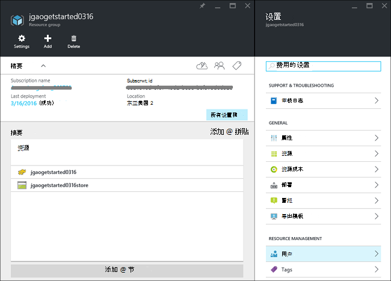
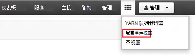
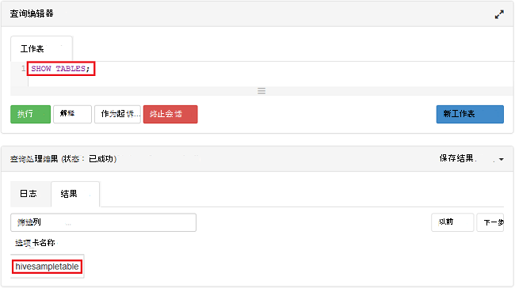

<properties
    pageTitle="Linux 教程︰ 开始使用 Hadoop 和配置单元 |Microsoft Azure"
    description="按照本 Linux 教程在 HDInsight 中使用 Hadoop 开始。 了解如何设置 Linux 群集和查询数据的配置单元。"
    services="hdinsight"
    documentationCenter=""
    authors="mumian"
    manager="jhubbard"
    editor="cgronlun"
    tags="azure-portal"/>

<tags
    ms.service="hdinsight"
    ms.devlang="na"
    ms.topic="hero-article"
    ms.tgt_pltfrm="na"
    ms.workload="big-data"
    ms.date="09/14/2016"
    ms.author="jgao"/>

# Hadoop 教程︰ 在 HDInsight 中使用基于 Linux 的 Hadoop 开始

> [AZURE.SELECTOR]
- [基于 linux * 的](hdinsight-hadoop-linux-tutorial-get-started.md)
- [基于 Windows 的](hdinsight-hadoop-tutorial-get-started-windows.md)

了解如何创建在 HDInsight，基于 Linux 的[Hadoop](http://hadoop.apache.org/)群集以及如何在 HDInsight 中运行配置单元作业。 [Apache 配置单元](https://hive.apache.org/)是 Hadoop 生态系统中的最常用组件。 HDInsight 配有 4 种不同的群集类型的当前︰ [Hadoop](hdinsight-hadoop-introduction.md)、[触发](hdinsight-apache-spark-overview.md)、 [HBase](hdinsight-hbase-overview.md)和[风暴](hdinsight-storm-overview.md)。  每种群集类型支持一组不同的组件。 所有 4 群集类型支持的配置单元。 在 HDInsight 的支持组件的列表，请参阅[由 HDInsight 提供的 Hadoop 群集版本中的新增功能？](hdinsight-component-versioning.md)  

[AZURE.INCLUDE [delete-cluster-warning](../../includes/hdinsight-delete-cluster-warning.md)]

## 系统必备组件

在开始本教程之前，您必须具有︰

- **Azure 订阅**︰ 要创建一个月免费试用帐户，请浏览到[azure.microsoft.com/free](https://azure.microsoft.com/free)。

### 访问控制要求

[AZURE.INCLUDE [access-control](../../includes/hdinsight-access-control-requirements.md)]

## 创建群集

大多数的 Hadoop 作业的批处理作业。 创建群集、 运行一些作业，然后删除群集。 在本节中，您将创建在 HDInsight 使用[Azure 资源管理器模板](../resource-group-template-deploy.md)基于 Linux 的 Hadoop 群集。 资源管理器模板可完全自定义;若要创建像 HDInsight 这样的 Azure 资源方便。 资源管理器模板体验并不需要遵循本教程。 对于其他群集创建方法和理解本教程中使用的属性，请参阅[创建 HDInsight 群集](hdinsight-hadoop-provision-linux-clusters.md)。 在本教程中所使用的资源管理器模板位于[https://hditutorialdata.blob.core.windows.net/armtemplates/create-linux-based-hadoop-cluster-in-hdinsight.json](https://hditutorialdata.blob.core.windows.net/armtemplates/create-linux-based-hadoop-cluster-in-hdinsight.json)的公钥 blob 容器中。 

1. 单击以下图像中登录到 Azure 和 Azure 门户中打开资源管理器的模板。 

    

2. 从**参数**刀片式服务器，输入以下命令︰

    .

    - **群集名称**︰ 输入，您将创建的 Hadoop 群集的名称。
    - **群集登录名和密码**︰ 默认登录名是**管理员**。
    - **SSH 的用户名和密码**︰ 默认的用户名是**sshuser**。  您可以重命名它。 
    
    其他参数是可选的遵循本教程。 可以将其保留原样。 
    
    每个群集有 Azure Blob 存储帐户依赖项。 它通常被称为默认存储帐户。 HDInsight 群集和其默认存储帐户必须共同位于 Azure 的同一地区。 删除群集不会删除存储帐户。 在模板中，默认的存储帐户名定义为群集名称与追加的"存储"。 
    
3. 单击**确定**以保存参数。
4. 从**自定义部署**刀片式服务器，请输入**新资源组名称**以创建新的资源组。  资源组是群集、 从属存储帐户和其他组的容器。 资源组位置可以不同于群集的位置。
5. **法律条款**，请单击，然后单击**创建**。
6. 验证**到仪表板的 pin 码**复选框已选中，然后单击**创建**。 您将看到名为**部署模板部署**新的拼贴。 大约需要大约 20 分钟的时间来创建一个群集。 
7.  创建群集后，拼贴的标题更改为您指定的资源组名称。 并门户自动打开两个刀片式服务器群集和群集设置。 

    .

    没有列出的两个资源、 群集和默认的存储帐户。

##运行配置单元查询

[Apache 配置单元](hdinsight-use-hive.md)是在 HDInsight 中使用的最常用组件。 有多种方法可以运行在 HDInsight 中的配置单元作业。 在本教程中，您将使用 Ambari 配置单元视图从门户运行某些配置单元作业。 将配置单元作业提交的其他方法，请参阅[使用 HDInsight 中的配置单元](hdinsight-use-hive.md)。

1. 浏览到**https://&lt;群集名称 >。 azurehdinsight.net**，其中&lt;群集名称 > 是群集在上一节打开 Ambari 中创建。
2. 输入的 Hadoop 用户名和密码，您在上一节中指定。 默认的用户名是**管理员**。
3. 下面的屏幕快照中所示，请打开**配置单元视图**︰

    .
4. 在页上的__查询编辑器__部分中，将下面的 HiveQL 语句粘贴到工作表中︰

        SHOW TABLES;

    >[AZURE.NOTE] 分号被必需的配置单元。       
        
5. 单击__执行__。 __查询进程结果__部分应当显示在查询编辑器下方，显示有关作业的信息。 

    一旦完成查询，__查询过程结果__部分将显示操作的结果。 您应看到一个名为**hivesampletable**的表。 此示例配置单元表附带了 HDInsight 中的所有群集。

    .

6. 重复步骤 4 和步骤 5，以运行下面的查询︰

        SELECT * FROM hivesampletable;

    > [AZURE.TIP] 请注意在左上角的__查询过程结果__部分，则__保存结果__下拉列表可以使用此结果，下载或将其保存为 CSV 文件的 HDInsight 存储。

7. 单击**历史记录**以获取作业的列表。

您已完成配置单元作业后，您可以[将结果导出到 SQL Azure 数据库或 SQL Server 数据库](hdinsight-use-sqoop-mac-linux.md)，还可以[直观地显示使用 Excel 的结果](hdinsight-connect-excel-power-query.md)。 有关使用 HDInsight 中的配置单元的详细信息，请参阅[使用配置单元和 HiveQL 与 Hadoop HDInsight 分析示例 Apache log4j 文件中](hdinsight-use-hive.md)。

##清理教程

完成本教程后，您可能需要删除该群集。 使用 HDInsight，您的数据以便不使用时，可以安全地删除群集 Azure 存储中存储。 您还收取 HDInsight 群集，即使不在使用中。 由于群集的费用超过存储的费用很多时候，它删除群集时未使用经济意义。 

>[AZURE.NOTE] 使用[Azure 数据工厂](hdinsight-hadoop-create-linux-clusters-adf.md)，可以根据需要，创建 HDInsight 群集并将 TimeToLive 设置为自动删除群集配置。 

**若要删除群集和/或默认的存储帐户**

1. 登录到[Azure 的门户](https://portal.azure.com)。
2. 从门户的仪表板，请单击创建群集时使用的资源组名称与该图块。
3. 单击**删除**以删除该资源组，其中包含群集和默认的存储帐户; 资源刀片式服务器或者单击群集名称**资源**拼贴上的，然后单击群集刀片式服务器上的**删除**。 请注意，删除该资源组将删除存储帐户。 如果您想保留存储帐户，选择删除群集只。

## 下一步行动

在本教程中，您学习了如何创建一个基于 Linux 的 HDInsight 群集使用资源管理器模板，以及如何执行基本配置单元查询。

若要了解有关 HDInsight 用分析数据的详细信息，请参阅以下︰

- 若要了解有关使用 HDInsight 配置单元的详细信息，包括如何执行配置单元查询从 Visual Studio，请参阅[使用配置单元与 HDInsight][hdinsight-use-hive]。

- 要了解小猪，用来转换数据，一种语言，请参阅[使用猪的 HDInsight 与][hdinsight-use-pig]。

- 要学习 MapReduce，编写程序处理数据的 Hadoop，一种方法，请参阅[使用 MapReduce 与 HDInsight][hdinsight-use-mapreduce]。

- 若要了解有关使用 Visual Studio 的 HDInsight 工具在 HDInsight 上的数据进行分析，请参阅[开始使用 Visual Studio 的 Hadoop HDInsight 工具](hdinsight-hadoop-visual-studio-tools-get-started.md)。

如果你准备好开始使用自己的数据，需要了解更多有关如何 HDInsight 存储数据或将数据导入 HDInsight，请参阅以下︰

- HDInsight 如何使用 Azure blob 存储的信息，请参阅[使用 Azure Blob 存储与 HDInsight](hdinsight-hadoop-use-blob-storage.md)。

- 有关如何将数据上传到 HDInsight 的信息，请参阅中的[上载数据为 HDInsight][hdinsight-upload-data]。

如果您想要了解有关创建或管理 HDInsight 群集的详细信息，请参阅以下︰

- 若要了解有关管理基于 Linux 的 HDInsight 群集，请参阅[使用 Ambari 管理 HDInsight 群集](hdinsight-hadoop-manage-ambari.md)。

- 若要了解有关创建 HDInsight 群集时，可以选择的选项，请参阅[linux 中使用自定义选项创建的 HDInsight](hdinsight-hadoop-provision-linux-clusters.md)。

- 如果您熟悉 Linux 和 Hadoop，但想知道有关 Hadoop 在 HDInsight 上的具体信息，请参阅[使用 Linux 上的 HDInsight](hdinsight-hadoop-linux-information.md)。 如本文提供的信息︰

    * 在集群上，Ambari 和 WebHCat 等承载服务的 Url
    * Hadoop 文件和示例在本地文件系统上的位置
    * 与默认的数据使用的 Azure 存储 (WASB) 而不是 HDFS 存储

[1]: ../HDInsight/hdinsight-hadoop-visual-studio-tools-get-started.md

[hdinsight-provision]: hdinsight-provision-clusters.md
[hdinsight-admin-powershell]: hdinsight-administer-use-powershell.md
[hdinsight-upload-data]: hdinsight-upload-data.md
[hdinsight-use-mapreduce]: hdinsight-use-mapreduce.md
[hdinsight-use-hive]: hdinsight-use-hive.md
[hdinsight-use-pig]: hdinsight-use-pig.md

[powershell-download]: http://go.microsoft.com/fwlink/p/?linkid=320376&clcid=0x409
[powershell-install-configure]: powershell-install-configure.md
[powershell-open]: powershell-install-configure.md#Install

[img-hdi-dashboard]: ./media/hdinsight-hadoop-tutorial-get-started-windows/HDI.dashboard.png
[img-hdi-dashboard-query-select]: ./media/hdinsight-hadoop-tutorial-get-started-windows/HDI.dashboard.query.select.png
[img-hdi-dashboard-query-select-result]: ./media/hdinsight-hadoop-tutorial-get-started-windows/HDI.dashboard.query.select.result.png
[img-hdi-dashboard-query-select-result-output]: ./media/hdinsight-hadoop-tutorial-get-started-windows/HDI.dashboard.query.select.result.output.png
[img-hdi-dashboard-query-browse-output]: ./media/hdinsight-hadoop-tutorial-get-started-windows/HDI.dashboard.query.browse.output.png
[image-hdi-clusterstatus]: ./media/hdinsight-hadoop-tutorial-get-started-windows/HDI.ClusterStatus.png
[image-hdi-gettingstarted-powerquery-importdata]: ./media/hdinsight-hadoop-tutorial-get-started-windows/HDI.GettingStarted.PowerQuery.ImportData.png
[image-hdi-gettingstarted-powerquery-importdata2]: ./media/hdinsight-hadoop-tutorial-get-started-windows/HDI.GettingStarted.PowerQuery.ImportData2.png
