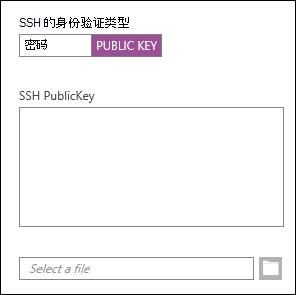
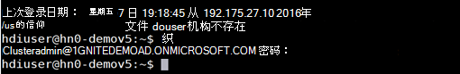
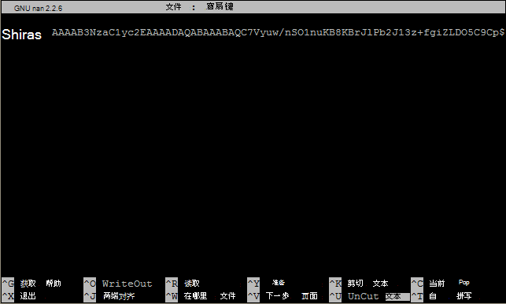

<properties
   pageTitle="从 Linux、 Unix 或 OS X 的基于 Linux 的 Hadoop 使用 SSH 密钥 |Microsoft Azure"
   description=" 您可以访问使用安全外壳 (SSH) 的基于 Linux 的 HDInsight。 本文档提供在使用 SSH HDInsight 从 Linux、 Unix 或 OS X 客户机的信息。"
   services="hdinsight"
   documentationCenter=""
   authors="Blackmist"
   manager="jhubbard"
   editor="cgronlun"
    tags="azure-portal"/>

<tags
   ms.service="hdinsight"
   ms.devlang="na"
   ms.topic="get-started-article"
   ms.tgt_pltfrm="na"
   ms.workload="big-data"
   ms.date="09/13/2016"
   ms.author="larryfr"/>

#<a name="use-ssh-with-linux-based-hadoop-on-hdinsight-from-linux-unix-or-os-x"></a>HDInsight 从 Linux、 Unix 或 OS X 上的基于 Linux 的 Hadoop 使用 SSH

> [AZURE.SELECTOR]
- [窗口](hdinsight-hadoop-linux-use-ssh-windows.md)
- [Linux、 Unix，OS X](hdinsight-hadoop-linux-use-ssh-unix.md)

[安全外壳协议 (SSH)](https://en.wikipedia.org/wiki/Secure_Shell)允许您远程执行基于 Linux 的 HDInsight 群集使用命令行界面上操作。 本文档提供在使用 SSH HDInsight 从 Linux、 Unix 或 OS X 客户机的信息。

> [AZURE.NOTE] 这篇文章中的步骤假定您在使用 Linux、 Unix 或 OS X 客户机。 可能基于 Windows 的客户端上执行这些步骤，如果您安装了一个包，提供了`ssh`， `ssh-keygen`，如[Ubuntu 在 Windows 上狂欢](https://msdn.microsoft.com/commandline/wsl/about)。
>
> 如果您没有安装在您的基于 Windows 的客户端上的 SSH，使用中的步骤[使用 SSH 与从 Windows 的基于 Linux 的 HDInsight (Hadoop)](hdinsight-hadoop-linux-use-ssh-windows.md)有关安装和使用 PuTTY 的信息。

##<a name="prerequisites"></a>系统必备组件

* **ssh keygen**和**ssh** Linux、 Unix 和 OS X 客户端。 此实用程序通常提供与您的操作系统，或可通过软件包管理系统。

* 现代 web 浏览器支持 HTML5。

OR

* [Azure CLI](../xplat-cli-install.md)。

    [AZURE.INCLUDE [use-latest-version](../../includes/hdinsight-use-latest-cli.md)] 

##<a name="what-is-ssh"></a>SSH 是什么？

SSH 是用于登录到，并远程执行命令在远程服务器上的实用程序。 与基于 Linux 的 HDInsight，SSH 建立加密的连接到群集 headnode，并提供了一个用于键入命令的命令行。 然后，直接在服务器上执行命令。

###<a name="ssh-user-name"></a>SSH 用户名称

SSH 用户名称是您使用 HDInsight 群集对进行身份验证的名称。 在群集创建过程中指定 SSH 用户名称时，此用户被创建群集中所有节点上。 创建群集后，您可以使用此用户名连接到 HDInsight 群集 headnodes。 从 headnodes，则可以连接到单个辅助节点。

###<a name="ssh-password-or-public-key"></a>SSH 密码或公共密钥

SSH 用户可以使用密码或公共密钥身份验证。 密码是文字的公钥生成来唯一地标识您的加密密钥对的一部分时，所做字符串。

键是比密码更安全，但是它需要额外的步骤来生成密钥，您必须维护包含一个安全的位置中的密钥的文件。 如果任何人获得密钥的文件的访问权限，他们获得访问您的帐户。 或者，如果丢失了密钥文件，您将无法登录到您的帐户。

密钥对由组成 （将它发送到 HDInsight 服务器上，） 的公钥和一个私钥 （它将保留在客户机上。）当您连接到 HDInsight 服务器使用 SSH 时，SSH 客户端将使用私钥在您的计算机上与该服务器进行身份验证。

##<a name="create-an-ssh-key"></a>创建 SSH 密钥

如果您计划在群集中使用 SSH 密钥，请使用下面的信息。 如果您计划使用密码，则可以跳过本节。

1. 打开一个终端会话，使用下面的命令以查看是否有任何现有的 SSH 密钥︰

        ls -al ~/.ssh

    查找目录列表中的下列文件。 这些都是 SSH 公钥的通用名。

    * id\_dsa.pub
    * id\_ecdsa.pub
    * id\_ed25519.pub
    * id\_rsa.pub

2. 如果不希望使用现有的文件，或者您有任何现有的 SSH 密钥，请使用以下生成一个新文件︰

        ssh-keygen -t rsa

    系统将提示您输入以下信息︰

    * 文件位置中的该位置默认 ~/.ssh/id\_rsa。
    * 一个密码短语-您将被提示重新输入此。

        > [AZURE.NOTE] 我们强烈建议您的密钥使用安全密码。 但是，如果您忘记了密码，则无法恢复它。

    在该命令完成后，您将有两个新文件的专用密钥 (例如， **id\_rsa**) 和公用密钥 (例如， **id\_rsa.pub**)。

##<a name="create-a-linux-based-hdinsight-cluster"></a>创建一个基于 Linux 的 HDInsight 群集

在创建一个基于 Linux 的 HDInsight 群集时，您必须提供以前创建的公用密钥。 从 Linux、 Unix 或 OS X 客户机有两种方法来创建一个 HDInsight 群集︰

* **Azure 门户**-使用基于 web 的门户网站来创建群集。

* **用于 Mac、 Linux 和 Windows azure CLI** -使用命令行命令来创建群集。

每种方法都需要的公共密钥或密码。 有关创建基于 Linux 的 HDInsight 群集的完整信息，请参阅[设置 Linux 基于 HDInsight 群集](hdinsight-hadoop-provision-linux-clusters.md)。

###<a name="azure-portal"></a>Azure 门户

当使用[Azure 门户网站][preview-portal]若要创建一个基于 Linux 的 HDInsight 群集，必须输入**SSH 用户名称**，并选择输入**密码**或**SSH 公用密钥**。

如果您选择**SSH 公钥**，可以将公钥 （在以**.pub**扩展名的文件包含） 粘贴到__SSH PublicKey__字段中，或选择__选择一个文件__，浏览并选择的公钥的密钥文件。



> [AZURE.NOTE] 密钥文件是只是一个文本文件。 内容应类似于以下内容︰
> ```
ssh-rsa AAAAB3NzaC1yc2EAAAADAQABAAABAQCelfkjrpYHYiks4TM+r1LVsTYQ4jAXXGeOAF9Vv/KGz90pgMk3VRJk4PEUSELfXKxP3NtsVwLVPN1l09utI/tKHQ6WL3qy89WVVVLiwzL7tfJ2B08Gmcw8mC/YoieT/YG+4I4oAgPEmim+6/F9S0lU2I2CuFBX9JzauX8n1Y9kWzTARST+ERx2hysyA5ObLv97Xe4C2CQvGE01LGAXkw2ffP9vI+emUM+VeYrf0q3w/b1o/COKbFVZ2IpEcJ8G2SLlNsHWXofWhOKQRi64TMxT7LLoohD61q2aWNKdaE4oQdiuo8TGnt4zWLEPjzjIYIEIZGk00HiQD+KCB5pxoVtp user@system
> ```

这将创建使用您提供的公钥的密码指定用户的登录名。

###<a name="azure-command-line-interface-for-mac-linux-and-windows"></a>用于 Mac、 Linux 和 Windows azure 的命令行界面

您可以使用[Mac、 Linux 和 Windows Azure CLI](../xplat-cli-install.md)创建新群集使用`azure hdinsight cluster create`命令。

使用此命令的详细信息，请参阅[配置 Hadoop Linux 群集中使用的自定义选项的 HDInsight](hdinsight-hadoop-provision-linux-clusters.md)。

##<a name="connect-to-a-linux-based-hdinsight-cluster"></a>连接到基于 Linux 的 HDInsight 群集

从终端会话，使用 SSH 命令提供的地址和用户的名称连接到群集 headnode:

* **SSH 地址**-有两个可用于连接到群集使用 SSH 的地址︰

    * **连接到 headnode**︰ 群集名称后, 跟**-ssh.azurehdinsight.net**。 例如， **mycluster-ssh.azurehdinsight.net**。
    
    * **连接到边缘节点**︰ HDInsight R 服务器群集时，群集还包含边节点可使用**RServer.CLUSTERNAME.ssh.azurehdinsight.net**，其中__群集名称__是该群集的名称。

* **用户名**— SSH 用户提供的名称创建群集时。

下面的示例将连接到主 headnode **mycluster**的用户**我**︰

    ssh me@mycluster-ssh.azurehdinsight.net

如果您使用的用户帐户的密码，系统会提示您输入密码。

如果使用密码保护 SSH 密钥，将提示您输入密码。 否则，SSH 将尝试自动在客户机上使用一个本地的私有密钥进行身份验证。

> [AZURE.NOTE] 如果 SSH 自动身份验证不使用正确的私钥，使用**-i**参数并指定密钥的路径。 下面的示例将加载私钥从`~/.ssh/id_rsa`:
>
> `ssh -i ~/.ssh/id_rsa me@mycluster-ssh.azurehdinsight.net`

如果您连接到使用地址 headnode，并且未指定端口则，SSH 将默认设置为端口 22 日将连接到主 headnode HDInsight 群集上。 如果您使用端口 23，您将连接到次映像。 Headnodes 的详细信息，请参阅[HDInsight 中的 Hadoop 群集的可用性和可靠性](hdinsight-high-availability-linux.md)。

###<a name="connect-to-worker-nodes"></a>连接到辅助节点

辅助节点不直接可以从外部访问 Azure 数据中心，但他们可以从群集 headnode 通过 SSH 访问。

如果使用 SSH 密钥来验证您的用户帐户，您必须在您的客户端上完成以下步骤︰

1. 使用文本编辑器，打开`~/.ssh/config`。 如果此文件不存在，您可以通过输入创建它`touch ~/.ssh/config`终端。

2. 向该文件添加以下内容。 *群集名称*替换 HDInsight 群集的名称。

        Host CLUSTERNAME-ssh.azurehdinsight.net
          ForwardAgent yes

    这将配置 SSH 代理转发为 HDInsight 群集。

3. 测试 SSH 代理通过使用下面的命令从终端转发︰

        echo "$SSH_AUTH_SOCK"

    这将返回类似于以下信息︰

        /tmp/ssh-rfSUL1ldCldQ/agent.1792

    如果不返回任何内容，则表明该**ssh 代理**未运行。 对于特定的步骤安装和配置**ssh 代理**，请查阅操作系统文档或查看[使用 ssh 代理使用 ssh](http://mah.everybody.org/docs/ssh)。

4. 验证正在运行**ssh 代理**后，请使用以下方法来添加到代理 SSH 私有密钥︰

        ssh-add ~/.ssh/id_rsa

    如果您的专用密钥存储在不同的文件，替换`~/.ssh/id_rsa`文件的路径。

使用以下步骤连接到辅助节点的群集。

> [AZURE.IMPORTANT] 如果 SSH 密钥用于验证您的帐户，您必须完成前面的步骤，来验证该代理转发工作。

1. 如上文所述，使用 SSH 连接到 HDInsight 群集。

2. 一旦连接，使用以下方法来检索您的群集中的节点的列表。 *ADMINPASSWORD*替换为您的群集管理员帐户的密码。 *群集名称*替换您的群集的名称。

        curl --user admin:ADMINPASSWORD https://CLUSTERNAME.azurehdinsight.net/api/v1/hosts

    这将显示群集中的节点的 JSON 格式返回的信息包括`host_name`，其中包含的每个节点的完全限定的域名 (FQDN)。 下面是一个示例`host_name`**卷曲**命令所返回的条目︰

        "host_name" : "workernode0.workernode-0-e2f35e63355b4f15a31c460b6d4e1230.j1.internal.cloudapp.net"

3. 一旦您想要连接到辅助节点的列表，使用 SSH 会话从服务器到下面的命令来打开一个连接到辅助节点︰

        ssh USERNAME@FQDN

    替换您的 SSH 用户姓名和*FQDN*与辅助节点的 FQDN*用户名*。 例如， `workernode0.workernode-0-e2f35e63355b4f15a31c460b6d4e1230.j1.internal.cloudapp.net`。

    > [AZURE.NOTE] 如果您使用密码来验证您的 SSH 会话，则将提示您再次输入密码。 如果您使用 SSH 密钥，该连接应该完成没有任何提示。

4. 一旦已经建立的会话，终端提示符将从`username@hn#-clustername`到`username@wk#-clustername`来指示您是否连接到辅助节点。 此时运行的任何命令将在辅助节点上运行。

4. 完成该工作节点上执行操作，使用`exit`命令以关闭到辅助节点会话。 这将返回到您`username@hn#-clustername`提示。

## <a name="connect-to-a-domain-joined-hdinsight-cluster"></a>连接到域加入 HDInsight 群集

[加入域的 HDInsight](hdinsight-domain-joined-introduction.md)与 HDInsight 在 Hadoop 集成 Kerberos。 因为 SSH 用户不是活动 Direcotry 域用户，此用户帐户不能 Hadoop 命令从 SSH 外壳程序域加入群集上直接运行。 您首先必须运行*kinit* 。 

**若要运行配置单元查询域加入 HDInsight 群集使用 SSH 上**

1. 连接到域加入 HDInsight 群集使用 SSH。  Instrocutions，请参阅[连接到一个基于 Linux 的 HDInsight 群集](#connect-to-a-linux-based-hdinsight-cluster)。
2. 运行 kinit。 它将要求您提供域用户名和域用户的密码。 了解更多有关配置域加入 HDInsight 群集的域用户，请参阅[配置域加入 HDInisight 群集](hdinsight-domain-joined-configure.md)。

    
3. 打开的控制台输入的配置单元︰

        hive

    然后，您可以运行配置单元的命令。

##<a name="add-more-accounts"></a>添加更多帐户

1. 生成一个新的公钥和私钥对于新的用户帐户，如[创建 SSH 密钥](#create-an-ssh-key-optional)部分中所述。

    > [AZURE.NOTE] 既应在客户机上的用户将用来连接到群集，或安全地转移到这样的客户端创建后生成的私钥。

1. 从群集的 SSH 会话，添加新用户使用以下命令︰

        sudo adduser --disabled-password <username>

    这将创建一个新的用户帐户，但将禁用密码身份验证。

2. 创建目录和文件按住键，使用以下命令︰

        sudo mkdir -p /home/<username>/.ssh
        sudo touch /home/<username>/.ssh/authorized_keys
        sudo nano /home/<username>/.ssh/authorized_keys

3. Nano 编辑器打开时，在复制和粘贴为新的用户帐户中的公共密钥的内容。 最后，使用**Ctrl-X**若要保存文件并退出编辑器。

    

4. 使用下面的命令将.ssh 文件夹及其内容的所有权更改为新的用户帐户︰

        sudo chown -hR <username>:<username> /home/<username>/.ssh

5. 您现在可以对具有新的用户帐户和专用密钥的服务器进行身份验证。

##<a id="tunnel"></a>SSH 隧道

可以使用 SSH 隧道本地请求，如 HDInsight 群集的 web 请求。 像它一样是在 HDInsight 群集 headnode 上生成，然后将所请求资源路由请求。

> [AZURE.IMPORTANT] SSH 隧道是访问某些 Hadoop 服务的 web 用户界面的要求。 例如，该作业历史记录用户界面或资源管理器用户界面只可以使用 SSH 隧道。

有关创建和使用 SSH 隧道的详细信息，请参阅[使用 SSH 隧道 Ambari web 用户界面、 ResourceManager、 JobHistory、 NameNode，Oozie 和其他的 web 用户界面的访问](hdinsight-linux-ambari-ssh-tunnel.md)。

##<a name="next-steps"></a>下一步行动

现在，您将了解如何使用 SSH 密钥进行身份验证，了解如何通过在 HDInsight 上的 Hadoop 使用 MapReduce。

* [使用 HDInsight 配置单元](hdinsight-use-hive.md)

* [使用 HDInsight 的小猪](hdinsight-use-pig.md)

* [HDInsight 使用 MapReduce 作业](hdinsight-use-mapreduce.md)

[preview-portal]: https://portal.azure.com/
