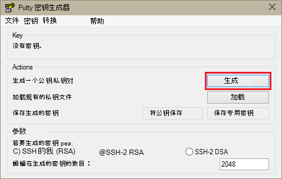
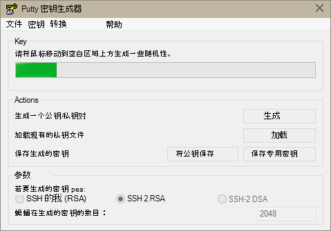
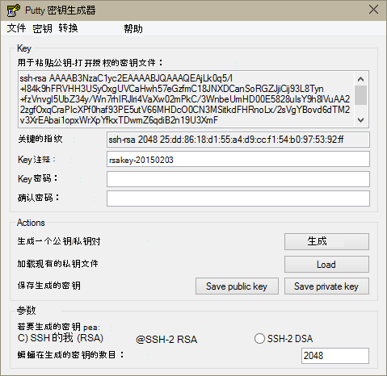
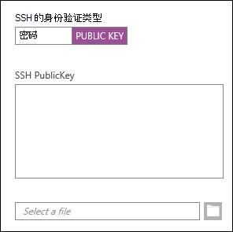
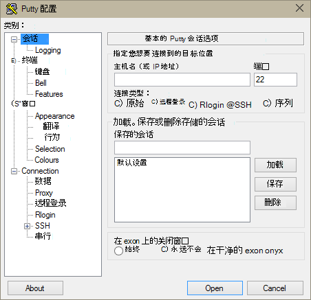
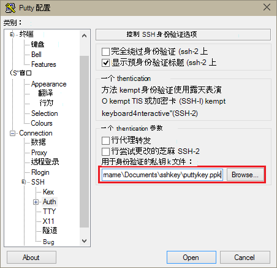
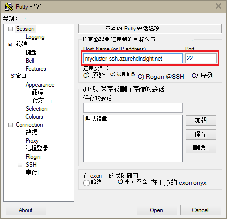
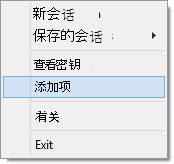
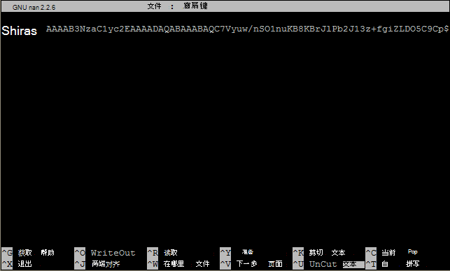

<properties
   pageTitle="在从 Windows 的基于 Linux 的群集上使用 Hadoop 的 SSH 密钥 |Microsoft Azure"
   description="了解如何创建和使用 SSH 密钥进行身份验证与基于 Linux 的 HDInsight 群集。 通过使用 PuTTY SSH 客户端从基于 Windows 的客户端连接群集。"
   services="hdinsight"
   documentationCenter=""
   authors="Blackmist"
   manager="jhubbard"
   editor="cgronlun"
    tags="azure-portal"/>

<tags
   ms.service="hdinsight"
   ms.devlang="na"
   ms.topic="get-started-article"
   ms.tgt_pltfrm="na"
   ms.workload="big-data"
   ms.date="08/30/2016"
   ms.author="larryfr"/>

#在从 Windows HDInsight 基于 Linux 的 Hadoop 使用 SSH

> [AZURE.SELECTOR]
- [窗口](hdinsight-hadoop-linux-use-ssh-windows.md)
- [Linux、 Unix，OS X](hdinsight-hadoop-linux-use-ssh-unix.md)

[安全外壳协议 (SSH)](https://en.wikipedia.org/wiki/Secure_Shell)允许您远程执行基于 Linux 的 HDInsight 群集使用命令行界面上操作。 本文档提供了有关使用 PuTTY SSH 客户端从基于 Windows 的客户端连接到 HDInsight 的信息。

> [AZURE.NOTE] 这篇文章中的步骤假定您在使用基于 Windows 的客户端。 如果您正在使用 Linux、 Unix 或 OS X 客户端，请参阅[使用 SSH 上从 Linux、 Unix 或 OS X HDInsight 基于 Linux 的 Hadoop 使用](hdinsight-hadoop-linux-use-ssh-unix.md)。
>
> 如果有 Windows 10，使用[Windows 在 Ubuntu 上狂欢](https://msdn.microsoft.com/commandline/wsl/about)，然后可以[使用 SSH 上从 Linux、 Unix 或 OS X HDInsight 基于 Linux 的 Hadoop 使用](hdinsight-hadoop-linux-use-ssh-unix.md)文档中使用步骤。

##系统必备组件

* **PuTTY**和**PuTTYGen**的基于 Windows 的客户端。 这些实用程序可从[http://www.chiark.greenend.org.uk/~sgtatham/putty/download.html](http://www.chiark.greenend.org.uk/~sgtatham/putty/download.html)。

* 现代 web 浏览器支持 HTML5。

OR

* [Azure CLI](../xplat-cli-install.md)。

    [AZURE.INCLUDE [use-latest-version](../../includes/hdinsight-use-latest-cli.md)] 

##SSH 是什么？

SSH 是用于登录到，并远程执行命令在远程服务器上的实用程序。 与基于 Linux 的 HDInsight，SSH 建立加密的连接到群集的头节点，并提供了一个用于键入命令的命令行。 然后，直接在服务器上执行命令。

###SSH 用户名称

SSH 用户名称是您使用 HDInsight 群集对进行身份验证的名称。 在群集创建过程中指定 SSH 用户名称时，此用户被创建群集中所有节点上。 创建群集后，您可以使用此用户名连接到 HDInsight 群集的头节点。 从 head 节点，则可以连接到单个辅助节点。

###SSH 密码或公共密钥

SSH 用户可以使用密码或公共密钥身份验证。 密码是文字的公钥生成来唯一地标识您的加密密钥对的一部分时，所做字符串。

键是比密码更安全，但是它需要额外的步骤来生成密钥，您必须维护包含一个安全的位置中的密钥的文件。 如果任何人获得密钥的文件的访问权限，他们获得访问您的帐户。 或者，如果丢失了密钥文件，您将无法登录到您的帐户。

密钥对由组成 （将它发送到 HDInsight 服务器上，） 的公钥和一个私钥 （它将保留在客户机上。）当您连接到 HDInsight 服务器使用 SSH 时，SSH 客户端将使用私钥在您的计算机上与该服务器进行身份验证。

##创建 SSH 密钥

如果您计划在群集中使用 SSH 密钥，请使用下面的信息。 如果您计划使用密码，则可以跳过本节。

1. 打开 PuTTYGen。

2. 对于**生成的密钥类型**，选择**SSH 2 RSA**，，然后单击**生成**。

    

3. 移动鼠标，在进度栏下的区域直到栏填满。 移动鼠标生成用于生成密钥的随机数据。

    

    一旦生成的密钥，将显示中的公共密钥。

4. 为了提高安全性，可以在**密钥密码**字段中，输入密码，然后在**确认密码**字段中键入相同的值。

    

    > [AZURE.NOTE] 我们强烈建议您的密钥使用安全密码。 但是，如果您忘记了密码，则无法恢复它。

5. 单击**保存专用密钥** **.ppk**文件中保存密钥。 该密钥将用于通过身份验证的基于 Linux 的 HDInsight 群集。

    > [AZURE.NOTE] 因为可以用它来访问您的基于 Linux 的 HDInsight 群集应该存储在一个安全位置，此注册表项。

6. 单击**保存公钥**将该项保存为**.txt**文件。 这使您可以创建其他基于 Linux 的 HDInsight 群集时将来重复使用的公钥。

    > [AZURE.NOTE] 顶部的 PuTTYGen 还显示中的公共密钥。 您可以用鼠标右键单击该字段、 复制值，然后将其粘贴到一个窗体，当创建群集使用 Azure 门户。

##创建一个基于 Linux 的 HDInsight 群集

在创建一个基于 Linux 的 HDInsight 群集时，您必须提供以前创建的公用密钥。 从基于 Windows 的客户端有两种方法可以创建一个基于 Linux 的 HDInsight 群集︰

* **Azure 门户**-使用基于 web 的门户网站来创建群集。

* **用于 Mac、 Linux 和 Windows azure CLI** -使用命令行命令来创建群集。

每种方法都需要公共密钥。 有关创建基于 Linux 的 HDInsight 群集的完整信息，请参阅[设置 Linux 基于 HDInsight 群集](hdinsight-hadoop-provision-linux-clusters.md)。

###Azure 门户

当使用[Azure 门户网站][preview-portal]若要创建一个基于 Linux 的 HDInsight 群集，必须输入**SSH 用户名**，并选择输入**密码**或**SSH 公钥**。

如果选择**SSH 公用密钥**，也可以粘贴公钥 (显示在__以便粘贴到授权的 OpenSSH 的公钥\_密钥文件__字段中 PuttyGen，) 到__SSH PublicKey__字段，或选择__选择一个文件__，浏览并选择包含公钥的文件。

这将创建指定的用户的登录名并启用密码身份验证或 SSH 密钥身份验证。

###用于 Mac、 Linux、 Windows azure 的命令行界面

您可以使用[Mac、 Linux 和 Windows Azure CLI](../xplat-cli-install.md)创建新群集使用`azure hdinsight cluster create`命令。

使用此命令的详细信息，请参阅[配置 Hadoop Linux 群集中使用的自定义选项的 HDInsight](hdinsight-hadoop-provision-linux-clusters.md)。

##连接到基于 Linux 的 HDInsight 群集

1. 打开 PuTTY。

    

2. 如果您提供 SSH 密钥，创建您的用户帐户时，您必须执行以下步骤，选择对群集进行身份验证时使用的专用密钥︰

    在**类别**中，扩展**连接**，展开**SSH**，选择**身份验证**。 最后，单击**浏览**并选择.ppk 文件，其中包含您的私钥。

    

3. 在**类别**中，选择**会话**。 从**基本的 PuTTY 会话选项**屏幕，在**主机名 （或 IP 地址）**字段中输入 HDInsight 服务器的 SSH 地址。 有两个可能的 SSH 地址连接到群集时，您可以使用︰

    * __头节点地址__︰ 要连接到群集的头节点，将您的群集名称，则**-ssh.azurehdinsight.net**。 例如， **mycluster-ssh.azurehdinsight.net**。
    
    * __边缘节点地址__︰ 如果您要连接到 HDInsight 群集上 R 服务器，您可以连接到 R 服务器边缘节点使用地址__RServer.CLUSTERNAME.ssh.azurehdinsight.net__，其中群集名称是该群集的名称。 例如， __RServer.mycluster.ssh.azurehdinsight.net__。

    

4. 要保存连接信息供将来使用，请输入下**保存会话**，此连接的名称，然后单击**保存**。 连接将被添加到已保存会话的列表中。

5. 单击**打开**到群集的连接。

    > [AZURE.NOTE] 如果是第一次连接到群集，您将收到安全警报。 这是正常的。 选择**是**以缓存服务器的 RSA2 键继续。

6. 出现提示时，输入在创建群集时输入的用户。 如果您为用户提供了密码，将提示您重新输入一遍也。

> [AZURE.NOTE] 以上步骤假定您在使用端口 22 日将连接到主 headnode HDInsight 群集上。 如果您使用端口 23，您将连接到次映像。 头节点的详细信息，请参阅[HDInsight 中的 Hadoop 群集的可用性和可靠性](hdinsight-high-availability-linux.md)。

###连接到辅助节点

辅助节点不直接可以从外部访问 Azure 数据中心，但他们可以从群集的头节点，通过 SSH 访问。

如果您提供 SSH 密钥，创建您的用户帐户时，您必须执行下列步骤以使用私有密钥，如果您想要连接到辅助节点到群集验证身份时。

1. 从[http://www.chiark.greenend.org.uk/~sgtatham/putty/download.html](http://www.chiark.greenend.org.uk/~sgtatham/putty/download.html)安装露天表演。 此实用程序用于缓存 PuTTY SSH 密钥。

2. 运行露天表演。 将最大限度地为状态任务栏中的图标。 用鼠标右键单击该图标，然后选择**添加项**。

    

3. 浏览对话框出现时，选择.ppk 文件包含密钥，，然后单击**打开**。 这为露天表演，它将其提供给 PuTTY 时连接到群集添加键。

    > [AZURE.IMPORTANT] 如果 SSH 密钥用于保护您的帐户，您必须完成前面的步骤之后，才会能够连接到辅助节点。

4. 打开 PuTTY。

5. 如果您使用 SSH 密钥来进行身份验证，在**类别**部分中，展开**连接**、 展开**SSH**，然后选择**身份验证**。

    在**身份验证参数**部分中，启用**允许代理转发**。 这使得 PuTTY 自动将证书身份验证，通过连接传递给群集的头节点时连接到辅助节点。

    

6. 前面所述，请连接到群集。 如果您使用 SSH 密钥身份验证，不需要选择键-添加到露天表演的 SSH 密钥用于验证群集。

7. 在建立连接后，使用以下内容以检索您的群集中的节点的列表。 *ADMINPASSWORD*替换为您的群集管理员帐户的密码。 *群集名称*替换您的群集的名称。

        curl --user admin:ADMINPASSWORD https://CLUSTERNAME.azurehdinsight.net/api/v1/hosts

    这将显示群集中的节点的 JSON 格式返回的信息包括`host_name`，其中包含的每个节点的完全限定的域名 (FQDN)。 下面是一个示例`host_name`**卷曲**命令所返回的条目︰

        "host_name" : "workernode0.workernode-0-e2f35e63355b4f15a31c460b6d4e1230.j1.internal.cloudapp.net"

8. 一旦您想要连接到辅助节点的列表，使用下面的命令从 PuTTY 会话打开一个连接到辅助节点︰

        ssh USERNAME@FQDN

    替换您的 SSH 用户姓名和*FQDN*与辅助节点的 FQDN*用户名*。 例如， `workernode0.workernode-0-e2f35e63355b4f15a31c460b6d4e1230.j1.internal.cloudapp.net`。

    > [AZURE.NOTE] 如果您使用密码来验证您的 SSH 会话，则将提示您再次输入密码。 如果您使用 SSH 密钥，该连接应该完成没有任何提示。

9. 一旦已经建立的会话，将改为 PuTTY 会话的提示`username@hn#-clustername`到`username@wn#-clustername`来指示您是否连接到辅助节点。 此时运行的任何命令将在辅助节点上运行。

10. 完成该工作节点上执行操作，使用`exit`命令以关闭到辅助节点会话。 这将返回到您`username@hn#-clustername`提示。

##添加更多帐户

如果需要在向群集中添加更多帐户，请执行以下步骤︰

1. 如上文所述，生成一个新的公钥和私钥的新用户帐户。

2. 从群集的 SSH 会话，添加新用户使用以下命令︰

        sudo adduser --disabled-password <username>

    这将创建一个新的用户帐户，但将禁用密码身份验证。

3. 创建目录和文件按住键，使用以下命令︰

        sudo mkdir -p /home/<username>/.ssh
        sudo touch /home/<username>/.ssh/authorized_keys
        sudo nano /home/<username>/.ssh/authorized_keys

4. Nano 编辑器打开时，在复制和粘贴为新的用户帐户中的公共密钥的内容。 最后，使用**Ctrl-X**若要保存文件并退出编辑器。

    

5. 使用下面的命令将.ssh 文件夹及其内容的所有权更改为新的用户帐户︰

        sudo chown -hR <username>:<username> /home/<username>/.ssh

6. 您现在可以对具有新的用户帐户和专用密钥的服务器进行身份验证。

##SSH 隧道

可以使用 SSH 隧道本地请求，如 HDInsight 群集的 web 请求。 如同它有是在 HDInsight 群集的头节点上生成，然后将所请求资源路由请求。

> [AZURE.IMPORTANT] SSH 隧道是访问某些 Hadoop 服务的 web 用户界面的要求。 例如，该作业历史记录用户界面或资源管理器用户界面只可以使用 SSH 隧道。

有关创建和使用 SSH 隧道的详细信息，请参阅[使用 SSH 隧道 Ambari web 用户界面、 ResourceManager、 JobHistory、 NameNode，Oozie 和其他的 web 用户界面的访问](hdinsight-linux-ambari-ssh-tunnel.md)。

##下一步行动

现在，您将了解如何使用 SSH 密钥进行身份验证，了解如何通过在 HDInsight 上的 Hadoop 使用 MapReduce。

* [使用 HDInsight 配置单元](hdinsight-use-hive.md)

* [使用 HDInsight 的小猪](hdinsight-use-pig.md)

* [HDInsight 使用 MapReduce 作业](hdinsight-use-mapreduce.md)

[preview-portal]: https://portal.azure.com/
