<properties
   pageTitle="监视和管理 HDInsight 群集使用 Apache Ambari Web 用户界面 |Microsoft Azure"
   description="了解如何使用 Ambari 来监控和管理基于 Linux 的 HDInsight 群集。 在本文中，您将学习如何使用 HDInsight 群集中包含 Ambari Web 用户界面。"
   services="hdinsight"
   documentationCenter=""
   authors="Blackmist"
   manager="jhubbard"
   editor="cgronlun"
    tags="azure-portal"/>

<tags
   ms.service="hdinsight"
   ms.devlang="na"
   ms.topic="article"
   ms.tgt_pltfrm="na"
   ms.workload="big-data"
   ms.date="09/27/2016"
   ms.author="larryfr"/>

#通过使用 Ambari Web 用户界面管理 HDInsight 群集

[AZURE.INCLUDE [ambari-selector](../../includes/hdinsight-ambari-selector.md)]

Apache Ambari 简化的管理和监视 Hadoop 群集通过提供一种易于使用 web 用户界面和 REST API。 Ambari 包含在基于 Linux 的 HDInsight 群集上，并用于监视群集并进行配置更改。

在本文中，您将学习如何使用 HDInsight 群集 Ambari Web 用户界面。

##Ambari 是什么？

<a href="http://ambari.apache.org" target="_blank">Apache Ambari</a>通过提供易于使用的 web 用户界面，用于配置、 管理和监视 Hadoop 群集使 Hadoop 管理更简单。 开发人员可以使用<a href="https://github.com/apache/ambari/blob/trunk/ambari-server/docs/api/v1/index.md" target="_blank">Ambari REST Api</a>将这些功能集成到其应用程序。

默认情况下，使用基于 Linux 的 HDInsight 群集提供了 Ambari Web 用户界面。 

##连接

在 HTTPS://CLUSTERNAME.azurehdidnsight.net，其中__群集名称__是该群集的名称 HDInsight 群集提供了 Ambari Web 用户界面。 

> [AZURE.IMPORTANT] 在 HDInsight 的 Ambari 连接需要 HTTPS。 您还必须为使用 （默认为__管理员__） 的管理员帐户名和密码创建群集时所提供的 Ambari 进行验证。

##SSH 代理

> [AZURE.NOTE] Ambari 为群集时可以访问，直接通过互联网，从 Ambari Web 用户界面 （如 JobTracker，） 某些链接不在 internet 上公开。 因此，尝试访问这些功能，除非您使用安全外壳协议 (SSH) 隧道代理 web 通信到群集的头节点时，您将收到"服务器未找到"错误。

创建 SSH 隧道使用 Ambari 的信息，请参阅[使用 SSH 隧道 Ambari web 用户界面、 ResourceManager、 JobHistory、 NameNode，Oozie 和其他的 web 用户界面的访问](hdinsight-linux-ambari-ssh-tunnel.md)。

##Ambari Web 用户界面

连接到 Ambari 的 Web 用户界面时，系统会提示您对页面进行身份验证。 使用群集管理员用户 （默认 Admin） 以及在群集创建过程中使用的密码。

当网页打开时，请注意在顶部的栏。 此文件中包含下列信息和控件︰

* **Ambari 徽标**-打开控制板，可用于监视群集。

* **群集名称 # ops** -显示 Ambari 的日常操作的数目。 选择群集名称或**# ops**将显示后台操作的列表。

* **# 警报**-警告或严重警报，如果有的话，该群集。 如果选择此将显示警报的列表。

* **仪表板**的显示仪表板。

* **服务**-在群集中的服务的信息和配置设置。

* **主机**的群集中的节点的信息和配置设置。

* **警报**的信息、 警告和严重警告的日志。

* **管理**-软件堆栈/服务已安装群集服务的帐户信息和 Kerberos 安全上。

* **Admin 按钮**-Ambari 管理、 用户设置和注销。

##监视

###警报

Ambari 提供了很多警报，将具有下列状态之一︰

* **还行**

* **警告**

* **关键**

* **未知**

未准备**好**的警报将导致**# 警报**条目顶部的页后，可以显示的警报数量。 选择此项，将显示警报和它们的状态。

预警分为几个默认组，可以从**通知**页中查看。

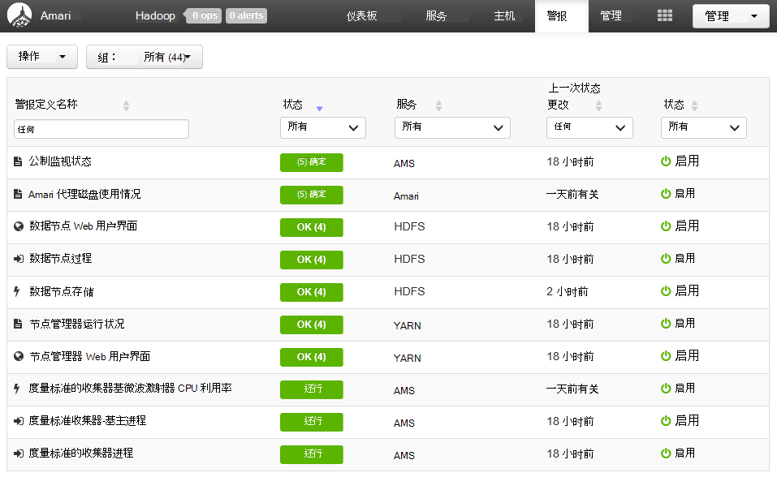

您可以通过使用**动作**菜单并选择**管理警报组**管理的组。 这使您可以修改现有的组，或创建新组。

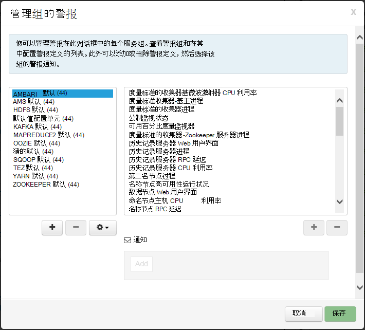

您还可以从**操作**菜单创建警报通知。 这允许您创建特定的警报严重性组合发生时发送通知通过**电子邮件**或**SNMP**的触发器。 例如，您可以发送警报当任何**YARN 默认**组中的警报设置为**严重**。

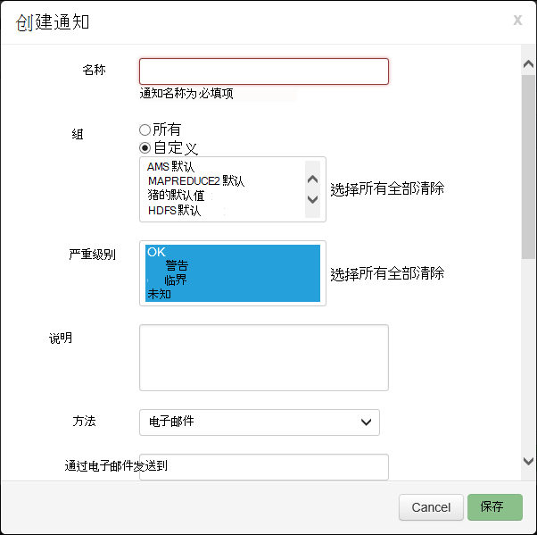

###群集

仪表板**标准**选项卡包含一系列的构件，方便地监视一眼群集的状态。 几个小部件，如**CPU 使用率**，提供其他的信息，单击时。

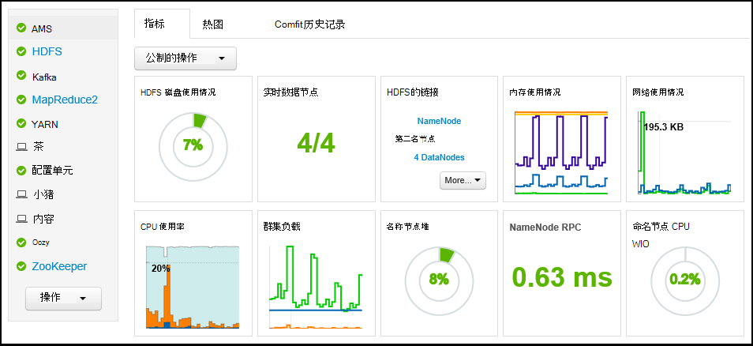

**Heatmaps**选项卡将显示为彩色 heatmaps，会从绿色变成红色的指标。

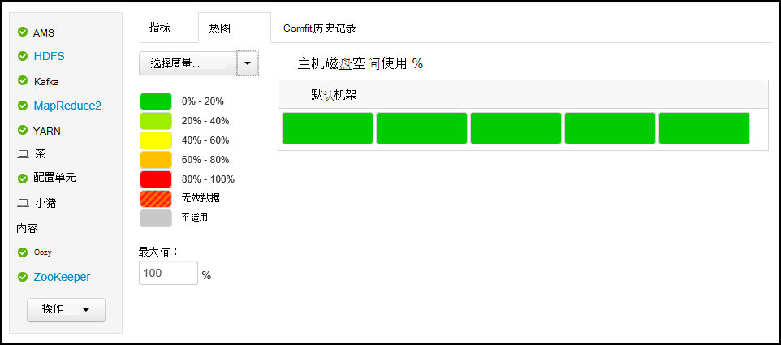

群集中的节点的详细信息，选择**主机**，然后选择您所感兴趣的特定节点。

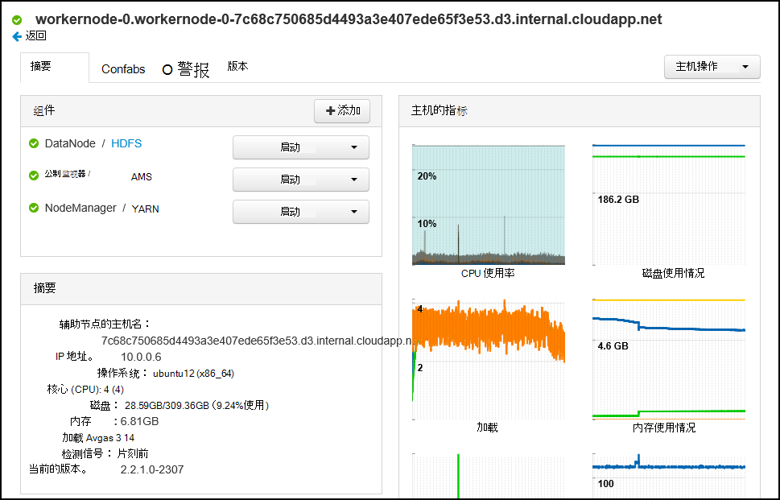

###服务

操控板上的**服务**侧栏提供了快速了解群集上运行的服务的状态。 各种图标用于指示状态或应采取的措施，例如，黄色回收符号如果服务需要被回收。

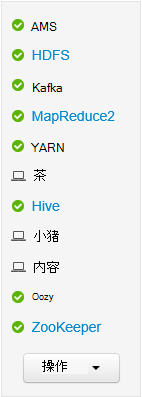

选择服务将在该服务显示更多详细的信息。

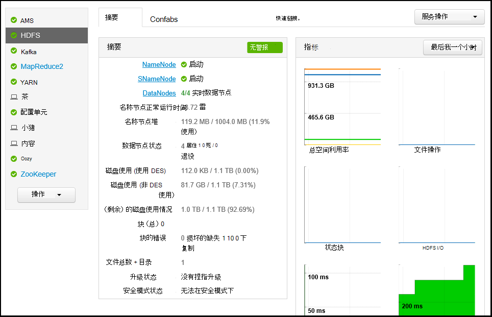

####快速链接

一些服务在页面的顶部显示的**快速链接**链接。 这可以用来访问特定于服务的 web 用户界面，如︰

* **作业历史记录**的 MapReduce 作业历史记录。

* **资源管理器**-YARN ResourceManager UI。

* **NameNode** -Hadoop 分布式文件系统 (HDFS) NameNode 用户界面。

* **Oozie Web 用户界面**的 Oozie 的用户界面。

选择任何这些链接将打开一个新标签，在浏览器中，它将显示所选的页面。

> [AZURE.NOTE] 选择任何服务一个**快速链接**的链接将导致"找不到服务器"的错误，除非您使用安全套接字层 (SSL) 隧道代理 web 通信到群集。 这是因为 web 应用程序用来显示此信息不会在 internet 上公开。
>
> 在 HDInsight 中使用 SSL 隧道的信息，请参阅[使用 SSH 隧道 Ambari web 用户界面、 ResourceManager、 JobHistory、 NameNode，Oozie 和其他的 web 用户界面的访问](hdinsight-linux-ambari-ssh-tunnel.md)

##管理

###Ambari 的用户、 组和权限

管理用户、 组和权限不应使用 HDInsight 群集。

###主机

**主机**页列出群集中的所有主机。 若要管理主机，请按照下列步骤。

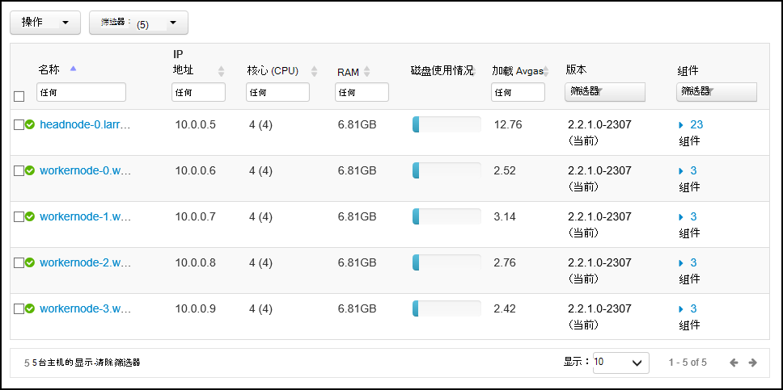

> [AZURE.NOTE] 添加、 退役或 recommissioning 主机不应该使用 HDInsight 群集使用。

1. 选择您要管理的主机。

2. 使用**操作**菜单中选择您想要执行的操作︰

    * **启动所有组件**的都启动主机上的所有组件。

    * **停止所有组件**-都停止主机上的所有组件。

    * **重新启动所有组件**-停止和启动主机上的所有组件。

    * **打开维护模式**-主机取消的通知。 如果您执行的操作，将生成警报，如重新启动正在运行的服务依赖的服务，应启用此。

    * **请关闭维护模式**-返回到正常报警主机。

    * **停止**的停止 DataNode 或主机上的 NodeManagers。

    * **开始**-开始 DataNode 或主机上的 NodeManagers。

    * **重新启动**-停止和启动 DataNode 或 NodeManagers 的主机上。

    * **取消**-从群集中删除一个主机。

        > [AZURE.NOTE] 不要在 HDInsight 群集上使用此操作。

    * **Recommission** -添加一个以前已停止使用的主机到群集。

        > [AZURE.NOTE] 不要在 HDInsight 群集上使用此操作。

###服务

从**仪表板**或**服务**页中，使用**操作**按钮底部的服务列表的停止和启动所有的服务。

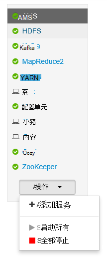

> [AZURE.WARNING] 在此菜单中列出了__添加服务__，它不应将服务添加到 HDInsight 群集。 应在群集资源调配过程中使用脚本操作添加新的服务。 使用脚本的操作的详细信息，请参阅[自定义 HDInsight 群集使用脚本的操作](hdinsight-hadoop-customize-cluster-linux.md)。

在**操作**按钮可重新启动的所有服务，通常要启动、 停止或重新都启动某个特定的服务。 使用以下步骤来对某一项服务执行操作︰

1. 从**仪表板**或**服务**页中，选择服务。

2. 从**摘要**选项卡上，使用**服务操作**按钮，并选择要执行的操作。 这将重新启动所有节点上的服务。

    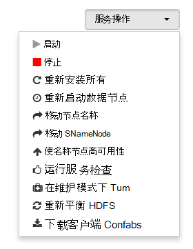

    > [AZURE.NOTE] 重新启动某些服务正在运行群集时可能会生成警报。 若要避免此问题，可以使用**服务操作**按钮来执行重新启动之前启用服务的**维护模式**。

3. 一旦选择了某个操作，则会增加页面的顶部**# op**项要显示后台操作正在发生。 如果配置为显示，显示后台操作的列表。

    > [AZURE.NOTE] 如果该服务启用了**维护模式**，请记住一旦操作完成后，通过**服务操作**按钮将其禁用。

若要配置服务，请使用以下步骤︰

1. 从**仪表板**或**服务**页中，选择服务。

2. 选择**配置**选项卡。 将显示当前配置。 此外显示以前的配置的列表。

    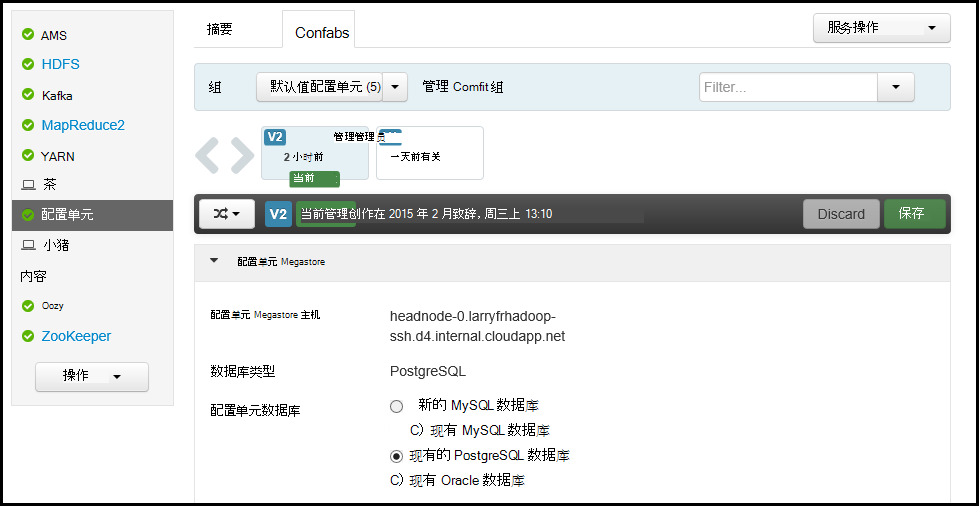

3. 使用要修改配置，而显示的字段，然后选择**保存**。 或者选择以前的配置，然后选择**成为当前**回滚到以前的设置。

##Ambari 视图

Ambari 视图允许开发人员将插入 Ambari Web UI 的 UI 元素使用[Ambari 视图框架](https://cwiki.apache.org/confluence/display/AMBARI/Views)。 HDInsight 提供了以下视图使用 Hadoop 群集类型︰

* Yarn 队列管理器︰ 队列管理器用于查看和修改 YARN 队列提供简单的用户界面。
* 配置单元视图: 配置单元视图允许您直接从您的 web 浏览器中运行配置单元查询。 可以保存查询、 查看结果、 将结果保存到该群集存储器，或将结果下载到您的本地系统。 使用配置单元的视图的详细信息，请参阅[使用配置单元与 HDInsight 视图](hdinsight-hadoop-use-hive-ambari-view.md)。
* Tez 视图︰ Tez 视图允许您更好地理解和执行 Tez 作业方式和作业所使用的资源查看信息优化作业。
