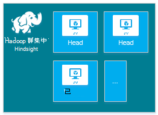
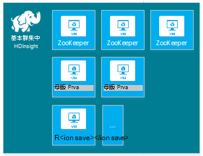
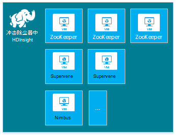
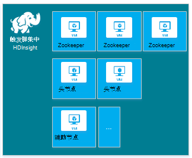
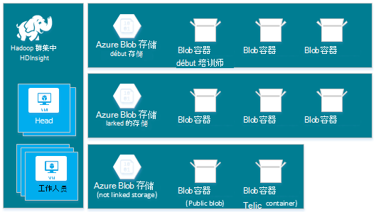
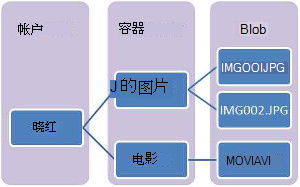
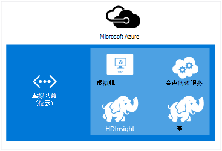
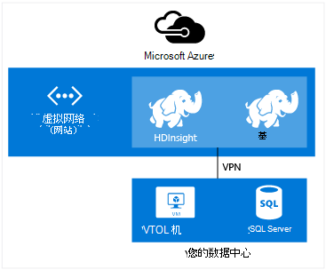

<properties
    pageTitle="在 Linux 中 HDInsight 上创建 Hadoop，HBase、 占领或触发群集 |Microsoft Azure"
    description="了解如何创建 Hadoop，HBase，风暴，或使用浏览器，Azure CLI，Azure PowerShell，其余部分，HDInsight 或 SDK 通过激励在 Linux 上的群集。"
    services="hdinsight"
    documentationCenter=""
    authors="mumian"
    manager="jhubbard"
    editor="cgronlun"
    tags="azure-portal"/>

<tags
    ms.service="hdinsight"
    ms.devlang="na"
    ms.topic="article"
    ms.tgt_pltfrm="na"
    ms.workload="big-data"
    ms.date="10/18/2016"
    ms.author="jgao"/>

# 在 HDInsight 中创建基于 Linux 的 Hadoop 群集

[AZURE.INCLUDE [selector](../../includes/hdinsight-selector-create-clusters.md)]

Hadoop 群集包含几个虚拟机 （节点），用于分布式处理群集上的任务。 Azure 抽象实现细节的安装和配置的各个节点，因此您只需提供常规的配置信息。 在本文中，您了解到了这些配置设置。

## 访问控制要求

[AZURE.INCLUDE [access-control](../../includes/hdinsight-access-control-requirements.md)]

## 群集类型

目前，Azure HDInsight 提供了五种不同类型的群集，每个都有一套组件，以提供一些功能。

| 群集类型 | 功能 |
| ------------ | ----------------------------- |
| Hadoop       | 查询和分析 （批处理作业）     |
| HBase        | NoSQL 数据存储            |
| 风暴        | 实时事件处理 |
| 触发        | 内存中处理、 交互查询批次微流处理 |
| [交互式配置单元 （预览）](hdinsight-hadoop-use-interactive-hive.md) | 内存中缓存的交互性和更快地配置单元查询|
| R 服务器上触发 （预览） | 大量的重要数据的统计、 预测建模和机器学习能力 |

每种群集类型具有其自身数量的群集中的节点，群集中的节点的术语和每个节点类型的默认虚拟机大小。 在下表中，每个节点类型的节点数是用括号括起来。

| 类型| 节点 | 关系图|
|-----|------|--------|
|Hadoop| 头节点 (2) 数据节点 （1 +）||
|HBase|头部服务器 (2) 区域 （1 +） 主/Zookeeper 节点 (3)||
|风暴|Nimbus 节点 (2) 主管服务器 （1 +） Zookeeper 节点 (3)||
|触发|头节点 (2)，辅助节点 （1 +） Zookeeper 节点 (3) （免费为 A1 Zookeepers VM 大小）||

下表列出了默认虚拟机大小为 HDInsight:

- 巴西南部和西日本除外的所有受支持的地区︰

  	|群集类型                     | Hadoop               | HBase                | 风暴                | 触发                                                                 | R 服务器 |
  	|---------------------------------|----------------------|----------------------|----------------------|-----------------------------------------------------------------------|-----------------------------------------------------------------------|
  	|头部 – 默认虚拟机大小           | D3 v2                | D3 v2                | A3                   | D12 v2                                                                | D12 v2                                                                |
  	|头部 – 建议虚拟机大小      | D3 v2、 D4 v2、 D12 v2 | D3 v2、 D4 v2、 D12 v2 | A3，A4，A5           | D12 v2、 D13 v2、 D14 v2                                                | D12 v2、 D13 v2、 D14 v2                                                |
  	|工作人员 – 默认虚拟机大小         | D3 v2                | D3 v2                | D3 v2                | 窗口︰ D12 v2;Linux: D4 v2                                         | 窗口︰ D12 v2;Linux: D4 v2                                         |
  	|工作人员 – 建议虚拟机大小    | D3 v2、 D4 v2、 D12 v2 | D3 v2、 D4 v2、 D12 v2 | D3 v2、 D4 v2、 D12 v2 | 窗口︰ D12 v2、 D13 v2、 D14 v2;Linux: D4 v2、 D12 v2、 D13 v2、 D14 v2 | 窗口︰ D12 v2、 D13 v2、 D14 v2;Linux: D4 v2、 D12 v2、 D13 v2、 D14 v2 |
  	|Zookeeper – 默认虚拟机大小      |                      | A3                   | A2                   |                                                                       |
  	|Zookeeper – 建议虚拟机大小 |                      | A3，A4，A5           | A2，A3，A4           |                                                                       |
  	|边缘-默认虚拟机大小           |                      |                      |                      |                                                                       | 窗口︰ D12 v2;Linux: D4 v2                                         |
  	|边缘的推荐虚拟机大小       |                      |                      |                      |                                                                       | 窗口︰ D12 v2、 D13 v2、 D14 v2;Linux: D4 v2、 D12 v2、 D13 v2、 D14 v2 |

- 巴西南部，仅日本西 （没有 v2 大小此处）︰

  	|群集类型                     | Hadoop      | HBase       | 风暴      | 触发                                          |R 服务器|
  	|---------------------------------|-------------|-------------|------------|------------------------------------------------|--------|
  	|头部 – 默认虚拟机大小           | D3          | D3          | A3         | D12                                            | D12|
  	|头部 – 建议虚拟机大小      | D3，D4 D12 | D3，D4 D12 | A3，A4，A5 | D12、 D13 D14                                  | D12、 D13 D14|
  	|工作人员 – 默认虚拟机大小         | D3          | D3          | D3         | 窗口︰ D12;Linux: D4                        | 窗口︰ D12;Linux: D4|
  	|工作人员 – 建议虚拟机大小    | D3，D4 D12 | D3，D4 D12 | D3，D4 D12| 窗口︰ D12、 D13 D14;Linux: D4，D12、 D13 D14| 窗口︰ D12、 D13 D14;Linux: D4，D12、 D13 D14|
  	|Zookeeper – 默认虚拟机大小      |             | A2          | A2         |                                                | |
  	|Zookeeper – 建议虚拟机大小 |             | A2，A3，A4  | A2，A3，A4 |                                                | |
  	|边缘 – 默认虚拟机大小          |             |             |            |                                                | 窗口︰ D12;Linux: D4 |
  	|边缘 – 建议虚拟机大小      |             |             |            |                                                | 窗口︰ D12、 D13 D14;Linux: D4，D12、 D13 D14 |

请注意，头部被称为*Nimbus*风暴群集类型。 工作人员是已知的作为*区域*HBase 群集类型和*主管*风暴群集类型。

> [AZURE.IMPORTANT] 如果打算让超过 32 辅助节点，在创建群集或通过创建后扩展群集，您必须选择至少 8 核和 14 GB 的 RAM 的头节点大小。

使用[脚本的操作](#customize-clusters-using-script-action)，可以对这些基本类型添加其他组件，如色调或 R。

> [AZURE.IMPORTANT] HDInsight 群集分为多种类型，分别对应于工作负荷或群集进行的优化的技术。 没有受支持的方法，以创建一个组合多个类型，如风暴和 HBase 在一个群集上的群集。 

如果您的解决方案需要跨多个 HDInsight 群集类型的技术，应该创建 Azure 虚拟网络，并创建虚拟网络中必需的群集类型。 这允许群集，并部署到它们，可以直接相互通信的任何代码。

在 HDInsight 中使用 Azure 虚拟网络的详细信息，请参阅[使用 Azure 虚拟网络扩展 HDInsight](hdinsight-extend-hadoop-virtual-network.md)。

使用 Azure 虚拟网络中的两种群集类型的示例，请参阅[与风暴和 HBase 分析传感器数据](hdinsight-storm-sensor-data-analysis.md)。

## 群集层

Azure HDInsight 提供了两个类别中的大数据云选项︰ 标准和[津贴](hdinsight-component-versioning.md#hdinsight-standard-and-hdinsight-premium)。 HDInsight 津贴包括 R 和其他附加组件。 仅在 HDInsight 3.4 版支持 HDInsight 津贴。

下表列出了 HDInsight 群集类型和 HDInsight 特优支持矩阵。

| 群集类型 | 标准 | 高级  |
|--------------|---------------|--------------|
| Hadoop       | 是的           | 是的          |
| 触发        | 是的           | 是的          |
| HBase        | 是的           | 不           |
| 风暴        | 是的           | 不           |
| R 服务器上触发 | 不 | 是的 |

此表将被更新，根据 HDInsight 津贴中包括更多的群集类型。 下面的屏幕快照显示用于选择群集类型的 Azure 门户信息。

## 基本的配置选项

以下是用于创建 HDInsight 群集的基本配置选项。

### 群集名称 ###

群集名称用于标识群集。 群集名称必须是全局唯一的并且它必须遵守以下命名准则︰

- 该字段必须是一个字符串，包含 3 到 63 个字符之间。
- 该字段可以包含字母、 数字和连字符。

### 群集类型###

请参阅[群集类型](#cluster-types)和[群集层](#cluster-tiers)。

### 操作系统 ###

您可以在下面的两个操作系统之一上创建 HDInsight 群集︰

- 在 Linux 上的 HDInsight。  HDInsight 提供了在 Azure 上配置 Linux 群集的选项。 如果您熟悉 Linux 或 Unix，将从现有的基于 Linux 的 Hadoop 解决方案迁移配置 Linux 群集或与 Hadoop 生态系统组件构建 linux 需要方便地集成。 有关详细信息，请参阅[开始使用 Hadoop HDInsight 在 Linux 上](hdinsight-hadoop-linux-tutorial-get-started.md)。
- Windows （Windows Server 2012 R2 数据中心） 的 HDInsight。

### HDInsight 版###

这用来确定 HDInsight 为此群集所需的版本。 有关详细信息，请参阅[Hadoop 群集版本和 HDInsight 中的组件](https://go.microsoft.com/fwLink/?LinkID=320896&clcid=0x409)。

### 订阅名###

每个 HDInsight 群集被依赖于一个 Azure 的订阅。

### 资源组名称 ###

[Azure 资源管理器](../azure-resource-manager/resource-group-overview.md)帮助您为一组，应用程序中使用资源也称为 Azure 资源组。 可以部署、 更新、 监视，或删除一个协调操作应用程序的所有资源。

### 凭据###

使用 HDInsight 群集，您可以在群集创建过程中配置两个用户帐户︰

- HTTP 的用户。 默认的用户名是*admin* Azure 门户上使用基本配置。 有时也称为"群集的用户"。
- SSH 用户 （Linux 群集）。 这用来连接到群集使用 SSH。 通过[使用 SSH 上从 Linux、 Unix 或 OS X HDInsight 基于 Linux 的 Hadoop 使用](hdinsight-hadoop-linux-use-ssh-unix.md)或[使用 SSH 在从 Windows HDInsight 基于 Linux 的 Hadoop 使用](hdinsight-hadoop-linux-use-ssh-unix.md)中的步骤创建群集后，您可以创建额外的 SSH 用户帐户。

    >[AZURE.NOTE] 对于基于 Windows 群集，您可以创建 RDP 用户连接到使用 RDP 的群集。

### 数据源###

原始的 Hadoop 分布式文件系统 (HDFS) 在群集上使用多的本地磁盘。 HDInsight 使用 Azure Blob 存储的数据存储。 Azure Blob 存储是一种可靠、 通用的存储解决方案，与 HDInsight 无缝集成。 通过 HDFS 界面，HDInsight 中的组件的完整集可以直接应用于 Blob 存储中的结构化或非结构化数据。 存储 Blob 存储的数据可以帮助您安全地删除而不会丢失用户的数据用于计算 HDInsight 群集。

配置过程中，必须指定 Azure 存储帐户和 Azure Blob 存储容器在 Azure 存储帐户上。 一些创建过程需要的 Azure 存储帐户和事先创建 Blob 存储容器。 Blob 存储容器用作群集的默认存储位置。 或者，您可以指定其他 Azure 存储帐户 （链接存储） 将可由群集。 群集还可以访问完整公钥的读访问权限或公钥 blob 仅读访问权限配置任何 Blob 存储容器。  有关详细信息，请参阅[管理 Azure 存储资源的访问](../storage/storage-manage-access-to-resources.md)。

>[AZURE.NOTE] Blob 存储容器提供了一套 blob 的分组如下图中所示。

我们不建议使用默认 Blob 存储容器，用于存储业务数据。 一个好的做法以降低存储成本每次使用后，请删除默认 Blob 存储容器。 注意，默认容器包含应用程序和系统日志。 请确保在删除容器之前检索日志。

>[AZURE.WARNING] 不支持共享一个 Blob 存储容器，用于多个群集。

使用辅助 Blob 存储的详细信息，请参阅[HDInsight Azure Blob 存储](hdinsight-hadoop-use-blob-storage.md)。

除了 Azure Blob 存储，还可以使用[Azure 数据湖商店](../data-lake-store/data-lake-store-overview.md)作为 HDInsight 在 HBase 群集的默认存储帐户和所有四个 HDInsight 群集类型链接的存储。 有关详细信息，请参阅[创建与数据湖商店 HDInsight 群集使用 Azure 的门户](../data-lake-store/data-lake-store-hdinsight-hadoop-use-portal.md)。

### 位置 （区域） ###

HDInsight 群集和其默认存储帐户必须位于相同的 Azure 位置。

支持区域的列表，请单击[HDInsight 定价](https://go.microsoft.com/fwLink/?LinkID=282635&clcid=0x409)上的**地区**下拉列表。

### 定价层的节点###

群集的使用寿命期间对这些节点的使用计费客户。 在创建群集时启动该帐单并删除群集时停止。 无法解除分配或将暂停群集。

不同的群集类型具有不同的节点类型的节点和节点大小的数字。 例如，Hadoop 群集类型具有两个_头节点_和默认值为四个_数据节点_，而风暴群集类型具有两个_nimbus 节点_， _zookeeper 节点_的三个，四个_主管节点_的默认值。 HDInsight 群集的成本是由节点和节点的虚拟机大小的数量决定的。 例如，如果您知道您将能执行需要大量内存的操作，您可以选择具有更大内存的计算资源。 出于学习目的，建议使用一个数据节点。 有关定价的 HDInsight 的详细信息，请参阅[HDInsight 定价](https://go.microsoft.com/fwLink/?LinkID=282635&clcid=0x409)。

>[AZURE.NOTE] 群集大小限制 Azure 订阅之间各不相同。 请联系帐单支持增加的限制。

>使用您的群集的节点不计作为虚拟机由于节点所使用的虚拟机映像是 HDInsight 服务的实施细节。 节点使用的计算内核计计算内核提供给您的订阅的总数。 您可以看到可用的内核和创建 HDInsight 群集时，群集节点定价层刀片式服务器的摘要部分中将使用的内核的数目。

当您使用 Azure 门户配置群集时，节点大小可通过__节点定价层__刀片式服务器。 您还可以查看不同的节点大小与相关的成本。 下面的屏幕快照显示了基于 Linux 的 Hadoop 群集的选项。

下表显示了支持 HDInsight 群集和它们提供的容量的大小。

#### 标准层︰ A 系列####

在经典的部署模型中，某些虚拟机大小是 PowerShell 和 CLI 中略有不同。
* Standard_A3 是大
* Standard_A4 是 ExtraLarge

|大小 |CPU 内核|内存|Nic （最大）|最大值。 磁盘大小|最大值。 数据 GB 的磁盘 （1023 每个）|最大值。 IOPS (500 每个磁盘)|
|---|---|---|---|---|---|---|
|Standard_A3\Large|4|7 GB|2|临时 = 285 GB |8|8 x 500|
|Standard_A4\ExtraLarge|8|14 GB|4|临时 = 605 GB |16|16 x 500|
|Standard_A6|4|28 GB|2|临时 = 285 GB |8|8 x 500|
|Standard_A7|8|56 GB|4|临时 = 605 GB |16|16 x 500|

#### 标准层︰ D 系列####

|大小 |CPU 内核|内存|Nic （最大）|最大值。 磁盘大小|最大值。 数据 GB 的磁盘 （1023 每个）|最大值。 IOPS (500 每个磁盘)|
|---|---|---|---|---|---|---|
|Standard_D3 |4|14 GB|4|临时 (SSD) = 200 GB |8|8 x 500|
|Standard_D4 |8|28 GB|8|临时 (SSD) = 400 GB |16|16 x 500|
|Standard_D12 |4|28 GB|4|临时 (SSD) = 200 GB |8|8 x 500|
|Standard_D13 |8|56 GB|8|临时 (SSD) = 400 GB |16|16 x 500|
|Standard_D14 |16|112 GB|8|临时 (SSD) = 800 GB |32|32 x 500|

#### 标准层︰ Dv2 系列####

|大小 |CPU 内核|内存|Nic （最大）|最大值。 磁盘大小|最大值。 数据 GB 的磁盘 （1023 每个）|最大值。 IOPS (500 每个磁盘)|
|---|---|---|---|---|---|---|
|Standard_D3_v2 |4|14 GB|4|临时 (SSD) = 200 GB |8|8 x 500|
|Standard_D4_v2 |8|28 GB|8|临时 (SSD) = 400 GB |16|16 x 500|
|Standard_D12_v2 |4|28 GB|4|临时 (SSD) = 200 GB |8|8 x 500|
|Standard_D13_v2 |8|56 GB|8|临时 (SSD) = 400 GB |16|16 x 500|
|Standard_D14_v2 |16|112 GB|8|临时 (SSD) = 800 GB |32|32 x 500|    

请注意当您打算使用这些资源的部署注意事项，请参见[为虚拟机大小](../virtual-machines/virtual-machines-windows-sizes.md)。 有关定价的各种大小的信息，请参阅[HDInsight 定价](https://azure.microsoft.com/pricing/details/hdinsight)。   

> [AZURE.IMPORTANT] 如果打算让超过 32 辅助节点，在创建群集或通过创建后扩展群集，您必须选择至少 8 核和 14 GB 的 RAM 的头节点大小。

记帐开始时创建群集，并停止删除群集时。 有关定价的详细信息，请参阅[HDInsight 定价的详细信息](https://azure.microsoft.com/pricing/details/hdinsight/)。

## 使用额外的存储

在某些情况下，您可能希望向群集中添加附加存储空间。 例如，可能有的不同地区或不同服务的多个 Azure 存储帐户，但您想要全部使用 HDInsight 对其进行分析。

当您创建一个 HDInsight 群集时或在创建群集后，您可以添加存储帐户。  请参阅[自定义 Linux 基于 HDInsight 群集使用脚本的操作](hdinsight-hadoop-customize-cluster-linux.md)。

有关辅助 Blob 存储的详细信息，请参阅[使用 Azure Blob 存储与 HDInsight](hdinsight-hadoop-use-blob-storage.md)。 有关辅助数据湖存储的详细信息，请参阅[创建 HDInsight 群集数据湖存储区使用 Azure 的门户](../data-lake-store/data-lake-store-hdinsight-hadoop-use-portal.md)。

## 使用配置单元/Oozie metastore

我们强烈建议您使用自定义的 metastore，如果您想要保留您的配置单元表后删除 HDInsight 群集。 您将能够将该 metastore 附加到另一个 HDInsight 群集。

> [AZURE.IMPORTANT] HDInsight metastore 创建一个 HDInsight 群集版本，不能共享不同 HDInsight 群集版本。 HDInsight 版本的列表，请参阅[支持的 HDInsight 版本](hdinsight-component-versioning.md#supported-hdinsight-versions)。

Metastore 包含配置单元和 Oozie 的元数据，例如配置单元表、 分区、 架构和列。 Metastore 可以帮助您保持您的配置单元和 Oozie 的元数据，因此无需重新创建配置单元表或 Oozie 作业时创建新的群集。 默认情况下，配置单元使用嵌入式的 SQL Azure 数据库来存储此信息。 删除群集时，嵌入式的数据库不能保留元数据。 使用创建时配置单元表 HDInsight 群集中配置的配置单元 metastore，重新创建群集使用相同的配置单元 metastore 时，将保留这些表。

Metastore 配置不可用于 HBase 群集类型。

> [AZURE.IMPORTANT] 在创建自定义的 metastore 时，不要使用包含短划线或连字符的数据库名称。 这会导致群集创建过程中失败。

## 使用 Azure 的虚拟网络

使用[Azure 的虚拟网络](https://azure.microsoft.com/documentation/services/virtual-network/)，您可以创建包含您的解决方案所需的资源的安全、 持久网络。 使用虚拟网络，您可以︰

* 连接在一起在专用网络 （仅云） 云资源。

    

* 通过使用虚拟专用网络 (VPN) 连接到您的本地数据中心网络 （站点到站点或点到站点） 云资源。

| 站点到站点配置 | 点到站点配置 |
| -------------------------- | --------------------------- |
| 使用站点的配置，您可以连接多个资源从您的数据中心到 Azure 的虚拟网络使用硬件 VPN 或路由和远程访问服务。  | 点到站点配置中，您可以使用 VPN 软件到 Azure 的虚拟网络连接特定的资源。  |

基于 Windows 群集需要 v1 （经典） 虚拟网络，而基于 Linux 的群集需要 v2 （Azure 资源经理） 虚拟网络。 如果您没有正确的网络类型，它将不能使用时创建群集。

HDInsight 使用虚拟网络，包括在虚拟网络的具体配置要求的详细信息请参阅[扩展 HDInsight 使用 Azure 的虚拟网络的能力](hdinsight-extend-hadoop-virtual-network.md)。

## 自定义群集使用 HDInsight 群集自定义项 （引导）

有时，您想要配置以下配置文件︰

- clusterIdentity.xml
- 核心-site.xml
- gateway.xml
- hbase env.xml
- hbase site.xml
- hdfs site.xml
- 配置单元 env.xml
- 配置单元 site.xml
- mapred 网站
- oozie site.xml
- oozie env.xml
- 暴 site.xml
- tez site.xml
- webhcat site.xml
- yarn site.xml

若要保留通过群集的生存期内更改，您可以使用 HDInsight 群集自定义在创建过程中，或基于 Linux 的群集中，可以使用 Ambari。 有关详细信息，请参阅[使用引导数据库的自定义 HDInsight 群集](hdinsight-hadoop-customize-cluster-bootstrap.md)。

>[AZURE.NOTE] 基于 Windows 群集将不能保留由于重建映像的更改。 有关详细信息，请参阅[角色实例重新启动由于操作系统升级](http://blogs.msdn.com/b/kwill/archive/2012/09/19/role-instance-restarts-due-to-os-upgrades.aspx)。  若要保留通过群集的生存期内更改，则必须使用 HDInsight 群集过程中创建的自定义。

## 自定义群集使用脚本操作

可以安装其他组件，或在创建过程中使用脚本自定义群集配置。 此类脚本调用通过**脚本操作**，即可以从 Azure 门户、 HDInsight Windows PowerShell 的 cmdlet 或 HDInsight.NET SDK 中使用的配置选项。 有关详细信息，请参见[使用脚本操作的自定义 HDInsight 群集](hdinsight-hadoop-customize-cluster-linux.md)。

作为 Java 归档文件 (JAR) 文件，某些本机的 Java 组件，如 Mahout 和级联，可以运行在群集上。 这些 JAR 文件可以分布到 Azure Blob 存储，并通过 Hadoop 作业提交机制提交到 HDInsight 群集。 有关详细信息，请参阅[提交 Hadoop 作业以编程方式](hdinsight-submit-hadoop-jobs-programmatically.md)。

>[AZURE.NOTE] 如果您有问题于 HDInsight 群集部署 JAR 文件或调用 HDInsight 群集上的 JAR 文件，请与[Microsoft 技术支持](https://azure.microsoft.com/support/options/)。

> 级联不支持 HDInsight 并不适用于 Microsoft 技术支持。 有关受支持的组件的列表，请参阅[由 HDInsight 提供的群集版本中的新增功能？](hdinsight-component-versioning.md)

## 使用边缘节点

 空的边缘节点是 Linux 虚拟机安装和配置如 headnodes 中所示的相同客户端工具。 可以使用边缘节点访问群集、 测试客户端应用程序和托管客户端应用程序。 有关详细信息，请参阅[HDInsight 中的使用空白边缘节点](hdinsight-apps-use-edge-node.md)。
 
## 群集创建方法

在本文中，您已了解有关创建基于 Linux 的 HDInsight 群集的基本信息。 使用下表来查找有关如何创建群集使用方法最适合您需要的特定信息。

| 创建群集 | Web 浏览器 | 命令行 | REST API， | SDK | Linux、 Mac OS X 或 Unix | 窗口 |
| ------------------------------- |:----------------------:|:--------------------:|:------------------:|:------------:|:-----------------------------:|:------------:|
| [Azure 门户](hdinsight-hadoop-create-linux-clusters-portal.md) | ✔     | &nbsp; | &nbsp; | &nbsp; | ✔      | ✔ |
| [Azure 数据工厂](hdinsight-hadoop-create-linux-clusters-adf.md) | ✔     | ✔  | ✔  |✔  | ✔      | ✔ |
| [Azure CLI](hdinsight-hadoop-create-linux-clusters-azure-cli.md)         | &nbsp; | ✔     | &nbsp; | &nbsp; | ✔      | ✔ |
| [Azure PowerShell](hdinsight-hadoop-create-linux-clusters-azure-powershell.md) | &nbsp; | ✔     | &nbsp; | &nbsp; | ✔ | ✔ |
| [卷曲](hdinsight-hadoop-create-linux-clusters-curl-rest.md) | &nbsp; | ✔     | ✔ | &nbsp; | ✔      | ✔ |
| [.NET SDK](hdinsight-hadoop-create-linux-clusters-dotnet-sdk.md) | &nbsp; | &nbsp; | &nbsp; | ✔ | ✔      | ✔ |
| [Azure 的资源管理器模板](hdinsight-hadoop-create-linux-clusters-arm-templates.md) | &nbsp; | ✔     | &nbsp; | &nbsp; | ✔      | ✔ |
