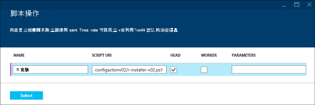

<properties
    pageTitle="HDInsight 自定义群集中的使用 R |Microsoft Azure"
    description="了解如何安装 R 使用脚本操作，并使用 HDInsight 群集上的 R。"
    services="hdinsight"
    documentationCenter=""
    tags="azure-portal"
    authors="mumian"
    manager="jhubbard"
    editor="cgronlun"/>

<tags
    ms.service="hdinsight"
    ms.workload="big-data"
    ms.tgt_pltfrm="na"
    ms.devlang="na"
    ms.topic="article"
    ms.date="09/14/2016"
    ms.author="jgao"/>

# 上安装和使用 R HDInsight Hadoop 群集

了解如何自定义 Windows 基于 HDInsight 群集与 R 使用脚本的操作，以及如何在 HDInsight 上使用 R 群集。 为 HDInsight 提供[特优层](https://azure.microsoft.com/pricing/details/hdinsight/)包括 R 服务器作为 HDInsight 群集的一部分。 这允许使用 MapReduce 和触发运行分布式的计算 R 脚本。 有关详细信息，请参阅[开始使用 R 服务器 HDInsight 上](hdinsight-hadoop-r-server-get-started.md)。 在 R 中使用的基于 Linux 的群集的信息，请参阅[安装和使用 R HDinsight Hadoop 群集 (Linux)](hdinsight-hadoop-r-scripts-linux.md)。
 
通过*脚本操作*，您可以安装在 Azure HDInsight R 上任何类型的群集 Hadoop，风暴，HBase （触发）。 只读的 Azure 存储 blob，在[https://hdiconfigactions.blob.core.windows.net/rconfigactionv02/r-installer-v02.ps1](https://hdiconfigactions.blob.core.windows.net/rconfigactionv02/r-installer-v02.ps1)提供了一个示例脚本，在一个 HDInsight 群集上安装 R。 

**相关的文章**

- [上安装和使用 R HDinsight Hadoop 群集 (Linux)](hdinsight-hadoop-r-scripts-linux.md)
- [在 HDInsight 中的创建 Hadoop 群集](hdinsight-provision-clusters.md)︰ 创建 HDInsight 群集的一般信息
- [自定义 HDInsight 群集使用脚本操作][hdinsight-cluster-customize]︰ 自定义 HDInsight 群集使用脚本操作的一般信息
- [HDInsight 为开发脚本操作脚本](hdinsight-hadoop-script-actions.md)

## R 是什么？

<a href="http://www.r-project.org/" target="_blank">用于统计计算的 R 项目</a>是开放源代码语言和环境的统计计算。 R 提供数百个生成中的统计函数和自己相结合方面的功能和面向对象的编程的编程语言。 它还提供了丰富的图形功能。 R 是大多数专业统计学家和科学家在各种不同的字段中首选的编程环境。

R 是兼容与 Azure Blob 存储 (WASB)，以便可以在 HDInsight 上使用 R 处理其中所存储的数据。  

## R 安装

只读的 blob Azure 存储中提供了[示例脚本](https://hdiconfigactions.blob.core.windows.net/rconfigactionv02/r-installer-v02.ps1)在 HDInsight 群集上安装 R。 本部分提供有关如何创建使用 Azure 门户群集时使用的示例脚本的说明。

> [AZURE.NOTE] 使用 HDInsight 群集版本 3.1 引入了示例脚本。 有关 HDInsight 群集版本的详细信息，请参阅[HDInsight 群集版本](hdinsight-component-versioning.md)。

1. 从门户创建一个 HDInsight 的群集时，单击**可选配置**，然后单击**脚本操作**。
2. 在**脚本操作**页中，输入以下值︰

    

    <table border='1'>
        <tr><th>属性</th><th>值</th></tr>
        <tr><td>名称</td>
            <td>指定脚本操作，例如，<b>安装 R</b>的名称。</td></tr>
        <tr><td>脚本的 URI</td>
            <td>指定调用自定义群集中，例如， <i>https://hdiconfigactions.blob.core.windows.net/rconfigactionv02/r-installer-v02.ps1</i>脚本的 URI</td></tr>
        <tr><td>节点类型</td>
            <td>指定在其运行的自定义脚本的节点。 您可以只选择<b>所有节点</b>、<b>只头节点</b>或<b>辅助节点</b>。
        <tr><td>参数</td>
            <td>指定的参数，如果所需的脚本。 但是，要安装 R 的脚本不需要任何参数，因此您可以将其留空。</td></tr>
    </table>

    您可以添加多个安装在群集上的多个组件的脚本操作。 添加脚本后，请单击复选标记以开始创建群集。

您可以使用该脚本使用 Azure PowerShell 或 HDInsight.NET SDK 安装在 HDInsight R。 本文后面提供了有关这些过程的说明。

## 运行 R 脚本
本部分介绍如何运行 Hadoop 群集与 HDInsight R 脚本。

1. **建立一个远程桌面连接到群集**︰ 从门户，与 R 安装，创建群集启用远程桌面，然后连接到群集。 有关说明，请参阅[HDInsight 群集使用 RDP 连接](hdinsight-administer-use-management-portal.md#rdp)。

2. **打开 R 控制台**︰ R 安装将 R 控制台链接放在头节点的桌面上。 单击它以打开 R 控制台。

3. **运行 R 脚本**︰ R 脚本可以直接从 R 控制台运行通过粘贴它、 选择它，然后按 ENTER。 这里有一个简单的示例脚本，生成编号 1 至 100，然后将其乘以 2。

        library(rmr2)
        library(rhdfs)
        ints = to.dfs(1:100)
        calc = mapreduce(input = ints, map = function(k, v) cbind(v, 2*v))
        from.dfs(calc)

前两行调用 RHadoop 库安装与。最后一行将打印到控制台的结果。 输出应如下所示︰

    [1,]  1 2
    [2,]  2 4
    .
    .
    .
    [98,]  98 196
    [99,]  99 198
    [100,] 100 200

## 安装使用 Aure PowerShell 的 R

请参阅[自定义 HDInsight 群集使用脚本的操作](hdinsight-hadoop-customize-cluster.md#call_scripts_using_powershell)。  此示例说明如何安装使用 Azure PowerShell 的触发。 您需要自定义脚本，以使用[https://hdiconfigactions.blob.core.windows.net/rconfigactionv02/r-installer-v02.ps1](https://hdiconfigactions.blob.core.windows.net/rconfigactionv02/r-installer-v02.ps1)。

## 安装使用.NET SDK 的 R

请参阅[自定义 HDInsight 群集使用脚本的操作](hdinsight-hadoop-customize-cluster.md#call_scripts_using_azure_powershell)。 此示例说明如何安装使用.NET SDK 的触发。 您需要自定义脚本，以使用[https://hdiconfigactions.blob.core.windows.net/rconfigactionv02/r-installer-v02.ps1](https://hdiconfigactions.blob.core.windows.net/rconfigactionv02/r-installer-v02.ps11)。

## 请参见

- [上安装和使用 R HDinsight Hadoop 群集 (Linux)](hdinsight-hadoop-r-scripts-linux.md)
- [在 HDInsight 中的创建 Hadoop 群集](hdinsight-provision-clusters.md)︰ 创建 HDInsight 群集的一般信息
- [自定义 HDInsight 群集使用脚本操作][hdinsight-cluster-customize]︰ 自定义 HDInsight 群集使用脚本操作的一般信息
- [HDInsight 为开发脚本操作脚本](hdinsight-hadoop-script-actions.md)
- [安装和使用 HDInsight 群集上触发][hdinsight-install-spark]︰ 有关安装触发的脚本操作示例
- [在 HDInsight 群集上安装 Giraph](hdinsight-hadoop-giraph-install.md)︰ 有关安装 Giraph 脚本操作示例
- [在 HDInsight 群集上安装 Solr](hdinsight-hadoop-solr-install-linux.md)︰ 有关安装 Solr 的脚本操作示例。

[powershell-install-configure]: powershell-install-configure.md
[hdinsight-provision]: ../hdinsight-provision-clusters/
[hdinsight-cluster-customize]: hdinsight-hadoop-customize-cluster-linux.md
[hdinsight-install-spark]: hdinsight-apache-spark-jupyter-spark-sql.md
