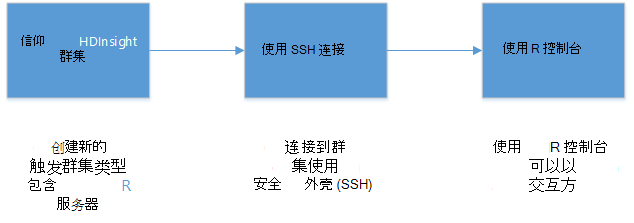
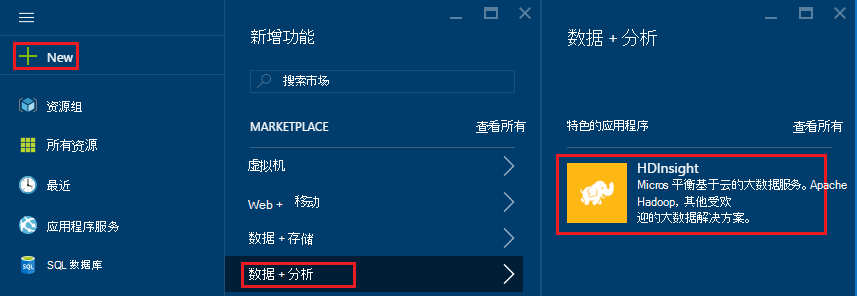
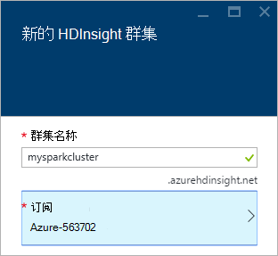
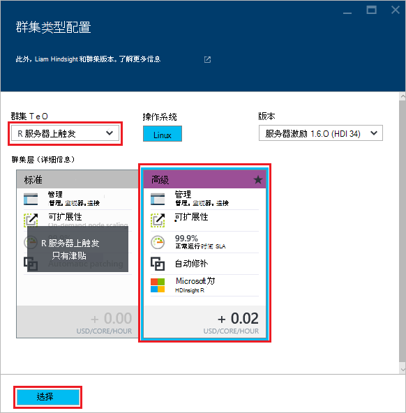
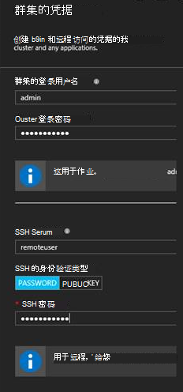
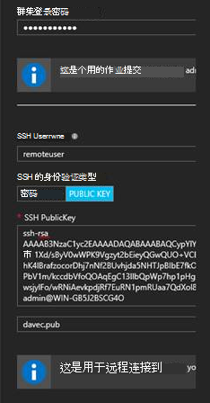
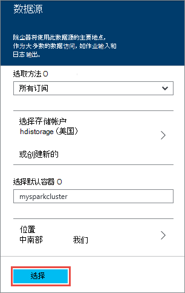
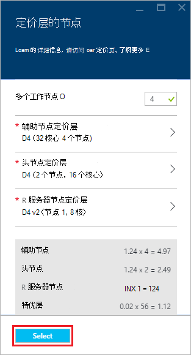
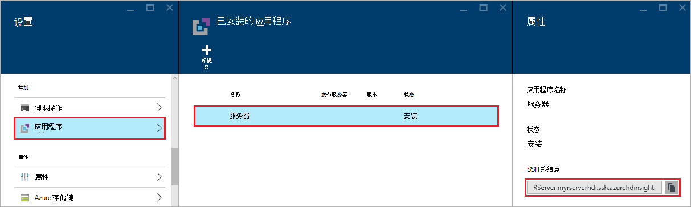
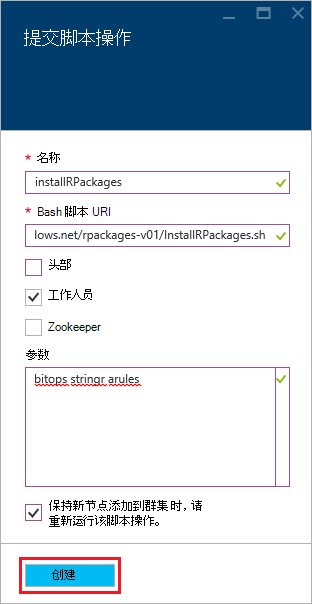

<properties
   pageTitle="开始使用 HDInsight （预览） 上的 R 服务器 |Azure"
   description="了解如何创建包括 R 服务器 （预览） 的 HDInsight (Hadoop) 群集上的 Apache 触发，然后提交群集上的 R 脚本。"
   services="HDInsight"
   documentationCenter=""
   authors="jeffstokes72"
   manager="jhubbard"
   editor="cgronlun"
/>

<tags
   ms.service="HDInsight"
   ms.devlang="R"
   ms.topic="article"
   ms.tgt_pltfrm="na"
   ms.workload="data-services"
   ms.date="08/19/2016"
   ms.author="jeffstok"
/>

# 开始使用 R 服务器 HDInsight （预览）

为 HDInsight 提供特优层包括 R 服务器作为 HDInsight （预览） 群集的一部分。 这允许使用 MapReduce 和触发运行分布式的计算 R 脚本。 在本文中，您将学习如何创建新的 R 服务器 HDInsight，然后运行演示了如何使用分布式 R 计算触发 R 脚本。

## 系统必备组件

* __Azure 订阅__︰ 在开始本教程之前，您必须先 Azure 的订阅。 有关更多信息，请参见[获取 Azure 免费试用版](https://azure.microsoft.com/documentation/videos/get-azure-free-trial-for-testing-hadoop-in-hdinsight/)。

* __安全外壳协议 (SSH) 客户机__︰ 使用 SSH 客户端能够远程连接到 HDInsight 群集和直接在群集上运行的命令。 Linux 和 Unix 中，OS X 系统提供了通过 SSH 客户端`ssh`命令。 对于 Windows 系统，我们建议[PuTTY](http://www.chiark.greenend.org.uk/~sgtatham/putty/download.html)。

    * __SSH 密钥 （可选）__︰ 确保用于连接到群集使用公共密钥或密码的 SSH 帐户的安全。 使用密码更容易，并允许您无需创建一个公钥/私钥对; 开始但是，使用一个键会更加安全。
    
        本文档中的步骤假定您正在使用一个密码。 有关如何创建和使用 HDInsight 的 SSH 密钥的信息，请参阅以下文档︰
        
        * [使用 SSH HDInsight 从 Linux、 Unix 或 OS X 客户机](hdinsight-hadoop-linux-use-ssh-unix.md)
        
        * [从 Windows 客户端中使用 SSH 使用 HDInsight](hdinsight-hadoop-linux-use-ssh-windows.md)

### 访问控制要求

[AZURE.INCLUDE [access-control](../../includes/hdinsight-access-control-requirements.md)]

## 创建群集

> [AZURE.NOTE] 此文档中的步骤创建上使用基本配置信息的 HDInsight R 服务器。 其他的群集配置设置 （如添加更多存储帐户，使用 Azure 虚拟网络，或创建用于配置单元的 metastore），请参阅[创建 Linux 基于 HDInsight 群集](hdinsight-hadoop-provision-linux-clusters.md)。

1. 登录到[Azure 的门户](https://portal.azure.com)。

2. 选择__新__的__数据 + 分析__，然后在__HDInsight__。

    

3. 在__群集名称__字段中输入群集的名称。 如果您有多个 Azure 订阅，使用__订阅__条目选择想要使用的一个。

    

4. 选择__选定的群集类型__。 在__群集类型__刀片式服务器，请选择以下选项︰

    * __群集类型__︰ R 服务器上触发
    
    * __群集层__︰ 高级

    将其他选项保留为默认值，然后使用__选择__按钮来保存群集类型。
    
    
    
    > [AZURE.NOTE] 通过选择群集类型，然后选择__津贴__，还可以添加 R 服务器到其他 HDInsight 群集类型 （例如，Hadoop 或 HBase，）。

5. 选择要查看的现有资源组列表，然后选择创建群集中的一个的**资源组**。 或者，您可以选择**新建**，然后输入新的资源组的名称。 绿色复选标记将显示以指示新组的名称是可用。

    > [AZURE.NOTE] 如果有的话，此项将默认为您现有的资源组之一。
    
    使用__选择__按钮来保存资源组。

6. 选择**凭据**，然后输入**登录用户名群集**和**群集的登录密码**。

    输入__SSH 用户名__。  SSH 使用远程连接到群集使用__安全外壳协议 (SSH)__客户端。 您可以指定 SSH 用户在该对话框中或已创建群集 （群集配置选项卡）。 R 服务器被配置为期望"remoteuser" __SSH 用户名__。  如果您使用不同的用户名，必须创建群集之后执行额外的步骤。
    
    

    __SSH 的身份验证类型__︰ 除非您更喜欢使用公用密钥作为身份验证类型选择__的密码__。  如果您想要访问 R 服务器上远程客户端，如 RTVS、 RStudio 或其他桌面 IDE 能够通过群集，您将需要一个公钥/私钥对。   

    若要创建并使用公钥/私钥对选择公钥，则按如下方式进行。  这些说明假定您使用 ssh keygen 或等效安装有 Cygwin。

    -    在便携式计算机上的命令提示符下生成公钥/私钥的密钥对︰
      
            ssh keygen-t rsa-b 2048 – f < 私有密钥文件名 >
      
    -    这样会如创建专用密钥文件和公用密钥文件名称 < 私有密钥文件名 >.pub 下 davec 和 davec.pub。  然后指定公钥文件 (*.pub) 分配 HDI 群集凭据时︰
      
          
      
    -    更改您的便携式计算机上的专用密钥文件上的权限
      
            chmod 600 < 私有密钥文件名 >
      
    -    使用专用密钥文件使用 SSH 进行远程登录如
      
            ssh – i < 私有密钥文件名 >remoteuser@<hostname public ip>
      
      或者作为部件 R 服务器的客户端上的 Hadoop 触发计算上下文定义 （请参阅使用 Microsoft R 服务器作为 Hadoop 客户端联机[RevoScaleR Hadoop 触发快速入门指南](https://msdn.microsoft.com/microsoft-r/scaler-spark-getting-started)的[创建触发计算上下文](https://msdn.microsoft.com/microsoft-r/scaler-spark-getting-started#creating-a-compute-context-for-spark)部分中。

7. 选择要选择群集的数据源的**数据源**。 请通过选择__选择存储帐户__，然后选择该帐户，选择现有的存储帐户或创建新帐户使用__选择存储帐户__部分中的__新建__链接。

    如果选择__新建__，则必须输入新的存储帐户的名称。 如果接受该名称，则会出现绿色复选标记。

    __默认容器__将默认为该群集的名称。 将此框保留为的值。
    
    选择用于选择要创建存储帐户中的区域的__位置__。
    
    > [AZURE.IMPORTANT] 选择默认的数据源的位置还会设置 HDInsight 群集的位置。 在同一区域必须位于群集和默认数据源。

    使用**选择**按钮来保存数据源配置。
    
    

8. 选择要显示的节点，则为此群集创建信息**节点定价层**。 除非您知道您将需要一个更大的群集，保留默认设置的辅助节点数`4`。 刀片式服务器中，将显示群集的估计的成本。

    > [AZURE.NOTE] 如果需要可以重新调整大小以后通过门户群集 (群集-> 设置-> 扩展群集) 增加或减少工作节点的数目。  这可以是对于闲置，停机时不在使用中，该群集，或者增加容量以满足更大的任务。

    调整您的群集、 数据节点和边缘节点时，需要注意的一些因素包括︰  
   
    - 在触发的分布式 R 服务器分析的性能数据量大时辅助节点数成正比。  
    - R 服务器分析性能，是被分析的数据的大小呈线性。 例如︰  
        - 小到适当的数据，将边缘节点上的本地计算上下文中分析时的最佳性能。  依据本地和触发计算环境最适合的方案的详细信息请参阅上 HDInsight R 服务器计算上下文选项。 
        - 如果您登录到边缘节点并运行您 R 脚本然后所有 ScaleR rx-函数将在边缘节点上<strong>本地</strong>执行，但这样的内存和内核的边缘节点数应调整大小相应地。 这同样适用于使用 R 服务器 HDI 为远程计算上下文从您的便携式计算机。
    
    

    使用**选择**按钮以保存配置的定价的节点。
    
9. 在**新的 HDInsight 群集**刀片式服务器，请确保选择了**附到 ' Startboard** ，，然后选择**创建**。 这会创建群集，并到 Azure 门户网站 Startboard 为其添加一个图块。 群集中创建，并将更改显示的 HDInsight 图标创建完成后，该图标将指示。

  	| 在创建 | 创建完成 |
  	| ------------------ | --------------------- |
  	|  |  |

    > [AZURE.NOTE] 它将需要一些时间为群集创建，通常大约 15 分钟。 使用 Startboard 或**通知**条目左侧的页上平铺上创建过程检查。

## 连接到 R 服务器边缘节点

连接到 HDInsight 群集使用 SSH 的 R 服务器边缘节点︰

    ssh USERNAME@r-server.CLUSTERNAME-ssh.azurehdinsight.net
    
> [AZURE.NOTE] 您还可以找到`R-Server.CLUSTERNAME-ssh.azurehdinsight.net`中选择您的群集中，则__所有设置__、__应用程序__和__RServer__Azure 的门户网站地址。 这将显示边缘节点的 SSH 终结点信息。
>
> 
    
如果您使用密码来保护您的 SSH 用户帐户时，将提示您重新输入一遍。 如果您使用公用密钥，您可能需要使用`-i`参数指定的匹配的私钥。 例如， `ssh -i ~/.ssh/id_rsa USERNAME@R-Server.CLUSTERNAME-ssh.azurehdinsight.net`。
    
在 SSH 中使用基于 Linux 的 HDInsight 的详细信息，请参阅下列文章︰

* [HDInsight 从 Linux、 Unix 或 OS X 上的基于 Linux 的 Hadoop 使用 SSH](hdinsight-hadoop-linux-use-ssh-unix.md)

* [在从 Windows HDInsight 基于 Linux 的 Hadoop 使用 SSH](hdinsight-hadoop-linux-use-ssh-windows.md)

一旦连接，您将到达类似于下面的提示。

    username@ed00-myrser:~$

## 使用 R 控制台

1. 从 SSH 会话，请使用下面的命令启动 R 控制台。

        R
    
    您将看到类似于下面的输出。
    
        R version 3.2.2 (2015-08-14) -- "Fire Safety"
        Copyright (C) 2015 The R Foundation for Statistical Computing
        Platform: x86_64-pc-linux-gnu (64-bit)

        R is free software and comes with ABSOLUTELY NO WARRANTY.
        You are welcome to redistribute it under certain conditions.
        Type 'license()' or 'licence()' for distribution details.

        Natural language support but running in an English locale

        R is a collaborative project with many contributors.
        Type 'contributors()' for more information and
        'citation()' on how to cite R or R packages in publications.

        Type 'demo()' for some demos, 'help()' for on-line help, or
        'help.start()' for an HTML browser interface to help.
        Type 'q()' to quit R.

        Microsoft R Server version 8.0: an enhanced distribution of R
        Microsoft packages Copyright (C) 2016 Microsoft Corporation

        Type 'readme()' for release notes.

        >

2. 从`>`提示，您可以输入 R 代码。 R 服务器包括允许您轻松地与 Hadoop 交互并运行分布式的计算的包。 例如，使用下面的命令以查看 HDInsight 群集的默认文件系统的根。

        rxHadoopListFiles("/")
    
    您还可以使用 WASB 样式寻址。
    
        rxHadoopListFiles("wasbs:///")

## 在 HDI 从 Microsoft R 服务器或 Microsoft R 客户端的远程实例上使用 R 服务器

每节上面关于使用公钥/私钥对访问群集，则可能从 Microsoft R 服务器或 Microsoft R 客户端桌面或膝上型计算机上运行的远程实例 HDI Hadoop 触发计算上下文访问安装程序 （请参见为 Hadoop 客户端联机[RevoScaleR Hadoop 触发快速入门指南](https://msdn.microsoft.com/microsoft-r/scaler-spark-getting-started)的[创建触发计算上下文](https://msdn.microsoft.com/microsoft-r/scaler-spark-getting-started#creating-a-compute-context-for-spark)部分中使用 Microsoft R 服务器）。  为此，您需要指定以下选项定义 RxSpark 时计算在您的便携式计算机上的上下文︰ hdfsShareDir，shareDir，sshUsername，sshHostname，sshSwitches，和 sshProfileScript。 例如︰

    
    myNameNode <- "default"
    myPort <- 0 
 
    mySshHostname  <- 'rkrrehdi1-ssh.azurehdinsight.net'  # HDI secure shell hostname
    mySshUsername  <- 'remoteuser'# HDI SSH username
    mySshSwitches  <- '-i /cygdrive/c/Data/R/davec'   # HDI SSH private key
 
    myhdfsShareDir <- paste("/user/RevoShare", mySshUsername, sep="/")
    myShareDir <- paste("/var/RevoShare" , mySshUsername, sep="/")
 
    mySparkCluster <- RxSpark(
      hdfsShareDir = myhdfsShareDir,
      shareDir     = myShareDir,
      sshUsername  = mySshUsername,
      sshHostname  = mySshHostname,
      sshSwitches  = mySshSwitches,
      sshProfileScript = '/etc/profile',
      nameNode     = myNameNode,
      port         = myPort,
      consoleOutput= TRUE
    )

    
 
## 使用计算上下文

计算上下文允许您控制是否计算将本地执行的边缘节点上，或者是否将分发到 HDInsight 群集中的节点。
        
1. 从 R 控制台中，使用以下方法来为 HDInsight 到存储的默认加载示例数据。

        # Set the HDFS (WASB) location of example data
        bigDataDirRoot <- "/example/data"
        # create a local folder for storaging data temporarily
        source <- "/tmp/AirOnTimeCSV2012"
        dir.create(source)
        # Download data to the tmp folder
        remoteDir <- "http://packages.revolutionanalytics.com/datasets/AirOnTimeCSV2012"
        download.file(file.path(remoteDir, "airOT201201.csv"), file.path(source, "airOT201201.csv"))
        download.file(file.path(remoteDir, "airOT201202.csv"), file.path(source, "airOT201202.csv"))
        download.file(file.path(remoteDir, "airOT201203.csv"), file.path(source, "airOT201203.csv"))
        download.file(file.path(remoteDir, "airOT201204.csv"), file.path(source, "airOT201204.csv"))
        download.file(file.path(remoteDir, "airOT201205.csv"), file.path(source, "airOT201205.csv"))
        download.file(file.path(remoteDir, "airOT201206.csv"), file.path(source, "airOT201206.csv"))
        download.file(file.path(remoteDir, "airOT201207.csv"), file.path(source, "airOT201207.csv"))
        download.file(file.path(remoteDir, "airOT201208.csv"), file.path(source, "airOT201208.csv"))
        download.file(file.path(remoteDir, "airOT201209.csv"), file.path(source, "airOT201209.csv"))
        download.file(file.path(remoteDir, "airOT201210.csv"), file.path(source, "airOT201210.csv"))
        download.file(file.path(remoteDir, "airOT201211.csv"), file.path(source, "airOT201211.csv"))
        download.file(file.path(remoteDir, "airOT201212.csv"), file.path(source, "airOT201212.csv"))
        # Set directory in bigDataDirRoot to load the data into
        inputDir <- file.path(bigDataDirRoot,"AirOnTimeCSV2012") 
        # Make the directory
        rxHadoopMakeDir(inputDir)
        # Copy the data from source to input
        rxHadoopCopyFromLocal(source, bigDataDirRoot)

2. 接下来，让我们创建一些数据信息，并定义两个数据源，以便我们可以处理的数据。

        # Define the HDFS (WASB) file system
        hdfsFS <- RxHdfsFileSystem()
        # Create info list for the airline data
        airlineColInfo <- list(
            DAY_OF_WEEK = list(type = "factor"),
            ORIGIN = list(type = "factor"),
            DEST = list(type = "factor"),
            DEP_TIME = list(type = "integer"),
            ARR_DEL15 = list(type = "logical"))

        # get all the column names
        varNames <- names(airlineColInfo)

        # Define the text data source in hdfs
        airOnTimeData <- RxTextData(inputDir, colInfo = airlineColInfo, varsToKeep = varNames, fileSystem = hdfsFS)
        # Define the text data source in local system
        airOnTimeDataLocal <- RxTextData(source, colInfo = airlineColInfo, varsToKeep = varNames)

        # formula to use
        formula = "ARR_DEL15 ~ ORIGIN + DAY_OF_WEEK + DEP_TIME + DEST"

3. 让我们来运行通过使用本地数据物流回归计算上下文。

        # Set a local compute context
        rxSetComputeContext("local")
        # Run a logistic regression
        system.time(
            modelLocal <- rxLogit(formula, data = airOnTimeDataLocal)
        )
        # Display a summary 
        summary(modelLocal)

    您应该看到结尾行类似于下面的输出。

        Data: airOnTimeDataLocal (RxTextData Data Source)
        File name: /tmp/AirOnTimeCSV2012
        Dependent variable(s): ARR_DEL15
        Total independent variables: 634 (Including number dropped: 3)
        Number of valid observations: 6005381
        Number of missing observations: 91381
        -2*LogLikelihood: 5143814.1504 (Residual deviance on 6004750 degrees of freedom)

        Coefficients:
                        Estimate Std. Error z value Pr(>|z|)
        (Intercept)   -3.370e+00  1.051e+00  -3.208  0.00134 **
        ORIGIN=JFK     4.549e-01  7.915e-01   0.575  0.56548
        ORIGIN=LAX     5.265e-01  7.915e-01   0.665  0.50590
        ......
        DEST=SHD       5.975e-01  9.371e-01   0.638  0.52377
        DEST=TTN       4.563e-01  9.520e-01   0.479  0.63172
        DEST=LAR      -1.270e+00  7.575e-01  -1.676  0.09364 .
        DEST=BPT         Dropped    Dropped Dropped  Dropped
        ---
        Signif. codes:  0 ‘***’ 0.001 ‘**’ 0.01 ‘*’ 0.05 ‘.’ 0.1 ‘ ’ 1

        Condition number of final variance-covariance matrix: 11904202
        Number of iterations: 7

4. 下一步，让我们运行使用触发上下文相同物流回归。 触发上下文将分布在 HDInsight 群集中的所有辅助节点处理。

        # Define the Spark compute context 
        mySparkCluster <- RxSpark()
        # Set the compute context 
        rxSetComputeContext(mySparkCluster)
        # Run a logistic regression 
        system.time(  
            modelSpark <- rxLogit(formula, data = airOnTimeData)
        )
        # Display a summary
        summary(modelSpark)

    > [AZURE.NOTE] 您还可以使用 MapReduce 在群集节点上分布计算。 在计算上下文的详细信息，请参阅[计算 R HDInsight 高级服务器的上下文选项](hdinsight-hadoop-r-server-compute-contexts.md)。

## 分发到多个节点的 R 代码

可以很容易地取得现有 R 代码并使用跨多个节点在群集中运行它与 R 服务器`rxExec`。 执行参数扫描或模拟时，这非常有用。 下面是如何使用的示例`rxExec`。

    rxExec( function() {Sys.info()["nodename"]}, timesToRun = 4 )
    
如果您仍在使用的触发或 MapReduce 上下文，这将返回工作节点的节点名称值的代码 (`Sys.info()["nodename"]`) 运行。 例如，在四节点群集上，您可能会收到与下面类似的输出。

    $rxElem1
        nodename
    "wn3-myrser"

    $rxElem2
        nodename
    "wn0-myrser"

    $rxElem3
        nodename
    "wn3-myrser"

    $rxElem4
        nodename
    "wn3-myrser"

## R 包安装

如果您想要在边缘节点上安装其他 R 程序包，则可以使用`install.packages()`直接从内 R 控制台连接到通过 SSH 的边缘节点时。 但是，如果您需要在群集的辅助节点上安装 R 程序包，您必须使用脚本操作。

脚本操作是用于更改 HDInsight 群集配置或安装其他软件的 Bash 脚本。 在这种情况下，若要安装其他 R 程序包。 若要安装附加软件包使用脚本操作，请使用以下步骤。

> [AZURE.IMPORTANT] 使用脚本的操作来安装附加的 R 程序包只能在创建群集之后。 它不应使用在群集创建过程中为脚本依赖于 R 服务器完全安装和配置。

1. 从[Azure 的门户网站](https://portal.azure.com)，选择 HDInsight 群集上 R 服务器。

2. 从群集刀片式服务器，选择__的所有设置__，然后__脚本操作__。 从__脚本操作__刀片式服务器，选择__提交新__提交新的脚本操作。

    

3. 从__提交脚本操作__刀片式服务器，请提供以下信息。

  - __名称__︰ 好记的名称来标识该脚本
  - __指责脚本 URI__:`http://mrsactionscripts.blob.core.windows.net/rpackages-v01/InstallRPackages.sh`
  - __头部__︰ 这应该是__未选中__
  - __工作人员__︰ 这应该是__检查__
  - __Zookeeper__︰ 这应该是__未选中__
  - __参数__︰ R 安装程序包。 例如，`bitops stringr arules`
  - __Persist 此脚本...__: 这应该是__已选中__  

    > [AZURE.NOTE] 1.默认情况下，R 的所有包都安装 Microsoft MRAN 存储库与 R 服务器已都安装的版本一致的快照。  如果您想要安装较新版本的软件包，则还有不兼容造成的一些风险，但是这是可以通过指定`useCRAN`作为包的第一个元素列表，例如 `useCRAN bitops, stringr, arules`.  
    > 2. 一些 R 包将需要额外的 Linux 系统库。 为方便起见，我们已预安装所需的 100 R 最受欢迎的顶级包的依赖关系。 但是，如果您安装的 R 程序包需要超出这些库，然后必须下载使用此处的基本脚本和添加步骤安装的系统库。 然后必须将修改后的脚本上传到 Azure 存储中的公钥 blob 容器，并使用修改后的脚本来安装软件包。
    > 开发脚本操作的详细信息，请参见[脚本操作开发](hdinsight-hadoop-script-actions-linux.md)。  

    

4. 选择要运行的脚本的__创建__。 一旦脚本执行完毕，R 包将提供工作人员的所有节点上。
    
## 下一步行动

现在，您将了解如何创建新的 HDInsight 群集包含 R 服务器，并使用 R 控制台的 SSH 会话的基本知识，使用以下方法来发现在 HDInsight R 服务器所使用的其他方法。

- [RStudio 服务器添加到 HDInsight 津贴](hdinsight-hadoop-r-server-install-r-studio.md)

- [计算 R 服务器在 HDInsight 高级上下文选项](hdinsight-hadoop-r-server-compute-contexts.md)

- [R 服务器在 HDInsight 特优 azure 存储选项](hdinsight-hadoop-r-server-storage.md)

### Azure 的资源管理器模板

如果你想自动使用 Azure 资源管理器模板 HDInsight R 服务器创建，请参阅以下示例模板。

* [使用 SSH 公钥的 HDInsight 群集上创建一个 R 服务器](http://go.microsoft.com/fwlink/p/?LinkID=780809)
* [在使用 SSH 密码 HDInsight 群集上创建一个 R 服务器](http://go.microsoft.com/fwlink/p/?LinkID=780810)

这两个模板创建一个新的 HDInsight 群集和关联的存储帐户，可以从 Azure CLI，Azure PowerShell 或 Azure 门户网站使用。

有关使用 Azure 资源管理器模板的一般信息，请参阅[创建 Linux 基于 Hadoop 群集中使用 Azure 资源管理器模板 HDInsight](hdinsight-hadoop-create-linux-clusters-arm-templates.md)。
