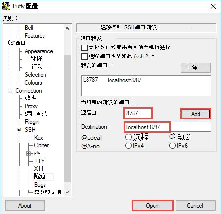
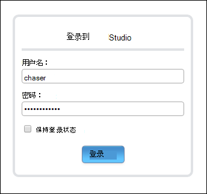

<properties
    pageTitle="用 R 服务器 HDInsight （预览） 上安装 RStudio |Microsoft Azure"
    description="如何安装 RStudio R 服务器在 HDInsight （预览）。"
    services="hdinsight"
    documentationCenter=""
    authors="jeffstokes72"
    manager="jhubbard"
    editor="cgronlun"/>

<tags
   ms.service="hdinsight"
   ms.devlang="na"
   ms.topic="article"
   ms.tgt_pltfrm="na"
   ms.workload="big-data"
   ms.date="09/16/2016"
   ms.author="jeffstok"/>

# 使用 R 服务器 HDInsight （预览） 上安装 RStudio

有多个集成的开发环境 (IDE) 可用于 R 目前，包括微软最近宣布[R Visual Studio 工具](https://www.visualstudio.com/en-us/features/rtvs-vs.aspx)(RTVS) 的桌面机和服务器工具[RStudio](https://www.rstudio.com/products/rstudio-server/)或 Walware 的基于 Eclipse 的[StatET](http://www.walware.de/goto/statet)系列。 在 Linux 上最受欢迎之一是使用[RStudio 服务器](https://www.rstudio.com/products/rstudio-server/)，可以提供远程客户端使用基于浏览器的 IDE。  HDInsight 高级群集的边缘节点上安装 RStudio 服务器提供完整的 IDE 体验开发和 R 脚本的执行与 R 服务器在群集上，并且可以大大提高效率比默认使用的 R 控制台。

在本文中，您将学习如何通过使用自定义脚本边缘节点的群集上安装 RStudio 服务器的社区 （免费） 版本。 如果您喜欢商业许可的 Pro 版 RStudio 服务器，您必须从[RStudio 服务器](https://www.rstudio.com/products/rstudio/download-server/)执行的安装说明进行操作。

> [AZURE.NOTE] 此文档中的步骤需要 HDInsight 群集上 R 服务器，如果您正在使用 HDInsight 群集将无法正常运行在 R 的安装使用[安装 R 脚本操作](hdinsight-hadoop-r-scripts-linux.md)。

## 系统必备组件

* 与 R 服务器安装 Azure HDInsight 群集。 有关说明，请参阅[开始使用 R HDInsight 群集上的服务器](hdinsight-hadoop-r-server-get-started.md)。
* SSH 客户端。 Linux 和 Unix 分发或 Macintosh OS X`ssh`命令提供与操作系统。 对于 Windows，我们建议使用[OpenSSH 选项](https://www.youtube.com/watch?v=CwYSvvGaiWU)或[PuTTY](http://www.chiark.greenend.org.uk/~sgtatham/putty/download.html) [Cygwin](http://www.redhat.com/services/custom/cygwin/) 。  

## 在使用自定义脚本的群集上安装 RStudio

1. 确定群集的边缘节点。 HDInsight R 服务器群集，下面是头节点和边缘节点的命名约定。

    * 头节点的`CLUSTERNAME-ssh.azurehdinsight.net`
    * 边缘节点-`R-Server.CLUSTERNAME-ssh.azurehdinsight.net` 

2. SSH 到边缘节点的群集使用上面的命名模式。 
 
    * 如果您从 Linux 客户端进行连接，请参阅[连接到一个基于 Linux 的 HDInsight 群集](hdinsight-hadoop-linux-use-ssh-unix.md#connect-to-a-linux-based-hdinsight-cluster)。
    * 如果您从 Windows 客户端连接，请参阅[连接到使用 PuTTY 的基于 Linux 的 HDInsight 群集](hdinsight-hadoop-linux-use-ssh-windows.md#connect-to-a-linux-based-hdinsight-cluster)。

3. 一旦连接，成为根用户在群集上。 在 SSH 会话，请使用下面的命令。

        sudo su -

4. 下载安装 RStudio 的自定义脚本。 使用下面的命令。

        wget http://mrsactionscripts.blob.core.windows.net/rstudio-server-community-v01/InstallRStudio.sh

5. 更改自定义脚本文件的权限，然后运行该脚本。 使用以下命令。

        chmod 755 InstallRStudio.sh
        ./InstallRStudio.sh

6. 如果您在使用 R 服务器创建一个 HDInsight 群集时使用 SSH 密码，可以跳过此步骤并继续执行下一步。 如果您改用 SSH 密钥来创建群集，则必须设置 SSH 用户密码。 连接到 RStudio 时，您将需要此密码。 运行下面的命令。 当系统提示您输入**当前 Kerberos 密码**，只需按**enter 键**。  请注意，您必须替换`USERNAME`与 HDInsight 群集的 SSH 用户。

        passwd USERNAME
        Current Kerberos password:
        New password:
        Retype new password:
        Current Kerberos password:
        
    如果成功地设置您的密码，您应该看到这样一条消息。

        passwd: password updated successfully

    退出的 SSH 会话。

7. 通过将映射创建群集的 SSH 隧道`localhost:8787`HDInsight 群集对客户端计算机上。 在打开新的浏览器会话之前，您必须创建 SSH 隧道。

    * 在 Linux 客户端或 Windows 客户端采用[Cygwin](http://www.redhat.com/services/custom/cygwin/)然后打开终端会话，使用下面的命令。

            ssh -L localhost:8787:localhost:8787 USERNAME@R-Server.CLUSTERNAME-ssh.azurehdinsight.net
            
        替换为 HDInsight 群集，SSH 用户的**用户名**和替换**群集名称**HDInsight 群集的名称与您还可以使用 SSH 密钥，而不是密码加上`-i id_rsa_key`     

    * 如果使用 Windows 客户端 PuTTY 然后

        1.  打开 PuTTY，并输入连接信息。 如果您还不熟悉 PuTTY，信息，请参阅[使用 SSH 与从 Windows HDInsight 上的基于 Linux 的 Hadoop](hdinsight-hadoop-linux-use-ssh-windows.md)如何使用 HDInsight。
        2.  在对话框左侧的**类别**部分中，展开**连接**， **SSH**，展开，然后选择**隧道**。
        3.  在**控制 SSH 端口转发选项**窗体中提供以下信息︰

            * **源端口**--您希望转发客户端上的端口。 例如，为**8787**。
            * **目标**-必须映射到本地客户端计算机的目标。 例如， **localhost:8787**。

            

        4. 单击**添加**以添加设置，然后再单击**打开**来打开 SSH 连接。
        5. 如果出现提示，请登录到服务器。 这会建立 SSH 会话并启用隧道。

8. 打开 web 浏览器并输入以下 URL 基于隧道的输入的端口上。

        http://localhost:8787/ 

9. 系统将提示您输入 SSH 用户名和密码以连接到群集。 如果您在创建群集时使用 SSH 密钥，您必须输入您在第 5 步中创建的密码。

    

10. 若要测试 RStudio 安装是否成功，您可以运行测试脚本执行 R 群集上基于 MapReduce 和触发作业。 返回到 SSH 控制台，请输入以下命令以下载测试脚本运行在 RStudio。

    * 如果您创建了 R 的 Hadoop 群集，使用此命令。
        
            wget http://mrsactionscripts.blob.core.windows.net/rstudio-server-community-v01/testhdi.r

    * 如果 R 与创建触发群集，使用此命令。

            wget http://mrsactionscripts.blob.core.windows.net/rstudio-server-community-v01/testhdi_spark.r

11. 在 RStudio，您将看到您所下载的测试脚本。 双击文件以打开它，选择内容的文件，然后单击**运行**。 您应该看到在**控制台**窗格中的输出。
 
    

另一种方法是键入`source(testhdi.r)`或`source(testhdi_spark.r)`来执行脚本。

## 请参见

- [计算 R 服务器 HDInsight 群集上下文选项](hdinsight-hadoop-r-server-compute-contexts.md)

- [R 服务器在 HDInsight 特优 azure 存储选项](hdinsight-hadoop-r-server-storage.md)

 
