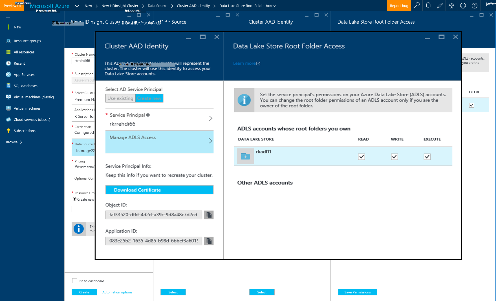

<properties
   pageTitle="R 服务器 HDInsight （预览） 在 azure 存储选项 |Microsoft Azure"
   description="了解如何在 HDInsight （预览） 与 R 服务器的用户可以使用不同的存储选项"
   services="HDInsight"
   documentationCenter=""
   authors="jeffstokes72"
   manager="jhubbard"
   editor="cgronlun"
/>

<tags
   ms.service="HDInsight"
   ms.devlang="R"
   ms.topic="article"
   ms.tgt_pltfrm="na"
   ms.workload="data-services"
   ms.date="09/01/2016"
   ms.author="jeffstok"
/>

# <a name="azure-storage-options-for-r-server-on-hdinsight-preview"></a>R 服务器 HDInsight （预览） 在 azure 存储选项

HDInsight （预览） 上的 Microsoft R 服务器有权访问这两个 Azure Blob 和[Azure 数据湖存储](https://azure.microsoft.com/services/data-lake-store/)，作为一种持久化数据，而代码，结果分析，从对象等。

在 HDInsight 中创建一个 Hadoop 群集时，您指定的 Azure 存储帐户。 从该帐户的特定 Blob 存储容器存放的群集 （例如，Hadoop 分布式文件系统） 创建的文件系统。 出于性能，HDInsight 群集作为主存储帐户指定同一个数据中心中创建。 有关详细信息，请参阅[使用 Azure Blob 存储与 HDInsight](hdinsight-hadoop-use-blob-storage.md "与 HDInsight 的使用 Azure Blob 存储")。   


## <a name="use-multiple-azure-blob-storage-accounts"></a>使用多个 Azure Blob 存储帐户

如有必要，您可以用 HDI 群集访问多个 Azure 存储帐户或容器。 若要执行此操作，您需要用户界面中指定附加的存储帐户时创建该群集，然后按照以下步骤用键。  

1.  创建存储帐户名称**容量 1**和默认容器称为**container1**HDInsight 群集。
2. 指定一个额外的存储帐户称为**storage2**。  
3. 将 mycsv.csv 文件复制到 /share 目录中，并对该文件进行分析。  

    ````
    hadoop fs –mkdir /share
    hadoop fs –copyFromLocal myscsv.scv /share  
    ````

3.  在 R 代码中，将名称节点设置为**默认值，**并设置您的目录和文件来处理。  

    ````
    myNameNode <- "default"
    myPort <- 0
    ````

  数据的位置︰  

    bigDataDirRoot <-"/ 共享"  

  定义触发计算上下文︰

    mySparkCluster <-RxSpark(consoleOutput=TRUE)

  设置计算上下文︰

    rxSetComputeContext(mySparkCluster)

  定义的 Hadoop 分布式文件系统 (HDFS) 文件系统︰

    hdfsFS <-RxHdfsFileSystem (主机名 myNameNode，端口 = = myPort)

  指定要在 HDFS 中分析的输入的文件︰

    输入文件 <-file.path(bigDataDirRoot,"mycsv.csv")

所有的目录和文件的引用指向存储帐户wasbs://container1@storage1.blob.core.windows.net。 这是**默认的存储客户，**与 HDInsight 群集相关联。

现在，假设您想要处理的文件称为位于 /private 的 mySpecial.csv **container2**在**storage2**目录。

在 R 代码中，点到**storage2**存储帐户名称节点引用。

    myNameNode <- "wasbs://container2@storage2.blob.core.windows.net"
    myPort <- 0

  数据的位置︰

    bigDataDirRoot <- "/private"

  定义触发计算上下文︰

    mySparkCluster <- RxSpark(consoleOutput=TRUE, nameNode=myNameNode, port=myPort)

  设置计算上下文︰

    rxSetComputeContext(mySparkCluster)

  定义 HDFS 文件系统︰

    hdfsFS <- RxHdfsFileSystem(hostName=myNameNode, port=myPort)

  指定要在 HDFS 中分析的输入的文件︰

    inputFile <-file.path(bigDataDirRoot,"mySpecial.csv")

所有引用的目录和文件现在指向存储帐户wasbs://container2@storage2.blob.core.windows.net。 这是您指定**名称的节点**。

注意，您将需要配置 /user/RevoShare/<SSH username>目录上**storage2** ，如下所示︰

    hadoop fs -mkdir wasbs://container2@storage2.blob.core.windows.net/user
    hadoop fs -mkdir wasbs://container2@storage2.blob.core.windows.net/user/RevoShare
    hadoop fs -mkdir wasbs://container2@storage2.blob.core.windows.net/user/RevoShare/<RDP username>

## <a name="use-an-azure-data-lake-store"></a>使用 Azure 数据湖商店

若要使用您的 HDInsight 帐户数据湖商店，您需要给您想要使用的每个 Azure 数据湖存储群集访问。 您对存储在脚本中使用 R 得像您使用辅助存储帐户 （如前面步骤中所述）。

## <a name="add-cluster-access-to-your-azure-data-lake-stores"></a>将群集访问添加到 Azure 数据湖商店

可通过与 HDInsight 群集 Azure 活动目录 (AD Azure) 服务主体访问数据湖商店。

### <a name="to-add-a-service-principal"></a>若要添加一个服务主体
1. 当您创建 HDInsight 群集时，请从**数据源**选项卡选择**群集 AAD 标识**。
2. 在**群集 AAD 标识**对话框中的下**选择广告服务主体**，选择**新建**。

为服务主体名称并为其创建密码之后，一个新的选项卡打开您可以与数据湖存储关联服务主体。

请注意，还可以访问到数据湖商店以后在 Azure 的门户打开数据湖商店并转到**数据资源管理器**通过 > **访问**。  下面是一个对话框，其中显示了如何创建服务主体和将其与"rkadl11"湖泊的数据存储区关联的示例。




## <a name="use-the-data-lake-store-with-r-server"></a>R 服务器上使用数据湖商店
一旦您已授予访问权限数据湖商店，可以使用 R 服务器中的存储在 HDInsight 上辅助 Azure 存储帐户的方式。 唯一的区别在于前缀**wasb: / /**更改为**adl: / /** ，如下所示︰

````
# Point to the ADL store (e.g. ADLtest)
myNameNode <- "adl://rkadl1.azuredatalakestore.net"
myPort <- 0

# Location of the data (assumes a /share directory on the ADL account)
bigDataDirRoot <- "/share"  

# Define Spark compute context
mySparkCluster <- RxSpark(consoleOutput=TRUE, nameNode=myNameNode, port=myPort)

# Set compute context
rxSetComputeContext(mySparkCluster)

# Define HDFS file system
hdfsFS <- RxHdfsFileSystem(hostName=myNameNode, port=myPort)

# Specify the input file in HDFS to analyze
inputFile <-file.path(bigDataDirRoot,"AirlineDemoSmall.csv")

# Create factors for days of the week
colInfo <- list(DayOfWeek = list(type = "factor",
               levels = c("Monday", "Tuesday", "Wednesday", "Thursday",
                          "Friday", "Saturday", "Sunday")))

# Define the data source
airDS <- RxTextData(file = inputFile, missingValueString = "M",
                    colInfo  = colInfo, fileSystem = hdfsFS)

# Run a linear regression
model <- rxLinMod(ArrDelay~CRSDepTime+DayOfWeek, data = airDS)
````

以下是用于使用 RevoShare 目录配置数据湖存储帐户和前面的示例中添加示例.csv 文件中的命令︰

````
hadoop fs -mkdir adl://rkadl1.azuredatalakestore.net/user
hadoop fs -mkdir adl://rkadl1.azuredatalakestore.net/user/RevoShare
hadoop fs -mkdir adl://rkadl1.azuredatalakestore.net/user/RevoShare/<user>

hadoop fs -mkdir adl://rkadl1.azuredatalakestore.net/share

hadoop fs -copyFromLocal /usr/lib64/R Server-7.4.1/library/RevoScaleR/SampleData/AirlineDemoSmall.csv adl://rkadl1.azuredatalakestore.net/share

hadoop fs –ls adl://rkadl1.azuredatalakestore.net/share
````

## <a name="use-azure-files-on-the-edge-node"></a>使用 Azure 的边缘节点上的文件

还有一个方便的数据存储选项用于在边缘节点称为[Azure 文件](../storage/storage-how-to-use-files-linux.md "Azure 的文件")上。 它使您能够安装 Linux 文件系统到 Azure 存储文件共享。 这可以非常方便用于存储数据文件、 R 脚本和有意义的边缘节点而不是 HDFS 上使用本机文件系统时可能以后需要的结果对象。

Azure 文件的主要优势是可以安装和使用的任何系统都支持的操作系统，如 Windows 或 Linux 文件共享。 例如，它可以使用由您或团队中的人有的另一个 HDInsight 群集、 Azure VM，或甚至通过内部系统。


## <a name="next-steps"></a>下一步行动

现在，您已经了解如何使用 R 控制台的 SSH 会话，以及如何创建一个新的 HDInsight 群集包含 R 服务器的基础知识，使用下面的链接来发现在 HDInsight R 服务器所使用的其他方法。

- [HDInsight R 服务器概述](hdinsight-hadoop-r-server-overview.md)
- [在 Hadoop R 服务器入门](hdinsight-hadoop-r-server-get-started.md)
- [RStudio 服务器添加到 HDInsight 津贴](hdinsight-hadoop-r-server-install-r-studio.md)
- [计算 R 服务器 HDInsight 上的上下文选项](hdinsight-hadoop-r-server-compute-contexts.md)
