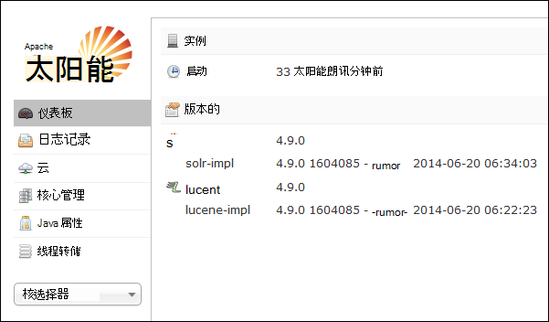
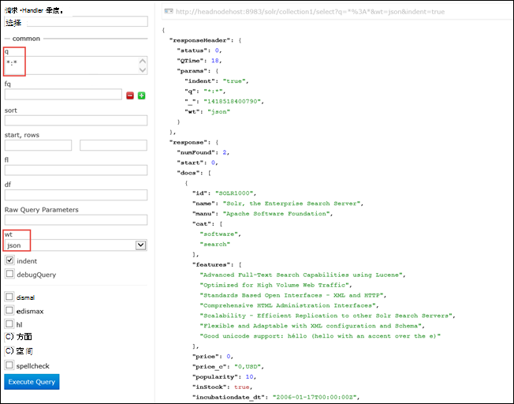

<properties
    pageTitle="使用脚本的操作基于 Linux 的 HDInsight 上安装 Solr |Microsoft Azure"
    description="了解如何使用脚本操作的基于 Linux 的 HDInsight Hadoop 群集上安装 Solr。"
    services="hdinsight"
    documentationCenter=""
    authors="Blackmist"
    manager="jhubbard"
    editor="cgronlun"
    tags="azure-portal"/>

<tags
    ms.service="hdinsight"
    ms.workload="big-data"
    ms.tgt_pltfrm="na"
    ms.devlang="na"
    ms.topic="article"
    ms.date="10/03/2016"
    ms.author="larryfr"/>

# 上安装和使用 Solr HDInsight Hadoop 群集

在本主题中，您将学习如何使用脚本的操作在 Azure HDInsight 上安装 Solr。 Solr 是一个功能强大的搜索平台，对数据管理的 Hadoop 提供企业级搜索功能。 一旦安装了 HDInsight 群集 Solr，您还将学习如何使用 Solr 的搜索数据。

> [AZURE.NOTE] 本文档中的步骤要求基于 Linux 的 HDInsight 群集。 在基于 Windows 群集中使用 Solr 的信息，请参阅[安装和使用 Solr HDinsight Hadoop 群集 (Windows) 上](hdinsight-hadoop-solr-install.md)

使用本主题中的示例脚本使用特定配置创建一个 Solr 群集。 如果您想要使用不同的集合、 shards、 架构、 副本等配置 Solr 群集，您必须相应地修改的脚本和 Solr 的二进制文件。

## Solr 是什么？

[Apache Solr](http://lucene.apache.org/solr/features.html)是一个企业搜索平台，使强大的全文搜索的数据。 虽然 Hadoop 使存储和管理大量数据，Apache Solr 提供了搜索功能，可快速检索数据。 本主题说明如何自定义 HDInsight 群集安装 Solr。

> [AZURE.WARNING] 完全支持使用 HDInsight 群集提供组件和 Microsoft 支持将有助于确定和解决与这些组件相关的问题。
>
> 自定义组件，例如 Solr，收到商业上合理的支持，以帮助您进一步排查该问题。 这可能导致解决问题或要求您能够进行深入的专业技能，为该技术在其中找到的开放源代码技术可用的频道。 例如，有许多社区站点可以使用，如︰ [HDInsight 的 MSDN 论坛](https://social.msdn.microsoft.com/Forums/azure/en-US/home?forum=hdinsight)、 [http://stackoverflow.com](http://stackoverflow.com)。 Apache 项目还有项目网站上[http://apache.org](http://apache.org)，例如︰ [Hadoop](http://hadoop.apache.org/)。

## 该脚本的执行

此脚本将为 HDInsight 群集进行以下更改︰

* 安装到 Solr`/usr/hdp/current/solr`
* 创建一个新用户， __solrusr__，用于运行 Solr 服务
* 将__solruser__设置为所有者`/usr/hdp/current/solr`
* 添加将群集节点重新启动的情况下启动 Solr [Upstart](http://upstart.ubuntu.com/)配置。 Solr 还会自动启动群集节点上安装后

## 安装脚本操作使用 Solr

在 HDInsight 群集上安装 Solr 的示例脚本可在以下位置。

    https://hdiconfigactions.blob.core.windows.net/linuxsolrconfigactionv01/solr-installer-v01.sh

本节说明如何使用 Azure 门户创建一个新群集时使用的示例脚本。 

> [AZURE.NOTE] Azure PowerShell、 Azure CLI、 HDInsight.NET SDK 或 Azure 资源管理器模板还可应用脚本操作。 此外可以将脚本操作应用到已在运行的群集。 有关详细信息，请参阅[自定义 HDInsight 群集使用脚本的操作](hdinsight-hadoop-customize-cluster-linux.md)。

1. 开始调配通过步骤在[配置 Linux 基于 HDInsight 群集](hdinsight-hadoop-create-linux-clusters-portal.md)中，群集，但未完成资源调配。

2. **可选配置**刀片式服务器，选择**脚本操作**，并提供以下信息︰

    * __名称__︰ 输入脚本操作的友好名称。
    * __脚本的 URI__: https://hdiconfigactions.blob.core.windows.net/linuxsolrconfigactionv01/solr-installer-v01.sh
    * __头部__︰ 选中该选项
    * __工作人员__︰ 选中该选项
    * __ZOOKEEPER__︰ 选中此选项可在 Zookeeper 节点上安装
    * __参数__︰ 将此字段保留为空

3. 底部的**脚本操作**，使用**选择**按钮以保存配置。 最后，使用**可选配置**刀片底部的**选择**按钮保存可选配置信息。

4. 继续[提供 Linux 基于 HDInsight 群集](hdinsight-hadoop-create-linux-clusters-portal.md)中所述配置群集。

## 如何在 HDInsight 中使用 Solr？

### 索引数据

您必须从开始与某些数据文件索引 Solr。 然后可以使用 Solr 以运行搜索查询的索引数据。 使用以下步骤向 Solr，添加一些示例数据，然后对其进行查询︰

1. 连接到使用 SSH 的 HDInsight 群集︰

        ssh USERNAME@CLUSTERNAME-ssh.azurehdinsight.net

    在 HDInsight 中使用 SSH 的详细信息，请参阅以下资源︰

    * [HDInsight 从 Linux、 Unix 或 OS X 上的基于 Linux 的 Hadoop 使用 SSH](hdinsight-hadoop-linux-use-ssh-unix.md)

    * [在从 Windows HDInsight 基于 Linux 的 Hadoop 使用 SSH](hdinsight-hadoop-linux-use-ssh-windows.md)

    > [AZURE.IMPORTANT] 步骤以后在此文档将使用 SSL 隧道连接到 Solr web 用户界面。 为了使用这些步骤，必须建立 SSL 通道，然后配置浏览器以使用它。
    >
    > 有关详细信息，请参阅[使用 SSH 隧道 Ambari web 用户界面、 ResourceManager、 JobHistory、 NameNode，Oozie 和其他的 web 用户界面的访问](hdinsight-linux-ambari-ssh-tunnel.md)

2. 使用下面的命令来了 Solr 索引示例数据︰

        cd /usr/hdp/current/solr/example/exampledocs
        java -jar post.jar solr.xml monitor.xml

    您将在控制台上看到以下输出︰

        POSTing file solr.xml
        POSTing file monitor.xml
        2 files indexed.
        COMMITting Solr index changes to http://localhost:8983/solr/update..
        Time spent: 0:00:01.624

    Post.jar 实用程序使用两个示例文档、 **solr.xml**和**monitor.xml**索引 Solr。 这些将被存储在__collection1__内 Solr。

3. 使用以下方法来查询公开 Solr 的 REST API:

        curl "http://localhost:8983/solr/collection1/select?q=*%3A*&wt=json&indent=true"

    这问题对__collection1__匹配的任何文档的查询__\*:\* __ (编码为\*%3a\*在查询字符串中，)，并应作为 JSON 返回响应。 响应应类似于以下内容︰

            "response": {
                "numFound": 2,
                "start": 0,
                "maxScore": 1,
                "docs": [
                  {
                    "id": "SOLR1000",
                    "name": "Solr, the Enterprise Search Server",
                    "manu": "Apache Software Foundation",
                    "cat": [
                      "software",
                      "search"
                    ],
                    "features": [
                      "Advanced Full-Text Search Capabilities using Lucene",
                      "Optimized for High Volume Web Traffic",
                      "Standards Based Open Interfaces - XML and HTTP",
                      "Comprehensive HTML Administration Interfaces",
                      "Scalability - Efficient Replication to other Solr Search Servers",
                      "Flexible and Adaptable with XML configuration and Schema",
                      "Good unicode support: héllo (hello with an accent over the e)"
                    ],
                    "price": 0,
                    "price_c": "0,USD",
                    "popularity": 10,
                    "inStock": true,
                    "incubationdate_dt": "2006-01-17T00:00:00Z",
                    "_version_": 1486960636996878300
                  },
                  {
                    "id": "3007WFP",
                    "name": "Dell Widescreen UltraSharp 3007WFP",
                    "manu": "Dell, Inc.",
                    "manu_id_s": "dell",
                    "cat": [
                      "electronics and computer1"
                    ],
                    "features": [
                      "30\" TFT active matrix LCD, 2560 x 1600, .25mm dot pitch, 700:1 contrast"
                    ],
                    "includes": "USB cable",
                    "weight": 401.6,
                    "price": 2199,
                    "price_c": "2199,USD",
                    "popularity": 6,
                    "inStock": true,
                    "store": "43.17614,-90.57341",
                    "_version_": 1486960637584081000
                  }
                ]
              }

### 使用 Solr 仪表板

Solr 仪表板是一个 web 用户界面，使您能够通过 web 浏览器使用 Solr。 Solr 仪表板直接从您的 HDInsight 群集 Internet 上不公开，而必须使用 SSH 隧道来访问。 使用 SSH 隧道的详细信息，请参阅[使用 SSH 隧道 Ambari web 用户界面、 ResourceManager、 JobHistory、 NameNode，Oozie 和其他的 web 用户界面的访问](hdinsight-linux-ambari-ssh-tunnel.md)

一旦建立 SSH 隧道之后，使用以下步骤使用 Solr 仪表板︰

1. 确定主 headnode 的主机名︰

    1. 使用 SSH 连接到端口 22 上的群集。 例如， `ssh USERNAME@CLUSTERNAME-ssh.azurehdinsight.net` ，__用户名__是您的 SSH 用户名称和__群集名称__是该群集的名称。

        使用 SSH 的详细信息，请参阅以下文档︰

        * [SSH 使用 Linux 和 Unix 中，Mac OS X 客户机的基于 Linux 的 HDInsight](hdinsight-hadoop-linux-use-ssh-unix.md)

        * [SSH 使用来自 Windows 客户端的基于 Linux 的 HDInsight](hdinsight-hadoop-linux-use-ssh-windows.md)
    
    3. 使用以下命令获取完全限定的主机名︰

            hostname -f

        这将返回一个名称与以下类似︰

            hn0-myhdi-nfebtpfdv1nubcidphpap2eq2b.ex.internal.cloudapp.net
    
        这是应在以下步骤中使用的主机名。
    
1. 在浏览器中，将连接到__http://HOSTNAME:8983/solr / #/__，其中__主机名__是您在前面的步骤中确定的名称。 

    该请求应该路由通过 SSH 隧道 HDInsight 群集的头节点。 您应该看到类似以下的页︰

    

2. 从左窗格中，使用**核心选择器**下拉列表可以选择**collection1**。 几个条目它们应低于__collection1__。

3. 从__collection1__以下各项，选择__查询__。 使用下列值来填充搜索页面︰

    * 在**q**文本框中，输入**\*:**\*。 这将返回 Solr 所有被编入索引的文档。 如果您想要搜索的文档内的特定字符串，可以输入该字符串。

    * 在**wt**文本框中，选择输出格式。 默认值为**json**。

    最后，选择底部的搜索引导**执行查询**按钮。

    

    将输出返回我们用于索引 Solr 的两个文档。 输出如下所示︰

            "response": {
                "numFound": 2,
                "start": 0,
                "maxScore": 1,
                "docs": [
                  {
                    "id": "SOLR1000",
                    "name": "Solr, the Enterprise Search Server",
                    "manu": "Apache Software Foundation",
                    "cat": [
                      "software",
                      "search"
                    ],
                    "features": [
                      "Advanced Full-Text Search Capabilities using Lucene",
                      "Optimized for High Volume Web Traffic",
                      "Standards Based Open Interfaces - XML and HTTP",
                      "Comprehensive HTML Administration Interfaces",
                      "Scalability - Efficient Replication to other Solr Search Servers",
                      "Flexible and Adaptable with XML configuration and Schema",
                      "Good unicode support: héllo (hello with an accent over the e)"
                    ],
                    "price": 0,
                    "price_c": "0,USD",
                    "popularity": 10,
                    "inStock": true,
                    "incubationdate_dt": "2006-01-17T00:00:00Z",
                    "_version_": 1486960636996878300
                  },
                  {
                    "id": "3007WFP",
                    "name": "Dell Widescreen UltraSharp 3007WFP",
                    "manu": "Dell, Inc.",
                    "manu_id_s": "dell",
                    "cat": [
                      "electronics and computer1"
                    ],
                    "features": [
                      "30\" TFT active matrix LCD, 2560 x 1600, .25mm dot pitch, 700:1 contrast"
                    ],
                    "includes": "USB cable",
                    "weight": 401.6,
                    "price": 2199,
                    "price_c": "2199,USD",
                    "popularity": 6,
                    "inStock": true,
                    "store": "43.17614,-90.57341",
                    "_version_": 1486960637584081000
                  }
                ]
              }

### 启动和停止 Solr

如果您需要手动停止或启动太阳，使用以下命令︰

    sudo stop solr

    sudo start solr

## 备份索引的数据

作为一个好的做法，您应该备份索引数据从 Azure Blob 存储到 Solr 群集节点。 执行以下步骤来执行此操作︰

1. 连接到群集使用 SSH，然后使用以下命令获取头节点的主机名︰

        hostname -f
        
2. 使用以下方法来创建索引的数据的快照。 __主机名__替换前一个命令返回的名称︰

        curl http://HOSTNAME:8983/solr/replication?command=backup

    您应该看到类似下面的响应︰

        <?xml version="1.0" encoding="UTF-8"?>
        <response>
          <lst name="responseHeader">
            <int name="status">0</int>
            <int name="QTime">9</int>
          </lst>
          <str name="status">OK</str>
        </response>

2. 接下来，将目录更改为__/usr/hdp/current/solr/example/solr__。 将每个集合的子目录。 集合中的每个目录都包含一个__数据__目录，这是该集合的快照所在位置。

    例如，如果您使用了步骤前面示例文档编制索引， __/usr/hdp/current/solr/example/solr/collection1/data__目录现在能包含名为的目录__快照。 # # #__ # 的所在的日期和时间的快照。

3. 创建压缩的档案文件的快照文件夹使用与以下类似的命令︰

        tar -zcf snapshot.20150806185338855.tgz snapshot.20150806185338855

    这将创建新的归档文件，名为__snapshot.20150806185338855.tgz__，其中包含__snapshot.20150806185338855__目录中的内容。

3. 然后，您可以存储存档文件到群集的主存储，使用下面的命令︰

    hadoop fs-copyFromLocal snapshot.20150806185338855.tgz/示例/数据

    > [AZURE.NOTE] 您可能需要创建一个专用存储 Solr 快照目录。 例如， `hadoop fs -mkdir /solrbackup`。

使用 Solr 的备份和恢复的详细信息，请参阅[使并将 SolrCores 的备份还原](https://cwiki.apache.org/confluence/display/solr/Making+and+Restoring+Backups+of+SolrCores)。

## 请参见

- [安装和使用群集在 HDInsight 上的色调](hdinsight-hadoop-hue-linux.md)。 色调是一个 web 用户界面，便于创建、 运行和小猪和配置单元作业，保存以及您 HDInsight 浏览默认存储群集。

- [在 HDInsight 群集上安装 R][hdinsight-install-r]。 使用自定义群集安装 HDInsight Hadoop 群集上的 R。 R 是一种开源的语言和环境统计计算的。 它提供了数百个内置统计函数和自己相结合方面的功能和面向对象的编程的编程语言。 它还提供了丰富的图形功能。

- [在 HDInsight 群集上安装 Giraph](hdinsight-hadoop-giraph-install-linux.md)。 使用自定义群集在 HDInsight Hadoop 群集上安装 Giraph。 Giraph 允许您执行图形使用 Hadoop，处理，并可以使用 Azure HDInsight。

- [安装 HDInsight 群集上的色调](hdinsight-hadoop-hue-linux.md)。 使用自定义群集安装 HDInsight Hadoop 群集上的色调。 色调是一套用于与 Hadoop 群集进行交互的 Web 应用程序。

[hdinsight-install-r]: hdinsight-hadoop-r-scripts-linux.md
[hdinsight-cluster-customize]: hdinsight-hadoop-customize-cluster-linux.md
