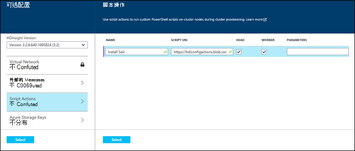
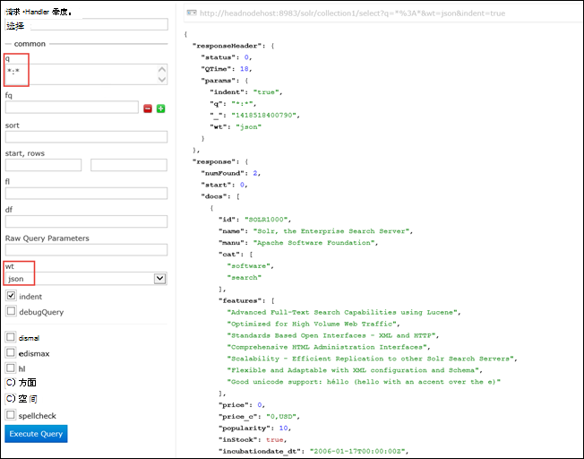

<properties
    pageTitle="使用脚本操作在 Hadoop 群集上安装 Solr |Microsoft Azure"
    description="了解如何使用 Solr 使用脚本操作自定义 HDInsight 群集。"
    services="hdinsight"
    documentationCenter=""
    authors="nitinme"
    manager="jhubbard"
    editor="cgronlun"
    tags="azure-portal"/>

<tags
    ms.service="hdinsight"
    ms.workload="big-data"
    ms.tgt_pltfrm="na"
    ms.devlang="na"
    ms.topic="article"
    ms.date="02/05/2016"
    ms.author="nitinme"/>

# 上安装和使用 Solr HDInsight Hadoop 群集

了解如何使用 Solr 使用脚本操作，自定义 Windows 根据的 HDInsight 群集以及如何使用 Solr 搜索数据。 在基于 Linux 的群集中使用 Solr 的信息，请参阅[安装和使用 Solr HDinsight Hadoop 群集 (Linux)](hdinsight-hadoop-solr-install-linux.md)。
 
通过*脚本操作*，可以在 Azure HDInsight 上安装 Solr 任意类型的群集 Hadoop，风暴，HBase （触发）。 只读的 Azure 存储 blob，在[https://hdiconfigactions.blob.core.windows.net/solrconfigactionv01/solr-installer-v01.ps1](https://hdiconfigactions.blob.core.windows.net/solrconfigactionv01/solr-installer-v01.ps1)提供了在 HDInsight 群集上安装 Solr 的示例脚本。 

示例脚本仅适用于 HDInsight 群集版本 3.1。 HDInsight 群集版本的详细信息，请参阅[HDInsight 群集版本](hdinsight-component-versioning.md)。

使用本主题中的示例脚本创建与特定配置的基于 Windows 的 Solr 群集。 如果您想要使用不同的集合、 shards、 架构、 副本等配置 Solr 群集，您必须相应地修改的脚本和 Solr 的二进制文件。

**相关的文章**

- [上安装和使用 Solr HDinsight Hadoop 群集 (Linux)](hdinsight-hadoop-solr-install-linux.md)
- [在 HDInsight 中的创建 Hadoop 群集](hdinsight-provision-clusters.md)︰ 创建 HDInsight 群集的一般信息。
- [自定义 HDInsight 群集使用脚本操作][hdinsight-cluster-customize]︰ 自定义 HDInsight 群集使用脚本操作的一般信息。
- [HDInsight 的开发脚本操作脚本](hdinsight-hadoop-script-actions.md)。

## Solr 是什么？

<a href="http://lucene.apache.org/solr/features.html" target="_blank">Apache Solr</a>是一个企业搜索平台，使强大的全文搜索的数据。 虽然 Hadoop 使存储和管理大量数据，Apache Solr 提供了搜索功能，可快速检索数据。 

## 安装使用门户 Solr

1. 通过开始创建群集使用的**自定义**选项，在[创建 Hadoop 群集在 HDInsight 中的](hdinsight-provision-clusters.md#portal)所述。
2. 在向导的**脚本操作**页上，单击**添加脚本操作**以提供详细信息的脚本操作，如下所示︰

    

    <table border='1'>
        <tr><th>属性</th><th>值</th></tr>
        <tr><td>名称</td>
            <td>指定脚本动作的名称。 例如，为<b>安装 Solr</b>。</td></tr>
        <tr><td>脚本的 URI</td>
            <td>指定脚本调用自定义群集的统一资源标识符 (URI)。 例如， <i>https://hdiconfigactions.blob.core.windows.net/solrconfigactionv01/solr-installer-v01.ps1</i></td></tr>
        <tr><td>节点类型</td>
            <td>指定在其运行的自定义脚本的节点。 您可以选择<b>所有节点</b>、<b>只头节点</b>或<b>仅辅助节点</b>。
        <tr><td>参数</td>
            <td>指定的参数，如果所需的脚本。 要安装 Solr 的脚本不需要任何参数，因此您可以将其留空。</td></tr>
    </table>

    您可以添加多个安装在群集上的多个组件的脚本操作。 添加脚本后，单击以开始创建群集的选中标记。

## 使用 Solr

您必须从开始与某些数据文件索引 Solr。 然后可以使用 Solr 以运行搜索查询的索引数据。 执行以下步骤以在 HDInsight 群集中使用 Solr:

1. **使用远程桌面协议 (RDP) 远程进入与 Solr 安装 HDInsight 群集**。 从 Azure 的门户，与 Solr 安装，然后远程创建到该群集的群集中启用远程桌面。 有关说明，请参阅[HDInsight 群集使用 RDP 连接](hdinsight-administer-use-management-portal.md#connect-to-clusters-using-rdp)。

2. **在通过上传数据文件的索引 Solr**。 当索引 Solr 时，则将文档放在它可能需要搜索。 索引 Solr，到群集到远程使用 RDP、 导航到桌面、 打开 Hadoop 命令行，并定位到**C:\apps\dist\solr-4.7.2\example\exampledocs**。 运行以下命令︰

        java -jar post.jar solr.xml monitor.xml

    您将在控制台上看到以下输出︰

        POSTing file solr.xml
        POSTing file monitor.xml
        2 files indexed.
        COMMITting Solr index changes to http://localhost:8983/solr/update..
        Time spent: 0:00:01.624

    Post.jar 实用程序使用两个示例文档、 **solr.xml**和**monitor.xml**索引 Solr。 Post.jar 实用程序和示例文档可以获得 Solr 安装。

3. **使用 Solr 的仪表板已构建索引文档中搜索**。 在 HDInsight 群集 RDP 会话中，打开 Internet Explorer 和启动 Solr 仪表板处**http://headnodehost:8983/solr / #/**。 从左窗格中，从**核选择器**下拉列表，选择**collection1**，并内，单击**查询**。 例如，要选择和 Solr 中返回所有文档，提供了以下值︰

    * 在**q**文本框中，输入**\*:**\*。 这将返回 Solr 所有被编入索引的文档。 如果您想要搜索的文档内的特定字符串，可以输入该字符串。
    
    * 在**wt**文本框中，选择输出格式。 默认值为**json**。 单击**执行查询**。

    
    
    将输出返回我们用于索引 Solr 的两个文档。 输出如下所示︰

            "response": {
                "numFound": 2,
                "start": 0,
                "maxScore": 1,
                "docs": [
                  {
                    "id": "SOLR1000",
                    "name": "Solr, the Enterprise Search Server",
                    "manu": "Apache Software Foundation",
                    "cat": [
                      "software",
                      "search"
                    ],
                    "features": [
                      "Advanced Full-Text Search Capabilities using Lucene",
                      "Optimized for High Volume Web Traffic",
                      "Standards Based Open Interfaces - XML and HTTP",
                      "Comprehensive HTML Administration Interfaces",
                      "Scalability - Efficient Replication to other Solr Search Servers",
                      "Flexible and Adaptable with XML configuration and Schema",
                      "Good unicode support: héllo (hello with an accent over the e)"
                    ],
                    "price": 0,
                    "price_c": "0,USD",
                    "popularity": 10,
                    "inStock": true,
                    "incubationdate_dt": "2006-01-17T00:00:00Z",
                    "_version_": 1486960636996878300
                  },
                  {
                    "id": "3007WFP",
                    "name": "Dell Widescreen UltraSharp 3007WFP",
                    "manu": "Dell, Inc.",
                    "manu_id_s": "dell",
                    "cat": [
                      "electronics and computer1"
                    ],
                    "features": [
                      "30\" TFT active matrix LCD, 2560 x 1600, .25mm dot pitch, 700:1 contrast"
                    ],
                    "includes": "USB cable",
                    "weight": 401.6,
                    "price": 2199,
                    "price_c": "2199,USD",
                    "popularity": 6,
                    "inStock": true,
                    "store": "43.17614,-90.57341",
                    "_version_": 1486960637584081000
                  }
                ]
              }

4. **建议︰ 备份到 Azure Blob 存储与 HDInsight 群集相关的索引数据从 Solr**。 作为一个好的做法，您应该备份索引数据从 Azure Blob 存储到 Solr 群集节点。 执行以下步骤来执行此操作︰

    1. RDP 会话中，打开 Internet Explorer，并指向以下 URL:

            http://localhost:8983/solr/replication?command=backup

        您应该看到类似下面的响应︰

            <?xml version="1.0" encoding="UTF-8"?>
            <response>
              <lst name="responseHeader">
                <int name="status">0</int>
                <int name="QTime">9</int>
              </lst>
              <str name="status">OK</str>
            </response>

    2. 在远程会话中，导航到 {SOLR_HOME}\{集合} \data。 通过示例脚本创建群集，这应该是**C:\apps\dist\solr-4.7.2\example\solr\collection1\data**。 在此位置，您应该看到类似于*的名称创建的快照文件夹*快照。*时间戳** *。

    3. 压缩快照文件夹并将其上载到 Azure Blob 存储。 Hadoop 命令行中，导航到快照文件夹的位置通过使用下面的命令︰

              hadoop fs -CopyFromLocal snapshot._timestamp_.zip /example/data

        此命令可将快照复制到 /example/data/低于中默认值的存储客户，与群集相关的容器。

## 安装使用 Aure PowerShell Solr

请参阅[自定义 HDInsight 群集使用脚本的操作](hdinsight-hadoop-customize-cluster.md#call_scripts_using_powershell)。  此示例说明如何安装使用 Azure PowerShell 的触发。 您需要自定义脚本，以使用[https://hdiconfigactions.blob.core.windows.net/solrconfigactionv01/solr-installer-v01.ps1](https://hdiconfigactions.blob.core.windows.net/solrconfigactionv01/solr-installer-v01.ps1)。

## 安装使用.NET SDK Solr

请参阅[自定义 HDInsight 群集使用脚本的操作](hdinsight-hadoop-customize-cluster.md#call_scripts_using_azure_powershell)。 此示例说明如何安装使用.NET SDK 的触发。 您需要自定义脚本，以使用[https://hdiconfigactions.blob.core.windows.net/solrconfigactionv01/solr-installer-v01.ps1](https://hdiconfigactions.blob.core.windows.net/solrconfigactionv01/solr-installer-v01.ps1)。

## 请参见

- [上安装和使用 Solr HDinsight Hadoop 群集 (Linux)](hdinsight-hadoop-solr-install-linux.md)
- [在 HDInsight 中的创建 Hadoop 群集](hdinsight-provision-clusters.md)︰ 创建 HDInsight 群集的一般信息。
- [自定义 HDInsight 群集使用脚本操作][hdinsight-cluster-customize]︰ 自定义 HDInsight 群集使用脚本操作的一般信息。
- [HDInsight 的开发脚本操作脚本](hdinsight-hadoop-script-actions.md)。
- [安装和使用 HDInsight 群集上触发][hdinsight-install-spark]︰ 有关安装触发的脚本操作示例。
- [在 HDInsight 群集上安装 R][hdinsight-install-r]︰ 有关安装 R.脚本操作示例
- [在 HDInsight 群集上安装 Giraph](hdinsight-hadoop-giraph-install.md)︰ 有关安装 Giraph 脚本操作示例。

[powershell-install-configure]: powershell-install-configure.md
[hdinsight-provision]: hdinsight-provision-clusters.md
[hdinsight-install-r]: hdinsight-hadoop-r-scripts.md
[hdinsight-install-spark]: hdinsight-hadoop-spark-install.md
[hdinsight-cluster-customize]: hdinsight-hadoop-customize-cluster.md
